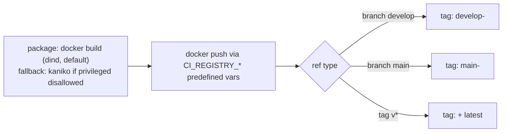

# Design: CI Image Publish (GitLab CI/CD via GitHub push-mirror)

> Status: draft

## Deliverables (this repo, pol-admin)

1. **NEW** `.gitlab-ci.yml` — pipeline defined in Data Models & Interfaces below.
2. **NEW** `.github/workflows/mirror-gitlab.yml` — push-mirror trigger.
3. **NEW** `docs/deploy-runbook.md` — "Deploy ผ่าน GitLab CI" section: tag
   `vX.Y.Z` on GitHub (per the org's release rule — tag + changelog) → GitLab
   pipeline builds → click Play on `deploy-production`. Manual first-install /
   fallback path documented alongside it (host `.env` + `secrets/` prep is
   still a one-time manual step regardless). Rollback documented as: re-run
   `deploy-production` from the pipeline of the previous tag.
4. GitLab-side infra checklist (below) — handed to the infra team, not
   something the AI can execute (no GitLab UI/API access this session).

Nothing under `.github/workflows/ci.yml` changes — GitHub remains the merge
gate exactly as it is today.

### Infra checklist (GitLab side, one-time)

1. Protect branches `develop`, `main`, and tags matching `v*` (Settings →
   Repository → Protected branches/tags) — required so protected CI/CD
   variables (mirror token, SSH key, deploy token) are only ever readable by
   pipelines running off these refs.
2. Create a **Project Access Token** (role Maintainer, scope
   `write_repository`) → put it in the GitHub repo secret `GITLAB_MIRROR_TOKEN`.
3. Enable the Container Registry on this GitLab project.
4. Create a **deploy token** (scope `read_registry`) → GitLab CI/CD variables
   `REGISTRY_DEPLOY_USER`, `REGISTRY_DEPLOY_TOKEN` (masked + protected).
5. CI/CD variables (all protected): `SSH_PRIVATE_KEY` (File),
   `SSH_KNOWN_HOSTS` (File), `DEPLOY_HOST`, `DEPLOY_USER`, `DEPLOY_PATH`. No
   other app secret goes into GitLab CI/CD — everything else lives as files
   under `$DEPLOY_PATH/secrets/` + `.env` on the production host.
6. Confirm runner topology: is the docker executor allowed to run in
   privileged mode (needed for the `package` stage's dind service)? If policy
   disallows privileged containers, swap `package` to kaniko (documented
   fallback in the job definition below) instead. Confirm outbound network
   access from the runner to: Docker Hub / whatever base images `Dockerfile`
   pulls from, `registry.npmjs.org`, the GitLab registry itself, and the
   deploy host over SSH.
7. Deploy host (one-time): add the CI SSH key pair's public key to
   `~/.ssh/authorized_keys` for `$DEPLOY_USER`; confirm `$DEPLOY_PATH` exists
   with `.env` + `secrets/` per the runbook.

## Architecture Overview

Source of truth stays on GitHub (`metrodiesign/pol-admin`, PR/review flow
unchanged); GitLab (`gitlab2.viriyah.co.th`, project
`central-software/vcentralpayadmin`) is CI/CD + deploy only: mirror the code in
automatically, re-run the same guard gate GitHub already runs (for parity, not
replacement — GitHub stays the merge gate), build + push the image to the
GitLab Container Registry, then deploy to the org's one production VM over SSH
behind a manual approval gate.

This adapts a locked pattern from a sibling repo's CI/CD setup (pol-core /
`central-payment-gateway`) — same shape (push-mirror, guard-gate parity,
manual-gated SSH deploy), stripped of everything that doesn't apply here:
pol-admin is a single Next.js image, no dotnet/SQL Server/migrate-worker
services, no `docker-compose.prod.yml` (one container, not three).

| Component | Responsibility |
|---|---|
| GitHub repo (`metrodiesign/pol-admin`) | Source of truth + PR review, unchanged. |
| GitHub Actions workflow (`.github/workflows/mirror-gitlab.yml`) | On push to `develop`, `main`, or tag `v*`: `git push --force` the same ref straight to the GitLab project over HTTPS (a **push mirror initiated from GitHub**, not GitLab pull-mirroring). Needs only a `write_repository`-scoped GitLab Project Access Token — narrower than the `api` scope the pull-mirror-API approach would have required. |
| GitLab CI/CD pipeline (`.gitlab-ci.yml`) | `workflow: rules:` restricts pipelines to `develop`, `main`, and tag `v*` — no MR pipelines (PR review lives on GitHub, not duplicated here). Stages: `verify` → `test` → `package` → `deploy`. |
| `verify` stage | Line-for-line port of GitHub's `.github/workflows/ci.yml` `verify` job (guard regression tests, secret scan, spec-trace) — same commands, `::group::` swapped for plain `echo` (GitLab doesn't fold GitHub Actions log groups). Exists so a GitLab pipeline run at the same SHA as a GitHub run is directly diffable — not a replacement gate, a parity check. |
| `test` stage | pol-admin's own app gate — `npm ci`, `tsc --noEmit`, `vitest run`. Not present on the GitHub side today (see Non-Functional Considerations); added here because building an image without typecheck/test having run first is not acceptable. |
| `package` stage | Builds the existing `Dockerfile` (PR #79) and pushes to the GitLab Container Registry. Docker executor + Docker-in-Docker (dind) is the **default** — runner privilege level for this project is unconfirmed, so the infra checklist asks explicitly; kaniko is the documented fallback if privileged execution is disallowed. |
| `deploy` stage (`deploy-production`) | Tag-triggered only (`$CI_COMMIT_TAG =~ /^v/`), `when: manual`. SSHes into the org production VM, `docker pull`s the new image, swaps the running container. Recorded under a GitLab `production` Environment so a prior deploy can be re-run as rollback. |
| Org production VM | Single machine, `docker run` (no compose — pol-admin ships one image, unlike pol-core's 3-service compose stack). Reachable by the GitLab runner over SSH, key-based only. |

## Sequence Diagrams

```mermaid
sequenceDiagram
    participant Dev
    participant GH as GitHub (pol-admin)
    participant GHA as GitHub Actions
    participant GL as GitLab project
    participant Reg as GitLab Container Registry
    participant ProdVM as Org production VM

    Dev->>GH: push to develop / main / tag v*
    GH->>GHA: mirror-gitlab.yml
    GHA->>GL: git push --force <ref>:<ref>\n(oauth2:GITLAB_MIRROR_TOKEN, write_repository scope)
    Note over GL: new commits land directly (push, not a pull-mirror poll)
    GL->>GL: pipeline auto-triggers (workflow: rules — develop/main/tag v* only)
    GL->>GL: verify (guard parity) -> test (npm/tsc/vitest) -> package (build+push)
    GL->>Reg: docker push (tag scheme below)
    Note over GL: deploy-production job created but held (when: manual, tag pipelines only)
    alt only for tag v* pipelines
        Dev->>GL: click "Play" on deploy-production (approval gate)
        GL->>ProdVM: ssh + docker pull <image>:<tag>
        GL->>ProdVM: docker stop/rm old container; docker run new
        ProdVM-->>GL: container up (see Error Handling re: healthcheck gap)
    end
```

Rollback (no separate pipeline needed): GitLab **Environments → production →**
find the last-known-good deployment **→ Re-deploy**. Re-running an old deploy
job re-executes the same SSH script with that job's own `$CI_COMMIT_TAG`,
pulling the previously-published image back down — no rebuild, no bespoke
rollback script.



## Data Models & Interfaces

### `.gitlab-ci.yml` (repo root)

```yaml
workflow:
  rules:
    - if: '$CI_COMMIT_BRANCH == "develop"'
    - if: '$CI_COMMIT_BRANCH == "main"'
    - if: '$CI_COMMIT_TAG =~ /^v\d+\.\d+\.\d+/'

stages:
  - verify
  - test
  - package
  - deploy

variables:
  IMAGE: $CI_REGISTRY_IMAGE

verify:
  stage: verify
  image: python:3.12
  before_script:
    - apt-get update -qq && apt-get install -y -qq bash git >/dev/null
  script:
    - set -euo pipefail
    - |
      for t in .claude/hooks/tests/*.test.sh; do
        echo "guard-test $t"
        bash "$t"
      done
    - SECRET_GUARD_SKIP='' .ai/bin/check-secrets.sh --all
    - scripts/check-rename-identifiers.sh
    - |
      for dir in .claude/specs/*/; do
        [ -f "${dir}requirements.md" ] || continue
        echo "spec-trace $(basename "$dir")"
        scripts/spec-trace.sh "$(basename "$dir")"
      done
  # 1:1 port of .github/workflows/ci.yml's `verify` job — same 4 checks, same
  # order, ::group:: replaced by plain echo. Kept in sync manually; a future
  # spec could generate both from one source if drift becomes a problem.

app-gate:
  stage: test
  image: node:22-alpine
  cache:
    key: npm-${CI_COMMIT_REF_SLUG}
    paths: [.npm]
  script:
    - npm ci --cache .npm --prefer-offline
    - npx tsc --noEmit
    - npx vitest run

build-and-push:
  stage: package
  image: docker:27
  services:
    - docker:27-dind
  variables:
    DOCKER_TLS_CERTDIR: "/certs"
  before_script:
    - docker login -u "$CI_REGISTRY_USER" -p "$CI_JOB_TOKEN" "$CI_REGISTRY"
  script:
    - |
      case "$CI_COMMIT_REF_NAME" in
        develop) TAG="develop-$CI_COMMIT_SHORT_SHA" ;;
        main)    TAG="main-$CI_COMMIT_SHORT_SHA" ;;
        *)       TAG="$CI_COMMIT_TAG" ;;   # tag pipeline (workflow:rules already filtered to v*)
      esac
    - docker build -t "${IMAGE}:${TAG}" .
    - docker push "${IMAGE}:${TAG}"
    - |
      if [ -n "$CI_COMMIT_TAG" ]; then
        docker tag "${IMAGE}:${TAG}" "${IMAGE}:latest"
        docker push "${IMAGE}:latest"
      fi
  # Fallback if the runner disallows privileged containers (needed for dind):
  # swap `image`/`services` for `gcr.io/kaniko-project/executor:v1.23.2-debug`
  # + `entrypoint: [""]`, drop the `services:` block, build the same auth JSON
  # kaniko expects at /kaniko/.docker/config.json from $CI_REGISTRY_USER/$CI_JOB_TOKEN.
  # See infra checklist item 6.

deploy-production:
  stage: deploy
  image: alpine:3.20
  rules:
    - if: '$CI_COMMIT_TAG =~ /^v\d+\.\d+\.\d+/'
      when: manual
  environment:
    name: production
    url: https://vcentralpay.viriyah.co.th   # placeholder — confirm real prod URL
  before_script:
    - apk add --no-cache openssh-client
    - eval "$(ssh-agent -s)"
    - echo "$SSH_PRIVATE_KEY" | ssh-add -           # File-type CI/CD variable
    - mkdir -p ~/.ssh && chmod 700 ~/.ssh
    - cp "$SSH_KNOWN_HOSTS" ~/.ssh/known_hosts       # File-type variable, not StrictHostKeyChecking=no
  script:
    - >
      ssh "$DEPLOY_USER@$DEPLOY_HOST"
      "docker login -u '$REGISTRY_DEPLOY_USER' -p '$REGISTRY_DEPLOY_TOKEN' '$CI_REGISTRY' &&
       docker pull '${IMAGE}:${CI_COMMIT_TAG}' &&
       docker stop pol-admin || true &&
       docker rm pol-admin || true &&
       docker run -d --name pol-admin --restart unless-stopped
         -p 5200:5200 --env-file '$DEPLOY_PATH/prod.env'
         '${IMAGE}:${CI_COMMIT_TAG}'"
```

`CI_REGISTRY`, `CI_REGISTRY_IMAGE`, `CI_REGISTRY_USER` are GitLab-predefined.
`$CI_JOB_TOKEN` authenticates the `package` stage's own push (scoped to that
job only, expires with it) — **not** reused for the deploy-time pull on the
production host, which needs a longer-lived **deploy token**
(`REGISTRY_DEPLOY_USER`/`REGISTRY_DEPLOY_TOKEN`, scope `read_registry`) since
that pull happens outside the job's own lifetime, directly on the remote VM.

### `.github/workflows/mirror-gitlab.yml` (repo root, GitHub side)

```yaml
name: Mirror to GitLab
on:
  push:
    branches: [develop, main]
    tags: ["v*"]

concurrency:
  group: mirror-gitlab-${{ github.ref }}
  cancel-in-progress: true

jobs:
  push-mirror:
    runs-on: ubuntu-latest
    steps:
      - uses: actions/checkout@v4
        with:
          fetch-depth: 0
      - name: Push mirror to GitLab
        run: |
          git push --force \
            "https://oauth2:${{ secrets.GITLAB_MIRROR_TOKEN }}@gitlab2.viriyah.co.th/central-software/vcentralpayadmin.git" \
            "${{ github.ref }}:${{ github.ref }}"
```

`GITLAB_MIRROR_TOKEN` = GitHub repo secret — a GitLab **Project Access Token**
(not a personal one), role Maintainer, scope `write_repository` only. Notably
narrower than the pull-mirror-API design this replaced (that needed `api`
scope with no narrower option); a push-mirror only ever needs to write refs.

## Technology Decisions

- **GitHub Actions push-mirror over GitLab pull-mirroring**: adopting the
  sibling repo's pattern — a plain `git push --force` from Actions is simpler
  than configuring GitLab-side pull mirroring (which needs UI setup + a
  read-only GitHub PAT stored *inside GitLab*) and needs a narrower token scope
  (`write_repository` vs. `api` for the mirror-pull trigger endpoint). Also
  drops the earlier design's awkward "native webhook can't send a custom auth
  header" problem entirely — there's no webhook in this version, Actions pushes
  directly.
- **docker:27 + dind as the default over kaniko-by-default**: matches the
  locked sibling-repo decision — runner privilege topology for this project is
  not yet confirmed, so design for the common case (docker executor, which is
  what most GitLab Runner installs default to) and hand infra a checklist item
  to confirm privileged-mode is actually allowed before this ships; kaniko
  stays documented as the drop-in fallback rather than the default, since it's
  extra image-registry-auth-JSON ceremony that's only needed if dind turns out
  to be blocked.
- **Single `docker build`+`docker push`, no compose file**: pol-admin is one
  Next.js container. The sibling repo's `docker-compose.registry.yml`
  override pattern (3 services: migrate/api/worker) doesn't apply — there is
  nothing to compose. Introducing a compose file for a single container would
  be solving a problem that doesn't exist here.
- **`app-gate` (tsc + vitest) as a new stage, not ported from GitHub**: GitHub's
  `ci.yml` only runs the framework-level guard checks today — it has no
  npm/tsc/vitest step (see Non-Functional Considerations, this is flagged as a
  pre-existing gap worth fixing on the GitHub side too, but that's out of this
  spec's scope). Shipping an image without having typechecked/tested it first
  is not an acceptable trade — added here as pol-admin's real quality gate
  ahead of `package`.
- **`when: manual` gate instead of a staging environment**: unchanged from the
  earlier round of this design — one production machine, no staging box, the
  human click is the compensating control the user explicitly chose. See
  Non-Functional Considerations.
- **GitLab Environments + Re-deploy for rollback over a bespoke rollback job**:
  unchanged — GitLab already tracks every deploy as a re-runnable "deployment."
- **Long-lived deploy token over reusing `CI_JOB_TOKEN` for the remote pull**:
  `CI_JOB_TOKEN` is scoped to the job's own lifetime and isn't valid for a
  `docker login` executed later, directly on the production host over SSH — a
  separate `read_registry`-scoped deploy token is the only credential that
  actually works there, and it's also narrower than `CI_JOB_TOKEN` would be if
  it *could* be reused (registry pull only, nothing else).

## Error Handling Strategy

- **Dockerfile/build fails** → `package` job fails, pipeline red, nothing is
  pushed (build failure happens before the `docker push` line runs).
- **Registry auth fails** (`docker login` step) → `package` job fails
  immediately with the auth error in the job log; no silent partial state.
- **Push-mirror `git push --force` fails** (`GITLAB_MIRROR_TOKEN`
  expired/revoked, GitLab host unreachable) → the GitHub Actions job fails
  (non-zero exit on `git push`), visible as a red check on the GitHub commit
  and in the Actions tab. Unlike pull-mirroring there is no periodic background
  fallback sync here — a broken token means GitLab silently falls behind until
  someone notices the red Actions run. This is a real trade-off of choosing
  push-mirror over pull-mirror; mitigated only by the Actions run being visible
  where commits already get reviewed (GitHub), not by any automatic retry.
- **`verify`/`app-gate` stage fails** → pipeline stops before `package` — no
  image is ever built from code that failed its own gate, tag or not.
- **Tag pushed that doesn't match `v\d+\.\d+\.\d+`** → `workflow: rules` has no
  matching entry, no pipeline is created at all for that ref (not just no
  deploy — GitLab won't even mirror-build it). Pre-release/rc tag scheme is an
  open question for requirements.md.
- **SSH connection to the production VM fails** (host unreachable, key
  rejected) → `deploy-production` fails at `ssh-add`/the `ssh` command itself;
  the remote script's `docker stop`/`rm` only runs after `docker pull`
  succeeds on the far side of the same SSH command chain, so a connection
  failure never reaches the stop/rm step — old container stays up.
- **`docker pull` succeeds but the new container fails healthcheck / crashes on
  start** → `docker run -d` still reports success (detached start, not a
  health-gated start) — real gap, same as the previous round of this design.
  Flagged again as an open question for requirements: does the deploy script
  need an explicit post-start healthcheck poll + auto-rollback, or is "click
  Re-deploy on the previous environment entry" an acceptable manual response?
- **`SSH_PRIVATE_KEY`/`REGISTRY_DEPLOY_TOKEN` missing/expired** → job fails at
  `ssh-add` or the remote `docker login`, nothing reaches/changes on the
  production host.

## Testing Strategy

Infra spec — no automated test suite; verified by a documented manual run of
each flow, same spirit as PR #79's Dockerfile verification (`docker build` +
`docker run` + healthcheck check), extended per the sibling repo's
verification checklist.

| Design behavior | Verification |
|---|---|
| Push mirrors and pipeline runs | Push a commit to `develop` (via PR, per workflow rules), confirm `mirror-gitlab.yml` is green on GitHub, confirm the commit appears on the GitLab project, confirm `verify`→`app-gate`→`package` all run |
| GitLab `verify` matches GitHub `verify` at the same SHA | Diff the two jobs' logs for the same commit — results must match (same guard tests, same secret scan, same spec-trace outcome) |
| `app-gate` actually blocks a bad build | Temporarily break a test/typecheck on a throwaway branch pushed to `develop`, confirm `package` never starts |
| Tag `v*` triggers a versioned image + deploy gate | `git tag v0.0.1-test && git push origin v0.0.1-test`, confirm the pipeline runs, registry shows `v0.0.1-test` + `latest`, and `deploy-production` sits blocked/manual |
| Non-matching ref never creates a pipeline | Push a branch or tag outside `develop`/`main`/`v*` (e.g. `checkpoint-1`), confirm no GitLab pipeline is created at all |
| Built image is runnable | Pull the pushed image, run it, repeat the PR #79 checks: `whoami` → non-root, healthcheck → healthy |
| No secret leakage in job logs | Read `package`/`deploy-production` job logs, confirm `REGISTRY_DEPLOY_TOKEN`/`SSH_PRIVATE_KEY`/`GITLAB_MIRROR_TOKEN` never appear in plaintext |
| Manual approval gate actually blocks | Confirm `deploy-production` does NOT run until someone clicks Play, even though the pipeline otherwise went green |
| Deploy reaches the real VM | Click Play on a test tag, confirm `docker ps` on the VM shows the new image digest and the app responds on the configured port |
| Rollback via Re-deploy works | After a second successful deploy, re-run the FIRST deployment from Environments → production, confirm the VM ends up back on the older tag |
| SSH failure doesn't touch the running container | Point `DEPLOY_HOST` at an unreachable address temporarily, confirm the job fails before any `docker stop`/`docker rm` runs |
| Mirror failure is visible | Temporarily revoke/rotate `GITLAB_MIRROR_TOKEN`, confirm the Actions run shows red |
| Integration-equivalent manual trigger (if later added) | N/A for pol-admin today — no integration-test stage exists (no dotnet/SQL); noted only because the sibling pattern has one, so a future reader doesn't wonder why it's missing here |

## Non-Functional Considerations

*(this section replaces Requirement Traceability — no REQ IDs exist yet in
Design-First mode; `/spec-requirements` will derive them from this design and
backfill the table)*

- **Credential scope, mirror token**: `GITLAB_MIRROR_TOKEN` needs
  `write_repository` only (push-mirror, not the `api`-scoped mirror-pull-API
  approach this replaced) — meaningfully narrower blast radius than the prior
  round of this design. Still use a **Project Access Token** scoped to this one
  GitLab project (not a personal token with account-wide reach), shortest
  practical expiry, rotate on any suspected leak per this repo's Secrets rules.
- **Credential scope, deploy token**: `REGISTRY_DEPLOY_TOKEN` is a GitLab
  **deploy token** (scope `read_registry` only) — deliberately not
  `CI_JOB_TOKEN` (job-lifetime-only, doesn't survive to the SSH'd remote
  script) and deliberately not a broader personal/project token (pull-only is
  all the production host ever needs).
- **Deploy credential blast radius**: `SSH_PRIVATE_KEY` grants direct SSH
  access to the one production machine. Store as masked + **protected**
  CI/CD variables (File type for the key + known_hosts) so only pipelines
  running off a protected branch/tag can read them — a feature-branch pipeline
  never sees these even if someone edited `.gitlab-ci.yml` on a branch. App
  secrets beyond these deploy credentials are NOT to be added as CI/CD
  variables at all — they live as files under `$DEPLOY_PATH/secrets/` +
  `.env` on the host itself, managed manually, same as the sibling repo's
  convention.
- **Registry storage growth**: every `develop`/`main` push produces a new tag;
  turn on GitLab's Container Registry cleanup policy (project Settings →
  Packages and registries) to expire untagged/dev-channel images — out of
  scope to configure here, flagged for the user to enable post-merge.
- **Push-mirror has no background fallback**: unlike GitLab pull-mirroring
  (which polls on an interval even if a webhook is missed), a push-mirror only
  updates when Actions successfully runs. A silently-broken
  `GITLAB_MIRROR_TOKEN` means GitLab drifts behind until someone notices the
  red Actions check — accepted trade-off for the simpler, narrower-scoped
  mechanism; mitigated by the Actions run being visible on GitHub where
  commits are already reviewed.
- **No staging environment — explicit risk acceptance, not a silent gap**:
  unchanged from the prior round — one production machine, no staging box.
  Compensating controls: (1) `when: manual` on deploy, (2) deploy is
  tag-triggered only, never on a bare branch push, (3) rollback is one click
  via GitLab Environments' Re-deploy. Re-examine if/when a staging box exists.
- **No Friday/pre-holiday deploy rule enforced in code**: process rule for the
  human clicking Play, not mechanically gate-able without also blocking
  legitimate emergency hotfixes (against the org's own exception clause) —
  noted so it isn't lost, not encoded in `.gitlab-ci.yml`.
- **No post-deploy health verification loop**: see Error Handling — deploy
  goes green on `docker run -d` succeeding, not on the container actually
  becoming healthy. Carried into requirements.md as an open question.
- **GitHub-side gate is framework-only today, not app-level**: `.github/workflows/ci.yml`
  runs guard tests/secret-scan/spec-trace but no `npm ci`/`tsc`/`vitest` —
  meaning GitHub's own PR merge gate does *not* currently catch a broken build
  before merge; only this new GitLab pipeline's `app-gate` stage does, and only
  after the fact (post-merge, once mirrored). Worth a follow-up spec to add the
  same `app-gate` to GitHub's PR gate directly — explicitly out of scope here
  since the task was "adapt the CI/CD pattern," not "fix GitHub's existing
  gate," but too important to bury unmentioned.
