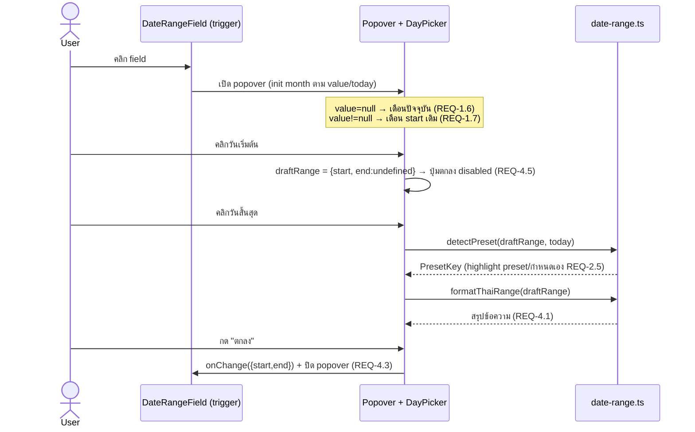
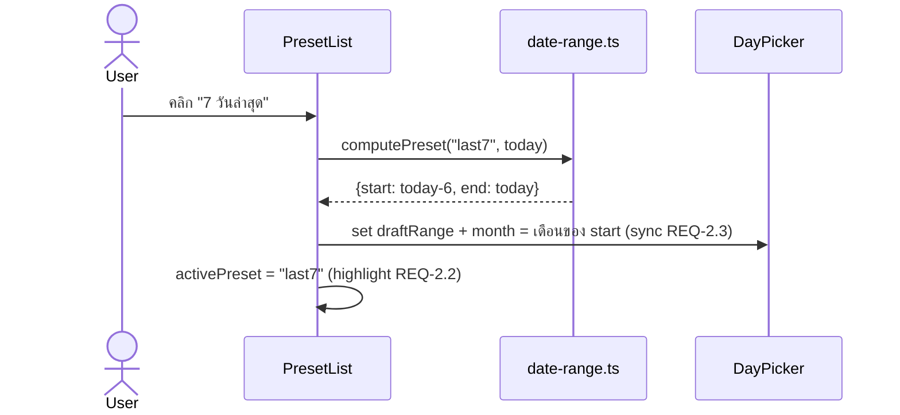

# Design: Date Range Picker (order list toolbar)

> Status: approved 2026-07-30, amended 2026-07-30

## Architecture Overview

แยกเป็น 2 ชั้นตาม ARCHITECTURE.md (pure logic แยกจาก presentation, co-locate test):

1. **Pure logic — `src/lib/date-range.ts`** (ไม่มี React, ไม่มี network, testable ล้วน)
   - นิยาม type `DateRange = { start: Date; end: Date }` + `PresetKey`
   - `computePreset(key, today): DateRange | null` — คำนวณช่วงตาม preset (REQ-2.2); `custom` → null. **normalize `today` → midnight local ก่อนคำนวณทุก preset** เพื่อให้ start/end เป็น date-only (00:00:00) ตรงกับ Date ที่ react-day-picker คืน
   - `detectPreset(range, today): PresetKey` — เทียบ **date-only** (`getFullYear/Month/Date` ทั้งสองฝั่ง ตัด time component) ว่าช่วงตรง preset ไหน คืน key นั้น ไม่ตรง → `"custom"` (REQ-2.5). ตรวจตามลำดับ `PRESETS` array แล้วคืนตัวแรกที่ match (deterministic เมื่อ range ตรงหลาย preset)
   - `sameDay(a, b): boolean` — helper เทียบ date-only ใช้ทั้งใน detectPreset และ test
   - `formatThaiDate(d): string` → `"30 ก.ค. 2569"` (REQ-4.1)
   - `formatThaiRange(range): string` → `"<start> - <end>"` (REQ-4.1)
   - `thaiMonthYearCaption(date): string` → `"กรกฎาคม 2569"` (formatter ให้ DayPicker, REQ-3.2)
   - `thaiWeekday(date): string` → `"อา"`..`"ส"` (formatter ให้ DayPicker, REQ-3.3)
   - single-source const: `THAI_MONTHS_FULL[]`, `THAI_MONTHS_ABBR[]`, `THAI_WEEKDAYS_ABBR[]`, `BE_OFFSET = 543`
   - co-located test: `src/lib/date-range.test.ts` (vitest)

2. **Presentation — `src/components/form/date-range-field.tsx`** (controlled, `"use client"`)
   - `DateRangeField` — export หลัก (named function ตาม convention)
     - trigger: label + bordered field (คง style ของ `DateInput` เดิม) + `CalendarDays` icon — **wrap ด้วย `PopoverTrigger` (button semantics, keyboard-reachable, aria-expanded/haspopup ให้โดย base-ui)** ไม่ใช่ text input เปล่า (m6, a11y hard constraint)
     - `Popover` (base-ui `@/components/ui/popover`) anchor กับ trigger — จัดการ dismiss (click-outside/Escape) ให้ในตัว → ครอบ REQ-1.3/1.4
     - เนื้อใน popover 3 ส่วน: `PresetList` (ซ้าย/บนเมื่อ mobile) + `<DayPicker>` (react-day-picker) + `Footer` (สรุป + ปุ่ม ยกเลิก/ตกลง)
   - draft state ภายใน (เปิดอยู่): `draftRange`, `month` (controlled month ของ DayPicker), `activePreset` — commit เฉพาะกด "ตกลง" (REQ-4.3); ปิดโดยไม่กด = คืนค่าเดิม (REQ-1.3/1.4/4.4)
   - responsive ผ่าน `useIsMobile(640)` (breakpoint = Tailwind `sm`): mobile → `numberOfMonths={1}` + preset ซ้อนแนวตั้ง (REQ-5.1/5.2)

Data flow: `order-list-toolbar.tsx` วาง `<DateRangeField>` แทน `DateInput` เดิม, ส่ง `value`/`onChange` (ยัง no-op/local ตาม scope UI-only, REQ-6.4) — ไม่แตะ `order-list-view.tsx` / `PaymentSession`.

## Sequence Diagrams

### เลือกช่วงผ่าน calendar แล้ว commit



### เลือกผ่าน preset



## Data Models & Interfaces

```ts
// src/lib/date-range.ts
export type DateRange = { start: Date; end: Date };
export type PresetKey =
  | "today" | "yesterday" | "last7" | "last30"
  | "thisMonth" | "lastMonth" | "custom";

export const PRESETS: { key: PresetKey; label: string }[]; // ลำดับตาม REQ-2.1

export function computePreset(key: PresetKey, today: Date): DateRange | null;
export function detectPreset(range: DateRange, today: Date): PresetKey;
export function formatThaiDate(d: Date): string;       // "30 ก.ค. 2569"
export function formatThaiRange(r: DateRange): string;  // "a - b"
export function thaiMonthYearCaption(d: Date): string;  // "กรกฎาคม 2569"
export function thaiWeekday(d: Date): string;           // "อา".."ส"
```

```ts
// src/components/form/date-range-field.tsx
interface DateRangeFieldProps {
  label: string;
  value: DateRange | null;
  onChange: (range: DateRange) => void;
  placeholder?: string; // default "กำหนดเอง" (REQ-4.6)
}
export function DateRangeField(props: DateRangeFieldProps): JSX.Element;
```

Boundary mapping กับ react-day-picker: lib logic ของเราใช้ `{start,end}` (แน่นอนทั้งคู่); react-day-picker ใช้ `DateRange = {from?, to?}`. แปลงที่ขอบ component:
- ขาเข้า DayPicker `selected`: มี draft → `{ from, to }`; **ไม่มี draft → ส่ง `undefined`** (ไม่ใช่ `{from:undefined,to:undefined}`) (m1)
- ขาออก `onSelect(rdpRange, clickedDay)`: handle `undefined` (deselect) → `draftRange = null`; ระหว่างเลือกครึ่งเดียว `to` undefined → เก็บ `{start: from, end: undefined-in-draft}`, ปุ่มตกลง disabled จนกว่า `to` มา (REQ-3.5/3.6/4.5)
- **REQ-3.7 (คลิก end ก่อน start) คุมเองใน `onSelect` ไม่พึ่ง default ของ RDP** — เมื่อมี start อยู่แล้วและ `clickedDay < start` ให้ set `{start: clickedDay, end: undefined}` (เริ่มช่วงใหม่จากวันที่คลิก รอ end ถัดไป) แทนที่จะปิดเป็น `{from:clicked,to:oldStart}` ตาม default lib
- **REQ-3.9 (ไม่แสดง outside day)** — ไม่ตั้ง `showOutsideDays` (default false) ช่องล้นเดือนเว้นว่าง; ไม่ต้องมี `onDayClick` nav

react-day-picker props ที่ใช้: `mode="range"`, `numberOfMonths={isMobile?1:2}`, `selected`, `onSelect`, `month`/`onMonthChange` (controlled — init + preset sync), `weekStartsOn={0}` (อาทิตย์, REQ-3.3), `navLayout="around"`, `formatters={{ formatCaption: thaiMonthYearCaption, formatWeekdayName: thaiWeekday }}`.

**Styling (M2)**: import `react-day-picker/style.css` เพื่อได้ layout ของ grid ทั้งหมด (months flex, table, weekday row, cell sizing) แล้ว **override เฉพาะสี/รูปทรงผ่าน RDP CSS variables** (`--rdp-accent-color`, `--rdp-range_middle-*` ฯลฯ) ให้ชี้ไปที่ semantic token ของโปรเจกต์ (primary, primary/10) — ไม่ทำซ้ำค่าดิบ (ตรง single-source token). ไม่ reconstruct classNames ระดับ structural slot เอง (หลีกเลี่ยง effort ระดับ shadcn calendar ทั้งไฟล์). scoped override วางใน CSS ข้าง component หรือ globals ที่ scope ด้วย wrapper class.

## Technology Decisions

- **react-day-picker (dependency ใหม่ ตัวเดียว)** — เลือกเพราะ range mode + dual month + a11y (roving tabindex, aria grid, keyboard nav) มาให้ครบ ไม่ต้อง reinvent accessible calendar grid (ARCHITECTURE + CODING_STANDARDS: a11y เป็น principle ไม่ใช่ option). License **MIT**, maintenance active (source reputation High), เข้ากับ React 19. Version pin: caret `^9.x` (range ที่ Dependency rules อนุญาต — ไม่ใช่ `*`/`latest`) + **commit lock file** ของ package manager ที่ repo ใช้ (m4)
- **ไม่เพิ่ม date-fns** — พ.ศ. + ชื่อเดือน/วันภาษาไทย ทำเองผ่าน const array + `year + 543` ใน `formatCaption`/`formatWeekdayName`; date math (บวก/ลบวัน, ต้น/สิ้นเดือน) ใช้ native `Date` พอ ไม่คุ้มลาก lib วันที่มาทั้งก้อน
- **Popover (base-ui) ตัวเดียวทั้ง desktop/mobile** — ไม่แยก Dialog เพื่อลด path; base-ui Popover จัดการ dismiss/focus ให้แล้ว. **scroll lock (REQ-1.5): reuse `useScrollLock` เดิม** (rung reuse — hook มีอยู่แล้วใน `src/hooks/`) โดยเรียกเมื่อ popover เปิด — ไม่พึ่งการตัดสินตอน implement (m3)
- **`today` คำนวณ client-side** — component เป็น `"use client"`; today ปลอดภัยจาก hydration mismatch เพราะ **ถูกใช้เฉพาะภายใน popover ที่ปิดอยู่ตอน SSR/initial render** (calendar/preset ที่พึ่ง today ไม่อยู่ใน SSR DOM) ไม่ใช่เพราะ lazy init (lazy `useState(()=>new Date())` ยังรันตอน SSR). **recompute today ทุกครั้งที่เปิด popover** เพื่อกัน drift ข้ามเที่ยงคืนเมื่อเปิดแอปค้าง (M4). ห้าม render อะไรที่พึ่ง today นอก popover

## Error Handling Strategy

- **time component (B1)** — `computePreset` normalize `today` → midnight ก่อนคำนวณ; `detectPreset` เทียบ date-only ผ่าน `sameDay` — กัน highlight preset พังเพราะ Date จาก calendar (00:00) ไม่ตรง preset ที่พก time
- **value ขาเข้ามี start > end** — normalize สลับที่ boundary ก่อนใช้ (กัน range กลับหัว)
- **เลือกครึ่งเดียว (มี start ไม่มี end)** — draft เก็บ start, ปุ่ม "ตกลง" disabled (REQ-4.5); ปิด popover = ทิ้ง draft คืนค่าเดิม (REQ-4.4)
- **คลิก end ก่อน start** — คุมเองใน `onSelect` (ไม่พึ่ง default RDP): `clickedDay < start` → `{start: clickedDay, end: undefined}` เริ่มช่วงใหม่ → ตรง REQ-3.7; test ระดับ logic ยืนยัน detectPreset/format ไม่พังกับ range 1 วัน (REQ-3.8)
- **preset key ไม่รู้จัก** — `computePreset` คืน `null` (เท่ากับ custom) ไม่ throw
- **เดือน/ปี boundary (สิ้นเดือน, ข้ามปี, ก.พ. อธิกสุรทิน)** — `thisMonth`/`lastMonth` ใช้ `new Date(y, m+1, 0)` หาวันสุดท้ายจริงของเดือน; `last7`/`last30` ใช้ลบวันจาก timestamp ให้ข้ามเดือน/ปีถูก — คุมด้วย unit test (ดู Testing)

## Testing Strategy

Unit (vitest, co-located `src/lib/date-range.test.ts`) — คลุม pure logic ทั้งหมด:

- **computePreset** — วันนี้/เมื่อวาน (start=end), last7 inclusive (start=today-6, end=today), last30 (start=today-29), thisMonth (วันที่ 1 → วันสุดท้ายจริง), lastMonth (เต็มเดือนก่อน) → REQ-2.2
- **computePreset edge** — today = วันที่ 1 (lastMonth ข้ามปี ธ.ค. ปีก่อน), today ในเดือน ก.พ. ปีอธิกสุรทิน (29 วัน) / ปีปกติ (28), last30 ข้ามปี → REQ-2.2 + Error Handling
- **detectPreset** — range ที่ตรง preset คืน key, ไม่ตรงคืน "custom", range 1 วัน (start=end) → REQ-2.5/3.8
- **detectPreset date-only (B1)** — range จาก "calendar" (Date ที่ midnight) ต้อง detect เป็น preset ได้จริงแม้ `today` argument พก time component; precedence: range ที่ match หลาย preset คืนตัวแรกตามลำดับ `PRESETS`
- **formatThaiDate/Range** — ปี พ.ศ. (2569 = 2026+543), เดือนย่อไทย, รูปแบบ "d ม. yyyy - d ม. yyyy" → REQ-4.1
- **thaiMonthYearCaption/thaiWeekday** — เดือนเต็มไทย + พ.ศ., อักษรย่อวัน อา..ส → REQ-3.2/3.3

Component behavior (REQ-1,3,4,5) — ตรวจด้วย manual/`/run` (ยังไม่มี @testing-library ใน deps; การเพิ่ม RTL อยู่นอก scope นี้ — flag ไว้): เปิด/ปิด popover, 2-click range, preset highlight sync, ปุ่มตกลง disabled ตอนครึ่งเดียว, responsive 1 vs 2 เดือน.

Gate note (m5): behavior ไม่มี automated test → ผ่าน task gate ด้วย typecheck เขียว + unit test ของ `date-range.ts` เขียว + Evidence (manual/`/run` screenshot). บันทึกความเสี่ยง: interaction regression ไม่มี test net; การเพิ่ม RTL เป็นการตัดสินระดับ project แยกจาก spec นี้.

## Requirement Traceability

| Design element | REQ |
|---|---|
| Popover (base-ui) dismiss click-outside/Escape | REQ-1.1, 1.2, 1.3, 1.4 |
| `useScrollLock` เดิม เมื่อ popover เปิด | REQ-1.5 |
| controlled `month` init จาก today | REQ-1.6 |
| controlled `month` init จาก value.start | REQ-1.7 |
| `PRESETS` const + `PresetList` | REQ-2.1 |
| `computePreset` + activePreset highlight | REQ-2.2, 2.4 |
| preset → set draftRange + month sync | REQ-2.3 |
| `detectPreset` | REQ-2.5 |
| `<DayPicker numberOfMonths={2}>` | REQ-3.1 |
| `formatters.formatCaption` = thaiMonthYearCaption | REQ-3.2 |
| `formatters.formatWeekdayName` + `weekStartsOn={0}` | REQ-3.3 |
| `navLayout="around"` + onMonthChange | REQ-3.4 |
| onSelect custom (2-click + swap เมื่อ end<start) | REQ-3.5, 3.6, 3.7, 3.8 |
| ไม่ตั้ง `showOutsideDays` (ซ่อนวันนอกเดือน) | REQ-3.9 |
| `Footer` summary + formatThaiRange | REQ-4.1 |
| `Footer` ปุ่ม ยกเลิก/ตกลง | REQ-4.2 |
| commit draft → onChange + close | REQ-4.3 |
| cancel → คืนค่าเดิม | REQ-4.4 |
| ปุ่มตกลง disabled ตอน range ไม่ครบ | REQ-4.5 |
| placeholder "กำหนดเอง" | REQ-4.6 |
| `useIsMobile(640)` → numberOfMonths=1 | REQ-5.1 |
| responsive layout (preset ซ้อนแนวตั้ง) | REQ-5.2 |
| sticky footer | REQ-5.3 |
| `DateRangeFieldProps` (value/onChange/label) | REQ-6.1 |
| controlled, no network | REQ-6.2 |
| drop-in แทน DateInput คง grid | REQ-6.3 |
| ไม่แตะ order-list-view/PaymentSession | REQ-6.4 |

## Open items (ยกไป tasks/implement)

- override RDP CSS variables → semantic token ตัวเต็ม (accent/range-middle/outside/today) ให้ตรง Viriyah palette ตอน implement
- ยืนยันพฤติกรรม RDP v9 onSelect จริงตอน implement (คลิก end ก่อน start) แล้วปรับ custom handler ให้ตรง REQ-3.7
