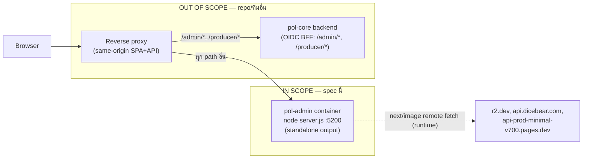
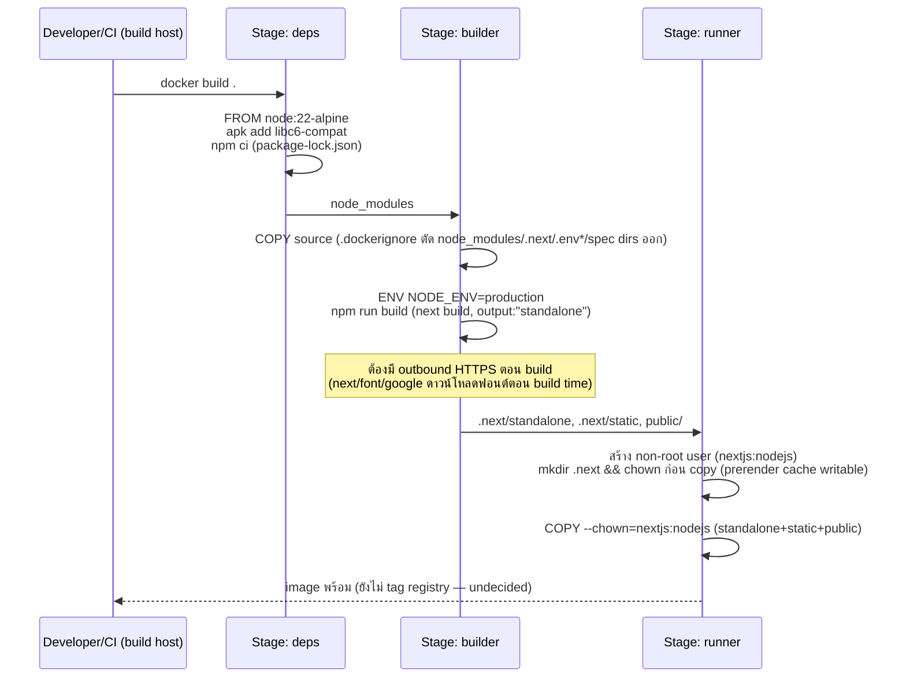
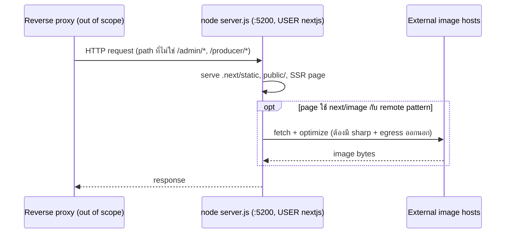

# Design: Docker Prod Deploy

> Status: approved 2026-07-13, amended 2026-07-13 (backfill REQ traceability after /spec-requirements derive)

อ้างอิง: /spec-new answers (2026-07-13). Design-First — ไม่มี requirements.md/REQ ID มาก่อน
(/spec-requirements จะ backfill ทีหลัง). Stack: Next 16.2.6 App Router / React 19.2.4 / npm.
scope ล็อกจาก /spec-new: **แค่ frontend container image**, target self-hosted/Kubernetes,
purpose = staging/UAT (prod-shaped แต่ยังไม่รับ user traffic จริง), registry ยังไม่ตัดสินใจ,
ไม่แตะ `.github/workflows/ci.yml` รอบนี้.

## Architecture Overview

Docker multi-stage build เดียว (`deps` -> `builder` -> `runner`) ผลิต production image ของ
Next.js frontend นี้เท่านั้น — ไม่มี reverse proxy, ไม่มี backend, ไม่มี docker-compose (single
service ไม่ต้อง orchestrate หลาย container ในสโคปนี้).

ไฟล์ที่เพิ่ม/แก้:

- `Dockerfile` (ใหม่, root) — 3 stage
- `.dockerignore` (ใหม่, root)
- `next.config.ts` (แก้) — เพิ่ม `output: "standalone"`
- `package.json` (แก้) — เพิ่ม `sharp` เป็น prod dependency

**ขอบเขตชัดเจน (สำคัญ เพราะเคย ambiguous มาก่อนใน /spec-new):** reverse proxy ที่เสิร์ฟ
SPA+backend origin เดียวกัน และตัว backend (`pol-core`, OIDC BFF) เป็นของ repo/ทีมอื่น
ทั้งคู่ — container นี้แค่ต้อง **compatible** กับ topology นั้น (ไม่ hardcode origin, ไม่ผูก
proxy config เอง) ไม่ใช่ต้อง provision มันเอง.



## Sequence Diagrams

### Build-time flow



### Runtime request flow (ภายใน scope ของ container เอง)



## Data Models & Interfaces

ไม่มี schema/type ใหม่ (ไม่ใช่ business domain) — "interface" ของ spec นี้คือไฟล์ infra
ที่เพิ่ม/แก้ ระบุ exact content ตามที่ตกลง (module/interface level):

### `Dockerfile` (ใหม่, root)

```dockerfile
# syntax=docker/dockerfile:1

FROM node:22-alpine AS base

# ---- deps: install dependencies only ----
FROM base AS deps
RUN apk add --no-cache libc6-compat
WORKDIR /app
COPY package.json package-lock.json ./
RUN npm ci

# ---- builder: build the app ----
FROM base AS builder
WORKDIR /app
COPY --from=deps /app/node_modules ./node_modules
COPY . .

# NEXT_PUBLIC_* ใด ๆ ที่ต้องการต้อง ARG/ENV ก่อนบรรทัด build นี้ (ค่า inline เข้า JS bundle
# ตอน build เท่านั้น) — ปัจจุบัน grep source แล้วไม่มี NEXT_PUBLIC_* ตัวไหนที่โค้ด live ใช้
# (ดู Error Handling Strategy: NEXT_PUBLIC_GOOGLE_CLIENT_ID_* เป็นของเก่าที่ dead แล้ว)
# NEXT_PUBLIC_SKIP_AUTH: ตั้งใจไม่ ARG/ENV ที่นี่ — prod build ต้องไม่ bake flag นี้เข้าไปเลย
ENV NODE_ENV=production
RUN npm run build

# ---- runner: minimal production image ----
FROM base AS runner
WORKDIR /app

ENV NODE_ENV=production
ENV PORT=5200
ENV HOSTNAME=0.0.0.0
# ADMIN_API_ORIGIN: ตั้งใจไม่ set — next.config.ts rewrites() คืน [] เมื่อไม่ set
# (reverse proxy เสิร์ฟ SPA+API origin เดียวกันอยู่แล้วใน prod)

RUN addgroup --system --gid 1001 nodejs \
  && adduser --system --uid 1001 nextjs

COPY --from=builder --chown=nextjs:nodejs /app/public ./public

# permission ก่อน copy standalone — ให้ prerender/ISR cache เขียนได้ตอน runtime
RUN mkdir .next && chown nextjs:nodejs .next

COPY --from=builder --chown=nextjs:nodejs /app/.next/standalone ./
COPY --from=builder --chown=nextjs:nodejs /app/.next/static ./.next/static

USER nextjs

EXPOSE 5200

HEALTHCHECK --interval=30s --timeout=5s --start-period=10s --retries=3 \
  CMD node -e "require('http').get('http://127.0.0.1:'+(process.env.PORT||5200)+'/', r=>{process.exit(r.statusCode<500?0:1)}).on('error',()=>process.exit(1))"

CMD ["node", "server.js"]
```

### `.dockerignore` (ใหม่, root)

```
node_modules
.next
.git
.github
.githooks
.claude
.ai
.agents
.codex
.opencode
docs
retrospectives
scripts
*.md
.env
.env.*
!.env.example
.DS_Store
coverage
.playwright-mcp
next-env.d.ts
tsconfig.tsbuildinfo
Dockerfile
.dockerignore
```

`.gitignore` กับ `.dockerignore` เป็นคนละกลไก — COPY ใน Dockerfile ไม่มองไฟล์ที่ gitignore
เว้น (`.env.local` เป็นตัวอย่างจริงที่มี local var อยู่) ต้องกันซ้ำที่ `.dockerignore` เอง.

### `next.config.ts` (diff)

```diff
 const nextConfig: NextConfig = {
+  output: "standalone",
   images: {
     remotePatterns: [
```

### `package.json` (diff)

```diff
   "dependencies": {
     "@base-ui/react": "^1.5.0",
+    "sharp": "^0.33.0",
```

(pin เวอร์ชันจริงตอน `npm install sharp` ที่ /spec-implement — เลขนี้เป็น placeholder
บ่งชี้ major/minor range ปัจจุบัน ไม่ใช่ตัวที่ต้อง lock เป๊ะ)

## Technology Decisions

| Decision | เลือก | เหตุผล |
|---|---|---|
| Base image | `node:22-alpine` (pin patch tag จริงตอน implement) | Next.js ต้องการ Node >=20.9.0 (official docs, ยืนยันผ่าน context7). เครื่อง dev local มี node 26 ซึ่งเป็น **Current ไม่ใช่ LTS** — ไม่ใช้เป็น base ของ prod image. alpine = pattern ของ official Next.js Docker example, image เล็ก |
| `output: "standalone"` | เพิ่มใน `next.config.ts` | official self-host Docker recipe — output file tracing เอาเฉพาะ dependency ที่ build จริงต้องใช้ ลด image size มาก เทียบกับ copy `node_modules` เต็ม |
| `sharp` เป็น prod dependency | เพิ่มใน `package.json` | self-host image optimization best practice ของ Next.js เอง; `next/image` + `remotePatterns` ถูกใช้จริง (grep เจอ 20+ ไฟล์ import `next/image`) ไม่ใช่ config ที่ตายแล้ว |
| Non-root runtime user | `nextjs:nodejs` (uid/gid 1001) | security baseline มาตรฐาน — official Next.js Docker example ก็ทำแบบนี้ |
| Multi-stage (deps/builder/runner) | 3 stage แยก | stage `runner` สุดท้ายไม่มี devDependencies/build tool/source เต็ม — ลด attack surface + size |
| ไม่มี `docker-compose.yml` | ตัดออกจากสโคป | ตัดสินใจแล้วใน /spec-new — "แค่ frontend image", single service ไม่ต้อง orchestrate |
| ไม่แตะ `ci.yml` รอบนี้ | ตัดออกจากสโคป | ตัดสินใจแล้วใน /spec-new — build/push automation เป็นงานถัดไป |
| Dockerfile ไม่ผูก registry | ไม่มี registry reference ใน Dockerfile | registry ยังไม่ตัดสินใจ (/spec-new) — tag ใส่ตอน `docker build -t`/`docker push` ภายนอกไฟล์นี้ |
| คง port 5200 | `ENV PORT=5200` / `EXPOSE 5200` | ตรงกับ `dev`/`start` script เดิมของโปรเจกต์ (`next dev -p 5200`, `next start -p 5200`) — ไม่สร้าง convention ใหม่ |
| HEALTHCHECK ด้วย inline `node -e` | ไม่ใช้ curl/wget | alpine base ไม่การันตีมี curl; node มีอยู่แล้วเสมอในทุก stage |

## Error Handling Strategy

| เคส | ผลถ้าไม่จัดการ | วิธีจัดการ |
|---|---|---|
| build ไม่มี outbound network (Google Fonts) | `next/font/google` ดาวน์โหลดฟอนต์ตอน **build time** — build fail ถ้าเข้าเน็ตไม่ได้ | เอกสารไว้เป็น build-environment requirement: ต้องมี outbound HTTPS ตอน build (ไม่ใช่แค่ runtime) |
| `sharp` native binding ผิด CPU arch | fallback ช้าลง หรือ runtime error ตอน optimize รูป | build image ให้ตรง target arch ของ deployment (เช่น deploy ขึ้น arm64 node ต้อง build arm64) — ไม่ assume x86 เสมอ |
| container ไม่มี egress ไปโฮสต์รูป remote (r2.dev, dicebear, minimal pages.dev) | `next/image` optimize รูปพวกนี้ fail ตอน runtime | เอกสารไว้ให้คนตั้งค่า K8s NetworkPolicy (นอกสโคปสร้างเอง) ต้อง allowlist 3 host นี้ |
| ตั้ง `ADMIN_API_ORIGIN` หลุดเข้า prod image | `rewrites()` จะ proxy `/admin/*` เอง ชนกับสมมติฐาน same-origin ของ reverse proxy จริง (คนละ origin behavior, กระทบ CSRF cookie) | ต้องไม่ set var นี้ตอน build/run prod image เด็ดขาด — ตรวจสอบตอน Testing Strategy |
| `NEXT_PUBLIC_SKIP_AUTH=true` หลุดเข้า prod build | ไม่มีผลจริง — `auth-provider.tsx:20` gate ด้วย `NODE_ENV!=='production'` อยู่แล้ว (verified) | defense-in-depth เฉย ๆ: prod build process ไม่ควร pass flag นี้อยู่ดี แม้ inert |
| non-root user เขียน `.next` cache ไม่ได้ | `EACCES` ตอน runtime พยายามเขียน prerender/ISR cache | ตาม official pattern: `mkdir .next && chown` **ก่อน** copy standalone output |
| `.env.local` มี `NEXT_PUBLIC_GOOGLE_CLIENT_ID_ADMIN`/`_PRODUCER` ที่ `.env.example` ไม่ได้ระบุ | ตอนแรกเข้าใจผิดว่าเป็น required build arg ที่ขาด | ตรวจแล้ว: มาจาก GIS client-side flow เดิมที่ **superseded 2026-06-24** (`login-google-sso` design.md Addendum — backend เปลี่ยนเป็น server-side OIDC BFF, `src/lib/auth/*` เดิมถูกลบทั้งหมด). grep source ปัจจุบันยืนยันไม่มีที่ไหนอ่าน 2 var นี้แล้ว — **dead, ไม่ต้อง wire เข้า Docker build**. flag ไว้เป็น repo cleanup แยก (`.env.local` มี var เก่าค้าง) ไม่ใช่ scope ของ spec นี้ |

## Testing Strategy

map กับ REQ ID จริงแล้ว (backfill จาก requirements.md, derive มาจาก section ด้านล่างของ design นี้):

- **Build succeeds**: `docker build -t pol-admin:local .` จบโดยไม่ error → REQ-1.1, 1.2, 1.10, 1.11
- **Container runs + responds**: `docker run -p 5200:5200 pol-admin:local` แล้ว `curl -i localhost:5200/` ได้ 200 → REQ-4.4, 4.5
- **Non-root confirmed**: `docker run pol-admin:local whoami` ≠ `root` → REQ-4.1, 4.2
- **ไม่มี secret หลุดเข้า image**: inspect layer (`docker history` / extract แล้ว grep หา `.env`) ต้องไม่เจอ `.env.local`/`.env` เนื้อหาจริง → REQ-5.1, 5.2, 5.3, 5.5, 5.6
- **`ADMIN_API_ORIGIN` ไม่ถูก bake**: `docker run pol-admin:local env` ต้องไม่มี `ADMIN_API_ORIGIN` → REQ-5.4
- **`NEXT_PUBLIC_SKIP_AUTH` ไม่ถูก bake**: build image แบบ prod แล้วเช็คว่า flag ไม่ true → REQ-2.1, 2.2
- **static asset โหลดได้**: เปิดหน้าเว็บผ่าน container จริง เช็ค CSS/font/รูปที่ import จาก `public/` ขึ้นครบ (ไม่ 404) → REQ-1.6, 3.1, 3.2
- **HEALTHCHECK ขึ้น healthy**: `docker inspect --format='{{.State.Health.Status}}'` หลัง start-period ต้อง `healthy` → REQ-4.6, 4.7, 4.8
- **scope boundary**: ตรวจ repo ไม่มี `docker-compose.yml` ใหม่ ไม่มี diff ใน `ci.yml`, `Dockerfile` ไม่มี registry host hardcode → REQ-6.1, 6.2, 6.3, 6.4

## Non-Functional Considerations

(section นี้บังคับเพราะ Design-First — constraint ที่ผลักดันงานนี้เป็น non-functional/infra ไม่ใช่ product behavior)

- **Security**: non-root runtime user, multi-stage ตัด devDependencies/source ทิ้งจาก final image, `.dockerignore` กัน `.env*` หลุดเข้า build context ตั้งแต่ต้นทาง (คนละกลไกจาก `.gitignore`), ไม่มี credential/registry อะไร bake ใน Dockerfile
- **Portability**: ไม่มี cloud-specific SDK/API ผูกไว้ — รันได้บน container runtime ทั่วไป (K8s ที่ตกลงไว้, plain Docker, หรืออื่น) ตรงกับการตัดสินใจ self-hosted/Kubernetes
- **Reproducibility**: base image pin เวอร์ชันเจาะจง (ไม่ใช้ `latest`/floating) ตาม Dependency rules ของโปรเจกต์
- **Maintenance**: ทุกครั้งที่ bump Next.js major ต้องเช็ค Node engine requirement ใหม่ (ตอนนี้ >=20.9.0) แล้ว sync base image tag ตาม — ไม่ใช่ one-time decision
- **Image size**: standalone output + alpine + multi-stage = image เล็กกว่า copy `node_modules` เต็มมาก (ตัวเลขจริงวัดได้ตอน implement เพราะยังไม่เคย build จริงในโปรเจกต์นี้)
- **สถานะ staging/UAT ไม่ใช่ prod จริง**: Dockerfile นี้ "prod-shaped" (ใช้ image เดิมได้ตอนขึ้น prod จริงในอนาคต) แต่ purpose ปัจจุบันคือ UAT ทดสอบ OIDC BFF login flow จริง (ตาม `login-google-sso` Addendum) บน domain data ที่ยัง mock — ไม่ใช่ตัวชี้วัดว่า "พร้อม prod" ทั้งระบบ

## Requirement Traceability

backfill จาก requirements.md (derive มาจาก design นี้ — ทิศทาง design -> REQ):

| Design element | REQ ที่ตอบสนอง |
|---|---|
| `Dockerfile` — `deps` stage (`npm ci`) | REQ-1.1, 1.2, 1.3 |
| `Dockerfile` — `builder` stage (`next build`, `NODE_ENV=production`) | REQ-1.4, 1.10, 2.1 |
| `next.config.ts` diff (`output: "standalone"`) | REQ-1.5 |
| `Dockerfile` — `runner` stage copy (`standalone`+`static`+`public` เท่านั้น) | REQ-1.6, 1.7 |
| Technology Decisions — base image `node:22-alpine` | REQ-1.8, 1.9 |
| Data Models — builder stage ไม่ ARG/ENV `NEXT_PUBLIC_SKIP_AUTH` | REQ-2.2 |
| Error Handling — NEXT_PUBLIC_* freeze-at-build note | REQ-2.3 |
| Error Handling — `NEXT_PUBLIC_GOOGLE_CLIENT_ID_*` dead (superseded) | REQ-2.4 |
| `package.json` diff (`sharp` dependency) + updated `package-lock.json` | REQ-3.1, 1.11 |
| Data Models — `next.config.ts` diff ไม่แตะ `remotePatterns` | REQ-3.2 |
| `Dockerfile` — `runner` stage non-root user + `chown` ก่อน copy | REQ-4.1, 4.2, 4.3 |
| `Dockerfile` — `ENV PORT=5200` / `HOSTNAME=0.0.0.0` | REQ-4.4, 4.5 |
| `Dockerfile` — `HEALTHCHECK` (node inline, ไม่พึ่ง curl/wget) | REQ-4.6, 4.7, 4.8 |
| `.dockerignore` — exclude `.env*` ยกเว้น `.env.example` | REQ-5.1, 5.2, 5.3 |
| `Dockerfile` — ไม่มี stage ไหน set `ADMIN_API_ORIGIN` | REQ-5.4 |
| Testing Strategy — secret-leak inspection check | REQ-5.5 |
| `.dockerignore` — exclude spec/tooling dirs | REQ-5.6 |
| Technology Decisions — ไม่มี `docker-compose.yml` | REQ-6.1, 6.2 |
| Technology Decisions — ไม่แตะ `ci.yml` | REQ-6.3 |
| Technology Decisions — Dockerfile ไม่ผูก registry | REQ-6.4 |

---

**Open item รอ confirm ตอน /spec-tasks**: exact patch tag ของ `node:22-alpine` และเวอร์ชันจริงของ
`sharp` ยังไม่ lock (ตั้งใจเว้นไว้ให้ implementation time เพราะ patch version ใหม่กว่าตลอด) — ไม่ใช่ gap
ของ design แค่จุดที่ resolve ตอนลงมือ.
