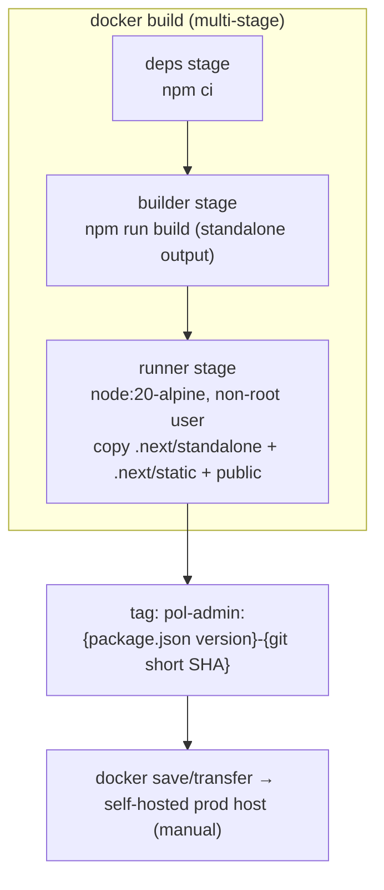
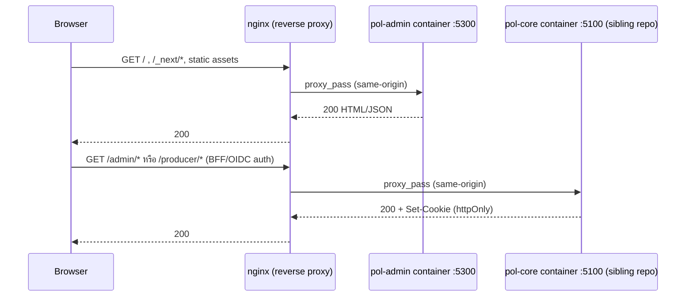
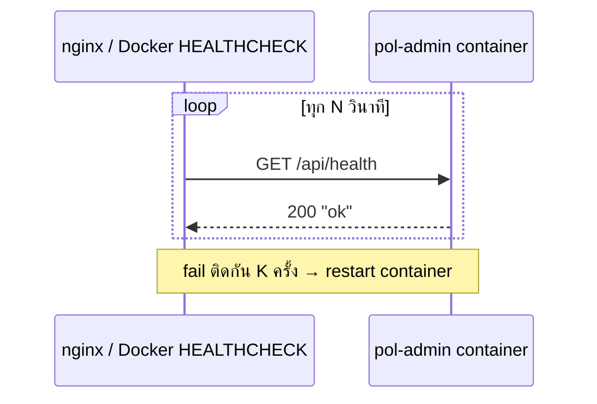

# Design: Docker Production Deployment (pol-admin)
> Status: approved 2026-07-13, amended 2026-07-13

## Architecture Overview

Component ใหม่/แก้ไขทั้งหมด (scope = repo นี้เท่านั้น, `pol-core` เป็น sibling repo ไม่แตะ):

| Component | ประเภท | หน้าที่ |
|---|---|---|
| `next.config.ts` (`output: "standalone"`) | แก้ไฟล์เดิม | เปิด Next.js standalone build — trace เฉพาะ dependency ที่ runtime ต้องใช้จริงเข้า `.next/standalone`, ตัด `node_modules` เต็มออกจาก image |
| `Dockerfile` | ไฟล์ใหม่ | multi-stage build: `deps` → `builder` → `runner` (`node:20-alpine`, non-root) |
| `.dockerignore` | ไฟล์ใหม่ | กัน `.env*`, `node_modules`, `.git`, `.next` cache หลุดเข้า build context/image layer |
| `src/app/api/health/route.ts` | ไฟล์ใหม่ | liveness endpoint สำหรับ nginx/orchestrator health check |
| `docker-compose.yml` | ไฟล์ใหม่ | รัน `pol-admin` image เดี่ยวๆ (ไม่รวม `pol-core`) สำหรับ smoke-test แบบ prod-like ก่อน deploy จริง |

Runtime topology (self-host หลัง reverse proxy — ตาม decision ที่ confirm แล้ว, ตรงกับที่
`next.config.ts`/`README.md`/`docs/dev-setup.md` ตั้งใจไว้อยู่แล้ว):

```
Internet → nginx (TLS termination, same-origin routing)
             ├── /, /_next/*, static assets  → pol-admin container :5300 (repo นี้)
             └── /admin/*, /producer/*        → pol-core container :5100 (sibling repo, out of scope)
```

nginx คือคนเดียวที่ทำหน้าที่ same-origin routing ใน prod แทน Next.js `rewrites()` ที่ทำงานเฉพาะ dev
(`ADMIN_API_ORIGIN` ต้องเว้นว่างใน prod เพื่อปิด rewrite นั้น — ดู Data Models & Interfaces).

## Sequence Diagrams

**1. Build & tag (manual — ไม่ wire CI ใน feature นี้ตาม decision ที่ confirm แล้ว):**



**2. Runtime request flow (prod, หลัง nginx):**



**3. Health check:**



## Data Models & Interfaces

**Runtime env contract** (ยืนยันจาก `.env.example` จริง — มีตัวแปรเดียว):

| Variable | Required | Prod value | หมายเหตุ |
|---|---|---|---|
| `ADMIN_API_ORIGIN` | optional | **เว้นว่าง/unset** | ถ้าตั้งค่าใน prod จะไปเปิด `next.config.ts` `rewrites()` (ตั้งใจไว้เฉพาะ dev) โดยไม่ตั้งใจ — ดู Error Handling |

ไม่มี secret/API key อื่นที่ container ต้องรับตอนนี้ (repo scope) — ทำให้ env contract เรียบง่ายมาก
ไม่มี "missing required var" failure mode ให้ handle.

**Container interface:**
- `EXPOSE 5300`
- Entrypoint: `node server.js` (ไฟล์ที่ Next.js standalone output generate เอง — มาแทน `next start`)
- Health interface: `GET /api/health` → `200` body `"ok"` (plain text, ไม่ต้อง JSON — เบาที่สุดพอ)

**docker-compose.yml interface** (scope: pol-admin เดี่ยว):
- service เดียว `pol-admin`: `build: .`, `ports: ["5300:5300"]`, `env_file` ชี้ไฟล์ env ที่**ไม่ commit**
  (ตาม Secrets rules), `restart: unless-stopped`

## Technology Decisions

| Decision | เลือก | เหตุผล |
|---|---|---|
| Build output mode | `output: "standalone"` ใน `next.config.ts` | ลด image size มาก (trace เฉพาะ dep ที่ใช้จริง) — pattern มาตรฐานของ Next.js + Docker; ต้อง verify syntax/behavior จริงกับ Next.js 16 ตอน implement (version ใหม่) |
| Build strategy | multi-stage (`deps`/`builder`/`runner`) | runner ไม่มี devDependency/build cache หลงเหลือ — image เล็กลง, attack surface น้อยลง |
| Base image | `node:20-alpine` | ตรง Node 20 LTS ที่ `docs/dev-setup.md` ระบุ; dependency ทั้งหมด (`recharts`/`simplebar`/`@base-ui/react`/`@tanstack/react-table` ฯลฯ) เป็น pure JS ไม่มี native binding — alpine (musl) ปลอดภัย ไม่เสี่ยง incompat |
| Runtime user | non-root ใน runner stage | container security baseline มาตรฐาน |
| `.dockerignore` | ครอบ `.env*`, `node_modules`, `.git`, `.next` | กัน secret/ไฟล์ไม่จำเป็นหลุดเข้า build context ตาม Secrets rules |
| Health check | เพิ่ม `src/app/api/health/route.ts` | endpoint เปล่าคืน 200 — มาตรฐานสำหรับ nginx/orchestrator liveness, เขียนสั้น ไม่กระทบ route อื่น |
| HEALTHCHECK poll mechanism | ใช้ Node เอง (`node -e` ยิง HTTP) แทน `curl`/`wget` | `node:20-alpine` ไม่มี `curl`/`wget` ติดมาโดย default — ใช้ Node ที่มีอยู่แล้วในตัว image ตรงเป้า minimal image, ไม่เพิ่ม package (จาก /spec-analyze finding #1) |
| HEALTHCHECK `start_period` | ~10 วินาที | กัน false-unhealthy ระหว่าง container cold start ก่อน Next.js server พร้อมรับ request (จาก /spec-analyze finding #6) |
| Image tag | `{package.json version}-{git short SHA}` | trace กลับ commit ตรง — ตรง Deploy/Release rules ที่ขอ tag เวอร์ชันชัดเจนทุก release |
| docker-compose scope | `pol-admin` เดี่ยวๆ | `pol-core` เป็น sibling repo — ต้องขอ confirm แยกก่อนแตะตาม repo-scope rule; full-stack compose ทำเป็น feature แยกได้ถ้าต้องการทีหลัง |
| CI wiring | ไม่ทำในรอบนี้ | `.github/workflows/ci.yml` ปัจจุบันยังไม่รัน build/test/lint ของ pol-admin เลย — wire registry push ก่อนมี baseline นั้นจะข้ามขั้น |

## Non-Functional Considerations

*(section นี้ครอบ constraint ที่ทำให้เลือก Design-First แทน Requirements-First — งานเริ่มจาก
architecture/non-functional constraint ไม่ใช่ user behavior)*

- **Topology constraint (ตายตัว ไม่ negotiable ในงานนี้)**: same-origin reverse-proxy routing —
  ฝังอยู่ใน `next.config.ts` comment + `docs/dev-setup.md` request-flow diagram อยู่แล้วก่อนงานนี้
  เริ่ม; เปลี่ยน topology (เช่นไป managed platform) กระทบ auth flow (OIDC BFF cookie) ด้วย ไม่ใช่แค่
  deploy mechanism
- **Security**: ห้าม secret หลุดเข้า image layer, non-root runtime, base image เล็กสุดเท่าที่ทำได้
  โดยไม่เสี่ยง compat
- **Image size / transfer**: self-host ต้อง `docker save`/transfer image เอง (ไม่มี registry ใน
  scope นี้) — standalone output + alpine ช่วยให้ transfer เร็ว/เบา
- **Version consistency**: pin Node 20 LTS ให้ตรง dev requirement (`docs/dev-setup.md`) กัน
  runtime drift ระหว่าง dev/prod
- **Compat**: alpine (musl) ยืนยันปลอดภัยกับ dependency tree ปัจจุบัน (pure JS ทั้งหมด) — ถ้าเพิ่ม
  dependency ที่มี native binding ในอนาคต ต้อง revisit เป็น `node:20-slim`

## Error Handling Strategy

| Error case | การจัดการ |
|---|---|
| `npm run build` fail ระหว่าง `docker build` | build stage exit non-zero, image ไม่ถูกสร้าง — fail fast ตามปกติของ Docker multi-stage |
| `ADMIN_API_ORIGIN` ถูกตั้งค่าโดยไม่ตั้งใจใน prod | mitigate 2 ชั้น: (1) comment ชัดเจนใน `docker-compose.yml`/env template ว่า "ต้องเว้นว่าง" (ตรงกับ pattern ที่ `next.config.ts`/README ใช้อยู่แล้ว) (2) **startup log warning** ถ้า `NODE_ENV=production` และ `ADMIN_API_ORIGIN` ถูกตั้งค่า — ไม่ fail-fast แค่ log ชัดๆ (REQ-2.4, จาก /spec-analyze finding #2: doc comment อย่างเดียวจับ silent misconfiguration ไม่ได้จริง) |
| Health check fail ต่อเนื่อง | Docker `HEALTHCHECK` directive (retries+interval) → container ถูก mark unhealthy → nginx/host process manager restart ตาม policy ปกติของ host นั้น |
| Container ขึ้นแล้วแต่ route คืน 404 ทุกเส้น (Turbopack-zombie pattern ที่เคยเจอใน dev — `LESSONS.md`) | verification step ต้อง `curl -i` ดู body จริง ไม่เชื่อแค่ status code — ระบุไว้ชัดใน Testing Strategy |
| Missing required env var | ไม่มี failure mode นี้ในตอนนี้ — มีแค่ `ADMIN_API_ORIGIN` ที่เป็น optional (ปลอดภัยตอนไม่ตั้งค่า) |

## Testing Strategy

*(backfilled — map กับ REQ ID จริงหลัง `/spec-requirements` derive requirements.md จาก design นี้)*

| Test | REQ ที่ตรวจ |
|---|---|
| `docker build .` ผ่าน, exit 0 | REQ-1.1, REQ-1.2, REQ-1.4 |
| `docker run` แล้ว `curl -i http://localhost:5300/` ได้ 200 + HTML body จริง (ไม่ใช่แค่ status code — กัน zombie-pattern false positive) | REQ-2.1, REQ-2.2 |
| `curl -i http://localhost:5300/api/health` ได้ 200 `"ok"` | REQ-3.1 |
| รันโดยไม่ตั้ง `ADMIN_API_ORIGIN` (หรือตั้งว่าง) แล้ว build ไม่มี dev-rewrite behavior หลุดเข้า prod | REQ-2.2, REQ-2.3 |
| `docker history <image> --no-trunc \| grep -i env` ไม่เจอ `.env*` หลุดเข้า layer | REQ-5.1, REQ-5.2 |
| เทียบ image size ก่อน/หลังใช้ `output: "standalone"` | REQ-1.2 |
| image ที่ build ได้ tag ตรง `{version}-{git short SHA}` | REQ-4.1 |
| `docker-compose up` มีแค่ service `pol-admin` เดี่ยว | REQ-4.2 |
| รันด้วย `ADMIN_API_ORIGIN` ตั้งค่า + `NODE_ENV=production` แล้วดู log มี startup warning จริง | REQ-2.4 |
| `docker inspect <container>` เห็น `Healthcheck.StartPeriod` ~10s | REQ-3.4 |
| `.ai/bin/gate-task.sh` เขียว (typecheck/test/lint auto-detect จาก `package.json`) | Definition of Done มาตรฐานของ repo (`TASK_PROTOCOL.md` — ไม่ผูก REQ เฉพาะ) |

## Requirement Traceability

| Design element | REQ |
|---|---|
| Dockerfile multi-stage (`deps`/`builder`/`runner`) | REQ-1.1 |
| `output: "standalone"` + `node:20-alpine` base | REQ-1.2 |
| Non-root runtime user (runner stage) | REQ-1.3 |
| Build fail-fast (non-zero exit, no image on build error) | REQ-1.4 |
| `EXPOSE 5300` / container port | REQ-2.1 |
| Same-origin topology, `ADMIN_API_ORIGIN` เว้นว่างใน prod | REQ-2.2 |
| Env template comment เตือนเรื่อง `ADMIN_API_ORIGIN` | REQ-2.3 |
| Startup log warning เมื่อ `ADMIN_API_ORIGIN` ถูกตั้งใน prod | REQ-2.4 |
| `src/app/api/health/route.ts` | REQ-3.1 |
| Docker `HEALTHCHECK` directive (Node-based poll, ไม่ใช่ curl/wget) | REQ-3.2 |
| Unhealthy → host restart policy | REQ-3.3 |
| HEALTHCHECK `start_period` ~10s | REQ-3.4 |
| Image tag `{version}-{git short SHA}` | REQ-4.1 |
| `docker-compose.yml` (pol-admin เดี่ยว) | REQ-4.2 |
| Manual build/tag/run docs (CI ไม่อยู่ใน scope) | REQ-4.3 |
| `.dockerignore` | REQ-5.1 |
| ตรวจ image layer ไม่มี `.env*` | REQ-5.2 |
