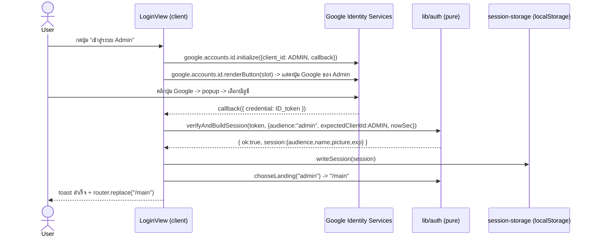
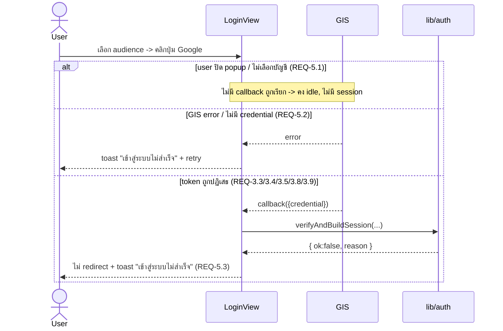
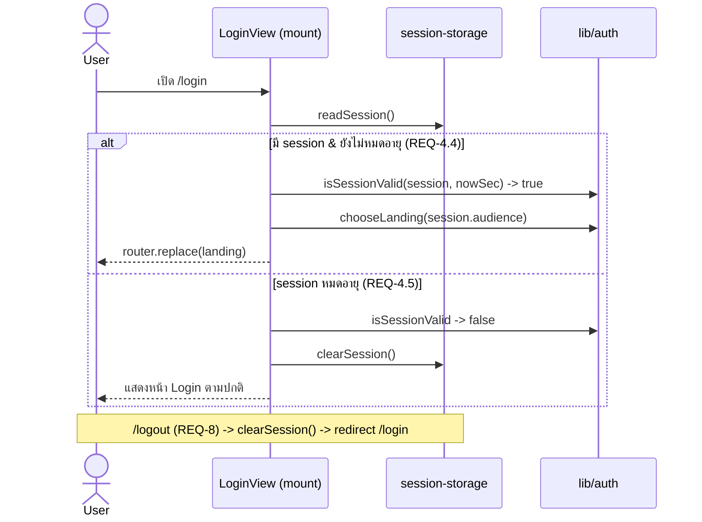

# Design: Login + Dual Google SSO

> Status: approved 2026-06-23, amended 2026-06-23, **SUPERSEDED 2026-06-24** (ดู Addendum 2026-06-24 ท้ายไฟล์)
>
> หมายเหตุ: ส่วน GIS client-side ทั้งหมดด้านล่าง (ปุ่ม 2-card, jwt decode, validateClaims, localStorage
> mock session, NEXT_PUBLIC_GOOGLE_CLIENT_ID_*) **เลิกใช้แล้ว** — backend เปลี่ยนเป็น server-side OIDC BFF.
> เก็บไว้เป็นบันทึกประวัติ. ของจริงที่ใช้งานอยู่ = Addendum 2026-06-24.

อ้างอิง: requirements.md (approved 2026-06-23, REQ-1..REQ-8). Stack: Next 16 App Router / React 19 /
Tailwind v4 / @base-ui / vitest (node env). Frontend-only, mock data, ไม่มี backend, ไม่มี dependency ใหม่.

## Architecture Overview

แยกเป็น 3 ชั้นตาม ARCHITECTURE.md (pure logic แยกจาก presentation; co-locate test; reuse primitive กลาง):

**ชั้น pure logic** (`src/lib/auth/*`, ทดสอบด้วย vitest node):
- `jwt.ts` — `decodeJwtPayload(token)` แยก JWT 3 ส่วน base64url-decode ส่วน payload, JSON.parse; malformed -> `null` (REQ-3.1, 3.3)
- `session.ts` — pure decision fns:
  - `validateClaims(payload, opts)` ตรวจ `aud`/`exp`/`email_verified`/`hd` -> `{ok, session}` หรือ `{ok:false, reason}` (REQ-3.2, 3.4, 3.5, 3.8, 3.9)
  - `verifyAndBuildSession(token, opts)` orchestrator: decode + validate -> ผลเดียว (ใช้โดย view)
  - `chooseLanding(audience)` -> route ผ่าน `LANDING_BY_AUDIENCE` (REQ-4.1)
  - `isSessionValid(session, nowSec)` -> เช็คหมดอายุ (REQ-4.4, 4.5)
- `auth-config.ts` — อ่าน env + ค่าคงที่:
  - `getClientId(audience)` <- `NEXT_PUBLIC_GOOGLE_CLIENT_ID_ADMIN` / `_PRODUCER` (REQ-6.1); คืน `null` ถ้าไม่ตั้ง (REQ-2.5)
  - `LANDING_BY_AUDIENCE: Record<Audience,string>` = `{ admin: "/main", producer: "/main" }`
  - `ALLOWED_HOSTED_DOMAINS: Record<Audience,string[]>` (default `{}` = ปิด hd check) (REQ-3.8)

**ชั้น storage adapter** (`src/lib/auth/session-storage.ts`, client-only, thin, ไม่ unit-test ใน node):
- `readSession()` / `writeSession(s)` / `clearSession()` บน `localStorage` key `pol.mock_session`. แยกจาก pure
  logic เพื่อให้ `session.ts` คง node-testable (ไม่แตะ `window`)

**ชั้น presentation** (`src/app/login/`, `src/app/logout/`, `src/components/auth/*`):
- `src/app/login/page.tsx` — server component บางมาก, render `<LoginView/>` (ตาม page->view pattern)
- `src/components/auth/login-view.tsx` (`"use client"`) — โหลด GIS script (`next/script`), เช็ค session เดิม
  (initial state `checking` กัน flash), render 2 ปุ่ม audience + slot ของ GIS rendered button (render-on-demand),
  จัดการ callback, แสดง toast, แสดง config error แบบ inline (REQ-1, 2, 4.4, 5)
- `src/components/auth/use-auth-toast.ts` + `auth-toaster.tsx` — extend pattern ของ `use-role-toast.ts` โดยเพิ่ม
  field `variant: "success" | "error"` (icon Check/X + สี success/error). ไม่เพิ่ม dependency — toaster เดิม
  hardcode success icon จึง reuse ตรง ๆ ไม่ได้ (B4) (REQ-5.4)
- `src/app/logout/page.tsx` (`"use client"`) — `clearSession()` -> redirect `/login` (REQ-8)
- `src/types/auth.ts` — `Audience`, `GoogleIdTokenClaims`, `MockSession`

**Config/secret:** `.env.example` (committed, placeholder) + `.env.local` (gitignored, ค่าจริง). `.gitignore`
ปลอดภัยอยู่แล้ว (`.env`, `.env.*`, `!.env.example`). client_id เป็นค่า public ของ OAuth (ไม่ใช่ secret);
ไม่มี client secret ฝั่ง frontend (REQ-6.2, 6.3, 6.4, 6.5).

> **Trust boundary (DEV-only, ponytail ceiling):** ทุก check ฝั่ง client = hint ไม่ใช่ security control.
> prod ต้องส่ง ID token ไป verify ลายเซ็นที่ backend (`pol-core`/`sdd-auth`) ก่อนไว้ใจ identity. localStorage เก็บ
> PII (name/picture) แบบ plaintext = DEV-only; prod ใช้ httpOnly cookie set โดย backend.

## Sequence Diagrams

### Happy path — เลือก audience -> ได้ ID token -> mock session -> redirect


### Error / reject path (REQ-3.x, REQ-5)


### มี session แล้วเข้า /login + sign-out (REQ-4.4, 4.5, 8)


## Data Models & Interfaces

`src/types/auth.ts`:
```ts
export type Audience = "admin" | "producer";

// claim ที่อ่านจาก Google ID token payload (REQ-3.2)
export interface GoogleIdTokenClaims {
  sub: string;
  email: string;
  email_verified: boolean;
  name: string;
  picture?: string;
  aud: string;      // = client_id ที่ใช้
  exp: number;      // epoch seconds
  hd?: string;      // hosted domain (ถ้ามี)
}

// mock session: เก็บเฉพาะ field ที่ UI ใช้ (REQ-3.6, F6) — ไม่เก็บ sub/email
export interface MockSession {
  audience: Audience;
  name: string;
  picture?: string;
  exp: number;
}
```

`src/lib/auth/jwt.ts`:
```ts
// REQ-3.1, 3.3 — decode payload เท่านั้น ไม่ verify ลายเซ็น (DEV-only). return null ถ้า malformed.
// ขั้นตอน base64url ที่ต้อง isomorphic (รันได้ทั้ง node test และ browser):
//   1) แยก 3 ส่วนด้วย "."; ไม่ครบ 3 -> null
//   2) ส่วน payload: replace "-"->"+", "_"->"/", เติม "=" ให้ len หาร 4 ลงตัว
//   3) atob -> bytes -> TextDecoder("utf-8") (รองรับชื่อ UTF-8/ไทย) -> JSON.parse
//   4) JSON.parse fail / ไม่ใช่ object -> null
export function decodeJwtPayload(token: string): Record<string, unknown> | null;
```

`src/lib/auth/session.ts`:
```ts
export type ClaimResult =
  | { ok: true; session: MockSession }
  | { ok: false; reason: "malformed" | "missing_claims" | "aud_mismatch" | "expired" | "email_unverified" | "hd_blocked" };

export interface VerifyOpts {
  audience: Audience;
  expectedClientId: string;          // aud ต้องตรงกับ client_id ที่กด (REQ-3.4)
  allowedHostedDomains?: string[];   // ว่าง/undefined = ไม่ตรวจ hd (REQ-3.8)
  nowSec: number;                    // inject เวลา -> pure/testable
}

// claim ที่ขาด (aud/exp/email_verified/sub/email) -> reason "missing_claims"; email_verified รับทั้ง boolean และ string "true"
export function validateClaims(payload: Record<string, unknown>, opts: VerifyOpts): ClaimResult;     // REQ-3.2,3.4,3.5,3.8,3.9
export function verifyAndBuildSession(token: string, opts: VerifyOpts): ClaimResult;                  // decode + validate (known audience)
export interface ResolveCredentialOpts { audienceForClientId: (clientId: string) => Audience | null; allowedHostedDomains: (a: Audience) => string[]; nowSec: number; }
export function resolveCredential(token: string, opts: ResolveCredentialOpts): ClaimResult;           // decode + derive audience จาก aud + validate (2-card, REQ-3.4)
export function chooseLanding(audience: Audience): string;                                            // REQ-4.1
export function isSessionValid(session: MockSession, nowSec: number): boolean;                        // REQ-4.4,4.5
```

`src/lib/auth/auth-config.ts`:
```ts
export function getClientId(audience: Audience): string | null;   // env, null = ไม่ตั้ง (REQ-2.5,6.1)
export function audienceForClientId(clientId: string): Audience | null;  // reverse: aud -> audience (2-card, REQ-3.4)
export const LANDING_BY_AUDIENCE: Record<Audience, string>;        // { admin:"/main", producer:"/main" }
export const ALLOWED_HOSTED_DOMAINS: Record<Audience, string[]>;   // default ว่าง = ปิด hd check
```

`src/lib/auth/session-storage.ts` (client-only):
```ts
export function readSession(): MockSession | null;
export function writeSession(s: MockSession): void;
export function clearSession(): void;
```

GIS (`window.google.accounts.id` เท่านั้น — ห้าม `google.accounts.oauth2`, REQ-2.6) — **โชว์ปุ่ม Google ทั้ง 2
audience พร้อมกัน (2-card)**. แต่ละ rendered-button iframe bake client_id ของตัวเอง; **callback เดียวใช้ร่วม**
(audience-agnostic) เลี่ยง singleton clobber — audience derive จาก `aud` ใน token ภายหลัง (ไม่ผูก closure):
```ts
// callback ร่วมตัวเดียว (ตัวสุดท้ายที่ initialize ชนะ — ปลอดภัยเพราะเป็นฟังก์ชันเดียวกัน)
function handleCredential(r: { credential?: string }) {
  if (!r.credential) { toast("เข้าสู่ระบบไม่สำเร็จ", "error"); return; } // REQ-5.2
  const res = resolveCredential(r.credential, { audienceForClientId, allowedHostedDomains, nowSec });
  // res.ok -> writeSession + redirect chooseLanding(res.session.audience); !ok -> toast error (REQ-5.3)
}
// วาดทั้ง 2 audience: ต่อ audience -> initialize(client_id, handleCredential) -> renderButton(slot ของ card นั้น)
for (const a of ["admin", "producer"]) {
  const clientId = getClientId(a); if (!clientId) continue; // card นั้นโชว์ config error (REQ-2.5)
  window.google.accounts.id.initialize({ client_id: clientId, callback: handleCredential });
  window.google.accounts.id.renderButton(slot[a], { type: "standard", theme: "outline", text: "signin_with" });
}
// คลิกปุ่ม Google ของ card ไหน -> popup ของ client_id นั้น -> handleCredential; `aud` ในtoken บอก audience (REQ-2.3/2.4,1.3)
```

## Technology Decisions

| เรื่อง | เลือก | เหตุผล |
|--------|-------|--------|
| Auth flow | GIS **ID-token credential** (`google.accounts.id`) | REQ-2.6; คืน ID token ตรง ๆ ไม่ต้อง backend exchange, ไม่ใช้ secret (REQ-6.4) |
| 2 client_id หน้าเดียว | **โชว์ปุ่ม Google ทั้ง 2 audience พร้อมกัน (2-card), callback เดียว derive จาก `aud`** | `google.accounts.id.initialize` = singleton (callback ตัวสุดท้ายชนะ) แต่แต่ละ **rendered-button iframe bake client_id ของตัวเอง**. initialize ต่อ audience -> renderButton ลง slot ของ card นั้น โดยใช้ **callback ร่วมตัวเดียว (audience-agnostic)** -> ไม่มี closure clobber; audience มาจาก `aud` (`audienceForClientId`/`resolveCredential`). **supersedes** render-on-demand เดิม (B3) ตาม UX 2-card. **ตัด `prompt()`/oauth2** (B1/B2, REQ-2.6). verified live: 2 iframe client_id ถูกตัว + `resolveCredential` unit-tested; residual: credential routing ยืนยันเต็มตอน sign-in จริง. ดู Addendum 2026-06-23 |
| GIS script | `next/script` ใน `login-view` (`strategy="afterInteractive"`); retry = bump `key` | repo ยังไม่ใช้ `next/script`; โหลดเฉพาะหน้า login; `onLoad` -> ready, `onError` -> error state. retry เปลี่ยน `key` ของ `<Script>` เพื่อ force re-fetch (M3) (REQ-1.5/1.6) |
| Toast | extend local toast-hook pattern + field `variant` | `RoleToaster` เดิม hardcode success icon — error จะขึ้นถูกเขียว (B4). เพิ่ม variant success/error; ยังเป็น local pattern ไม่เพิ่ม lib (REQ-5.4) |
| Session storage | **localStorage** (`pol.mock_session`), field น้อยสุด | scope = mock UI, ไม่มี backend/middleware; client-only พอ. **Ceiling:** prod = httpOnly cookie set โดย backend + middleware guard |
| Redirect-if-logged-in | client-side ใน `login-view` (useEffect) | localStorage อ่านได้เฉพาะ client; server page อ่านไม่ได้ (REQ-4.4) |
| Sign-out | route **`/logout`** (clear -> `/login`) | laziest ที่ผ่าน REQ-8 โดยไม่แตะ Minimals topbar shell. **Ceiling:** ภายหลัง wire เข้า account menu ของ topbar |
| Landing per aud | const map, ทั้งคู่ -> `/main` | repo ไม่มี surface producer; map เปลี่ยนที่เดียวเมื่อมี (REQ-4.1, F8) |
| Dependency | **ไม่เพิ่ม** (ไม่ใช้ next-auth/lucia) | stack discipline; GIS + pure fn พอสำหรับ scope mock |
| Reuse | Button `@/components/ui/button`, toast pattern จาก `use-role-toast.ts`, token จาก `globals.css` (`bg-primary`/`text-error`/`shadow-card`), `cn()` | ตาม mandate reuse ไม่ reinvent |

## Error Handling Strategy

| กรณี | REQ | จัดการ |
|------|-----|--------|
| GIS script โหลดไม่เสร็จ | 1.5 | ปุ่ม disabled/loading จนกว่า `onLoad` |
| GIS script โหลด fail | 1.6 | state error + ปุ่ม "ลองใหม่" -> bump `key` ของ `<Script>` ให้ re-fetch (M3) |
| client_id ของ audience หาย | 2.5 | `getClientId` null -> ปุ่มนั้น disabled + **inline** config error ใต้ปุ่ม (ไม่ใช่ toast เพราะเกิดตอน mount); หายทั้งคู่ -> empty-state ทั้งหน้า (M4) |
| token malformed | 3.3 | `decodeJwtPayload` -> null -> reason `malformed` |
| claim หลักขาด (aud/exp/email_verified/sub/email) | 3.2 | `validateClaims` reason `missing_claims` -> reject (M1) |
| aud ไม่ตรง client_id | 3.4 | `validateClaims` reason `aud_mismatch` |
| token หมดอายุ | 3.5 | reason `expired` |
| hd ไม่อยู่ใน allow list | 3.8 | reason `hd_blocked` (เมื่อเปิด config) |
| email_verified != true (รับทั้ง bool/`"true"`) | 3.9 | normalize แล้ว reason `email_unverified` ถ้าไม่ verified (m4) |
| user ปิด/ยกเลิก popup | 5.1 | ปิด Google popup = ไม่มี callback -> คง idle ไม่มี session (ไม่พึ่ง moment-notification, B1) |
| GIS error / ไม่มี credential | 5.2 | toast "เข้าสู่ระบบไม่สำเร็จ" + retry |
| reject หรือ storage fail | 5.3 | ไม่ redirect, คงหน้า login, toast รวม `เข้าสู่ระบบไม่สำเร็จ` |
| session หมดอายุตอนเข้า /login | 4.5 | `isSessionValid` false -> `clearSession()` + แสดง login |

ทุก error ใช้ toast เดิม (`use-auth-toast` mirror `use-role-toast`) — ไม่สร้างกลไกใหม่ (REQ-5.4). ไม่ log
token/PII ทุกกรณี (REQ-3.7).

## Testing Strategy

vitest **node env** -> ทดสอบเฉพาะ pure logic (co-located `*.test.ts`). UI/GIS/a11y = manual verify (`npm run dev` :5200).

`src/lib/auth/jwt.test.ts`:
- decode token valid -> payload ถูก (REQ-3.1)
- ไม่ใช่ 3 ส่วน / base64 พัง / ไม่ใช่ JSON -> `null` (REQ-3.3)
- payload ที่มี `-`/`_` (base64url) และ len ไม่หาร 4 -> decode ถูก (M2)
- ชื่อ UTF-8/ไทย ใน `name` -> decode ไม่เพี้ยน (M2)

`src/lib/auth/session.test.ts`:
- `validateClaims`: aud ตรง -> ok + session มีเฉพาะ audience/name/picture/exp (REQ-3.4, 3.6); aud ไม่ตรง -> `aud_mismatch` (REQ-3.4)
- `exp` อนาคต -> ok; อดีต -> `expired` (REQ-3.5)
- `email_verified` true -> ok; false -> `email_unverified`; string `"true"` -> ผ่าน, `"false"` -> `email_unverified` (REQ-3.9, m4)
- claim หลักขาด (`aud`/`exp`/`email_verified`) -> `missing_claims` (REQ-3.2, M1)
- hd: ไม่มี allow list -> ผ่าน; มี allow list & hd ตรง -> ผ่าน; ไม่ตรง -> `hd_blocked` (REQ-3.8)
- `verifyAndBuildSession`: malformed token -> `malformed` (REQ-3.3)
- `chooseLanding("admin")` -> `/main`; `chooseLanding("producer")` -> `/main` (REQ-4.1, 4.2, 4.3)
- `isSessionValid`: ยังไม่หมดอายุ -> true; หมดอายุ -> false (REQ-4.4, 4.5)

Manual verify (REQ ที่เป็น UI): `/login` ไม่มี shell (1.1, 1.2), 2 ปุ่ม + label (1.3, 1.4), loading/error ของ
script (1.5, 1.6), env client_id แยกต่อปุ่ม (2.1-2.4), keyboard/contrast/responsive (7.1-7.3), /logout (8),
ไม่มี token/PII ใน console/network (3.7).

## Requirement Traceability

| REQ | Design element |
|-----|----------------|
| 1.1, 1.2 | `src/app/login/page.tsx` (shell-free โดย root layout) |
| 1.3, 1.4 | `login-view.tsx` 2 ปุ่ม + accessible name |
| 1.5, 1.6 | `<Script>` ready/error state ใน `login-view` |
| 2.1, 2.2 | `auth-config.getClientId` (env) |
| 2.3, 2.4 | `signIn(audience)` re-init GIS + tag audience |
| 2.5 | `getClientId` null -> ปุ่ม disabled + inline config error; หายทั้งคู่ -> empty-state |
| 2.6 | `google.accounts.id` ID-token flow (Technology Decisions) |
| 3.1, 3.3 | `jwt.decodeJwtPayload` |
| 3.2, 3.4, 3.5, 3.8, 3.9 | `session.validateClaims` |
| 3.6 | `MockSession` (field น้อยสุด) + `validateClaims` |
| 3.7 | login-view: ไม่ log token/PII (Error Handling) |
| 4.1 | `session.chooseLanding` + `LANDING_BY_AUDIENCE` |
| 4.2, 4.3 | `login-view` redirect ตาม `chooseLanding(session.audience)` |
| 4.4 | `login-view` mount: `readSession` + `isSessionValid` -> redirect |
| 4.5 | `isSessionValid` false -> `clearSession` + แสดง login |
| 5.1, 5.2, 5.3 | `login-view` callback handler (5.1 = ไม่มี callback = idle) |
| 5.4 | `use-auth-toast` / `auth-toaster` (mirror role toast) |
| 6.1 | `auth-config` อ่าน `NEXT_PUBLIC_GOOGLE_CLIENT_ID_*` |
| 6.2, 6.4 | ไม่มี hardcode/secret; ID-token flow |
| 6.3 | `.env.example` (placeholder, committed) |
| 6.5 | `.gitignore` (`.env`, `.env.*`, `!.env.example`) — มีอยู่แล้ว |
| 7.1, 7.2, 7.3 | `login-view` semantic Button + tokens + responsive (manual verify) |
| 8.1, 8.2, 8.3 | `src/app/logout/page.tsx` + `clearSession` |

## Design review log (spec-architect critique, 2026-06-23)

- **B1/B2/B3 (BLOCKER) GIS strategy** — `prompt()` = One Tap (cooldown/rate-limit; FedCM ถอด moment-notification).
  **Applied:** เปลี่ยนเป็น `renderButton()` render-on-demand 1 client_id/ครั้ง; ตัด `prompt()`; cancel = ไม่มี callback. + spike ยืนยัน client_id binding
- **B4 (BLOCKER) toast** — `RoleToaster` hardcode success icon. **Applied:** `use-auth-toast`/`auth-toaster` เพิ่ม `variant` success/error (ยังเป็น local pattern ไม่เพิ่ม lib)
- **M1 missing claims** — **Applied:** reason `missing_claims` เมื่อ aud/exp/email_verified/sub/email ขาด + test
- **M2 base64url isomorphic** — **Applied:** spec replace `-_`/pad/atob/TextDecoder UTF-8 + test `-_` และชื่อไทย
- **M3 script retry** — **Applied:** retry = bump `key` ของ `<Script>`
- **M4 config-error placement** — **Applied:** inline ใต้ปุ่ม (ไม่ใช่ toast) + empty-state เมื่อหายทั้งคู่
- **M5 REQ-2.6 enforcement** — **Applied:** ใช้เฉพาะ `window.google.accounts.id`, ห้าม import `oauth2` (review/lint guard)
- **m1 flash before redirect** — **Applied:** initial state `checking` ก่อน render ปุ่ม (hydration ปลอดภัย: อ่าน localStorage ใน effect + root `suppressHydrationWarning`)
- **m2 localStorage PII** — **Applied:** ผูกเข้า Trust boundary ceiling (DEV-only; prod = httpOnly cookie)
- **m3 stale prompt() snippet** — **Applied:** แทน snippet เป็น `renderButton`
- **m4 email_verified string** — **Applied:** normalize `=== true || === "true"` + test

## Open items (defer ไป tasks/impl)
- ค่า client_id จริงของ 2 OAuth client (Google Cloud Console) — ใส่ `.env.local` ตอนทดสอบจริง
- ถ้า `prompt()` ไม่ reliable -> สลับไป rendered GIS button 2 ขั้น (ระบุใน Technology Decisions ceiling)
- wire sign-out เข้า topbar account menu (ภายหลัง; `/logout` พอสำหรับ scope นี้)

## Addendum 2026-06-23 — 2-card render-both (supersedes render-on-demand B3)

ตาม UX ที่ user ขอ (แยก 2 card + โชว์ปุ่ม Google เลย) เปลี่ยนกลยุทธ์ GIS:

- **เดิม (B3):** render-on-demand 1 client_id/ครั้ง, callback closure ผูก audience -> ต้องเลือก audience ก่อนถึงเห็นปุ่ม
- **ใหม่:** โชว์ปุ่ม Google ทั้ง 2 audience พร้อมกัน. แต่ละ rendered-button iframe bake client_id ของตัวเอง; **callback ร่วมตัวเดียว (audience-agnostic)**; audience derive จาก `aud` ผ่าน `audienceForClientId` + `resolveCredential`
- **ทำไมได้:** GIS `initialize` = singleton (callback ตัวสุดท้ายชนะ) — closure ต่อปุ่มจะ clobber. callback เดียวร่วม + derive-from-aud เลี่ยงปัญหานี้ (token ของ iframe ไหนมา callback เดียวกัน decode `aud` รู้เอง)
- **REQ-3.4 reinterpret:** "aud ต้องตรง client ของปุ่มที่กด" -> "aud ต้องตรงหนึ่งใน client ที่ตั้งไว้; audience ถูกกำหนดโดย `aud`". aud ไม่ตรง client เรา -> `aud_mismatch` (เดิม). สาระความปลอดภัยเท่าเดิม
- **fn ใหม่:** `audienceForClientId(clientId)` (auth-config), `resolveCredential(token, {audienceForClientId, allowedHostedDomains, nowSec})` (session) — view ใช้ `resolveCredential` แทน `verifyAndBuildSession` (ตัวเดิมคงไว้เป็น helper known-audience + test)
- **verified:** live :5200 — 2 card, ปุ่ม Google ทั้งคู่ render พร้อมกัน, iframe client_id Admin=`888188...`/Producer=`331131...` (คนละตัว), 375 no h-scroll; unit GREEN: `resolveCredential` (malformed/aud_mismatch/admin/producer), `audienceForClientId`
- **residual:** credential routing ของ 2 ปุ่มพร้อมกัน (GIS ส่ง credential ของแต่ละ iframe เข้า callback ร่วม) ยืนยันเต็มตอน sign-in จริง — ตอนนี้ติด OAuth origin allowlist (403)
- **T3 spike เดิม** (manual ยืนยัน binding) -> แทนด้วย unit test + live distinct-client_id render

## Addendum 2026-06-24 — Server-side OIDC BFF (supersedes GIS client-side flow ทั้งหมด)

ทีม API (pol-core) เปลี่ยน admin auth เป็น **server-side OIDC BFF**. contract: `pol-core/docs/reference/
admin-fe-integration.md` (+ `admin-google-sso.md`, generated 2026-06-24 จาก C# source). FE **ไม่ถือ token**
— session อยู่ใน httpOnly cookie ที่ backend จัดการ. addendum นี้ **แทน** ดีไซน์ GIS ทั้งหมดด้านบน.

**Decisions (locked กับ user 2026-06-24):**
1. **Admin only** — ตัด producer audience ทิ้ง. `Audience` type, dual-card, `audienceForClientId`,
   `resolveCredential`, `LANDING_BY_AUDIENCE` เลิกใช้.
2. Scope = auth integration + เริ่ม data layer (wire `/admin/me` จริง; domain อื่นคง mock).

**Backend contract (ยืนยันจาก source):**
- endpoints: `GET /admin/auth/login?returnTo=`, `POST /admin/auth/logout`, `POST /admin/auth/logout-all`,
  `GET /admin/me`, `POST/GET /admin/tenants[/{code}]`, `/admin/admins/*`.
- `GET /admin/me` 200 = `{ adminId, email, tier: "Super"|"Scoped", accessibleTenants: { isUnrestricted,
  tenants?: [{id,code}] } }` — **ไม่มี name/picture**. 401 = ยังไม่ login.
- cookie (dev http): session `adm_session` (httpOnly), CSRF `adm_csrf` (JS อ่านได้). prod = `__Host-adm_session`
  + Secure อัตโนมัติ. CSRF double-submit: header `X-CSRF-Token` == cookie `adm_csrf`, เฉพาะ POST/PUT/PATCH/DELETE.
- same-origin บังคับ -> Next proxy rewrite `/admin/:path*` -> `ADMIN_API_ORIGIN` (dev เท่านั้น; prod reverse proxy).
- returnTo allowlist = `/`, `/dashboard`, `/tenants`. **`/main` ไม่อยู่ใน allowlist** -> coordination item.

**Architecture (BFF):**
- `src/lib/api/admin-api.ts` — pure helper (`readCookieFrom`, `isMutation`, `buildLoginUrl`,
  `buildRequestInit`; node-testable) + binding (`cookie`, `login`, `adminFetch`, `getMe`, `logout`,
  `logoutAll`). `adminFetch` ใส่ CSRF เมื่อ mutation + `credentials:'include'`; 401 -> เด้ง login.
- `src/components/auth/auth-provider.tsx` — `<AuthProvider>` เรียก `getMe()` ตอน mount; `useAuth()` (co-locate
  ตาม pattern settings-provider). `auth-guard.tsx` — loading -> spinner, anon -> `login()`, authed -> children.
- wrap `<AuthProvider><AuthGuard>` **ภายใน `minimals-layout.tsx`** (`MinimalsShell` = body เดิม) — คุมทุก
  protected group (dashboard/main/policy/producer/transaction/user); `/login` `/logout` ไม่ผ่าน -> public.
- `login-view.tsx` — ปุ่มเดียว `login("/dashboard")` (ตัด GIS/next-script/ResizeObserver/dual-card/toast).
- `logout/page.tsx` — `logout().finally(-> /login)`. `account-drawer.tsx` — ปุ่ม Logout -> `/logout`;
  header แสดง `me.email` + tier badge (name/avatar คง mock เพราะ backend ไม่ส่ง).
- `app/page.tsx` (root "/") — `redirect("/main")`. "/" ไม่มี surface เอง; ครอบการเข้า / ตรง ๆ + กรณี
  backend fall back มา "/" หลัง callback (เมื่อ returnTo ไม่ allowlist) -> ยังลง /main ผ่าน guard. (พบตอน live E2E: "/" 404.)
- `app/login-error/page.tsx` (public, shell-free) — backend เด้งมาเมื่อ login callback ไม่ผ่าน
  (`AdminAuthOptions.ErrorPath="/login-error"`) พร้อม `?reason=<label>`. label: `not-provisioned`,
  `suspended`, `access-denied`, `missing-subject`, `resolve-failed`, `session-write-failed` (+ OIDC failure).
  อ่าน reason -> แสดงข้อความไทย + ปุ่มกลับ `/login`. (พบตอน live E2E — guide FE ไม่ได้ระบุ route นี้.)
- `src/types/auth.ts` — `AdminTier`, `AccessibleTenants`, `AdminMe` (แทน Audience/GoogleIdTokenClaims/MockSession).
- ลบ `src/lib/auth/*` ทั้งหมด (gis/jwt/session/session-storage/auth-config + tests).

**Trust boundary:** ย้ายไป backend เต็มตัว — backend verify ID token signature, ถือ session, ตรวจ CSRF.
FE เป็นแค่ proxy + redirect + cookie carrier. client-side decode/validate เดิม = เลิกใช้.

**Tests:** `admin-api.test.ts` (node) ครอบ pure helper. UI/proxy/login round-trip = manual ที่ :5200 + backend :5100.

**Coordination items (backend):** (1) **[FE switched to /main 2026-06-24]** landing = `/main` (RETURN_TO +
FE allowlist). backend เพิ่ม `/main` ใน `AdminSession:ReturnUrlAllowlist` = nice-to-have (ลง /main ตรง ๆ);
ถ้าไม่เพิ่ม backend fall back `/` -> root page redirect -> /main อยู่ดี (double-bounce แต่ใช้งานได้);
(2) `/admin/me` เพิ่ม name/picture ถ้าต้องการแสดงใน account-drawer; (3) domain endpoints
(transaction/policy/producer/user) ยังไม่มี -> คง mock.
