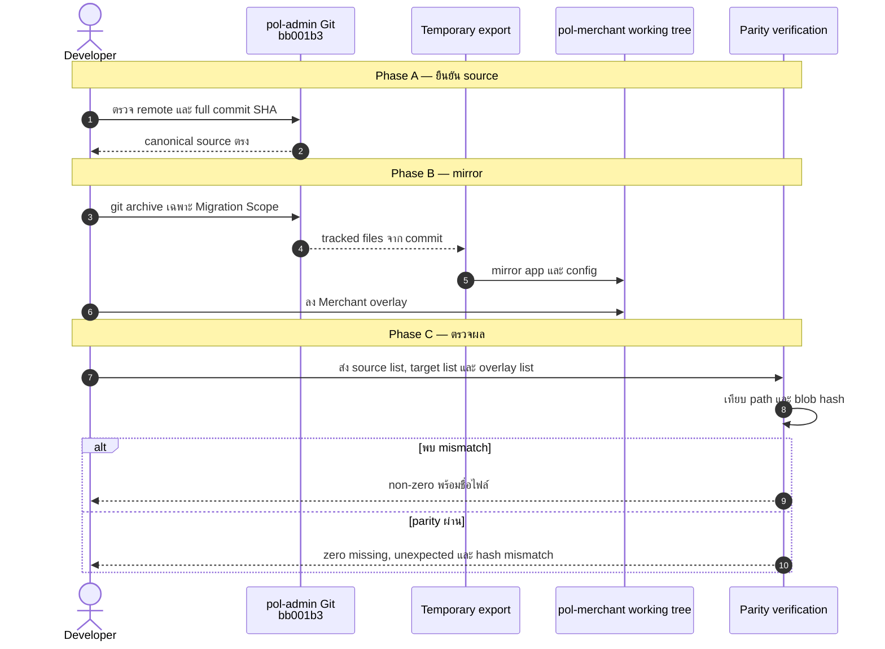
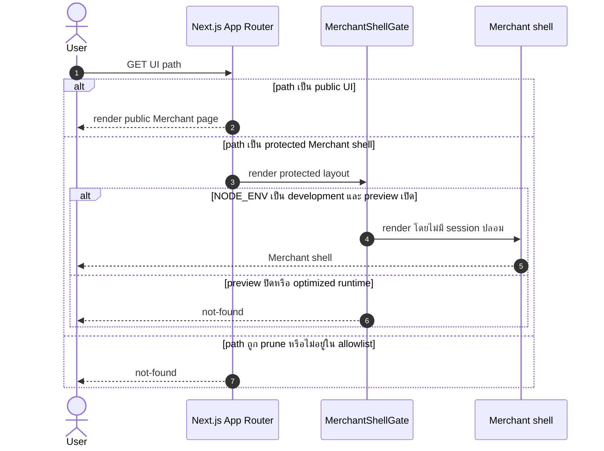
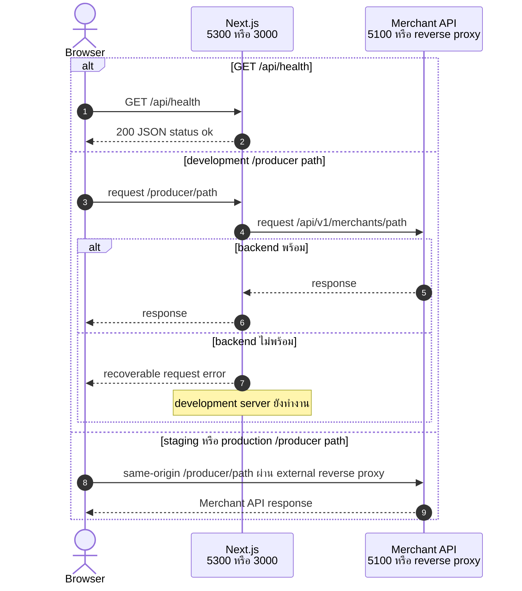
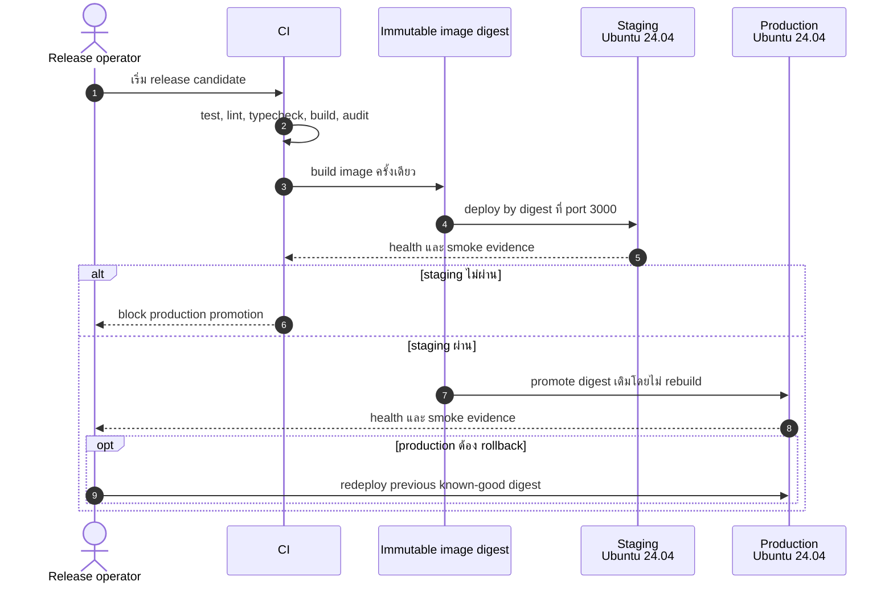

# Design: Merchant Portal Bootstrap

> Status: approved 2026-08-09

ออกแบบการย้าย application/runtime จาก `pol-admin` snapshot ที่ระบุใน
[`requirements.md`](requirements.md) แล้ววาง Merchant overlay เฉพาะ identity, route boundary,
runtime profile, API proxy, deployment และ verification โดยรักษา operating layer ของ target

## Architecture Overview

### ภาพรวมชั้นระบบ

| ชั้น | Component | หน้าที่ |
|---|---|---|
| Source snapshot | Git repository `pol-admin` commit `bb001b30b1379df2eedd4ecfcb09c9d23afe6434` | เป็น baseline เดียวและไม่อ่าน dirty working tree |
| Snapshot export | temporary directory จาก `git archive` | รับเฉพาะ tracked files ใน Migration Scope โดยไม่แตะ branch หรือ `.git` ของ source/target |
| Application mirror | `src/**`, `public/**` และ config files ที่ระบุ | แทน target application/runtime แบบ exact mirror ก่อนลง overlay |
| Merchant identity | root metadata, public pages, error/not-found page, package และ documentation | เปลี่ยน runtime-visible product จาก Admin เป็น `POL Merchant` และใช้คำว่า ตัวแทน/นายหน้า |
| Merchant route boundary | pruned App Router tree, `merchant-shell-gate.tsx`, protected layouts และ navigation configs | เปิดเฉพาะ Route Allowlist และทำ development preview แบบ opt-in โดยไม่สร้าง session |
| API boundary | `next.config.ts` และ Merchant API client | proxy เฉพาะ `/producer/:path*` ใน development และคง same-origin contract ใน deployed environments |
| Runtime profiles | `package.json` และ `scripts/clean-development.mjs` | กำหนด port/command ตายตัวและล้าง cache แบบใช้ Node standard library |
| Deployment | `Dockerfile`, `.dockerignore`, `docker-compose.yml` และ deployment docs | สร้าง standalone image บน Node 22, รัน non-root ที่ port `3000`, healthcheck และ promote image digest เดิม |
| Verification | application CI matrix, browser smoke, audit และ migration parity evidence | พิสูจน์ source parity, platform, port, route, accessibility, security และ deployment contract |

### Migration pipeline

Migration เป็น one-time controlled operation ไม่เพิ่ม migration framework ถาวร:

1. ตรวจว่า local source มี canonical remote และ full commit SHA ที่กำหนด
2. export commit เข้า temporary directory ด้วย Git โดยระบุ include paths เท่านั้น
3. mirror `src/**` และ `public/**` พร้อมลบ target-only files ภายในสอง path
4. คัดลอก config files ที่อยู่ใน Migration Scope แบบ byte-for-byte
5. ลง Merchant overlay ตามตารางด้านล่าง
6. เปรียบเทียบ sorted file list และ Git blob hash ของ non-overlay files กับ source snapshot
7. บันทึก command, missing/unexpected file list และผล hash comparison ใน task Evidence

ไม่ commit temporary export, source `.git`, source `.env*`, generated files หรือ migration helper
เฉพาะกิจ

### Merchant overlay

| กลุ่ม | การเปลี่ยนจาก source snapshot |
|---|---|
| Public entry | แก้ `src/app/page.tsx`, `src/app/layout.tsx`, `src/app/login/page.tsx`, `src/components/auth/login-view.tsx`, `src/app/login-error/page.tsx`, `src/app/not-found.tsx` |
| Protected shell | เพิ่ม `src/components/layout/merchant-shell-gate.tsx`; ให้ protected top-level layouts เรียก gate เดียว |
| Admin auth removal | ตัด `AuthProvider` และ `AuthGuard` ออกจาก `minimals-layout.tsx`; ลบสอง component เมื่อไม่มี caller |
| Route pruning | ลบ route directories `src/app/admin`, `src/app/control`, `src/app/organization`, `src/app/minimals`, `src/app/error`, `src/app/maintenance`, `src/app/logout`; คง global `src/app/error.tsx` |
| Navigation | ลด `nav-config.ts` และ `minimals-nav-config.ts` เหลือ dashboard, policy, order, transaction, Merchant user และ Merchant role |
| Merchant API | คง registration contract ใน `src/lib/api/merchant/user.ts`; ตัด dead SSO functions/tests ที่ไม่มี UI action |
| Health | เพิ่มหรือแทน `src/app/api/health/route.ts` ด้วย contract JSON ตายตัว |
| Runtime/deploy | แก้ `package.json`, root metadata ของ `package-lock.json`, `next.config.ts`, `Dockerfile`, `docker-compose.yml`, `.dockerignore`, `.gitignore` และ `.env.example` |
| Operating docs | แก้ `README.md`, `docs/dev-setup.md`, `.ai/shared/PROJECT_CONTEXT.md`, `.ai/shared/ARCHITECTURE.md` และ `.ai/shared/stack/nextjs.md`; ไม่แก้ spec history อื่น |
| CI | รักษา guard/secret/spec-trace jobs แล้วเพิ่ม application quality และ OS compatibility jobs |

### Route architecture

| Surface | Implementation | Result |
|---|---|---|
| `/` | server redirect ใน `src/app/page.tsx` | redirect ไป `/login` |
| `/login`, `/register`, `/login-error` | shell-free App Router pages | public Merchant UI |
| `/dashboard`, `/policy/*`, `/checkout/*`, `/order/*`, `/transaction/*`, `/merchant/user/*`, `/merchant/role/*` | route filesจาก source + shared `MerchantShellGate` | render เฉพาะ development ที่เปิด preview |
| `/api/health` | local Route Handler | public `200` โดยไม่ผ่าน API proxy |
| `/producer/*` | development Next rewrite หรือ deployed reverse proxy | ส่งไป Merchant backend contract |
| `/admin/*`, `/control/*`, `/organization/*`, `/minimals/*` | ไม่มี route tree หลัง overlay | native not-found ทุก environment |
| Source UI route อื่น | ไม่มี route tree หลัง overlay | native not-found ใน optimized runtime |

`MerchantShellGate` เป็น Server Component และตรวจสองเงื่อนไขพร้อมกัน:

```ts
const previewEnabled =
  process.env.NODE_ENV === "development" &&
  process.env.MERCHANT_SHELL_PREVIEW === "true";
```

ถ้าเงื่อนไขไม่ครบ gate เรียก `notFound()` ก่อน render shell ถ้าครบจึง render
`MinimalsLayout` โดยไม่สร้าง user, token, cookie หรือ authorization result ปลอม

## Sequence Diagrams

### 1. Snapshot migration และ parity

อ้างอิง: REQ-1.1-REQ-1.13



### 2. UI route boundary

อ้างอิง: REQ-2.4-REQ-2.13, REQ-3.1-REQ-3.9



### 3. API routing และ health

อ้างอิง: REQ-6.1-REQ-6.13, REQ-7.9-REQ-7.13



### 4. Build, promote และ rollback

อ้างอิง: REQ-4.3-REQ-4.11, REQ-7.1-REQ-7.14, REQ-9.15-REQ-9.19



## Data Models & Interfaces

### Environment contract

| Config | Scope | Default | Security/behavior |
|---|---|---|---|
| `MERCHANT_API_ORIGIN` | development server only | `http://localhost:5100` | server-side Next rewrite;ไม่ใช้ `NEXT_PUBLIC_*`; optimized build ไม่อ่านค่า |
| `MERCHANT_SHELL_PREVIEW` | development server only | `false` | server-only opt-in; ไม่มีผลเมื่อ `NODE_ENV=production` |
| `NODE_ENV` | Next/Docker runtime | Next กำหนดตาม command | staging และ production ใช้ `production` |
| `PORT` | standalone container | `3000` | bind ภายใน container |
| `HOSTNAME` | standalone container | `0.0.0.0` | รับ request จาก container network |

`.env.example` มีเพียงค่าปลอมหรือ non-secret:

```dotenv
MERCHANT_API_ORIGIN=http://localhost:5100
MERCHANT_SHELL_PREVIEW=false
```

Source `.env*` ไม่ถูกอ่านเป็น migration input และ `.gitignore` คงกฎ ignore `.env` กับ
`.env.*` โดย allow เฉพาะ `.env.example`

### npm command contract

| Command | Runtime | Port | Implementation |
|---|---|---|---|
| `npm run dev` | Next development | `5300` | `next dev -p 5300` |
| `npm run dev:clean` | clean แล้ว Next development | `5300` | Node `fs.rmSync` ล้าง `.next` และ `tsconfig.tsbuildinfo` แล้วเรียก dev command |
| `npm run build` | optimized build | n/a | `next build` |
| `npm run start:staging` | optimized runtime | `3000` | `next start -p 3000 -H 0.0.0.0` |
| `npm run start:production` | optimized runtime | `3000` | command เดียวกับ staging |
| `npm run start` | optimized runtime alias | `3000` | เรียก `start:production` |

`package.json` เพิ่ม `packageManager: "npm@11.12.1"` และไม่เพิ่ม cleanup/port dependency
ส่วน `package-lock.json` เริ่มจาก source snapshot แล้วเปลี่ยน root name เป็น `pol-merchant`
security remediation เปลี่ยน lock graph ได้เฉพาะรายการที่บันทึกใน dependency audit ledger
Next.js เป็นผู้คืน non-zero exit เมื่อ bind port ไม่สำเร็จ

### API contract

Development rewrite มี rule เดียว:

```text
/producer/:path* -> ${MERCHANT_API_ORIGIN}/api/v1/merchants/:path*
```

Staging/production ไม่สร้าง Next rewrite external origin browser เรียก relative `/producer/*`
และ infrastructure ภายนอก map ไป `/api/v1/merchants/*` ส่วน `/api/health` จบที่ Next Route Handler

Registration คง wire contract จาก source:

- request: `POST /producer/register`
- body: browser-generated `multipart/form-data`
- credentials: `include`
- terminal status: `201`, `400`, `409`, `413`, `429`
- network failure: แสดงข้อความลองใหม่ได้โดยไม่หยุด Next server

### Health contract

```http
GET /api/health HTTP/1.1

HTTP/1.1 200 OK
Content-Type: application/json

{"status":"ok"}
```

Endpoint ไม่อ่าน backend, environment, dependency, credential หรือ session

### Container contract

| Field | Value |
|---|---|
| Build | multi-stage `deps` -> `builder` -> `runner` |
| Base | `node:22.19.0-alpine3.22` จาก source snapshot |
| npm | exact `11.12.1` ก่อน `npm ci` |
| Output | Next standalone server |
| User | system user `nextjs`, non-root |
| Bind | `0.0.0.0:3000` |
| Compose | service `pol-merchant`, host `3000` -> container `3000` |
| Health probe | `http://127.0.0.1:3000/api/health` ผ่าน Node standard library |
| Promotion | staging และ production อ้าง image digest เดียว |
| Rollback | redeploy previous known-good digest |

### Dependency review

Source snapshot เพิ่ม production dependency 3 ตัวเทียบ target baseline ตรวจข้อมูลเมื่อ
2026-08-09:

| Dependency | Locked version | ใช้งาน | License | Maintenance status | Decision |
|---|---:|---|---|---|---|
| [`react-day-picker`](https://www.npmjs.com/package/react-day-picker) | `9.14.0` | date picker และ date range field | MIT | active, มี release major ใหม่กว่า | คง source lock; ไม่ upgrade ระหว่าง bootstrap |
| [`react-qr-code`](https://www.npmjs.com/package/react-qr-code) | `2.2.0` | QR ใน order และ transaction detail | MIT | active, release ปัจจุบันตรง source lock | คง source lock |
| [`sharp`](https://www.npmjs.com/package/sharp) | `0.34.5` -> `0.35.3` | Next image/standalone runtime | Apache-2.0 | active, patched versionมีแล้ว | security remediation ตาม dependency audit ledger |

ทุกตัวมี license อยู่ใน source `package-lock.json` และไม่ใช้ floating version

## Technology Decisions

| Decision | เลือก | เหตุผลและทางเลือกที่ไม่เลือก |
|---|---|---|
| Source acquisition | `git archive` จาก full commit SHA | ไม่ copy working tree เพราะ source dirty และทำซ้ำไม่ได้ |
| Migration parity | Git path/blob comparison เป็น implementation evidence | ไม่เพิ่ม manifest/framework ถาวรสำหรับ migration ครั้งเดียว |
| Lockfile baseline | เริ่มจาก source lock; ยอมให้ต่างเฉพาะ root identity และ security remediation ที่บันทึกไว้ | รักษา reproducibility โดยไม่บล็อก patched security update |
| Production audit | Critical บล็อกเสมอ; High ที่มี fix บล็อก; High ที่ไม่มี fix ต้องรายงานพร้อม owner/review date | ไม่ suppress advisory และไม่อ้าง zero-High เมื่อ upstream ยังไม่มี fix |
| Internal route blocking | prune App Router directories | native not-found, ลด attack surface และโค้ดน้อยกว่า proxy/middleware allowlist |
| Protected route blocking | shared Server Component gate | route ยัง compile สำหรับ preview แต่ optimized runtime เข้าไม่ได้; ไม่ duplicate logic ทุก page |
| Preview config | server-only `MERCHANT_SHELL_PREVIEW` + `NODE_ENV` | ไม่ใช้ `NEXT_PUBLIC_SKIP_AUTH`, ไม่สร้าง mock identity และไม่เปิดทางใน deployed build |
| Auth boundary | ถอด Admin guard ออกจาก Merchant shell | `/admin/me` พิสูจน์ Merchant session ไม่ได้; session contract ใหม่อยู่นอก scope |
| API development proxy | Next rewrite เฉพาะ `/producer/:path*` | ใช้ source convention, ไม่ชน local `/api/health`, ไม่เปิด broad `/api/*` proxy |
| API deployed routing | relative same-origin ผ่าน external reverse proxy | ไม่ bake localhost หรือ deployment hostname เข้า bundle |
| Cache cleanup | Node `fs.rmSync` | cross-platform และไม่เพิ่ม `rimraf` หรือ shell-specific command |
| Staging/production runtime | command aliases เหมือนกันบน optimized build | port และ executable เดียว ลด environment drift; deployment context แยก intent |
| Container | source multi-stage standalone image, เปลี่ยน port เป็น `3000` | reuse proven source pattern, non-root และไม่มี package เพิ่มใน runner |
| Release promotion | immutable image digest เดียว | staging พิสูจน์ artifact เดียวกับ production; rollback ชี้ digest ก่อนหน้า |
| CI smoke | native Bash บน macOS/Ubuntu และ PowerShell บน Windows | ไม่เพิ่ม test-server dependency เพื่อจัดการ process |

## Error Handling Strategy

| Error case | Detection | Response |
|---|---|---|
| Source remote/SHA ไม่ตรง | pre-migration Git check | หยุดก่อน export พร้อม expected/actual value |
| Source path ขาดหรือมี target mismatch | path/blob parity comparison | non-zero พร้อมชื่อ missing, unexpected หรือ changed file |
| Generated/excluded file ต่าง | exclusion list จาก requirements | ไม่นับเป็น mismatch |
| Internal/unknown route ถูกเรียก | route tree ไม่มี page | native not-found |
| Protected route ถูกเรียกเมื่อ preview ปิด | `MerchantShellGate` | `notFound()` โดยไม่เรียก `/admin/me` |
| Preview flag รั่วเข้า staging/production | `NODE_ENV !== "development"` | flag ไม่มีผลและ route ยัง not-found |
| Development backend ไม่พร้อม | Next rewrite/fetch reject | public UI และ dev server คงทำงาน; registration แสดงข้อความลองใหม่ |
| `/api/health` ถูกเรียกขณะ backend down | local Route Handler | ยังตอบ exact health JSON |
| Port `5300` หรือ `3000` ถูกใช้งาน | Next bind failure | startup command จบ non-zero |
| Cache cleanup ล้มเหลว | Node filesystem exception | `dev:clean` จบ non-zeroและไม่เริ่ม server |
| `npm ci`, test, lint, typecheck หรือ build ล้ม | CI command status | job red และไม่ build/promote release candidate |
| Production audit พบ Critical หรือ fixable High | policy-aware audit script | CI red จน remediate |
| Production audit พบ High ที่ยังไม่มี fix | policy-aware audit script + ledger | แสดง advisory path และติดตาม owner/review date; CI ไม่ซ่อนผล |
| Container health probe ล้มต่อเนื่อง | Docker `HEALTHCHECK` | mark unhealthy; operator ไม่ promote instance |
| Staging smoke ล้ม | release gate | ห้าม production promotion |
| Production regression | health/smoke หลัง deploy | redeploy previous known-good digest |

## Testing Strategy

### Automated checks

| Check | Method | Requirement coverage |
|---|---|---|
| Source provenance/parity | validate remote/SHA, sorted path sets และ blob hashes โดยหัก overlay/exclusion | REQ-1.1-REQ-1.13 |
| Source tests retained | compare source/target `src/**/*.test.ts` path set แล้วรัน `npm test` | REQ-1.10, REQ-9.1 |
| Identity | inspect package/metadata และ browser-visible text; built assets ไม่มี `POL Admin` หรือ `pol-admin` บน allowed pages | REQ-2.1-REQ-2.3, REQ-2.8-REQ-2.10 |
| Public routes | optimized runtime: `/` redirect, public pages `200`, registration error/status contract คงเดิม | REQ-2.4, REQ-3.1-REQ-3.5, REQ-3.8 |
| Blocked routes | optimized runtime: ตัวอย่างทุก blocked prefix, protected prefix และ pruned source route ได้ not-found | REQ-2.5-REQ-2.7, REQ-2.11-REQ-2.12, REQ-3.4, REQ-3.6 |
| Development preview | flag off ได้ not-found; flag on render shell; browser network ไม่มี `/admin/me`; ไม่มี token/session storage | REQ-2.13, REQ-3.6-REQ-3.9 |
| Navigation | ตรวจ href/text ใน vertical, horizontal และ mobile variants; blocked groups ไม่ปรากฏ | REQ-2.5-REQ-2.6, REQ-10.5 |
| Development proxy | stub backend ที่ `5100`; `/producer/register` ถึง `/api/v1/merchants/register`; health ไม่ถึง stub | REQ-6.1-REQ-6.4, REQ-6.9-REQ-6.12 |
| Bundle safety | build โดยมี/ไม่มี dev origin แล้วตรวจ optimized output ไม่มี `http://localhost:5100` | REQ-6.5-REQ-6.8, REQ-6.13 |
| Health | unauthenticated request ได้ status, content type และ body exact; backend down ไม่เปลี่ยนผล | REQ-7.9-REQ-7.13 |
| Dependency integrity | source baseline diff, documented remediation, floating-version scan, license table และ policy-aware production audit | REQ-8.1-REQ-8.8 |
| Quality | `npm test`, `npm run lint`, `npx tsc --noEmit`, `npm run build`, secret scan, `.only`/`.skip` scan | REQ-9.1-REQ-9.6 |
| Responsive/a11y | browser ที่ viewport `375`, `768`, `1440`; วัด overflow, keyboard order, focus และ accessible names | REQ-10.1-REQ-10.6 |

### CI matrix

| Runner | Setup | Required checks |
|---|---|---|
| `macos-latest` | Node 22 + npm `11.12.1` | `npm ci`, `npm run dev` smoke ที่ `5300`, clean-development behavior |
| `windows-latest` | Node 22 + npm `11.12.1` | `npm ci`, `npm run dev` smoke ที่ `5300`, clean-development behavior โดยไม่ใช้ WSL |
| `ubuntu-24.04` | Node 22 + npm `11.12.1` | quality commands, policy-aware production audit, optimized build, staging และ production smoke ที่ `3000` |

CI เดิมยังรัน guard regression, full-tree secret scan และ spec trace แยกจาก matrix

### Container and release evidence

- build Docker image ครั้งเดียวและบันทึก digest
- ตรวจ `docker inspect` ว่า user ไม่ใช่ root, port เป็น `3000`, health probe ใช้ loopback path ที่กำหนด
- deploy digest ไป staging แล้วเก็บ health/smoke evidence
- production plan ต้องอ้าง digest เดียวและ previous known-good digest สำหรับ rollback
- งานนี้ไม่ deploy external environment จริง จึงเก็บ procedure และ local/container evidence เท่านั้น

## Requirement Traceability

| Design element | Requirements satisfied |
|---|---|
| Snapshot export, exact mirror, overlay list และ path/blob parity | REQ-1.1-REQ-1.13 |
| Package/service/runtime metadata และ product documentation | REQ-2.1-REQ-2.3, REQ-2.8-REQ-2.10 |
| Pruned route tree, root redirect, navigation และ `MerchantShellGate` | REQ-2.4-REQ-2.7, REQ-2.11-REQ-2.13 |
| Merchant-only login, registration contract และ no-session boundary | REQ-3.1-REQ-3.9 |
| npm environment command contract และ native port failure | REQ-4.1-REQ-4.11 |
| Node/npm baseline, packageManager, Node cleanup และ OS matrix | REQ-5.1-REQ-5.13 |
| Development rewrite, same-origin contract, env safety และ recoverable API error | REQ-6.1-REQ-6.13 |
| Ubuntu/container contract, health endpoint, immutable promotion และ rollback | REQ-7.1-REQ-7.14 |
| Source lock baseline, documented remediation, dependency review และ policy-aware production audit | REQ-8.1-REQ-8.8 |
| Quality gates, smoke evidence, CI matrix และ operating documentation | REQ-9.1-REQ-9.19 |
| Responsive, keyboard, focus, accessible names และ nav variants | REQ-10.1-REQ-10.6 |
