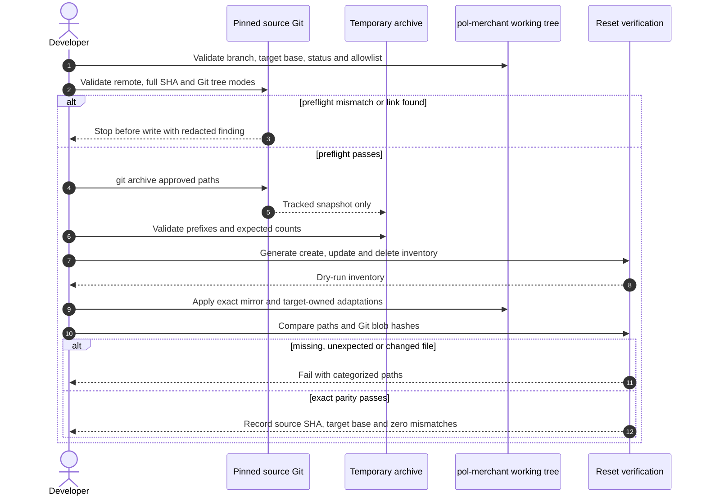
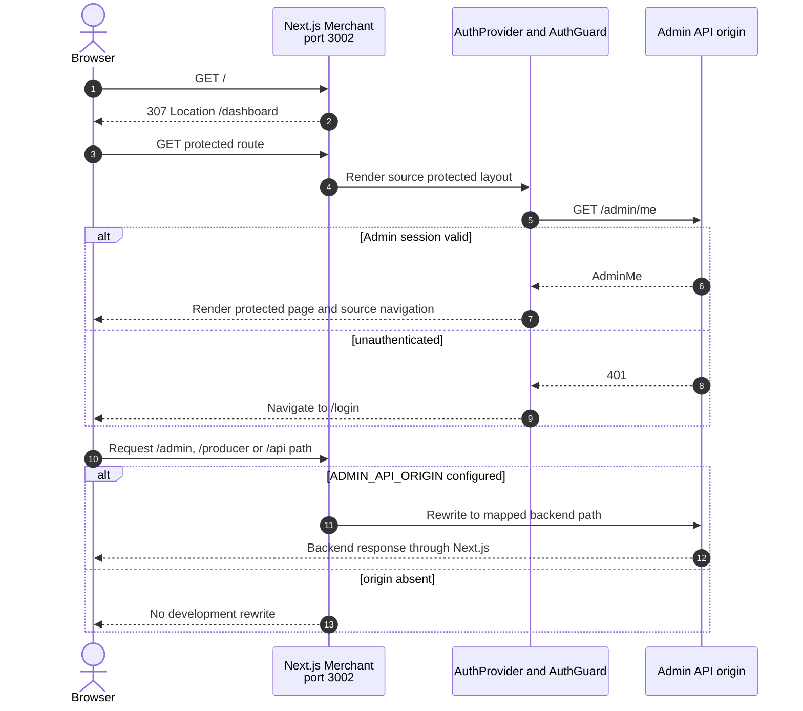
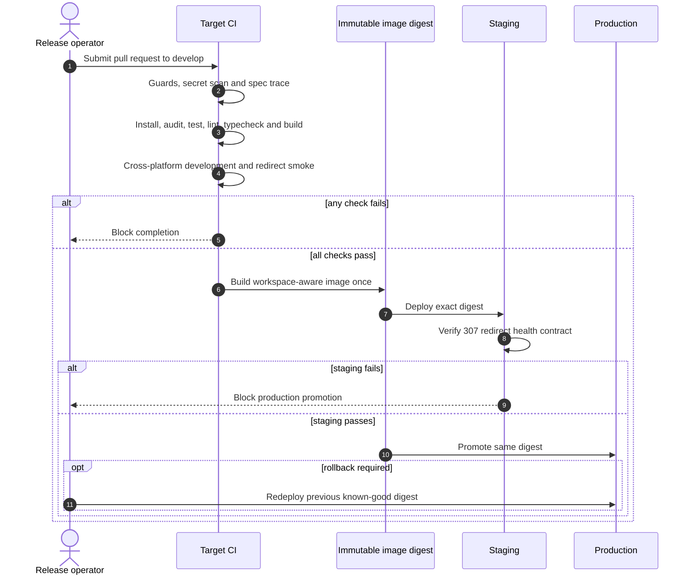

# Design: Merchant Workspace Reset

> Status: approved 2026-08-17

ออกแบบการแทน application layer ของ `pol-merchant` ด้วย Merchant snapshot ที่ pinned โดยคง
Git history, operating layer, CI policy และ deployment ownership ของ target repository

## Architecture Overview

### Target state

Repository หลัง reset แยกเป็นห้าชั้นที่มี ownership ชัดเจน

| ชั้น | Component | หน้าที่ |
|---|---|---|
| Provenance | `pol-admin` commit `79644df1bfa4b9ad9149fdeecedc63cbafda76d6` | เป็น immutable source ของ application และ local packages |
| Root orchestration | `package.json`, `package-lock.json`, `tsconfig.base.json`, `eslint.config.mjs` | ประกาศ explicit workspaces และ root commands สำหรับ Merchant-only graph |
| Application | `apps/merchant` | exact Git-tracked mirror จำนวน 749 files และเป็น Next.js runtime เดียว |
| Shared packages | `packages/ui`, `packages/shared` | exact mirrors จำนวน 6 files ต่อ package และห้าม import app workspace |
| Target ownership | operating layer, CI, container, docs และ release policy | คง governance ของ `pol-merchant` แล้วปรับเฉพาะ current-state contract |

หลัง reset ผ่าน acceptance แล้ว `pol-merchant` เป็น canonical source สำหรับ Merchant app
การแก้ครั้งถัดไปใช้ spec ใหม่ใน repository นี้ ไม่ synchronize กลับจาก `pol-admin`

### Filesystem boundary

| Action | Paths | Policy |
|---|---|---|
| Preserve | `.git/**` และ remote `origin` | ไม่ copy, replace หรือ rewrite Git metadata |
| Preserve | `.agents/**`, `.claude/**`, `.codex/**`, `.opencode/**` | คง adapters, skills, historical specs และ active spec |
| Preserve | `.ai/bin/**`, `.githooks/**`, guard tests และ spec scripts | ห้ามลดหรือ bypass enforcement |
| Exact mirror | `apps/merchant/**`, `packages/ui/**`, `packages/shared/**` | content และ intended tracked path set ตรง pinned source |
| Adapt | root manifests/config, `.github/workflows/ci.yml`, container files | เปลี่ยน topology, commands และ port โดยคง target policy |
| Adapt | `README.md`, `docs/dev-setup.md`, project context, architecture, Next.js profile | เปลี่ยนเฉพาะ current-state documentation |
| Remove tracked | `src/**`, `public/**` และ root app-only config | ทิ้ง lab application เดิมตาม approved reset scope |
| Preserve ignored | ignored dotenv files เช่น `.env.local`, `.DS_Store`, `.playwright-mcp/**` | อยู่นอก parity และไม่อ่าน content; tracked `.env.example` จัดการแยก |

Root app-only config ที่ลบคือ `.env.example`, `components.json`, `next.config.ts`,
`postcss.config.mjs`, `tsconfig.json` และ `scripts/clean-development.mjs` ส่วน
`vitest.config.ts` คงไว้สำหรับ target audit-policy tests และลด include เหลือ `scripts/**/*.test.mjs`

Generated cleanup จำกัดที่ root `.next/**`, `next-env.d.ts` และ `tsconfig.tsbuildinfo`
หลังตรวจ resolved path และ file type แล้วเท่านั้น ส่วน `node_modules` ให้ `npm ci` reconcile

### Controlled migration pipeline

Migration เป็น one-time operation ใช้ Git, tar และ Node/npm ที่มีอยู่แล้ว ไม่เพิ่ม framework
หรือ committed source-sync tool

1. ยืนยัน current branch, target base, source remote และ full source commit โดยไม่แสดง credential
2. ตรวจ `git status` ให้มี change ได้เฉพาะ active spec และตรวจ source/target allowlist ว่าไม่มี symlink หรือ reparse point
3. สร้าง temporary directory แล้วใช้ `git archive` export เฉพาะ approved source paths จาก pinned commit
4. ตรวจ archive member prefixes, source file counts และสร้าง dry-run inventory แยก create, update, delete และ excluded counts
5. หลัง inventory ผ่าน จึง copy สาม mirrored trees, ลบ tracked legacy paths และแก้ root operating files ตาม allowlist
6. Regenerate root lockfile ด้วย npm `11.12.1`, รัน `npm ci` แล้วตรวจ workspace graph และ application gates
7. เทียบ path/blob parity และ route manifests เก็บ Evidence จากนั้นล้างเฉพาะ temporary directory ที่สร้างในรอบนี้

Archive สำหรับ copy มีเพียง `apps/merchant`, `packages/ui` และ `packages/shared`
archive สำหรับ source reference build เพิ่มเฉพาะ root manifests/config และ
`apps/admin/package.json` ที่ npm ต้องใช้ resolve pinned workspace graph ไม่มี `.git`, ignored
dotenv files, certificate, generated output หรือ untracked file และมีเฉพาะ tracked `.env.example`

### Mutation allowlist

| กลุ่ม | Authorized targets |
|---|---|
| Mirrored writes | `apps/merchant/**`, `packages/ui/**`, `packages/shared/**` |
| Legacy tracked deletes | `src/**`, `public/**`, root app-only config ตาม Filesystem boundary |
| Root workspace | `package.json`, `package-lock.json`, `tsconfig.base.json`, `eslint.config.mjs`, `vitest.config.ts`, `.gitignore` |
| Verification policy | `.github/workflows/ci.yml`, `.dockerignore`, `Dockerfile`, `docker-compose.yml` |
| Current-state docs | `README.md`, `docs/dev-setup.md`, `.ai/shared/PROJECT_CONTEXT.md`, `.ai/shared/ARCHITECTURE.md`, `.ai/shared/stack/nextjs.md` |
| Generated cleanup | root `.next/**`, `next-env.d.ts`, `tsconfig.tsbuildinfo` |

ทุก resolved write/delete path ต้องอยู่ใต้ target repository และตรง allowlist แบบ exact path
หรือ descendant boundary การพบ link, path escape หรือ path เพิ่มนอก inventory ทำให้หยุดก่อน mutation

### Workspace and dependency direction

```text
root orchestration
  -> apps/merchant
       -> packages/ui
       -> packages/shared

packages/ui       -X-> apps/merchant
packages/shared   -X-> apps/merchant
apps/merchant     -X-> apps/admin
```

Root manifest ใช้ explicit workspace paths ไม่ใช้ `apps/*` เพื่อไม่รับ `@pol/admin` โดยบังเอิญ
ไม่มี dependency ใหม่ นอก pinned source และ target audit tooling ที่มีอยู่แล้ว

### Runtime and route architecture

| Surface | Implementation | Result |
|---|---|---|
| `/` | source `apps/merchant/src/app/page.tsx` | exact `307` redirect ไป `/dashboard` |
| `/register` | source App Router page | public Merchant registration route |
| Protected routes | source `MinimalsLayout`, `AuthProvider`, `AuthGuard` | ใช้ `AdminMe`, `getMe` และ Admin session contract |
| Admin operations | source `src/lib/api/admin/**` | ใช้ Admin API adapters เดิมแบบ byte-identical |
| Navigation | source `src/components/layout/nav-config.ts` | route/navigation set เดียวกับ pinned source |
| `/admin/*`, `/producer/*`, `/api/*` | source `apps/merchant/next.config.ts` | rewrite เฉพาะเมื่อ `ADMIN_API_ORIGIN` มีค่า |
| `/invite`, `/pay/[token]`, `/api/health` | ไม่มี page/route ใน source mirror | Next.js native not-found |

Application files ไม่รับ overlay หลัง copy เพราะเป้าหมายคือ source behavior เดิมทั้งหมด
root orchestration, CI, container และ docs เป็น target-owned adaptation layer เท่านั้น

### Verification and deployment architecture

| Layer | Design |
|---|---|
| One-time parity | build pinned source reference และ target locally แล้ว compare normalized app-path manifests |
| Permanent CI floor | คง PR base guard, guard regression, secret scan และ spec trace |
| Application matrix | `macos-latest`, `windows-latest`, `ubuntu-24.04` ใช้ Node.js `22.19.0` และ npm `11.12.1` |
| Linux full gate | production audit, test, lint, typecheck, build และ HTTP redirect smoke |
| macOS/Windows smoke | clean install และ HTTPS development smoke ที่ port `3002` |
| Container | npm workspaces multi-stage build, non-root runner, port `3002`, strict root-redirect healthcheck |
| Release | build image ครั้งเดียว, staging verify digest เดิม, production promote digest เดิม, rollback digest ก่อนหน้า |

CI หลัง reset ไม่ checkout หรืออ้าง `pol-admin` route parity เป็น historical Evidence ของ reset
ไม่ใช่ permanent repository coupling

## Sequence Diagrams

### 1. Controlled reset และ exact parity

อ้างอิง: REQ-1, REQ-3, REQ-5



### 2. Runtime auth และ API routing

อ้างอิง: REQ-4



### 3. CI, container และ release gate

อ้างอิง: REQ-6, REQ-7



## Data Models & Interfaces

### Pinned reset contract

| Field | Value | Verification |
|---|---|---|
| `sourceRepository` | `https://github.com/metrodiesign/pol-admin.git` | compare normalized host/path without emitting credentials |
| `sourceCommit` | `79644df1bfa4b9ad9149fdeecedc63cbafda76d6` | `git cat-file` และ full SHA equality |
| `targetBase` | `ae550fa602593b75c77cbc817cb456c86f44311c` | branch ancestry และ recorded base equality |
| `mirrorRoots` | three approved workspace paths | archive prefix validation |
| `sourceCounts` | `749`, `6`, `6` | Git tree count ก่อน extract |
| `recoveryReference` | target base commit | report only ไม่มี automatic destructive rollback |

Dry-run inventory มีสี่ sorted path sets: `create`, `update`, `delete` และ `excludedIgnored`
พร้อม count ต่อ set ไม่มี file content หรือ environment value

### Workspace manifest contract

| Package | Path | Direct internal dependencies | Required scripts |
|---|---|---|---|
| `pol-merchant` | root orchestrator | none | root command surface และ audit policy |
| `@pol/merchant` | `apps/merchant` | `@pol/ui`, `@pol/shared` | `dev`, `dev:clean`, `build`, `start`, `test`, `lint`, `typecheck` |
| `@pol/ui` | `packages/ui` | none | `lint`, `typecheck` |
| `@pol/shared` | `packages/shared` | none | `test`, `lint`, `typecheck` |

Root `workspaces` array ระบุสาม paths แบบ explicit และ `packageManager` เป็น
`npm@11.12.1` lockfile regenerate จาก manifests ชุดนี้ ไม่ reuse Admin workspace graph

### Root command contract

| Command | Delegation | Observable result |
|---|---|---|
| `npm run dev` | `@pol/merchant` `dev` | HTTPS development server ที่ `3002` |
| `npm run dev:clean` | `@pol/merchant` `dev:clean` | ล้าง app-local generated output แล้วเปิด HTTPS ที่ `3002` |
| `npm run build` | `@pol/merchant` `build` | standalone output ใต้ `apps/merchant/.next` |
| `npm start` | `@pol/merchant` `start` | HTTP production server ที่ `3002` |
| `npm test` | target audit-policy test แล้ว workspace tests | รัน Merchant และ shared tests รวม target policy test |
| `npm run lint` | all workspaces with script | ตรวจ Merchant, UI และ shared |
| `npm run typecheck` | all workspaces with script | ตรวจ Merchant, UI และ shared |
| `npm run audit:production` | existing target audit evaluator | บังคับ custom Critical/High policy |

### Application interfaces retained from source

| Interface | Source path | Contract |
|---|---|---|
| `AdminMe` | `apps/merchant/src/types/auth.ts` | identity type สำหรับ protected Admin-derived surface |
| `getMe` | `apps/merchant/src/lib/api/admin/auth.ts` | `/admin/me` คืน `AdminMe` หรือ `null` เมื่อ `401` |
| `AuthProvider` | `apps/merchant/src/components/auth/auth-provider.tsx` | โหลด identity และ expose auth state |
| `AuthGuard` | `apps/merchant/src/components/auth/auth-guard.tsx` | loading placeholder, authenticated render หรือ navigate `/login` |
| `navConfig` | `apps/merchant/src/components/layout/nav-config.ts` | navigation source เดียวของ cloned routes |

Interfaces เหล่านี้ไม่ถูกแก้หรือ wrap ระหว่าง reset การทดสอบใช้ source tests ที่ถูก mirror มาด้วย

### Environment and rewrite contract

| Variable | Location | Behavior |
|---|---|---|
| `ADMIN_API_ORIGIN` | `apps/merchant/.env.local` สำหรับ development | เปิด source rewrites สำหรับ `/admin/*`, `/producer/*`, `/api/*` |
| `NEXT_PUBLIC_API_ORIGIN` | app-local example ตาม source | public non-secret origin ที่ source clients ใช้ |
| `NODE_ENV` | Next.js และ container | production runtime ไม่กำหนด backend origin |
| `PORT` | container | `3002` |
| `HOSTNAME` | container | `0.0.0.0` |

Developer สร้าง `apps/merchant/.env.local` เองจาก `apps/merchant/.env.example`
ไฟล์ local environment ถูก ignore, ไม่ถูก migration tooling อ่าน และไม่เข้า Git

### Route manifest contract

Source และ target build สร้าง
`apps/merchant/.next/server/app-paths-manifest.json` แล้ว normalize แบบเดียวกัน

| Step | Transformation |
|---:|---|
| 1 | รับเฉพาะ JSON object keys ที่ลงท้าย `/page` |
| 2 | map `/page` เป็น `/` และตัด suffix `/page` จาก key อื่น |
| 3 | ตัด route ที่ขึ้นต้น `/_` |
| 4 | deduplicate และ sort แบบ deterministic |
| 5 | compare exact equality แล้วรายงาน `missing` และ `extra` แยกกัน |

Parity check รันครั้งเดียวใน reset acceptance หลังทั้งสอง builds สำเร็จ
target CI ปกติใช้ target build เท่านั้น

### Container and release contract

| Field | Value |
|---|---|
| Base image | `node:22.19.0-alpine3.22` |
| npm | exact `11.12.1` ก่อน `npm ci` |
| Build input | root manifest/lock และสาม workspace manifests |
| Build command | root `npm run build` |
| Standalone entry | `node apps/merchant/server.js` |
| Runtime user | `nextjs` UID `1001`, non-root |
| Bind | `0.0.0.0:3002` |
| Health | HTTP `GET /`, exact `307`, exact `Location: /dashboard` |
| Compose | host `3002` ไป container `3002`, image จาก `POL_MERCHANT_IMAGE` |
| Promotion | staging และ production ใช้ immutable digest เดียว |
| Rollback | previous known-good digest |

Docker runner copy workspace standalone root, app-local `public` และ app-local `.next/static`
ตาม monorepo output layout ไม่ copy root legacy `public`

## Technology Decisions

| Decision | Choice | Rationale |
|---|---|---|
| Source acquisition | `git archive` จาก full SHA และ explicit paths | tracked-only, reproducible, ไม่แตะ source working tree |
| Migration implementation | one-time standard-tool procedure | ไม่มีเหตุผลเก็บ migration framework หรือ source-sync code หลัง acceptance |
| Application strategy | exact mirror ไม่มี overlay | ผู้ใช้เลือกทิ้ง lab behavior และลด divergence risk |
| Workspace manager | native npm workspaces | npm ติดตั้งอยู่แล้ว ไม่เพิ่ม Turborepo หรือ orchestration dependency |
| Workspace declaration | explicit three paths | ป้องกัน `@pol/admin` เข้ามาจาก wildcard ในอนาคต |
| Root lockfile | regenerate ด้วย npm `11.12.1` | source lock มี Admin graph จึงใช้ตรง ๆ ไม่ได้ |
| Root tests | คง target audit test แล้ว delegate workspace tests | รักษา policy test โดยไม่สร้าง test framework เพิ่ม |
| Route parity | compare built app-path manifests one-time | พิสูจน์ observable route set โดยไม่ผูก CI กับ source repository |
| CI policy | adapt target 3-OS matrix | รักษา governance และเปลี่ยนเฉพาะ workspace paths, HTTPS และ port |
| Production audit | reuse existing evaluator และ ledger | policy มี tests อยู่แล้วและครอบ prod dependency surface |
| Container | adapt source monorepo standalone pattern | output layout ถูกกับ `outputFileTracingRoot` และใช้ non-root runner |
| Healthcheck | native Node HTTP probe ที่ `/` | source ไม่มี `/api/health`; exact redirect เป็น runtime contract ที่มีอยู่ |
| Documentation | patch current-state docs only | historical specs และ framework docs ยังเป็นหลักฐานเดิม |

ไม่มี dependency ใหม่ ไม่มี API schema ใหม่ ไม่มี database migration และไม่แก้ core domain logic
จึงไม่สร้าง abstraction, ADR หรือ fresh-context CORE logic critique เพิ่ม

## Error Handling Strategy

| Error case | Detection | Response |
|---|---|---|
| Source commit หรือ target base ไม่ตรง | Git preflight | หยุดก่อน application mutation และรายงาน expected identifier |
| Source/target remote ไม่ตรง | normalized remote comparison | หยุดโดยไม่พิมพ์ embedded credential |
| Dirty target นอก active spec | porcelain status classification | หยุดพร้อม path list แต่ไม่อ่าน content |
| Symlink, reparse point หรือ path escape | Git mode, filesystem metadata และ boundary check | หยุดก่อน copy/delete พร้อม offending path |
| Archive member อยู่นอก mirror roots | archive inventory validation | ปฏิเสธ archive และไม่ extract เข้า target |
| Source counts ไม่ใช่ `749`, `6`, `6` | Git tree count | หยุดเพราะ pinned input ไม่ตรง expectation |
| Dry-run path อยู่นอก mutation allowlist | exact path/descendant check | หยุดก่อน write หรือ delete |
| Mirror path/blob mismatch | staged snapshot เทียบ target candidate tracked set | non-zero พร้อม `missing`, `unexpected`, `changed` แยกกัน |
| Ignored target file พบใน mirror roots | `git check-ignore` classification | exclude จาก parity และ deletion โดยไม่อ่าน content |
| Lockfile หรือ workspace resolve ไม่ได้ | `npm ci` และ workspace query | fail reset acceptance |
| `ADMIN_API_ORIGIN` ไม่มีค่า | source `rewrites()` | คืน empty rewrite list โดยไม่ fallback ไป origin อื่น |
| Unknown หรือ target-only route ถูกเรียก | built route tree | Next.js native not-found |
| Source/target route manifests ต่าง | normalized set comparison | block acceptance และบันทึก missing/extra Evidence |
| Audit, test, lint, typecheck, build หรือ secret scan fail | command exit status | CI และ completion ถูก block |
| Port `3002` ถูกใช้ | Next.js bind failure หรือ smoke preflight | command/smoke fail โดยไม่ฆ่า process เจ้าของ port |
| Container redirect ไม่ใช่ exact contract | health probe status/header check | mark container unhealthy |
| Staging verification fail | release gate | ห้าม production promotion |
| Reset ต้อง recover | handoff source SHA และ target base | หยุด mutation ไม่มี automatic reset; recover จาก target base หลัง human review |

## Testing Strategy

### Reset acceptance checks

| Check | Method | Requirement coverage |
|---|---|---|
| Provenance and preservation | verify source SHA, target base, branch, remotes, operating-layer diff scope | REQ-1.1-REQ-1.12 |
| Workspace topology | inspect explicit root workspaces, run `npm ci`, query workspace names และ dependency direction | REQ-2.1-REQ-2.11 |
| Exact mirror | compare source archive path set และ Git blob hashes กับ target candidate tracked set | REQ-3.1-REQ-3.12 |
| Canonical transition | record one-time parity result และ no-sync policy ใน docs/handoff | REQ-3.13-REQ-3.14 |
| Runtime commands | smoke HTTPS development และ HTTP production ที่ port `3002` | REQ-4.1-REQ-4.3 |
| Route and source contracts | source/target manifest equality, source auth/API/navigation tests, forbidden-route smoke | REQ-4.4-REQ-4.16 |
| Migration safety | dry-run inventory, link/path guards, ignored-file exclusion, secret scan และ recovery anchor | REQ-5.1-REQ-5.17 |
| Quality gates | custom audit, root tests, lint, typecheck, build, focused-test scan | REQ-6.1-REQ-6.11 |
| CI/runtime pinning | inspect 3-OS matrix, Node/npm pins, route-normalizer fixture และ no-source-CI rule | REQ-6.12-REQ-6.17 |
| Container | build image, inspect non-root user/port, run exact redirect health probe | REQ-7.1-REQ-7.5 |
| Release procedure | verify immutable staging/production digest fields และ rollback reference | REQ-7.6-REQ-7.8 |
| Documentation | execute documented clean install, verification และ run commands; scan stale topology/ports | REQ-8.1-REQ-8.15 |

### Application and CI commands

| Runner | Required checks |
|---|---|
| Local reset acceptance | source build, target build, file/blob parity, route parity และ full-tree secret scan |
| `ubuntu-24.04` | `npm ci`, audit, test, lint, typecheck, build, HTTP production redirect smoke |
| `macos-latest` | `npm ci`, app-local clean command และ HTTPS development smoke ที่ `3002` |
| `windows-latest` | `npm ci`, app-local clean command และ HTTPS development smoke ที่ `3002` |
| Docker | image build, non-root inspection, port mapping และ repeated health status/header probe |

UI ไม่มี design change แต่ application tree ถูกย้ายทั้งก้อน browser verification จึงตรวจ `/register`
และ protected auth transition ที่ viewport `375`, `768`, `1440` พร้อม hydration/console errors
ผล visual ต้องตรง source snapshot ไม่สร้าง target-only behavior

### Route parity fixture

Normalizer test ใช้ manifest fixture ที่มี root page, normal page, internal `/_` page,
dynamic segment และ duplicate result แล้ว assert sorted unique routes รวมทั้ง invalid JSON-object input
comparison test ต้องแสดง missing/extra แยกและคืน non-zero เมื่อ set ต่าง

### Evidence requirements

- บันทึก source SHA, target base และ dry-run path counts
- บันทึก missing, unexpected และ changed mirror paths แม้ทุกกลุ่มเป็นศูนย์
- บันทึก source/target normalized route counts พร้อม missing/extra แยก
- บันทึก exact commands และ observed exit/results ใน task Evidence
- ไม่เก็บ temporary source checkout, source archive หรือ environment content ใน repository

## Requirement Traceability

| Design element | Requirements satisfied |
|---|---|
| Pinned reset contract และ provenance preflight | REQ-1.1-REQ-1.4, REQ-1.7-REQ-1.9 |
| Filesystem preservation และ target-owned adaptation boundary | REQ-1.5-REQ-1.6, REQ-1.10-REQ-1.12 |
| Explicit Merchant-only workspace manifest และ root commands | REQ-2.1-REQ-2.11 |
| Staged archive, exact mirror และ path/blob parity | REQ-3.1-REQ-3.12 |
| Canonical transition และ one-time parity policy | REQ-3.13-REQ-3.14 |
| Source runtime, routes, auth, API adapters, navigation และ rewrites | REQ-4.1-REQ-4.16 |
| Mutation allowlist, ignored-file handling, secret safety และ recovery | REQ-5.1-REQ-5.17 |
| Quality gates, target CI matrix, route normalization และ no-sync CI | REQ-6.1-REQ-6.17 |
| Workspace-aware container, redirect health, promotion และ rollback | REQ-7.1-REQ-7.8 |
| Current-state documentation และ executable setup/run contract | REQ-8.1-REQ-8.15 |
