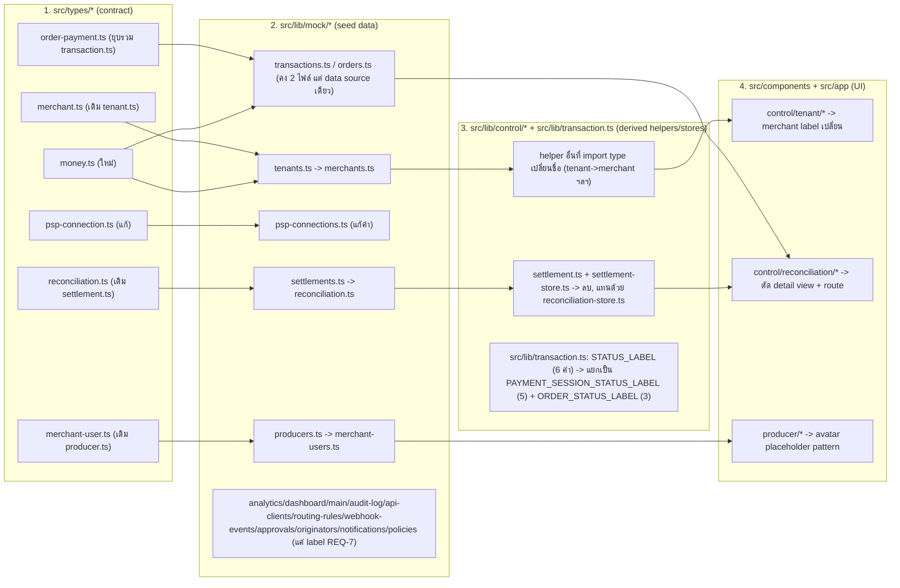
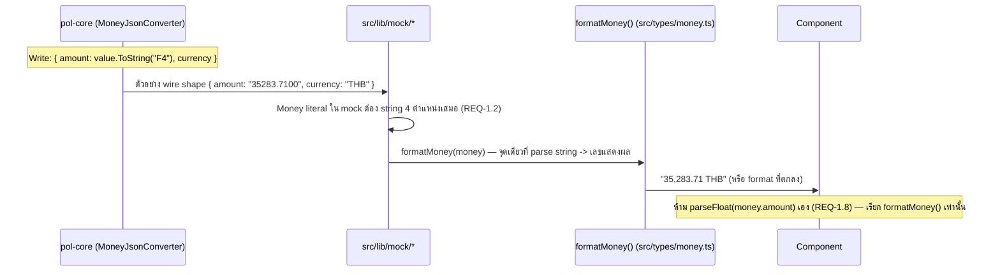
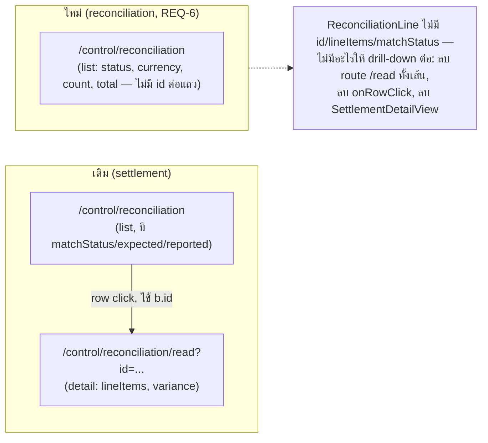

# Design: Mock Truth Pass (Mock Canonical Alignment)

> Status: approved 2026-07-20

## Architecture Overview

Truth Pass เป็น **data + type rewrite ล้วน** — ไม่มี component ใหม่, ไม่มี state management ใหม่,
ไม่มี route ใหม่ (ยกเว้นการ "ลบ" 1 route ที่ไม่มีข้อมูลรองรับแล้ว, ดู REQ-6.7). ขอบเขตงานแบ่งเป็น 4 ชั้น
ตาม data flow ที่มีอยู่แล้วของโปรเจกต์ (`ARCHITECTURE.md`: `lib/mock/* -> hook/store -> page container ->
child render`):



**ทำไม 2 ไฟล์ mock (`transactions.ts`/`orders.ts`) ยังคงอยู่แยกกัน (ปิด OQ-D) — แก้หลัง spec-architect
critique (P1-2):** ดราฟต์แรกเข้าใจผิดว่าทั้งคู่เป็น data ซ้ำ byte-for-byte ที่ควรยุบเป็น type เดียว —
ตรวจ field จริงแล้ว **ไม่ใช่**: `transactions.ts` มีรูปร่างของ `PaymentSession` (psp/channel/items ต่อ
การชำระ), `orders.ts` มีรูปร่างของ `Order` (แค่ id/amount/status/link กลับไป session) — คนละ entity
คนละ enum จริงตาม pol-core (REQ-2.3, REQ-8.2). `orders.ts` **derive** จาก `transactions.ts` ด้วย `.map()`
(ไม่ maintain literal array คู่ขนาน, Anti-Pattern) แต่ผลลัพธ์เป็น type `Order[]` คนละ shape จาก
`PaymentSession[]` จริง ไม่ใช่ re-export ตรง ๆ — รายละเอียดเต็มอยู่ใน REQ-8 ด้านล่าง

## Sequence Diagrams

### Money wire round-trip (REQ-1)



### Contract test scan scope (REQ-9.6/9.6a) — แก้จาก Codex finding P1

```mermaid
flowchart TD
    Start["npm test (vitest run)"] --> Scan["mock-contract.test.ts"]
    Scan --> Allow{"ไฟล์อยู่ใน POL-scope allowlist?\n(REQ-9.6 รายชื่อ 17 mock file + 6 type file)"}
    Allow -->|ใช่| Check["scan หาคำต้องห้าม:\ncompleted/refunded/banned/disabled/vcentral/tenant/minorUnits"]
    Allow -->|ไม่ใช่ (Minimals demo)| Skip["ข้าม — banking.ts/course.ts/ecommerce.ts/ฯลฯ\nไม่ผ่าน scan (REQ-9.6a)"]
    Check --> Fail{"เจอคำต้องห้าม?"}
    Fail -->|เจอ| Red["test fail — บอกไฟล์:บรรทัด"]
    Fail -->|ไม่เจอ| Green["test ผ่าน"]
```

### Reconciliation page — จาก drill-down เป็น flat summary (REQ-6.7)



## Data Models & Interfaces

### REQ-1: `src/types/money.ts` (ใหม่)

```ts
export interface Money {
  amount: string; // ทศนิยม 4 ตำแหน่งตายตัวเสมอ ("35283.7100"), ห้ามติดลบ
  currency: string; // ISO 4217 ตัวพิมพ์ใหญ่ 3 ตัว ("THB")
}

/** จุดเดียวที่ parse Money.amount -> string แสดงผล — component ห้าม parseFloat/Number() เอง (REQ-1.8) */
export function formatMoney(money: Money): string;
```

ยึดจาก `pol-core/src/SharedKernel/Money.cs` (`Of()` throw บนค่าติดลบ/scale เกิน 4 ตำแหน่ง/currency ไม่รองรับ)
+ `MoneyJsonConverter.Write` (wire = `{ "amount": "1500.0000", "currency": "THB" }`, amount เป็น
JSON **string** เสมอ — ส่ง JSON number กลับไปจะได้ 400).

**ที่ใช้จริงในสโคปนี้:** `Order.amount`/`PaymentSession.amount` ผ่าน `src/types/order-payment.ts`
(REQ-1.6 + REQ-8) และ item-level `OrderItem.amount`. **`Product.price` ไม่มี mock file ที่ map ตรง
ใน pol-admin ตอนนี้** (pol-admin มี `Policy`/`policies.ts` ซึ่ง REQ-7.2/Overview ยืนยันแล้วว่า **ไม่ใช่**
`Product` — "Product ไม่มีฟิลด์ประกันสักตัว" — และ REQ-7.4 ห้ามรื้อ `policies.ts` เกิน REQ-2/3/5/6 บังคับ)
ดังนั้น `Money` type ถูกนิยามไว้ใช้ได้ (REQ-1.1) แต่ **ไม่ apply กับ `policies.ts`** ในรอบนี้ — บันทึกเป็น
Edge Case ใหม่ด้านล่าง (ไม่ใช่ REQ-1.6 ที่ทำไม่ครบ, เป็นเพราะไม่มีไฟล์เป้าหมายให้ apply).

`ReconciliationLine.total` **ไม่ใช้** `Money` (REQ-1.7) — คง `number` + `currency` แยก field ตรง
`ReconciliationLine(string Status, string Currency, int Count, decimal Total)` ของ pol-core เป๊ะ.

### REQ-2: Status enum — รวมที่เดียวใน `order-payment.ts` + `merchant-user.ts` + `psp-connection.ts`

| Type | ค่า (PascalCase ตรง enum C#) | ไฟล์ปลายทาง |
|---|---|---|
| `OrderStatus` | `"AwaitingPayment" \| "Paid" \| "Cancelled"` | `src/types/order-payment.ts` |
| `PaymentSessionStatus` | `"Created" \| "Redirected" \| "Paid" \| "Failed" \| "Expired"` | `src/types/order-payment.ts` (type ใหม่ — เดิมไม่มี เพราะ mock เก่าไม่แยก Order/Session) |
| `MerchantUserStatus` | `"PendingApproval" \| "Active" \| "Rejected" \| "Suspended"` | `src/types/merchant-user.ts` |
| `MerchantStatus` | `"Active"` (ค่าเดียว) | `src/types/merchant.ts` |
| PSP code | `"omise" \| "2c2p"` (lowercase, ตรง `Codes.ToCode()` ของ pol-core — ไม่มี dedicated JSON converter class แยก แต่ wire string เดียวกัน) | `src/types/psp-connection.ts` |
| Payment method | `"card" \| "promptpay" \| "installment"` | `src/types/order-payment.ts` |

**REQ-2.9 (exhaustive switch แทน fallback เงียบ):** ทุกจุด map status -> label/สี ใช้ pattern
`switch` ที่ TypeScript บังคับ exhaustive (`never` ใน `default`) แทน `Record<Status, X>` แบบ partial —
ตรวจตอน implement ว่า status label map เดิม (เช่น `PSP_LABEL`, ตัวใหม่สำหรับ order status) ใช้ signature
ที่ compile fail เมื่อ union ขยาย.

### REQ-3: `src/types/merchant.ts` (เดิม `tenant.ts`) + `src/lib/mock/merchants.ts` (เดิม `tenants.ts`)

```ts
export type MerchantCode = "vprivilege" | "vcommerce" | "vsouvenir"; // ตรง MerchantCode.Allowed
export type MerchantStatus = "Active";

export interface Merchant {
  id: string; // Guid จาก MerchantView.Id — ไม่ผูก allowlist (REQ-9.4a)
  code: MerchantCode;
  displayName: string;
  legalEntityId: string;
  status: MerchantStatus;
  country: string;
  currency: string;
  enabledChannels: string; // string CSV ตาม MerchantView.EnabledChannels — ห้ามเปลี่ยนเป็น array
  createdAt: string; // ISO
  // UI-only, ไม่มีใน MerchantView (REQ-3.7, ต้องมีคอมเมนต์กำกับต่อ field):
  saqScope: string;
  adminCount: number;
  enabledPsps: string[];
}
```

field ที่หายไปจาก `Tenant` เดิม: `name` (ซ้ำความหมายกับ `displayName` ที่มีคู่จริงใน `MerchantView` —
ตัดสินใจ **คง `name` ไว้เป็น UI-only ต่อ REQ-3.7 ได้ ถ้า component ใช้จริง**, ตรวจตอน implement ว่ามี
consumer อ่าน `name` แยกจาก `displayName` หรือไม่; ถ้าไม่มีใคร import ให้ตัดทิ้งตาม REQ-8.4-style
"ไม่ทิ้ง type ที่ไม่มีใคร import" — กลับกันคือไม่เพิ่ม field ที่ไม่มีใครใช้).

**แก้จากดราฟต์แรก (P1-3 จาก critique — "3 seed record คงเดิม" ผิด):** `tenants.ts` ปัจจุบันมีแค่
`vcentral`/`vcommerce`/`vsouvenir` — **ไม่มี `vprivilege` เลย**. REQ-3.1 ต้องการ `vprivilege` เป็นหนึ่งใน
3 ราย ดังนั้นนี่คือการ **author record `vprivilege` ใหม่ทั้งอัน** (ไม่ใช่แก้ id ของ record เดิม) แล้วลบ
`vcentral` ทิ้ง (REQ-3.2) เหลือ `vcommerce`/`vsouvenir`/`vprivilege ใหม่` = 3 ราย. ทุก field ของ
`MerchantView` ที่ `Tenant` เดิมไม่มี (`displayName`, `legalEntityId`, `country`, `currency`,
`enabledChannels`, `createdAt`) ต้อง **author ค่าใหม่ทั้ง 3 record** ไม่ใช่ map จาก field เดิม — `code`
เปลี่ยนความหมายจาก human label (`"VCTL"`) เป็น lowercase allowlist ตรง ๆ (`"vprivilege"`) ด้วย. รายการ
ค่าที่ต้อง author ต่อ record (implementation detail, ระบุ shape ไว้ให้ tasks.md): `displayName` (ชื่อ
บริษัทที่แสดงผล, ยังใช้ธีม vPrivilege/vCommerce/vSouvenir เดิมได้), `legalEntityId` (เลขนิติบุคคลปลอมที่
หน้าตาสมจริง), `country: "TH"`, `currency: "THB"`, `enabledChannels` เป็น **string CSV** ปลอมที่หน้าตา
สมจริง (เช่น `"card,promptpay"` ไม่ใช่ array), `createdAt` เป็น ISO date ปลอม.

status `"Active"` ทั้งหมด (REQ-3.3 — ปิด OQ-B: **ลบ status column/filter/badge บนหน้า merchant list
ทิ้ง** เพราะมีค่าเดียวเสมอ ไม่ใช่ข้อมูลที่ user กรองได้จริง ไม่ใช่ cosmetic ที่ต้องคงไว้).

**Merchant `id` (GUID) vs `code` (FK ข้ามไฟล์) — แก้ P1-4 จาก critique:** `id` (GUID) ใช้**เฉพาะ**บน
record ของ `Merchant` เอง (ตรง `MerchantView.Id`) — **ไม่ใช่**ค่าที่ mock ไฟล์อื่นอ้างถึงเป็น FK. grep
ยืนยันแล้วว่า `tenantId`/`TENANT_LABEL`/`tenantById` ถูกใช้ 189 จุดใน 51 ไฟล์ (`webhook-events.ts`,
`audit-log.ts`, `originators.ts`, `api-clients.ts`, `approvals.ts`, `routing-rules.ts`,
`psp-connections.ts`, `notifications.ts` ฯลฯ) เก็บ FK เป็น **code string** (`"vcentral"` เป็นต้น) — ไม่มี
REQ ไหนบังคับให้ค่า FK เหล่านี้ต้องเป็น GUID, REQ-3.4 สั่งแค่ **rename field name** (`tenantId` ->
`merchantId`) ไม่ใช่เปลี่ยนชนิดค่า. ดังนั้น:

- `Merchant.id` (บน record ของตัวเอง) = GUID จริง (REQ-9.4a)
- `merchantId` field ที่ไฟล์ **อื่น** ทั้ง 51 ไฟล์ถืออยู่ = **ยังคงเป็น code string** (`"vprivilege"` เป็น
  ค่าใหม่แทน `"vcentral"` เดิม) — แค่ rename **key** จาก `tenantId` -> `merchantId`, ค่าไม่เปลี่ยนชนิด
- `MERCHANT_LABEL` (เดิม `TENANT_LABEL`) ยัง **key ด้วย `code`** เหมือนเดิม (`Record<MerchantCode,
  string>`) ไม่ใช่ key ด้วย GUID — เพราะ 51 ไฟล์เรียกมันด้วยค่า code ที่มีอยู่แล้ว, เปลี่ยนไป key ด้วย
  GUID จะพังทุกจุดเรียกจริง
- **orphan records ของ `vcentral`** (PSP connection `PSP-VCTL-*` 3 แถว ใน `psp-connections.ts:8,20,33`
  + record อื่นทุกไฟล์ที่ FK ไป `"vcentral"`) ต้อง **reassign ไป `"vprivilege"`** (merchant ใหม่ที่แทนที่)
  ไม่ใช่ลบทิ้งเฉย ๆ — มิฉะนั้น `vprivilege` จะไม่มี PSP connection ตัวอย่างเลยทั้งที่ merchant อื่นมี.
  ตรง REQ-3.2 เอง: "`PSP-VCTL-*`, `STL-VCTL-*` ต้องสร้างใหม่ ไม่ใช่ sed คำเดียว" — id ใหม่ของ 3 แถวนี้
  คือ `PSP-VPRV-OMISE-LIVE` เป็นต้น (สร้าง id ใหม่ตาม merchant code ใหม่ ไม่ใช่ sed `VCTL`->`VPRV`)

**Import fan-out:** `TENANT_LABEL`/`TenantId`/`tenantId` = 189 occurrence ใน 51 ไฟล์ (verify จริง, ไม่ใช่
27 ไฟล์อย่างที่ดราฟต์แรกนับผิด — ตัวเลข 27 คือเฉพาะไฟล์ `.tsx` ที่ import type/label, ไม่รวม mock data
ไฟล์อื่นที่เก็บ FK เป็น field ตรง ๆ). Rename `tenantId` -> `merchantId`, `TENANT_LABEL` ->
`MERCHANT_LABEL`, `tenantById` -> `merchantByCode` เป็น **find-and-replace ที่ปลอดภัย** เพราะค่า/ชนิดไม่
เปลี่ยน (ยกเว้นค่า `"vcentral"` ต้องเปลี่ยนเป็น `"vprivilege"` ทุกจุดที่ orphan ตามข้อด้านบน) — TypeScript
compiler จะ catch ทุกจุดที่ import ชื่อเก่าหลุดไป (REQ-9.8 gate).

### REQ-4: `src/types/merchant-user.ts` (เดิม `producer.ts`) + `src/lib/mock/merchant-users.ts` (เดิม `producers.ts`)

```ts
export type MerchantUserStatus = "PendingApproval" | "Active" | "Rejected" | "Suspended";
export type PersonType = "Individual" | "Juristic"; // verify แล้วตรง PersonType.cs:5-9 ของ pol-core เป๊ะ (Individual=0, Juristic=1) — ยกระดับจาก "เดา" เป็น "ยืนยันแล้ว" ตาม spec-architect critique

export interface MerchantUser {
  id: string;
  firstName: string;
  lastName: string;
  displayName: string; // server-computed "{firstName} {lastName}" (REQ-4.8) — ไม่ใช่ input
  personType: PersonType | null;
  idNumber: string | null;
  producerCode: string | null;
  licenseNumber: string | null;
  phone: string | null;
  photoObjectKey: string | null;
  photoContentType: string | null;
  email: string;
  status: MerchantUserStatus;
  merchantId: string | null; // NULL จนกว่า admin approve; PendingApproval ⇒ null เสมอ (REQ-4.6)
}
```

`PERSON_TYPE_LABEL` เดิม (`producer.ts:44-47`) key ด้วย lowercase (`individual`/`juristic`) — ต้องแก้
key ให้ตรง `PersonType` ใหม่ (PascalCase `Individual`/`Juristic`) พร้อมกับ rename type/mock ไม่ใช่ทิ้งไว้
เป็นจุดที่ compile ผ่านแต่ lookup พัง runtime (key ไม่ match).

`ProducerFormData`/`ProducerRegisterFormData` (ฟอร์มลงทะเบียน public `/register`) **แยกจาก
`MerchantUser` domain model โดยเจตนา** (REQ-4.1a) — ฟอร์มยัง require ทุก field ตามที่ UX ต้องการกรอก
(`firstName`/`lastName`/... เป็น `string` ไม่ใช่ `string | null` ในฟอร์ม) แม้ domain model ยอม null;
เปลี่ยนชื่อ type เหล่านี้ตาม MerchantUser (`MerchantUserFormData`, `MerchantUserRegisterFormData`)
แต่ **ไม่เปลี่ยน nullability ของฟอร์ม** — คนละสัญญากับ REQ-4.1a ที่พูดถึง domain/mock model เท่านั้น.

**Avatar (REQ-4.9, ปิด OQ-F):** ลบ `avatarUrl` ออกจากทั้ง type และ mock (10 seed record). Placeholder
avatar ใช้ pattern ที่มีอยู่แล้ว 2 จุด (ไม่สร้าง component ใหม่):
- `producer-table-columns.tsx` — `AvatarImage` ตัดทิ้ง เหลือแค่ `AvatarFallback` (initials) เสมอ เพราะ
  ไม่มี `src` ให้ resolve แล้ว
- `producer-edit-profile-card.tsx` (ผ่าน `AvatarUpload`) — ไม่มี `fallback`/initials prop วันนี้ (ตรวจจาก
  source แล้ว: `!imageSrc` branch แสดง "อัปโหลดรูป" camera placeholder อยู่แล้วเมื่อไม่มี `src`) —
  **ใช้ path เดิมนี้ตรงๆ**: ส่ง `src={undefined}` แทนการพยายามประกอบ URL จาก `photoObjectKey` เข้าไป
  จะ trigger camera-placeholder branch ที่มีอยู่แล้วโดยไม่ต้องแก้ `AvatarUpload` เลย
- `app/producer/edit/page.tsx` + `app/producer/read/page.tsx` — เอา hardcoded `avatarUrl={AVATAR}` ออก

### REQ-5: `src/types/psp-connection.ts` (แก้ในไฟล์เดิม, ไม่ rename ไฟล์)

```ts
export interface PspConnection {
  pspConnectionId: string;
  psp: "omise" | "2c2p";
  merchantId: string | null; // MerchantConnectionView.MerchantId เป็น string? (nullable)
  enabledMethods: string[]; // array — ตรง MerchantConnectionView.EnabledMethods (IReadOnlyList<string>)
  config: Record<string, unknown>; // JsonElement? — object ธรรมดา ห้าม typed field เจาะจง (ดู Edge Cases เดิม)
  maskedSecrets: Record<string, string>; // hint เท่านั้น ไม่ใช่ secret จริง
}
```

ลบ `id`/`tenantId`/`provider`/`environment`/`publicKey`/`secretKey`/`webhookSecret`/`redirectOnly`/
`health`/`lastWebhookAt`/`createdAt` ทั้งหมด — **ไม่มีคู่ใน `MerchantConnectionView` เลยสักตัว** ยกเว้น
`health`/`lastWebhookAt` ที่ REQ-5.4 อนุญาตให้คงเป็น UI-only ได้ (พร้อมคอมเมนต์กำกับ) ถ้า UI ยังต้องใช้
โชว์สถานะ connection — ตรวจตอน implement ว่า `psp-connections-view.tsx`/`psp-detail-view.tsx` ยังอ้าง
field เหล่านี้อยู่ไหม ถ้าอ้างอยู่คงไว้แบบ UI-only, ถ้าไม่มีใครอ่านให้ตัดทิ้งไปเลย (REQ-8.4-style).

`environment`/`redirectOnly` **ไม่มีคู่และไม่มีเหตุผลคงไว้** (REQ-5 ไม่ได้อนุญาต, pol-core connection ผูก
แค่ psp+merchant ไม่มี concept แยก environment ต่อ connection) — ตัดทิ้ง ไม่ใช่ UI-only.

**แก้ P2-5 จาก critique — `health: "disabled"` ชนกับ forbidden-word scan:** ถ้าคง `health`/
`lastWebhookAt` แบบ UI-only (REQ-5.4) ค่า `PspHealth` เดิม (`"healthy" | "degraded" | "error" |
"disabled"`) มีคำว่า `disabled` ซึ่งเป็นคำต้องห้ามตาม REQ-9.6/9.7 (แม้เป็น UI-only ก็ห้ามตาม REQ-7.5) —
เก็บ `health` ไว้ได้แต่ต้อง **rename ค่า `"disabled"` -> `"offline"`** (ความหมายเดิมคงอยู่ ไม่ชนคำต้องห้าม)
พร้อมแก้ `PspHealth` union และทุก mock record ที่ใช้ค่านี้ (`psp-connections.ts:80` ปัจจุบัน 1 แถว).

ProvisioningGuards.RejectSecretsInConfig ยืนยันตรง REQ-5.1: secret field name (`secretKey`/`publicKey`/
`webhookSecret`) ต้องไม่อยู่ใน `config` — mock ต้องไม่มี key พวกนี้ปนใน `config` object เด็ดขาด แม้เป็น
mock ก็ตาม (เพื่อไม่ให้ตัวอย่าง mock สอนผิด).

### REQ-6: `src/types/reconciliation.ts` (เดิม `settlement.ts`) + `src/lib/mock/reconciliation.ts` (เดิม `settlements.ts`)

```ts
export interface ReconciliationLine {
  status: string; // ค่าจาก OrderStatus (REQ-2.2) — PascalCase
  currency: string;
  count: number;
  total: number; // decimal ธรรมดา ไม่ใช่ Money (REQ-1.7)
}
```

ตรง `ReconciliationLine(string Status, string Currency, int Count, decimal Total)` /
`ReconciliationView { lines: ReconciliationLine[] }` เป๊ะ — **ไม่มี field อื่นเลย** (ไม่มี `id`,
`batchRef`, `psp`, `merchantId`/`tenantId` ต่อแถว, `expected`, `reported`, `matchStatus`, `settledAt`,
`lineItems`) เพราะ pol-core ไม่มีแนวคิด settlement batch (non-goal, REQ-6.4/6.5).

Mock seed: generate จาก 3 merchant x ชุด (status, currency) ที่สมเหตุผล (ไม่ต้อง cross-currency,
REQ-6.6) — จำนวนแถวเป็น implementation detail ของ tasks.md.

**`src/lib/control/settlement.ts` + `settlement-store.ts` + `settlement.test.ts` ลบทั้งชุด** —
`matchSettlement`/`variance`/`statusTone`/`STATUS_LABEL`/`PSP_LABEL` ไม่มีความหมายอีกต่อไป (ไม่มี
matchStatus/psp ต่อแถวให้ label). แทนที่ด้วย `src/lib/control/reconciliation-store.ts` (แค่ห่อ
`RECONCILIATION_LINES` ด้วย `createControlStore` เดิม, ไม่มี business logic ใหม่ให้ต้อง unit test) —
status label/tone **reuse** จาก order-status label map เดียวกันที่ REQ-8 สร้าง (ห้าม duplicate, ตาม
Anti-Patterns).

### REQ-6.7 UI — ตัด detail view ทิ้ง + ขยายสโคป (แก้ P2-6 จาก critique — ดราฟต์แรกประเมิน `reconciliation-view.tsx` ต่ำเกินจริง)

**สถาปัตยกรรมที่ต้องตั้งข้อสังเกตก่อน (ไม่ใช่แค่ UI ripple):** `GetReconciliationSummaryQuery(Guid
MerchantId) : IMerchantScoped` ของ pol-core เป็น query **merchant-scoped** (RLS) — คืนข้อมูลของ
merchant เดียวต่อ 1 เรียก ไม่ใช่ cross-merchant list ที่ admin กวาดดูได้ทีเดียวหลายบริษัทแบบที่
`settlements.ts` เดิมทำ (แต่ละแถวผูก `tenantId` คนละบริษัท). ซึ่งหมายความว่า **การมี "company filter" บน
หน้า reconciliation ของ control-plane admin ไม่มี backend endpoint รองรับจริงตามสเปกนี้** — ถ้าจะทำ
cross-merchant view ต้อง loop เรียกทีละ merchant (3 ครั้ง) แล้ว concat เอง ซึ่งเป็นการเดา integration
pattern ที่ REQ overview บอกไว้ชัดว่าไม่ทำในสเปกนี้ ("ไม่สร้าง mapper/seam layer ... เลื่อนไปสเปก API
Integration"). **บันทึกเป็น Edge Case ใหม่** (ด้านล่างสุดของเอกสารนี้) ให้สเปกถัดไปตัดสิน ไม่ใช่เดาเอาตอนนี้
— รอบนี้ mock ให้ `RECONCILIATION_LINES` เป็น flat array เดียวไม่มี merchant breakdown ต่อแถว (ตรง
`ReconciliationLine` เป๊ะ ไม่มี field merchant) ก็เพียงพอกับสิ่งที่ REQ-6 ต้องการแล้ว

| ไฟล์ | การกระทำ | เหตุผล |
|---|---|---|
| `src/app/control/reconciliation/read/page.tsx` | **ลบไฟล์** | `ReconciliationLine` ไม่มี `id`/`lineItems` ให้ drill-down |
| `src/components/control/reconciliation/settlement-detail-view.tsx` | **ลบไฟล์** | เหตุผลเดียวกัน |
| `src/components/control/reconciliation/settlement-columns.tsx` -> `reconciliation-columns.tsx` | เขียนใหม่: คอลัมน์ `status` (badge, reuse `ORDER_STATUS_LABEL` จาก REQ-8), `currency`, `count`, `total` (formatTHB) เท่านั้น — ตัด spine/chevron/batchRef/psp/tenant/expected/reported/variance/settledAt ออกทั้งหมด | ไม่มี field รองรับ |
| `reconciliation-view.tsx` (verify แล้วมีมากกว่าที่ดราฟต์แรกระบุ: company filter ผูก `TENANT_LABEL`, PSP filter, `matchStatus` filter, ปุ่ม "กระทบยอด" เรียก `runReconciliation`, 2 ใน 3 StatCard คำนวณจาก `matched`/`totalVariance`) | ตัดทิ้งทั้งหมดต่อไปนี้: company filter (ไม่มี merchant field ต่อแถวแล้ว ดูหมายเหตุสถาปัตยกรรมด้านบน), PSP filter (ไม่มี `psp` field), `matchStatus` filter, ปุ่ม "กระทบยอด"/`runReconciliation` (ไม่มี concept match/re-run — reconciliation คือ read-only summary), StatCard 2 ตัวที่คำนวณ `matched`/`totalVariance`. **เหลือ**: ตารางเดียว (list) + อาจมี status filter แบบเดียวกับหน้า order (reuse component เดิม ไม่สร้างใหม่) + 1 StatCard สรุปยอดรวมถ้าต้องการ (ใช้ `total`/`count` ที่มีจริง) | ไม่มี field ต้นทางรองรับ ตาม REQ-6.7 "ไม่ป้อนค่าปลอมแทน" |
| `reconciliation-view.tsx` import | เปลี่ยนจาก `settlementStore`/`variance`/`PSP_LABEL` เป็น `reconciliationStore`/`ORDER_STATUS_LABEL` (REQ-8) | ตาราง read-only ล้วน ไม่มี action ต่อแถว |

### REQ-8: consolidate เป็น `src/types/order-payment.ts` — **1 ไฟล์ 2 type** (revise หลัง spec-architect critique)

**แก้จากดราฟต์แรก:** ดราฟต์แรกให้ `orders.ts` re-export จาก `transactions.ts` โดยสมมติว่าทั้งคู่เป็น
data ซ้ำ byte-for-byte ที่ควรยุบเป็น type เดียว — **ผิด**. ตรวจ field จริงแล้ว `transactions.ts`
(`psp`, `channel`, `subItems`/`items` เป็นรายการ) ตรงกับรูปร่างของ **`PaymentSession`** (มี PSP/channel
ต่อการชำระ) ส่วน `orders.ts` ตรงกับ **`Order`** (`OrderSummaryResponse: Guid OrderId, Money Amount,
string Status, Guid? PaymentSessionId` — มี FK ไปหา session แต่ไม่มี psp/channel เอง) REQ-7.2 เองก็แยก
`transactions.ts` ว่า "ไม่มี read endpoint ของ **PaymentSession**" ไว้แล้ว คนละ entity คนละ enum จริง
(REQ-2.3) **re-export ระหว่างสอง type ที่ไม่ใช่ type เดียวกันทำไม่ได้** — REQ-8.1 ("ยุบให้เหลือแหล่ง
เดียว") หมายถึง **รวมเป็นไฟล์เดียว** ไม่ใช่ type เดียว, REQ-8.2 ("แยก Order ออกจาก PaymentSession")
ยืนยันตรงนี้อยู่แล้วว่าต้องเป็นคนละ type — สองข้อนี้ไม่ขัดกันถ้าอ่านถูก

เลือก `order-payment.ts` เป็นไฟล์รอด (ไม่ใช่ `transaction.ts`) เพราะ **ยึดซอร์ส**: pol-core ไม่มี entity
ชื่อ "Transaction" เลย มีแต่ `Order` + `PaymentSession`. ลบ `src/types/transaction.ts` ทั้งไฟล์.

```ts
export interface PaymentSession {
  id: string;
  code: string;
  recipientEmail: string | null; // ดูเหตุผลด้านล่าง (ปิด OQ-C)
  source: { code: string; label: string };
  channel: "card" | "promptpay" | "installment";
  psp: "omise" | "2c2p";
  amount: Money; // REQ-1.6
  status: PaymentSessionStatus; // "Created" | "Redirected" | "Paid" | "Failed" | "Expired" — REQ-2.3
  time: string;
  subItems: number;
  items: PaymentSessionItem[];
}
export interface PaymentSessionItem { name: string; amount: Money; }

export interface Order {
  id: string;
  amount: Money; // REQ-1.6
  status: OrderStatus; // "AwaitingPayment" | "Paid" | "Cancelled" — REQ-2.2
  paymentSessionId: string | null; // ตรง OrderSummaryResponse.PaymentSessionId (Guid?)
}
```

`customerName`/`customerEmail` (OQ-C) — pol-core มีแค่ `Recipient` field บน `Order`/`Session` domain
entity ที่เก็บแค่ email (ไม่มี record ชื่อ `NotificationRecipient` จริงในซอร์ส, ไม่มีชื่อคนเก็บเลย) —
**ตัดสิน: เปลี่ยนเป็น `recipientEmail: string | null` บน `PaymentSession` เท่านั้น (ไม่มีบน `Order`),
ตัด `customerName` ทิ้ง**. Ripple ที่ต้องแก้พร้อมกัน (verify แล้ว, ไม่ใช่แค่ type):
`transaction-list-view.tsx` ใช้ `t.customerName.toLowerCase()` เป็น globalFilter — เปลี่ยน filter ให้
ใช้ `source.label` + `recipientEmail` แทน (ทั้งคู่มีชื่อ/identifier ที่ search ได้อยู่แล้ว)

### REQ-8 + REQ-2 status migration — ปิด OQ-A จริง (mapping table, ไม่ใช่ "ตรวจตอน implement")

mock ปัจจุบันใช้ 6 ค่า lowercase (`completed`/`pending`/`processing`/`failed`/`refunded`/`cancelled`)
บนทั้ง 48 record x 2 ไฟล์ — ต้อง map ไป **สอง** enum ใหม่คนละชุด เพราะแยก entity แล้ว (ด้านบน):

| ค่าเก่า | `PaymentSession.status` (5 ค่า) | `Order.status` (3 ค่า) | เหตุผล |
|---|---|---|---|
| `completed` | `Paid` | `Paid` | ชำระสำเร็จทั้งสองระดับ |
| `pending` | `Created` | `AwaitingPayment` | ยังไม่เริ่ม redirect |
| `processing` | `Redirected` | `AwaitingPayment` | อยู่ระหว่าง redirect ไป PSP, order ยังไม่ paid |
| `failed` | `Failed` | `AwaitingPayment` | session ล้มเหลว, order ยังรอชำระซ้ำได้ (ไม่มี concept "order failed") |
| `refunded` | `Paid` | `Cancelled` | **ปิด OQ-A**: pol-core ไม่มี refund (non-goal, REQ-6.5) — เงินเข้าสำเร็จที่ session (`Paid`) แต่ order ถูกยกเลิกภายหลัง (`Cancelled`) เป็น 2 ข้อเท็จจริงคนละชั้น ไม่ใช่สถานะเดียว (เลือกตามที่ requirements.md OQ-A แนะนำไว้เอง: "แทนด้วย `Cancelled`") |
| `cancelled` | `Expired` | `Cancelled` | ยกเลิกก่อนชำระ = session หมดอายุ, order ถูกยกเลิก |

**UI ripple ที่ mapping นี้บังคับ (ต้องแก้พร้อม type, ไม่ใช่ implementation detail แยก):**

- `src/lib/transaction.ts` — `STATUS_LABEL` (key ด้วย 6 ค่าเดิม) ต้องแยกเป็น 2 map ใหม่:
  `PAYMENT_SESSION_STATUS_LABEL` (5 ค่า) ใช้ในหน้า transaction, `ORDER_STATUS_LABEL` (3 ค่า) ใช้ใน
  หน้า order + reconciliation (REQ-6, single source ตาม Anti-Patterns — ทั้งสองจุดที่ต้องการ order-status
  label ใช้ map เดียวกันนี้)
- `transaction-list-view.tsx:25-32` (`STATUS_ORDER` 6 tab) + `order-list-tabs`/`transaction-list-tabs` +
  `transaction-lifecycle.tsx`/`order-lifecycle.tsx` + `transaction-status-badge.tsx`/
  `order-status-badge.tsx` — ทุกจุดที่ hardcode 6-value tab/switch ต้องเขียนใหม่ตาม union ใหม่ (5 หรือ 3
  ค่าแล้วแต่หน้า) ด้วย exhaustive switch (REQ-2.9) — ตัด tab `refunded` ออกจาก transaction list (ไม่มี
  ค่านี้ใน `PaymentSessionStatus` แล้ว, ข้อมูลที่เคย `refunded` ย้ายไป `Paid` ตาม mapping ด้านบน)

`src/lib/mock/orders.ts` **ไม่ re-export** จาก `transactions.ts` อีกต่อไป — import `PAYMENT_SESSIONS`
จาก `transactions.ts` แล้ว **derive** `ORDERS` ด้วย `.map()` สำหรับ `id`/`amount`/`paymentSessionId`
(pure function ของ session ตัวเอง จริง) แต่ **`status` derive จาก `PaymentSessionStatus` เพียวๆ ไม่ได้**
— `Paid` session ในตารางข้างบนแตกเป็น `Order.Paid` (แถวเดิม `completed`) **หรือ** `Order.Cancelled`
(แถวเดิม `refunded`) แล้วแต่แถว, ไม่ใช่ฟังก์ชันของ session status อย่างเดียว. แก้: authored ตอน migrate
ข้อมูล 48 แถวเดิม ให้ status คู่ (session, order) มาจาก**แถวต้นฉบับเดียวกัน**พร้อมกันตาม mapping table
(ไม่ใช่ chain derivation หลังบ้าน) — เก็บ order-status เป็น lookup แยกต่อ id เฉพาะ 6 แถวที่มาจาก
`refunded` เดิม (ค่าอื่นใช้ default rule `Paid session -> Paid order` ได้ตรง ๆ):

```ts
// orders.ts
import { PAYMENT_SESSIONS } from "./transactions";

// เฉพาะ session เดิมมาจาก "refunded" — ปิด OQ-A: session สำเร็จ (Paid) แต่ order ถูกยกเลิกภายหลัง
// (Cancelled). แถวอื่นทั้งหมดใช้ default rule ด้านล่าง ไม่ต้องมี entry ที่นี่.
const ORDER_STATUS_OVERRIDE: Record<string, OrderStatus> = {
  "TXN-2026-1000xx": "Cancelled", // ใส่ id จริงตอน implement ตามแถวที่เดิมเป็น "refunded"
};

function defaultOrderStatus(s: PaymentSessionStatus): OrderStatus {
  switch (s) {
    case "Paid": return "Paid";
    case "Created":
    case "Redirected":
    case "Failed": return "AwaitingPayment";
    case "Expired": return "Cancelled";
  }
}

export const ORDERS: Order[] = PAYMENT_SESSIONS.map((s) => ({
  id: s.id,
  amount: s.amount,
  status: ORDER_STATUS_OVERRIDE[s.id] ?? defaultOrderStatus(s.status),
  paymentSessionId: s.id,
}));
```

### REQ-9: Contract test — `src/lib/mock/mock-contract.test.ts` (ใหม่, co-located ตาม convention)

ไฟล์เดียว รวม assertion ทั้งหมดของ REQ-9.1–9.9 (ไม่ใช่ต่อ mock file — เพราะ assertion ส่วนใหญ่ cross-cut
หลายไฟล์พร้อมกัน: allowlist ของ 9.6 อยู่เป็น const array บนหัวไฟล์, ใช้ `fs.readFileSync` + regex scan
ต่อไฟล์ที่ import มาจาก type array). วาง `co-locate` ข้าง `src/lib/mock/` ตามหลัก "co-locate unit test
ไว้ข้างโค้ดที่มันทดสอบ" ของ `ARCHITECTURE.md` — ไฟล์นี้ทดสอบ **โฟลเดอร์** `src/lib/mock/` + `src/types/`
ทั้งคู่ จึงวางที่ `src/lib/mock/` (โฟลเดอร์ที่ REQ-9 พูดถึงเป็นหลัก, primary target ของ scan).

## Technology Decisions

| Decision | เลือก | เหตุผล |
|---|---|---|
| Merchant `id` เป็น GUID แบบไหน | deterministic string literal ที่หน้าตาเป็น UUID v4 จริง เขียนตรงในไฟล์ mock (ไม่ใช่ generate runtime ด้วย `crypto.randomUUID()`) | mock ต้อง reproducible ระหว่าง test run (REQ-9.4a assert format คงที่); runtime-random ทำให้ snapshot/debug ลำบากโดยไม่จำเป็น — ตรงกับหลัก "ไม่ต้อง random" ที่ `policies.ts` ใช้อยู่แล้ว (ดู comment มันเอง: "generate แบบ deterministic ไม่มี random") |
| `Order`/`Transaction` merge ทิศทางไหน | เก็บ `order-payment.ts`, ลบ `transaction.ts` | ยึดซอร์ส — pol-core ไม่มี entity "Transaction" |
| `orders.ts` mock ทำยังไงกับ data ที่เคยซ้ำ | `.map()` derive `Order[]` จาก `PaymentSession[]` ของ `transactions.ts` (คนละ type จริง ไม่ใช่ re-export) + `ORDER_STATUS_OVERRIDE` สำหรับ 6 แถวที่ status ไม่ใช่ default rule | Anti-Pattern ห้าม duplicate ค่าดิบ (id/amount ไม่ author ซ้ำ); `Order`/`PaymentSession` เป็นคนละ entity จริงตาม pol-core จึงไม่ใช่ re-export |
| Reconciliation detail route | ลบทิ้งทั้งเส้น ไม่ทำ redirect/stub | `ReconciliationLine` ไม่มี identity ต่อแถวให้ resolve เป็น detail ได้จริง — ทำ detail page ปลอมจะขัด "ไม่ป้อนค่าปลอมแทน" (REQ-6.7 เอง) |
| Avatar placeholder | reuse `AvatarFallback` (list) + camera-placeholder branch เดิมของ `AvatarUpload` (edit/detail) | ไม่มี component ใหม่ต้องสร้าง, ทั้งสอง fallback มีอยู่แล้วในโค้ด |
| Contract test file เดียวหรือหลายไฟล์ | ไฟล์เดียว `mock-contract.test.ts` | assertion ส่วนใหญ่ cross-cut หลายไฟล์ (allowlist scan, merchant id/code แยกชนิด) แยกไฟล์ต่อ REQ จะ duplicate allowlist const |

## Error Handling Strategy

| เคส | ผลถ้าไม่จัดการ | วิธีจัดการ |
|---|---|---|
| REQ-9.6 allowlist ไม่ครบ (มี POL mock file ใหม่เกิดขึ้นทีหลังที่ REQ-1..8 ไม่ได้อ้างถึง) | forbidden word หลุดผ่าน scan เงียบ ๆ | เอกสาร comment บนหัว `mock-contract.test.ts` ว่า allowlist ต้องอัปเดตคู่กับทุก REQ ใหม่ที่แตะ mock — ไม่ auto-scan ทั้งโฟลเดอร์ (root cause ของ Codex P1 finding เดิม) |
| `ORDER_STATUS_OVERRIDE` ใน `orders.ts` ลืมใส่ id ของแถวที่มาจาก `refunded` เดิม | แถวนั้นได้ `Order.Paid` จาก default rule ทั้งที่ควรเป็น `Cancelled` — ข้อมูลเงียบผิดโดย TypeScript ไม่ error | ระบุ id ทั้ง 6 แถวไว้ชัดตอน implement (grep `status: "refunded"` ใน `orders.ts` เดิมก่อนลบ ไม่ใช่เดา) |
| component เก่ายังอ้าง `p.avatarUrl` หลัง type ลบ field นี้ | compile error ทันที (TS strict) | ตั้งใจ — REQ-9.8 บังคับ `tsc --noEmit` เขียวเป็น DoD, ไม่ silent fallback |
| `MerchantConnectionView.MerchantId` เป็น `string?` (nullable) แต่ `PspConnection.merchantId` เดิมไม่มี field นี้เลย | UI ที่คาดว่า connection ผูก merchant แน่นอนจะพัง runtime ถ้าเจอ `null` | ประกาศ type เป็น `string \| null` ตรง ๆ ตาม source, ตรวจตอน implement ว่า UI ทุกจุดที่ใช้ field นี้ handle null (แสดง "ยังไม่ผูก merchant" หรือ label ที่เหมาะสม) |

## Testing Strategy

| Test | Assert | REQ |
|---|---|---|
| `Money.amount` เป็น string, match `/^\d+\.\d{4}$/`, ไม่ติดลบ | scan ทุก `Order.amount`/`OrderItem.amount` ใน `transactions.ts` | REQ-9.1, 1.2, 1.5 |
| `Money.currency` match `/^[A-Z]{3}$/` | เหมือนกัน | REQ-9.2 |
| `OrderStatus` ∈ 3 ค่า, `PaymentSessionStatus` ∈ 5 ค่า, PascalCase | scan `PAYMENT_SESSIONS` (`transactions.ts`) ด้วย `PaymentSessionStatus`, scan `ORDERS` (`orders.ts`, derived) ด้วย `OrderStatus` — คนละ union คนละไฟล์ export | REQ-9.3, 2.2, 2.3 |
| merchant `code` ∈ allowlist 3 ค่า | scan `merchants.ts` | REQ-9.4 |
| merchant `id` เป็น GUID format valid | scan `merchants.ts`, regex/`crypto.randomUUID`-format check | REQ-9.4a |
| `PendingApproval ⇒ merchantId === null` | scan `merchant-users.ts` | REQ-9.5 |
| forbidden-word scan บน allowlist ไฟล์เท่านั้น | `fs.readFileSync` ทีละไฟล์ใน allowlist const, regex คำต้องห้าม 7 คำ | REQ-9.6 |
| Minimals demo ไฟล์ไม่ถูก scan | negative assertion: allowlist const ไม่มีชื่อไฟล์ demo เลย (list check ตรง ๆ ไม่ต้องรัน scan บนมันเพื่อพิสูจน์) | REQ-9.6a |
| ไม่มี `secretKey`/`webhookSecret`/`publicKey` (plaintext) ใน mock ไหนเลย | scan `psp-connections.ts` (ชื่อไฟล์คงเดิม, เนื้อหาแก้) | REQ-9.7, 5.1 |
| `npm run lint && npx tsc --noEmit && npm test && npm run build` ทั้งหมดเขียว | CI gate เดิมของ repo (`gate-task.sh` auto-detect script) | REQ-9.8 |
| เพิ่มค่าผิด contract แล้ว test ต้อง fail (meta-test) | ตัวอย่าง: temporarily inject คำต้องห้ามในไฟล์ทดสอบแยก (ไม่ commit) ยืนยันว่า scan จับได้จริงตอน implement | REQ-9.9 |
| `reconciliation-store.test` — ไม่จำเป็น (ไม่มี business logic ใหม่ นอกจาก wrap `createControlStore` ที่มี test coverage อยู่แล้วจากการใช้งานเดิมกับ store อื่น) | — | (no new REQ, decision note) |
| ไม่มี aggregate ไหนมีเงินหลาย currency ปนกัน | scan `PAYMENT_SESSIONS`/`ORDERS`: ทุก item ภายใน record เดียวกัน currency ต้องเท่ากันหมด | REQ-1.9 |

## Requirement Traceability

| Design element | REQ ที่ตอบสนอง |
|---|---|
| `src/types/money.ts` + `formatMoney()` | REQ-1.1, 1.2, 1.3, 1.5, 1.8 |
| `Money` ไม่ apply ที่ `policies.ts` (ไม่มีไฟล์เป้าหมาย) | REQ-1.6 (บันทึกช่องว่าง, ไม่ใช่ REQ ทำไม่ครบ) |
| `ReconciliationLine.total` เป็น `number` แยกจาก `Money` | REQ-1.7 |
| ลบ `*MinorUnits`/`minorUnits` ทุกที่ | REQ-1.4 |
| `OrderStatus`/`PaymentSessionStatus`/`MerchantUserStatus`/`MerchantStatus`/PSP code/payment method table | REQ-2.1–2.7 |
| exhaustive switch pattern สำหรับ status -> label/สี | REQ-2.8, 2.9 |
| `src/types/merchant.ts` + `src/lib/mock/merchants.ts` | REQ-3.1–3.7 |
| `MERCHANT_LABEL` rename + 27-file import fan-out note | REQ-3.4, 3.5 |
| `src/types/merchant-user.ts` + `src/lib/mock/merchant-users.ts` | REQ-4.1–4.8 |
| nullable field breakdown บน `MerchantUser` แยกจาก form model | REQ-4.1a |
| avatar placeholder table (2 component reuse) | REQ-4.9 |
| `src/types/psp-connection.ts` field table | REQ-5.1–5.5 |
| `src/types/reconciliation.ts` + `src/lib/mock/reconciliation.ts` | REQ-6.1–6.6 |
| UI removal table (detail route/view/columns) | REQ-6.7 |
| ลบ `settlement.ts`/`settlement-store.ts`/`settlement.test.ts`, เพิ่ม `reconciliation-store.ts` | REQ-6.4, 6.5 |
| ติดคอมเมนต์ UI-only บนหัว 13 ไฟล์ (main.ts รวมเป็นไฟล์ที่ 13 นอกเหนือ 12 ที่ REQ-7.2 แจกแจง เพราะ import จาก `dashboard.ts` โดยตรงและมี field payment-domain จริง) | REQ-7.1, 7.2, 7.3, 7.5 |
| ไม่รื้อเนื้อหาไฟล์เกินกว่า REQ อื่นบังคับ | REQ-7.4 |
| `src/types/order-payment.ts` เดียว, ลบ `transaction.ts` | REQ-8.1, 8.2 |
| `orders.ts` derive `Order[]` จาก `PaymentSession[]` ด้วย `.map()` + `ORDER_STATUS_OVERRIDE` | REQ-8.3, 8.4 (ไม่ทิ้งไฟล์ที่ยังมี import) |
| `mock-contract.test.ts` — assertion table ทั้งชุด | REQ-9.1–9.9 |
| allowlist scope (แก้ Codex P1) | REQ-9.6, 9.6a |
| merchant id/code แยก assertion (แก้ Codex P1) | REQ-9.4, 9.4a |
| `PaymentSession`/`Order` แยก type จริง + status migration table (แก้ spec-architect P1-1, P1-2) | REQ-2.2, 2.3, 2.8, 2.9, 8.1, 8.2, 8.3, 8.4 |
| ปิด OQ-A ด้วย mapping table (`refunded` -> session `Paid` + order `Cancelled`) | REQ-6.5 (ไม่มี refund concept), Edge Cases OQ-A |
| author `vprivilege` ใหม่ + field list ที่ต้อง author (แก้ P1-3) | REQ-3.1, 3.2, 3.6 |
| `id` (GUID) vs `code` (FK ข้ามไฟล์) แยกกันชัด + orphan `vcentral` reassign (แก้ P1-4) | REQ-3.2, 3.4, 3.5, 9.4a |
| `PspHealth "disabled" -> "offline"` (แก้ P2-5) | REQ-5.4, 9.6, 9.7, 7.5 |
| `reconciliation-view.tsx` scope ที่แก้ครบ (filter/ปุ่ม/StatCard) + merchant-scoped query note (แก้ P2-6) | REQ-6.7 |
| `src/lib/transaction.ts` label map split (แก้ P2-7) | REQ-2.8 |
| `PersonType` verified + `PERSON_TYPE_LABEL` casing fix | REQ-4.1 |
| aggregate เงินไม่ข้าม currency | REQ-1.9 |

---

## Edge Cases เพิ่มจาก design (นอกเหนือ requirements.md เดิม)

- **Reconciliation เป็น merchant-scoped query ใน pol-core (`GetReconciliationSummaryQuery :
  IMerchantScoped`)** — ไม่มี cross-merchant list endpoint ให้ control-plane admin เรียกทีเดียวหลาย
  บริษัท (ต่างจาก `settlements.ts` เดิมที่ทุกแถวผูก `tenantId` คนละบริษัทแบบ list เดียวจบ) mock รอบนี้ยัง
  ทำ flat list ได้ตรง `ReconciliationLine` (ไม่มี field merchant ต่อแถวอยู่แล้วตามสัญญาจริง) แต่ **การมี
  company filter บนหน้า UI ไม่มี backend รองรับจริง** — ตัดออกจาก UI ตาม REQ-6.7(ไม่ป้อนค่าปลอมแทน).
  ถ้าต้องการ cross-merchant reconciliation ในอนาคตต้องเป็นสเปกแยก (loop เรียกทีละ merchant หรือ backend
  เพิ่ม admin-scoped endpoint ใหม่) — **ไม่ใช่สโคปของ Truth Pass นี้**

**Open item ที่เหลือให้ /spec-tasks ตัดสินเป็น implementation detail (ไม่ใช่ gap ของ design):**
จำนวน/การกระจาย seed record ของ `reconciliation.ts`, id จริงของ 6 แถวที่ต้องใส่ใน
`ORDER_STATUS_OVERRIDE` (ต้องดู 48 แถวต้นฉบับจริงว่าแถวไหนเดิมเป็น `refunded`), field `name`/`health`/
`lastWebhookAt` เก็บหรือตัด (เช็ค consumer ก่อนตาม note ในแต่ละ REQ ด้านบน).
