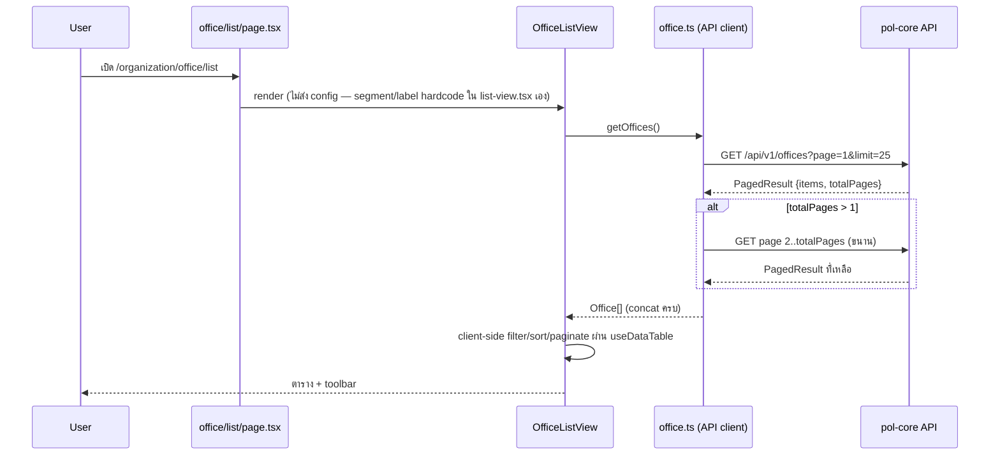
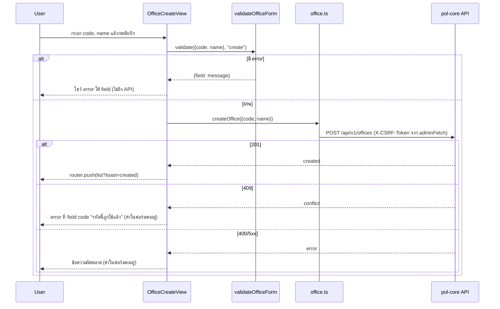
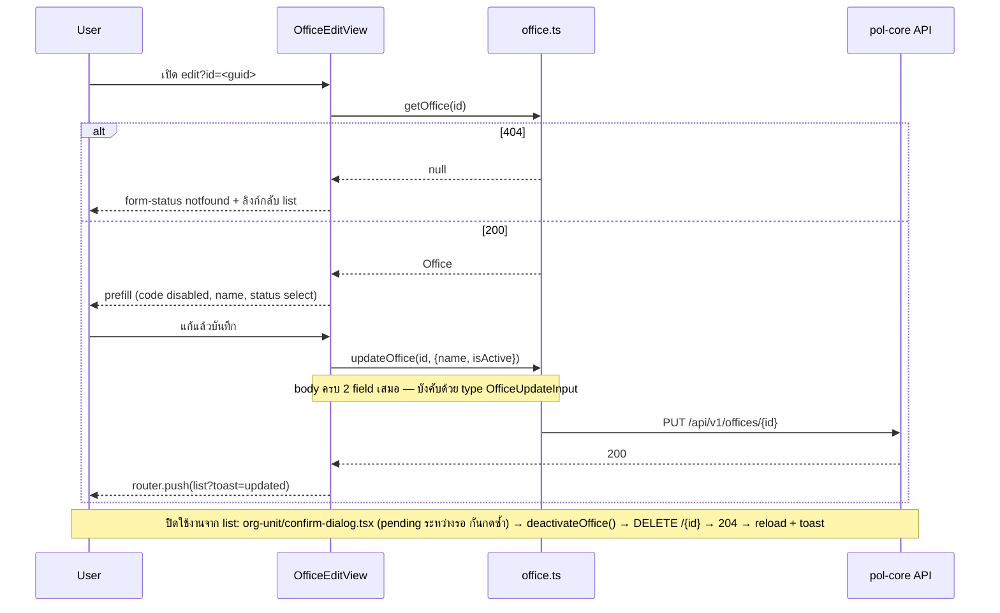

# Design: โมดูลโครงสร้างองค์กร (organization-structure)

> Status: approved 2026-08-02; revised 2026-08-03 (REQ-7 เปลี่ยนเป็นสถาปัตยกรรมอิสระต่อ module)

## Architecture Overview

หลักการของ design นี้ (revised): **แต่ละ module (office/division/level/position) มีไฟล์ type,
config, validation, API client, view component เป็นของตัวเองทั้งหมด** (REQ-7.2) ยกเว้น UI component
ที่เป็น generic ล้วน ไม่ผูก type เฉพาะ entity ยังคง shared ต่อไป (REQ-7.3) — เดิม design นี้ใช้
"implementation ชุดเดียว parametrize ด้วย config ต่อ entity" (REQ-7.2 เดิม) แต่ทีมพัฒนาต้องการให้
แต่ละ module เพิ่ม field/logic เฉพาะตัวได้อิสระในอนาคตโดยไม่กระทบ module อื่น จึง revise เป็นแยกไฟล์
(ดู migration note ใน `requirements.md` REQ-7)

ชั้น route ยังเป็น per-entity folder ตาม convention ของ repo เหมือนเดิม — ต่างจากเดิมตรงที่ route
เรียก view ของ module ตัวเองตรง ๆ ไม่ผ่าน config prop อีกต่อไป

```
src/app/organization/                        (ชั้น route — per-entity, บางที่สุด, ไม่เปลี่ยนจากเดิม)
  layout.tsx                                 ครอบ MinimalsLayout (แบบ src/app/merchant/layout.tsx)
  {office,division,position,level}/
    list/page.tsx                            metadata + PageHeader + <{Module}ListView />
    read/{page,layout}.tsx                   ?id= → <{Module}ReadView id />
    create/{page,layout}.tsx                 <{Module}CreateView />
    edit/{page,layout}.tsx                   ?id= → <{Module}EditView id />

src/components/organization/office/          (ชั้น view — เฉพาะ office เท่านั้น ไม่มี module อื่นแตะ)
  list-view.tsx     list container: โหลดข้อมูล, state search/status/dense/detail/deactivate/toast
                     — segment/basePath/label ของ office hardcode ในไฟล์นี้ตรง ๆ
  detail-sheet.tsx  drawer รายละเอียดจาก row click
  create-view.tsx   ฟอร์ม code + name
  edit-view.tsx     ฟอร์ม name + status (code disabled)
  read-view.tsx     แสดง field อ่านอย่างเดียว

src/components/organization/{division,level,position}/
                    ซ้ำโครงเดียวกับ office/ เป๊ะ (list-view.tsx, detail-sheet.tsx, create-view.tsx,
                    edit-view.tsx, read-view.tsx) — คนละไฟล์ ไม่ import ข้าม module กัน

src/components/organization/org-unit/        (ชั้น view — shared เฉพาะที่ generic ล้วน, REQ-7.3)
  toolbar.tsx       ช่องค้นหา + select สถานะ — รับ prop เป็น primitive/callback ล้วน
  columns.tsx       buildOrgUnitColumns<T extends OrgUnitLike>(): generic ผ่าน TS structural typing
                     (interface OrgUnitLike { id; code; name; isActive } define ในไฟล์นี้เอง
                     ไม่ import type เฉพาะ entity ใด — Office/Division/Level/Position ผ่าน check
                     อัตโนมัติเพราะ shape ตรงกัน)
  status-badge.tsx  badge ใช้งาน/ปิดใช้งาน + STATUS_OPTIONS + type OrgUnitStatus (define ในไฟล์เอง
                     ไม่ import จาก type module ของ module ใด — เดิม import จาก org-unit type)
  (detail-sheet.tsx ย้ายออกจากที่นี่แล้ว — เป็นของแต่ละ module ตามด้านบน)
  confirm-dialog.tsx  dialog ยืนยัน generic (async onConfirm + pending) — รับ title/description/
                      confirmLabel/onConfirm ล้วน ไม่แตะ type entity — ใช้ทั้งยืนยัน "ปิดใช้งาน"
                      และยืนยันยกเลิกฟอร์มที่มีข้อมูลค้าง
  form-status.tsx   สถานะ loading | error | notfound ของหน้า read/edit — รับ state/backHref/label
                     (string ล้วน) ไม่แตะ type entity

src/components/shared/toaster.tsx + src/hooks/use-toast.ts
                    toast ยกขึ้นเป็นของกลาง (ไม่เปลี่ยนจากเดิม — สำเนา admin/role + merchant/role
                    เดิมไม่แตะ)

src/lib/organization/office/                 (ชั้น pure logic — เฉพาะ office)
  config.ts         ค่าคงที่ตรง ๆ ไม่มี Record/key อีกต่อไป: OFFICE_SEGMENT, OFFICE_BASE_PATH,
                     OFFICE_LABEL
  form.ts           validateOfficeForm() pure function + form.test.ts

src/lib/organization/{division,level,position}/
                    ซ้ำโครงเดียวกับ office/ เป๊ะ (config.ts, form.ts + form.test.ts)

src/lib/api/admin/
  office.ts         CRUD client เฉพาะ office — segment "offices" hardcode ในไฟล์ ไม่รับ parameter
                     อีกต่อไป + office.test.ts
  division.ts, level.ts, position.ts
                    ซ้ำโครงเดียวกับ office.ts (อยู่ใต้ api/admin เพราะแกนของ src/lib/api/* คือ
                    audience/BFF area ไม่ใช่ domain — endpoint ชุดนี้ใช้ admin session + user.manage)

src/types/organization/
  office.ts         Office, OfficeCreateInput, OfficeUpdateInput
  division.ts       Division, DivisionCreateInput, DivisionUpdateInput
  level.ts          Level, LevelCreateInput, LevelUpdateInput
  position.ts       Position, PositionCreateInput, PositionUpdateInput
```

แก้ไฟล์เดิม 3 ไฟล์ (ไม่เปลี่ยนจากเดิม): `next.config.ts` (rewrite), `src/components/layout/nav-config.ts` +
`minimals-nav-config.ts` (menu group) และเพิ่ม SVG 4 ไฟล์ใน `public/assets/icons/navbar/`

Reuse component กลางเดิม ไม่สร้างใหม่: `PageHeader`, `EditPageHeader`, `DataTable`
(ส่ง `showSelectionAction={false}` — ไม่มี bulk action, กัน overlay "N selected" ค้าง),
`TextField`/`SelectField`, `useDataTable`
(หมายเหตุ: `ConfirmDialog` ของ `components/policy/` ไม่อยู่ในรายการ reuse — เป็น domain folder
ไม่ใช่ของกลาง และ signature เป็น sync ไม่มี pending state; `org-unit/confirm-dialog.tsx` เป็น shared
component ของ 4 module นี้เอง ไม่ใช่ per-module)

### Preconditions (verify แล้ว — ไม่เปลี่ยนจากเดิม)

- CSRF cookie `adm_csrf` ตั้ง `Path = "/"` (pol-core `SessionCookies.cs:63`) — `document.cookie`
  อ่านได้จากหน้า `/organization/*` แน่นอน mutation ผ่าน `adminFetch` ได้ header ครบ
- `src/app/` ไม่มี route ใต้ `/api` เลย (ไม่มี `route.ts` ทั้ง repo) — rewrite passthrough ไม่ชนอะไร
- dev ต้อง set `ADMIN_API_ORIGIN` เสมอ — ถ้าไม่ set, `rewrites()` คืน `[]` และ request `/api/v1/*`
  จะได้ HTML 404 ของ Next กลับมา (โผล่เป็น error state ทั่วไป ไม่ crash)

## Sequence Diagrams

ตัวอย่างใช้ office เป็นตัวแทน — division/level/position เดินโครง sequence เดียวกันเป๊ะ ต่างแค่ชื่อ
component/function/segment (`Division*`/`divisions`, `Level*`/`levels`, `Position*`/`positions`)

### Flow 1: เปิดหน้า list (REQ-2)



### Flow 2: สร้างรายการ (REQ-4)



### Flow 3: แก้ไข + ปิดใช้งาน (REQ-5, REQ-6)



## Data Models & Interfaces

ตัวอย่างใช้ office เป็นตัวแทน — division/level/position มีไฟล์ของตัวเองที่โครงเดียวกันเป๊ะ
เปลี่ยนแค่ชื่อ type/function/segment/label

```ts
// src/types/organization/office.ts
export interface Office {
  id: string;        // Guid — row key + route param (?id=)
  code: string;      // ^[a-z0-9_]+$ max 64, unique, immutable หลัง create
  name: string;      // max 200
  isActive: boolean; // false = ปิดใช้งาน (soft-deactivate)
}

export interface OfficeCreateInput { code: string; name: string; }
/** ทั้งสอง field บังคับ — backend PUT เป็น full-replace, ขาด isActive = โดนปิดใช้งานเงียบ (REQ-5.4) */
export interface OfficeUpdateInput { name: string; isActive: boolean; }

// division.ts / level.ts / position.ts ซ้ำโครงเดียวกัน: Division/DivisionCreateInput/DivisionUpdateInput
// เปลี่ยนแค่ชื่อ type — ไม่มี OrgUnitSegment รวมอีกต่อไป (segment เป็นค่าคงที่ hardcode ใน api client แต่ละไฟล์)
```

```ts
// src/lib/organization/office/config.ts — ไม่มี Record/key รวมอีกต่อไป เป็นค่าคงที่ตรง ๆ ของ office เอง
export const OFFICE_SEGMENT = "offices";           // API path segment
export const OFFICE_BASE_PATH = "/organization/office"; // route base
export const OFFICE_LABEL = "สำนักงาน";              // label ไทย ใช้ใน title/breadcrumb/ข้อความ

// division/config.ts, level/config.ts, position/config.ts ซ้ำโครงเดียวกัน คนละไฟล์
```

```ts
// src/lib/api/admin/office.ts — convention เดียวกับ src/lib/api/admin/role.ts, segment hardcode ในไฟล์
const BASE = "/api/v1/offices"; // เปลี่ยน 1 บรรทัดถ้า segment เปลี่ยน — ไม่รับ parameter อีกต่อไป

interface PagedResult<T> { items: T[]; page: number; limit: number; total: number; totalPages: number; }

/** fetch-all: page 1 → รู้ totalPages → ยิงที่เหลือขนาน → concat. throw ถ้า page ใดไม่ ok */
export async function getOffices(): Promise<Office[]>
/** 404 → null, throw ถ้า status อื่นไม่ ok. id ผ่าน encodeURIComponent เสมอ */
export async function getOffice(id: string): Promise<Office | null>
/** raw Response — caller เช็ค 409 (code ซ้ำ) เอง */
export function createOffice(input: OfficeCreateInput): Promise<Response>
export function updateOffice(id: string, input: OfficeUpdateInput): Promise<Response>
/** DELETE = soft-deactivate ฝั่ง backend */
export function deactivateOffice(id: string): Promise<Response>

// division.ts, level.ts, position.ts ซ้ำโครงเดียวกัน — BASE เปลี่ยนตาม segment, ชื่อฟังก์ชัน/type เปลี่ยนตาม entity
```

```ts
// src/lib/organization/office/form.ts — pure function, คืน {} = ผ่าน (pattern เดิมของ role, ไม่เปลี่ยน business rule)
export interface OfficeFormInput { code: string; name: string; }
export type OfficeFormMode = "create" | "edit";
export function validateOfficeForm(input: OfficeFormInput, mode: OfficeFormMode): Record<string, string>
// กติกา: create → code required + ^[a-z0-9_]+$ + len ≤ 64; ทั้งสอง mode → name (trim) required + len ≤ 200
// ไม่เช็ค code ซ้ำฝั่ง client — ให้ server ตอบ 409 (REQ-4.6; ต่างจาก role ที่ preload list)
// division/form.ts, level/form.ts, position/form.ts ซ้ำ business rule เดียวกัน คนละไฟล์
```

```ts
// src/components/organization/org-unit/columns.tsx — shared, generic ผ่าน structural typing (REQ-7.3)
interface OrgUnitLike { id: string; code: string; name: string; isActive: boolean }
export function buildOrgUnitColumns<T extends OrgUnitLike>(args: {
  label: string;
  onSelect?: (unit: T) => void;
  onRead?: (unit: T) => void;
  onEdit?: (unit: T) => void;
  onDeactivate?: (unit: T) => void;
}): ColumnDef<T>[]
// office/list-view.tsx เรียก buildOrgUnitColumns<Office>({...}) — ผ่าน type check เพราะ Office
// มี shape {id,code,name,isActive} ตรงกับ OrgUnitLike โดยไม่ต้อง import type ของ office เข้ามาในไฟล์นี้เลย
```

View props + พฤติกรรม UI ที่เป็นข้อผูกพัน:

```ts
OfficeListView()                  // list — ไม่รับ config อีกต่อไป, segment/basePath/label hardcode ในไฟล์
OfficeCreateView()                // create
OfficeEditView({ id })            // edit — id จาก searchParams
OfficeReadView({ id })            // read
// division/level/position มี *ListView()/*CreateView()/*EditView({id})/*ReadView({id}) ของตัวเอง
```

- **Breadcrumb (REQ-1.5)**: ประกอบ trail ต่อชนิดหน้าจาก literal label ของ module (เช่น `"สำนักงาน"`
  ตรง ๆ ในไฟล์ office ไม่ใช่ `config.label` อีกต่อไป) ส่งเป็น prop เข้า `PageHeader`/`EditPageHeader`
  (repo ไม่ใช้ `buildBreadcrumbs()` จริง — หน้าเดิม hardcode ทุกหน้า): list = `[{Console}, {label}]`;
  create = `[{Console}, {label, href: basePath+"/list"}, {"เพิ่ม" + label}]`; read/edit ทำนองเดียวกัน
  ("รายละเอียด" / "แก้ไข")
- **ยืนยันยกเลิกฟอร์ม (REQ-4.8)**: ปุ่มยกเลิกใน create/edit เป็น `<button>` (ไม่ใช่ `<Link>` เปล่าแบบ role) —
  เช็ค dirty (create: `code || name` ไม่ว่าง; edit: ค่าต่างจากที่ prefill) → dirty เปิด
  `org-unit/confirm-dialog.tsx` (shared) แล้วค่อย `router.push(basePath + "/list")` — ดักเฉพาะปุ่มยกเลิก
  ไม่ทำ `beforeunload`/route interception
- **Toast กลับหน้า list**: `router.push(basePath + "/list?toast=...")` (basePath เป็นค่าคงที่ hardcode
  ของ module); ฝั่ง list อ่านแล้วล้างด้วย `history.replaceState`
- **เรียงชื่อไทย (REQ-2.3)**: column name ใส่
  `sortingFn: (a, b, id) => String(a.getValue(id)).localeCompare(String(b.getValue(id)), "th")` —
  sort default ของ TanStack เทียบ code point แล้วสระหน้าไทย (เ แ โ ใ ไ) จะเรียงผิด
- **Detail sheet**: ปุ่ม "ปิดใช้งาน" แสดงเฉพาะเมื่อ `isActive` (ขยาย REQ-2.11 ให้ครอบ sheet ด้วย)

Nav item (ไม่เปลี่ยนจากเดิม — ผูกกับ path ไม่ใช่ config object, เพิ่มทั้ง `nav-config.ts` และ
`minimals-nav-config.ts` ตำแหน่งเดียวกัน — ถัดจาก group "ผู้ใช้งาน & สิทธิ์" ก่อน "Control plane · การเชื่อมต่อ"):

```ts
{
  subheader: "โครงสร้างองค์กร",
  items: [
    { title: "สำนักงาน", path: "/organization/office/list",   icon: "building", match: "/organization/office" },
    { title: "แผนก",     path: "/organization/division/list", icon: "sitemap",  match: "/organization/division" },
    { title: "ตำแหน่ง",   path: "/organization/position/list", icon: "badge",    match: "/organization/position" },
    { title: "ระดับ",     path: "/organization/level/list",    icon: "ranking",  match: "/organization/level" },
  ],
},
```

`next.config.ts` — เพิ่มใน `rewrites()` block เดิม (หลัง 2 rule เดิม, ไม่เปลี่ยนจากเดิม):

```ts
{ source: "/api/:path*", destination: `${adminApiOrigin}/api/:path*` },
```

## Technology Decisions

| การตัดสินใจ | เหตุผล |
|---|---|
| แยกไฟล์อิสระต่อ module (type/config/form/API client/view) — **revised 2026-08-03** | เดิมใช้ generic ชุดเดียว + config ต่อ entity (REQ-7.2 เดิม) เพราะ 4 resource มี schema/behavior เหมือนกัน 100% ตอนเริ่มโปรเจกต์; ทีมพัฒนาต้องการเพิ่ม field/logic เฉพาะตัวต่อ module ในอนาคต ทำให้ config-driven parametrization กลายเป็นอุปสรรค (ทุกครั้งที่ module หนึ่งต้องต่างจากอีก 3 module ต้องเจาะ `if` เข้า shared code) — แยกไฟล์ทำให้แก้ module หนึ่งไม่กระทบอีก 3 module แลกกับต้องแก้ bug ร่วม (เช่น validation pattern) 4 จุดแทนที่จะเป็นจุดเดียว |
| คง UI component ที่ generic ล้วนเป็น shared (`org-unit/columns.tsx`, `confirm-dialog.tsx`, `form-status.tsx`, `status-badge.tsx`, `toolbar.tsx`) — REQ-7.3 | ไฟล์เหล่านี้ไม่มี business logic เฉพาะ entity เลย (รับ primitive/callback หรือ structural type ล้วน) — ไม่ต้องแตะแม้ module จะเพิ่ม field เฉพาะตัวในอนาคต เพราะไม่รู้จัก field นั้นอยู่แล้ว; ทำเป็น per-module ด้วยจะเป็น duplicate โดยไม่มีประโยชน์ |
| `columns.tsx` ใช้ TS generic + structural typing (`<T extends OrgUnitLike>`) แทนการ import type entity ตรง ๆ | ให้ยังคง shared ได้โดยไม่ผูกกับ `Office`/`Division`/`Level`/`Position` module ใดเป็นพิเศษ — Office ฯลฯ ผ่าน constraint อัตโนมัติเพราะ shape ตรงกัน ไม่ต้องมี type import ข้าม module |
| ชั้น route คงเป็น per-entity static folder (28 ไฟล์บาง) ไม่ใช้ dynamic segment `[unit]` | ตัดสินใจโดยรู้ trade-off: `[unit]` + `generateStaticParams` ลดเหลือ ~7 ไฟล์ แต่ repo ทั้งตัวไม่มี dynamic segment เลย (ทุก module ใช้ static folder + query string) — การเพิ่ม pattern ใหม่ให้ codebase มีราคาแพงกว่า route เปลือก 8 บรรทัด × 28 ไฟล์ที่ไม่มี logic ให้ผิด; สอดคล้องกับการแยกอิสระต่อ module ยิ่งขึ้นหลัง revise REQ-7 |
| `adminFetch` เดิม ไม่สร้าง fetch layer ใหม่ | ได้ CSRF + `credentials:'include'` + 401→/login ฟรี (REQ-1.6, REQ-7.1); cookie `adm_csrf` Path=/ verify แล้ว |
| API client อยู่ `src/lib/api/admin/{office,division,level,position}.ts` | แกนของ `src/lib/api/*` = audience/BFF area (admin/merchant) ไม่ใช่ domain; endpoint ใช้ admin session + `user.manage` |
| fetch-all แล้ว client-side filter/sort/paginate | server ไม่รองรับ filter `isActive`/sort เลย (hardcode OrderBy Name), limit เพดาน 25, ข้อมูลจริง ~8-12 แถว/resource; ติด `ponytail:` comment ระบุเพดานหลักร้อย + ทางอัพเกรด server pagination |
| Rewrite passthrough `/api/:path*` | endpoint อยู่ top-level `/api/v1/{res}` ไม่เข้า rewrite `/admin/*` เดิม; `src/app/` ไม่มี route ใต้ `/api` จึงไม่ชนกัน (verify แล้ว); prod reverse proxy ส่ง `/api/v1/*` ผ่านอยู่แล้ว (ยืนยันจาก user); `BASE` ในแต่ละ client เก็บจุดเดียวสลับได้ 1 บรรทัด |
| toast ยกเป็น `src/hooks/use-toast.ts` + `src/components/shared/toaster.tsx` | มีสำเนาอยู่แล้ว 2 ชุด (admin/role, merchant/role) และ generic 100% — สร้างชุดที่สามใน module ขัดเหตุผล genericity ของ design เอง; สำเนาเดิมไม่แตะ (surgical) |
| dialog ยืนยันเป็น shared component (`org-unit/confirm-dialog.tsx`, async + pending) | `ConfirmDialog` ของ policy เป็น cross-domain import + sync `onConfirm` ไม่มี pending state — กดยืนยันรัวได้ = DELETE ซ้ำ; ตัวนี้ `onConfirm: () => Promise<void>` + disable ระหว่างรอ ใช้ได้ทั้ง deactivate และ cancel-confirm ของทั้ง 4 module — generic ล้วนจึงยังคง shared ได้ตาม REQ-7.3 |
| ไม่มี duplicate mode / permission matrix / color | ฟอร์มมี 2-3 field — feature ของ role ที่ไม่มีความหมายกับ master data นี้ ตัดออก (YAGNI) |
| Validation เป็น pure function ไม่ใช่ zod | repo ไม่มี zod — ตาม convention เดิม (`Record<string,string>`), ไม่เพิ่ม dependency (REQ-7.6) |
| Route ใช้ `?id=` query string | pattern เดิมของ repo (role ใช้ `?code=`) |
| SVG icon ใหม่ 4 ตัว (building/sitemap/badge/ranking) | set ปัจจุบันไม่มี icon แนวองค์กร; ต้อง solid-fill เพราะ `NavIcon` ใช้เป็น CSS `mask-image` |
| ไม่มี FE route guard | ตาม convention ปัจจุบัน (repo ไม่มี middleware/guard เลย); backend บังคับ `user.manage` → 403 → error state ทั่วไป |

## Error Handling Strategy

`{module}` = office/division/level/position; `{Module}` = Office/Division/Level/Position (ชื่อ type/function ต่อ module)

| กรณี | จุดจัดการ | พฤติกรรม | REQ |
|---|---|---|---|
| 401 session หมด | `adminFetch` | redirect `/login` อัตโนมัติ | 1.6 |
| โหลด list ล้มเหลว (network/403/5xx) | `{module}/list-view.tsx` | error state + ปุ่มลองใหม่ (ไม่ใช่ตารางว่าง) — client throw รวม ไม่แยก 403 (signature คืน data หรือ throw; REQ-2.9 ไม่บังคับข้อความสิทธิ์เฉพาะ) | 2.9 |
| ไม่มีรายการตรงเงื่อนไข | `DataTable` emptyState | empty state เดิมของ repo | 2.10 |
| `?id=` หาย | `{module}/{read,edit}/page.tsx` (server) | `redirect(<basePath>/list)` | 3.2, 5.2 |
| GET by id → 404 | `get{Module}` คืน null → `org-unit/form-status.tsx` (shared) | notfound + ลิงก์กลับ list | 3.3, 5.2 |
| Client validation ไม่ผ่าน | `validate{Module}Form` | error ใต้ field, ไม่ยิง API | 4.3, 5.3 |
| POST → 409 | `{module}/create-view.tsx` | error ที่ field code "รหัสนี้ถูกใช้แล้ว" ฟอร์มคงค่า | 4.6 |
| POST → 400/5xx | `{module}/create-view.tsx` | ข้อความผิดพลาด ฟอร์มคงค่า | 4.7 |
| PUT → 404 (รายการหายระหว่างแก้ เช่น อีกแท็บ) | `{module}/edit-view.tsx` | ข้อความ "ไม่พบรายการ อาจถูกเปลี่ยนแปลงแล้ว" + ลิงก์กลับ list ฟอร์มคงค่า | 5.6 |
| PUT → 400/5xx | `{module}/edit-view.tsx` | ข้อความผิดพลาด ฟอร์มคงค่า | 5.6 |
| DELETE → error | `{module}/list-view.tsx` | toast error สถานะรายการเดิม dialog ปิด | 6.4 |
| DELETE กดซ้ำระหว่างรอ | `org-unit/confirm-dialog.tsx` (shared) pending | ปุ่มยืนยัน disabled ระหว่าง await | 6.2 |
| fetch-all บาง page fail | `get{Module}s` | throw ทั้งก้อน → error state (ไม่แสดงข้อมูลครึ่งเดียว) | 2.9 |

## Testing Strategy

Unit tests (vitest, co-located — ตาม convention `src/lib/api/admin/role.test.ts`) — **แยกไฟล์ต่อ
module (×4: office/division/level/position)** ต่างจากเดิมที่เป็นไฟล์เดียวรวม:

| ไฟล์ test | ครอบ | REQ |
|---|---|---|
| `src/lib/api/admin/{office,division,level,position}.test.ts` (×4) | path ประกอบถูกของ segment ตัวเอง + id ผ่าน `encodeURIComponent`; fetch-all: single page, หลาย page concat, page fail → throw; `get{Module}` 404→null / อื่น throw; `create{Module}` POST body `{code,name}`; `update{Module}` PUT body ครบ `{name,isActive}` ทั้งคู่ (กัน regression ปิดใช้งานเงียบ); `deactivate{Module}` method DELETE | 2.1, 3.3, 4.4, 5.4, 6.2, 7.5 |
| `src/lib/organization/{office,division,level,position}/form.test.ts` (×4) | ทุก branch: code ว่าง/มี uppercase/มีอักขระนอก set/ยาว 65; name ว่าง/whitespace ล้วน/ยาว 201; ค่า valid ผ่าน `{}`; mode edit ไม่เช็ค code — business rule เหมือนกันทุก module แต่คนละไฟล์ | 4.2, 4.3, 5.3, 7.5 |

Integration/manual (ไม่มีโครง E2E automation ใน repo — role ก็ไม่มี):

- เดินครบ 16 หน้า (4 module × 4 หน้า) ต่อ backend จริง (ต้อง set `ADMIN_API_ORIGIN`)
- office เต็ม flow: create → create ซ้ำเห็น 409 → edit rename → toggle inactive ผ่าน edit →
  deactivate จาก list → filter สถานะ/ค้นหา → read + id มั่ว = notfound → กดยกเลิกฟอร์ม dirty
  เห็น dialog ยืนยัน (REQ-2..6)
- Network tab **จากหน้า `/organization/*`**: mutation แนบ `X-CSRF-Token` จริง, ยิง `/api/v1/{segment}` (REQ-7.1, 7.4)
- Sidebar: group ตำแหน่งถูก, active state ต่อ item, breadcrumb ทุกหน้าแสดง trail จาก literal label
  เฉพาะ module ไม่ใช่ path ดิบ (REQ-1)
- เรียงชื่อ: มีรายการชื่อขึ้นต้นด้วยสระหน้า (เช่น "แผนกกลาง") ต้องเรียงตามพจนานุกรมไทย (REQ-2.3)
- Static gate: typecheck + lint + vitest เขียวทั้ง repo (CI required check)

## Requirement Traceability

| Design element | REQ |
|---|---|
| nav group ใน `nav-config.ts` + `minimals-nav-config.ts` (ตำแหน่ง, 4 items, match) | REQ-1.1, 1.2, 1.4 |
| SVG 4 ไฟล์ `public/assets/icons/navbar/ic-*.svg` | REQ-1.3 |
| breadcrumb trail ต่อชนิดหน้าจาก literal label เฉพาะ module ส่งเข้า `PageHeader`/`EditPageHeader` | REQ-1.5 |
| `adminFetch` (เดิม) | REQ-1.6, 7.1 |
| `get{Module}s` fetch-all + `{module}/list-view.tsx` + `useDataTable` | REQ-2.1, 2.4, 2.5, 2.6 |
| `sortingFn` localeCompare "th" ที่ column name (`org-unit/columns.tsx`, shared) | REQ-2.3 |
| `org-unit/columns.tsx` (shared, stopPropagation + `meta.ignoreRowClick`, ซ่อนปุ่มเมื่อ inactive) | REQ-2.2, 2.8, 2.11 |
| `{module}/detail-sheet.tsx` (ปุ่มปิดใช้งานเฉพาะ `isActive`) | REQ-2.7, 2.11 |
| error/empty state ใน `{module}/list-view.tsx` + `DataTable` (`showSelectionAction={false}`) | REQ-2.9, 2.10 |
| `{module}/read-view.tsx` + `org-unit/form-status.tsx` (shared) + redirect ใน `{module}/read/page.tsx` | REQ-3.1–3.4 |
| `{module}/create-view.tsx` + `validate{Module}Form` + `create{Module}` | REQ-4.1–4.7 |
| ปุ่มยกเลิก dirty-check + `org-unit/confirm-dialog.tsx` (shared) ใน create/edit | REQ-4.8 |
| `{module}/edit-view.tsx` + `{Module}UpdateInput` (บังคับ 2 field) + `update{Module}` | REQ-5.1–5.7 |
| `org-unit/confirm-dialog.tsx` (shared, async + pending) + `deactivate{Module}` + wording "ปิดใช้งาน" | REQ-6.1–6.5 |
| type/config/form/API client/view component แยกไฟล์อิสระต่อ module (Office/Division/Level/Position) | REQ-7.2 |
| `org-unit/{columns,confirm-dialog,form-status,status-badge,toolbar}.tsx` (shared, generic ล้วน) | REQ-7.3 |
| rewrite `/api/:path*` ใน `next.config.ts` | REQ-7.4 |
| `{module}.test.ts` + `form.test.ts` ต่อ module (×4) | REQ-7.5 |
| ไม่เพิ่ม dependency (pure function validation, component เดิม) | REQ-7.6 |
