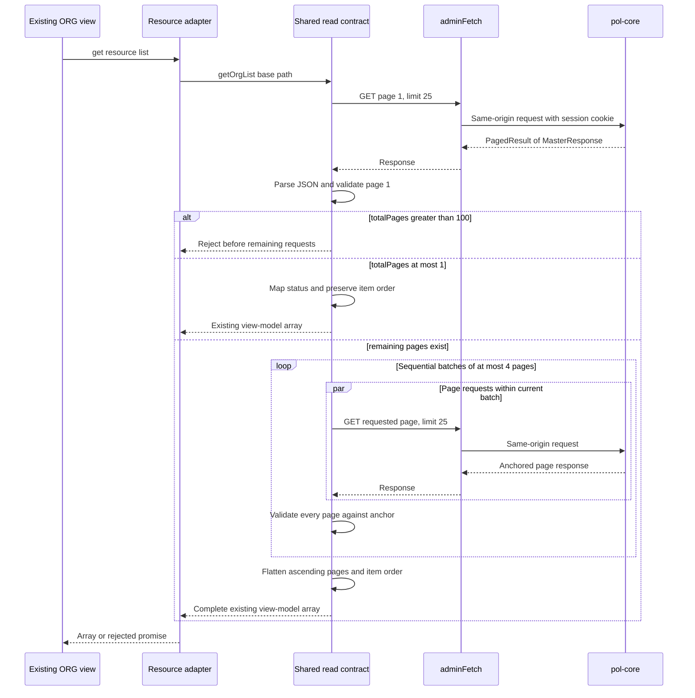
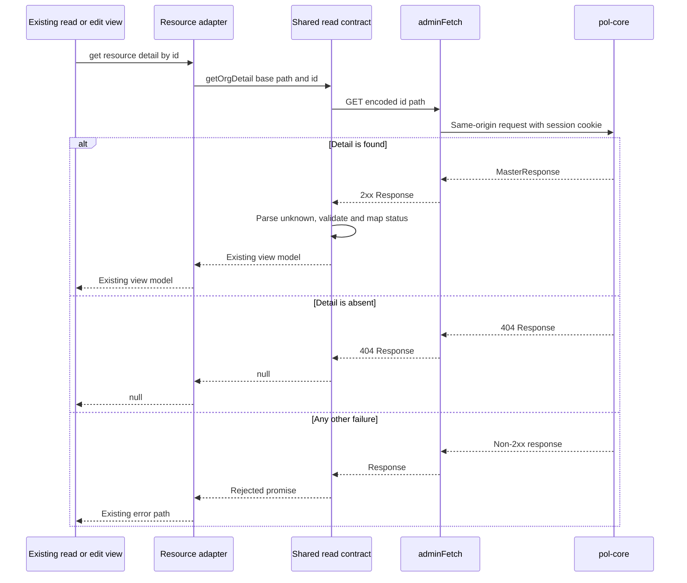

# Design: ORG read-only adapter alignment

> Status: approved 2026-08-24

เอกสารนี้ออกแบบการปรับ ORG list/detail adapters แปด GET operations ให้ตรงกับ `pol-core` snapshot `88db074596afb726c1153d0e92e59e30cdd026b3`. ขอบเขตคง production consumers, UX/UI, routes และ ORG writes เดิมทั้งหมด.

## Architecture Overview

### Scope boundary

| In scope | Out of scope |
|---|---|
| `GET /api/v1/divisions` และ `GET /api/v1/divisions/{id}` | ORG create, update, delete, ETag และ conflict lifecycle |
| `GET /api/v1/levels` และ `GET /api/v1/levels/{id}` | AROLE และ Phase 1 gap อื่น |
| `GET /api/v1/offices` และ `GET /api/v1/offices/{id}` | JSX, CSS, routes, navigation, labels และ copy |
| `GET /api/v1/positions` และ `GET /api/v1/positions/{id}` | UI fields, actions, states และ interactions |
| Shared wire validation, mapping และ bounded pagination | Dependency, manifest, lockfile และ `pol-core` changes |

`pol-core` เป็น read-only contract source. การตรวจ contract ใช้ `git show 88db074596afb726c1153d0e92e59e30cdd026b3:<path>` เท่านั้น ไม่อ้าง working-tree HEAD และไม่เขียนไฟล์ใน `pol-core`.

### Components and responsibilities

| Component | Ownership | Responsibility |
|---|---|---|
| Shared ORG read contract | `src/lib/api/admin/org-read-contract.ts` | Private wire types, unknown-value validation, status mapping, list/detail fetch, ceiling และ bounded pagination |
| Division adapter | `src/lib/api/admin/division.ts` | Bind `/api/v1/divisions` to shared reads; preserve exported signatures and all write functions |
| Level adapter | `src/lib/api/admin/level.ts` | Bind `/api/v1/levels` to shared reads; preserve exported signatures and all write functions |
| Office adapter | `src/lib/api/admin/office.ts` | Bind `/api/v1/offices` to shared reads; preserve exported signatures and all write functions |
| Position adapter | `src/lib/api/admin/position.ts` | Bind `/api/v1/positions` to shared reads; preserve exported signatures and all write functions |
| Shared contract tests | `src/lib/api/admin/org-read-contract.test.ts` | Parameterized four-resource read matrix, decoder/mapping, pagination, transport และ 401 integration |
| Existing adapter tests | Four existing `division.test.ts`, `level.test.ts`, `office.test.ts`, `position.test.ts` files | Endpoint binding and unchanged create/update/deactivate regression only |
| Existing production consumers | `src/components/organization/**` | Unchanged; continue consuming existing arrays, view models and detail `null` semantics |

Shared read contract is sole production owner of validation and pagination. Four adapters retain resource-specific endpoint ownership and delegate only existing read exports; write code remains unchanged.

### Read flow invariants

1. Adapter supplies same-origin resource base path to shared read contract.
2. Shared contract calls existing `adminFetch`; browser sends session cookie through `credentials: "include"` and no Bearer header.
3. JSON is accepted as `unknown` and validated before mapping.
4. Page `1` must have `page=1`, `limit=25`, valid envelope and `totalPages <= 100` before any later request starts.
5. Remaining page numbers run in ascending batches, each containing at most four concurrent requests.
6. Batches run sequentially. `Promise.all` input order preserves page order inside each batch; concatenation preserves backend item order.
7. Any status, network, JSON, schema or anchor failure rejects whole operation. No partial array crosses shared-contract boundary.

## Sequence Diagrams

### List read



### Detail read



## Data Models & Interfaces

### Private wire contract

Types below live only in `org-read-contract.ts`. They are not exported as UI contracts and contain no `any`.

```ts
interface MasterResponseWire {
  id: string;
  code: string;
  name: string;
  status: 1 | 2;
  version: number;
}

interface PagedResultWire<T> {
  items: T[];
  page: number;
  limit: number;
  total: number;
  totalPages: number;
}

interface OrgUnitView {
  id: string;
  code: string;
  name: string;
  isActive: boolean;
}
```

Wire fields match pinned backend records: `MasterResponse(Guid Id, string Code, string Name, int Status, long Version)` and `PagedResult<T>(Items, Page, Limit, Total)` with derived `TotalPages`. JSON naming remains backend camelCase.

### Shared read interface

```ts
export function getOrgList(basePath: string): Promise<OrgUnitView[]>;

export function getOrgDetail(
  basePath: string,
  id: string,
): Promise<OrgUnitView | null>;
```

Only these behavior-level functions need export. Decoder, mapper, page fetch and batch helpers remain private unless direct test access proves unavoidable; tests prefer observable adapter results.

### Validation rules

| Field | Validation before use |
|---|---|
| `items` | Array; every element passes `MasterResponseWire` validation |
| `page` | Positive safe integer; page `1` equals `1`; remaining page equals requested page |
| `limit` | Positive safe integer at most `25`; every operation page equals required `25` |
| `total` | Nonnegative safe integer |
| `totalPages` | Nonnegative safe integer, at most `100`, equals `Math.ceil(total / limit)` |
| `id` | UUID matching `/^[0-9a-f]{8}-[0-9a-f]{4}-[0-9a-f]{4}-[0-9a-f]{4}-[0-9a-f]{12}$/i` |
| `code` | Nonempty, at most 64 characters, matches `^[a-z0-9_]+$` |
| `name` | String at most 200 characters with nonempty trimmed value |
| `status` | Integer literal `1` or `2` |
| `version` | Nonnegative safe integer |

Validation reads only required fields from object values and ignores extra fields. Unsafe source `long` values are rejected because JavaScript cannot represent them losslessly.

### Mapping and pagination contracts

| Input | Output or invariant |
|---|---|
| `status=1` | `isActive=true` |
| `status=2` | `isActive=false` |
| Extra wire fields | Ignored; output shape remains `{id, code, name, isActive}` |
| Page `1` with `totalPages=0` or `1` | Return validated first-page items; start no remaining request |
| Page `1` with `totalPages=2..100` | Request pages `2..totalPages` in sequential batches of up to four |
| Remaining page | Require requested `page`, `limit=25` and `totalPages` equal page `1` anchor |
| Completed pages | Flatten in ascending page order, preserving item order inside each page |
| Failed page or batch | Reject operation; do not start later batches or return accumulated items |

## Technology Decisions

| Decision | Choice | Rationale |
|---|---|---|
| Runtime and language | Existing TypeScript, Next.js and Vitest | Matches repository; no dependency or tooling change |
| Transport | Existing `adminFetch` | Preserves BFF session, same-origin path, credentials and 401 side effect |
| Wire parsing | Small explicit type guards over `unknown` | No new schema dependency; validates trust boundary and forbids unchecked casts |
| Shared owner | One `org-read-contract.ts` | Four contracts are identical except base path; one fix/test owner prevents drift |
| Concurrency | Native `Promise.all` in sequential slices of four | Enforces bounded fan-out without dependency or queue abstraction |
| Ordering | Batch input arrays and final page arrays remain ascending | Native `Promise.all` preserves input order despite completion timing |
| Failure atomicity | Promise rejects before flattened result is returned | Existing consumers already handle rejected reads; no new UI state or fallback |
| Adapter compatibility | Keep existing exported read/write signatures | Consumers and ORG writes remain untouched |
| Backend source | Pinned `git show` at canonical SHA | Prevents contract drift from newer local `pol-core` working tree |

## Error Handling Strategy

### Response behavior

| Failure | List result | Detail result | Side effect |
|---|---|---|---|
| `401` | Reject | Reject | `adminFetch` assigns `window.location.href="/login"` and returns original response |
| `403` | Reject | Reject | None added |
| Representative `5xx` | Reject | Reject | None added |
| Network failure | Reject original fetch error | Reject original fetch error | None added |
| Malformed JSON | Reject JSON parse error | Reject JSON parse error | None added |
| Schema violation | Reject contract error | Reject contract error | No invalid value enters UI state |
| Detail `404` | Not applicable, list `404` rejects | Return `null` | Sole allowed `null` case |
| Remaining-page status or payload failure | Reject whole list | Not applicable | No partial result |
| Remaining-page page, limit or anchor mismatch | Reject whole list | Not applicable | No partial result |
| Page `1` ceiling exceeded | Reject before remaining requests | Not applicable | No fan-out starts |

Errors must not include response bodies, cookies, credentials or PII. Existing UI catch branches remain sole presentation owner; shared contract adds no mock fallback, toast, label or state.

### Four-resource failure matrix

Every listed cell is an executable case in parameterized shared tests, not coverage inferred from one resource.

| Resource | List failure cases | Detail failure cases | Pagination-specific cases |
|---|---|---|---|
| Divisions | `401`, `403`, `5xx`, network, malformed JSON, envelope schema, item schema | `401`, `403`, `5xx`, network, malformed JSON, item schema, `404` | Remaining failure, malformed payload, page mismatch, limit mismatch, anchor mismatch, ceiling |
| Levels | `401`, `403`, `5xx`, network, malformed JSON, envelope schema, item schema | `401`, `403`, `5xx`, network, malformed JSON, item schema, `404` | Remaining failure, malformed payload, page mismatch, limit mismatch, anchor mismatch, ceiling |
| Offices | `401`, `403`, `5xx`, network, malformed JSON, envelope schema, item schema | `401`, `403`, `5xx`, network, malformed JSON, item schema, `404` | Remaining failure, malformed payload, page mismatch, limit mismatch, anchor mismatch, ceiling |
| Positions | `401`, `403`, `5xx`, network, malformed JSON, envelope schema, item schema | `401`, `403`, `5xx`, network, malformed JSON, item schema, `404` | Remaining failure, malformed payload, page mismatch, limit mismatch, anchor mismatch, ceiling |

## Testing Strategy

### Shared contract tests

`org-read-contract.test.ts` owns a typed descriptor table with resource name, base path, list function, detail function and view-model factory for all four resources. It drives real exported adapters through `adminFetch`; it does not replace decoder or mapper with fakes.

| Test group | Required evidence |
|---|---|
| Valid list/detail | Status `1` and `2` mapping, valid single page, valid detail and extra fields ignored |
| Pagination | Page `1` uses `limit=25`; pages `2..anchor` all requested; at most four fetches simultaneously; later batch starts only after current batch settles |
| Deterministic result | Delayed responses resolve out of order but output stays ascending by page and backend item order |
| Atomic failure | Any page in a batch rejects whole list; no partial array is observed; later batches are not started |
| Envelope schema | Every invalid field class, `page != requested`, `limit != 25`, unsafe total and inconsistent `totalPages` rejects |
| Item schema | Every invalid `id`, `code`, `name`, `status`, unsafe version and non-object value rejects list and detail |
| Transport | Exact same-origin paths, `credentials: "include"`, no `Authorization` header and encoded detail id |
| Failure matrix | All list/detail/pagination cases from four-resource matrix execute for every descriptor |

For `401`, test stubs `document.cookie`, a mutable `window.location.href`, and global `fetch` returning a concrete `401 Response`. Test proves `adminFetch` assigns `/login`, returns that same response to caller, then each adapter rejects instead of returning mock data, an array or `null`.

### Adapter binding and write regression tests

Existing four resource test files keep resource-specific assertions only:

| Owner | Binding assertions | Write invariants preserved |
|---|---|---|
| `division.test.ts` | Division list/detail exports bind exact division paths | Existing POST, PUT, DELETE path, body, CSRF and raw `Response` behavior |
| `level.test.ts` | Level list/detail exports bind exact level paths | Existing POST, PUT, DELETE path, body, CSRF and raw `Response` behavior |
| `office.test.ts` | Office list/detail exports bind exact office paths | Existing POST, PUT, DELETE path, body, CSRF and raw `Response` behavior |
| `position.test.ts` | Position list/detail exports bind exact position paths | Existing POST, PUT, DELETE path, body, CSRF and raw `Response` behavior |

No write test migrates to shared contract owner. This prevents read refactor from silently changing ORG mutations while avoiding four duplicate decoder matrices.

### Browser production verification

Browser verification runs against a fresh production build and production server, never dev server. A deterministic Node contract stub is created under a temporary directory outside repository; it is not committed and performs no mutation.

Stub `GET /api/v1/admins/me` returns a valid `AdminMe` with `permissions: ["user.view"]`:

```json
{
  "adminId": "aaaaaaaa-aaaa-4aaa-8aaa-aaaaaaaaaaaa",
  "email": "browser-contract@example.test",
  "tier": "Scoped",
  "accessibleMerchants": {
    "isUnrestricted": false,
    "merchants": []
  },
  "permissions": ["user.view"]
}
```

| Resource | Exact list stub | Exact detail stub |
|---|---|---|
| Division | `GET /api/v1/divisions` | `GET /api/v1/divisions/{id}` |
| Level | `GET /api/v1/levels` | `GET /api/v1/levels/{id}` |
| Office | `GET /api/v1/offices` | `GET /api/v1/offices/{id}` |
| Position | `GET /api/v1/positions` | `GET /api/v1/positions/{id}` |

Build and start production with stub origin configured for both processes:

```bash
ADMIN_API_ORIGIN=http://127.0.0.1:<stub-port> npm run build
ADMIN_API_ORIGIN=http://127.0.0.1:<stub-port> npm run start
```

Browser probes frontend at `http://127.0.0.1:3001`.

| Resource | Production routes verified |
|---|---|
| Division | `/organization/division/list`, `/organization/division/read?id=<known-uuid>`, `/organization/division/edit?id=<known-uuid>` |
| Level | `/organization/level/list`, `/organization/level/read?id=<known-uuid>`, `/organization/level/edit?id=<known-uuid>` |
| Office | `/organization/office/list`, `/organization/office/read?id=<known-uuid>`, `/organization/office/edit?id=<known-uuid>` |
| Position | `/organization/position/list`, `/organization/position/read?id=<known-uuid>`, `/organization/position/edit?id=<known-uuid>` |

Each of 12 routes is checked at exact `document.documentElement.clientWidth` values `375`, `768` and `1440`. Evidence records production build identity, successful React hydration, no unexpected console error, no failed ORG network request, no document horizontal overflow, loaded contract values, and unchanged visible labels, actions, states, interaction controls and layout.

Viewport setup adjusts browser dimensions only when measured `clientWidth` differs from target. Mobile `375` uses device emulation when OS window minimum prevents exact width.

Deterministic stub verification proves frontend behavior without live identity dependency. Live OIDC and provisioned `AdminSession` availability are recorded separately as environment status; missing credential is a blocker only for safe local live GET probe and must not be misreported as browser-contract failure.

### Final verification commands

Run from `pol-admin` root and record command, exit code and observed counts:

```bash
npm run typecheck
npm test
npm run lint
npm run build
npm run verify:workspaces
```

Safe local probe, when live OIDC session exists, is limited to the four same-origin list GET endpoints. If unavailable, record endpoint, attempted command and exact auth/environment error; never send mutation or claim pass.

## Requirement Traceability

| Requirement | Design element | Verification owner |
|---|---|---|
| `REQ-1.1` | Four adapter base-path bindings and list sequence | Shared descriptor plus adapter binding tests |
| `REQ-1.2` | Encoded detail path from requested id | Shared descriptor plus adapter binding tests |
| `REQ-1.3` | Validated list mapping to existing view array | Shared contract tests |
| `REQ-1.4` | Validated detail mapping to existing view model | Shared contract tests |
| `REQ-1.5` | Detail-only `404` branch returns `null` | Four-resource failure matrix |
| `REQ-2.1` | Private `PagedResultWire<MasterResponseWire>` types | Typecheck and shared contract tests |
| `REQ-2.2` | `unknown` parsing with no `any` | Typecheck, lint and test source review |
| `REQ-2.3` | Paged envelope validator before mapping | Envelope schema matrix |
| `REQ-2.4` | Master response validator before mapping | Item schema matrix |
| `REQ-2.5` | Required-field reads ignore extra fields | Extra-field test |
| `REQ-2.6` | Status `1` maps active | Valid mapping test |
| `REQ-2.7` | Status `2` maps inactive | Valid mapping test |
| `REQ-2.8` | Schema guard rejects unsupported values | Envelope and item schema matrices |
| `REQ-2.9` | Page `1` ceiling gate before fan-out | Ceiling and request-count test |
| `REQ-3.1` | Initial query fixes page `1`, limit `25` | Captured request test |
| `REQ-3.2` | Valid page `1` supplies anchor | Multi-page test |
| `REQ-3.3` | Sequential batches cover every page through anchor | Bounded concurrency test |
| `REQ-3.4` | Ascending page arrays plus native `Promise.all` order | Out-of-order completion test |
| `REQ-3.5` | Remaining page validation and batch rejection | Remaining failure and mismatch matrix |
| `REQ-3.6` | Flatten only after all batches validate | Atomic failure test |
| `REQ-4.1` | Pinned backend `AdminSession + user.view` contract remains backend-owned | Canonical source review and safe live probe when available |
| `REQ-4.2` | Shared reads call existing `adminFetch` | Shared integration tests |
| `REQ-4.3` | Resource bases remain `/api/v1/*` | Captured path tests |
| `REQ-4.4` | Existing `adminFetch` adds included credentials | Captured RequestInit test |
| `REQ-4.5` | Shared reads add no Authorization header | Captured header test |
| `REQ-4.6` | Existing 401 location assignment retained | 401 mutable-location test |
| `REQ-4.7` | Adapter rejects returned 401 response | Four-resource 401 matrix |
| `REQ-4.8` | 401 yields no mock, array or `null` | Four-resource 401 matrix |
| `REQ-4.9` | Non-2xx except detail 404 rejects | 403 and 5xx matrix |
| `REQ-4.10` | Fetch rejection propagates | Network matrix |
| `REQ-4.11` | JSON parse rejection propagates | Malformed JSON matrix |
| `REQ-4.12` | `adminFetch` returns original 401 response after redirect | Direct 401 transport assertion |

## Deferred Gaps

| Gap | Reason deferred | Required future workflow |
|---|---|---|
| ORG create/update/delete wire mismatch | Explicitly outside eight GET operations | New requirements covering write DTO and failure behavior |
| ORG ETag and `If-Match` lifecycle | Requires concurrency contract and UI write-state review | Separate design and browser interaction verification |
| AROLE contract gaps | Separate resource and permissions contract | Separate approved scope |
| Server-side ORG filtering and sorting | Existing UI intentionally filters and paginates complete read result | Revisit only if supported ceiling becomes insufficient |
| More than 2,500 records | Frontend-supported ceiling rejects by requirement | Product decision for server pagination or revised UX |
| Live OIDC automation | Requires human identity and provisioned AdminSession | Environment coordination, not source fallback |

No deferred gap permits a mock fallback, UI change, unbounded read, backend change or scope expansion in this implementation.
