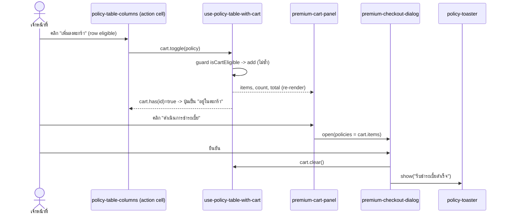
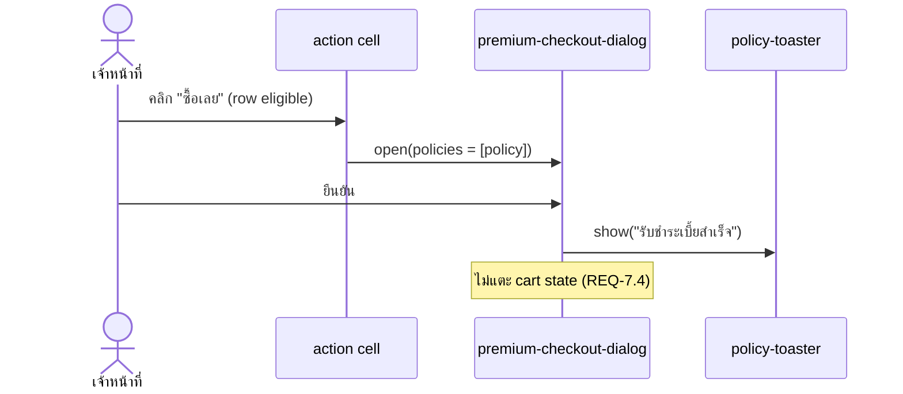

# Design: Policy Marketplace (รับชำระเบี้ย)

> Status: approved 2026-06-17, amended 2026-06-17

## Architecture Overview

Feature เป็น client-side surface บน mock data ตาม pattern ที่ build จริงแล้วของ
user/role (`components/<domain>/` + route `/<domain>/list`, ขับด้วย `useDataTable`).
ยึด ARCHITECTURE.md: pure logic แยกจาก presentation, design token single-source,
named export, `@/*` absolute import.

ชั้นงาน (จากล่างขึ้นบน):

- **Types** — `src/types/policy.ts` (`Policy`, `PolicyStatus`, `PremiumFrequency`).
  `src/types/table-meta.ts` (single source TableMeta augmentation) เพิ่ม field `cart`.
- **Pure logic** — `src/lib/policy/policy.ts`: `isCartEligible`, `sumPremium`,
  `matchesPolicyFilter` (predicate ใช้ใน table globalFilterFn), `buildTypeOptions` /
  `buildSourceOptions` (derive ตัวเลือก filter จากชุดข้อมูล), `countByStatus`.
  ไม่มี React, test ได้ตรง ๆ. + `formatTHB` ใน `src/lib/utils.ts` (เติมข้าง `cn`).
- **Mock data** — `src/lib/mock/policies.ts` export `POLICIES: Policy[]` (~48 records,
  กระจาย status ตรง count). seed แถวต้นจาก screenshot.
- **State hook** — `src/hooks/use-policy-table-with-cart.ts`: รวม table state
  (`useDataTable`) + cart state (`useReducer`). คุม invariant eligibility, ให้ derived
  `counts`, `filteredCount`, และ cart API.
- **Presentation** — `src/components/policy/*`: view container + toolbar + tabs +
  columns + status badge + cart panel/item + checkout dialog + toaster.
- **Route + nav** — `src/app/policy/{layout,list/page}.tsx` + เพิ่ม nav group ใน
  `src/components/layout/nav-config.ts`.

ความรับผิดชอบของแต่ละ component:

| ไฟล์ | หน้าที่ |
|------|---------|
| `policy-marketplace-view.tsx` | container ระดับหน้า: เรียก hook, จัด layout 2 คอลัมน์ (desktop) / cart sheet (mobile), ถือ dialog + toast state, ส่ง cart API เข้า table `meta` |
| `policy-list-toolbar.tsx` | SearchField + SelectField (ประเภท, ที่มา) + date stub + "ตัวกรองเพิ่มเติม" stub + "ส่งออก CSV" stub |
| `policy-status-tabs.tsx` | tabs สถานะ + count badge (pattern จาก `dashboard/order/order-list-tabs.tsx`) |
| `policy-table-columns.tsx` | `ColumnDef<Policy>[]`; action cell อ่าน `meta.cart` แสดงปุ่มเฉพาะ row eligible |
| `policy-status-badge.tsx` | badge dot+label 5 สถานะ + label/option maps (presentation) |
| `premium-cart-panel.tsx` | เนื้อหา panel: header+count, empty state, รายการ, เบี้ยรวม, ปุ่มดำเนินการ (ใช้ทั้ง inline และใน sheet) |
| `premium-cart-item.tsx` | แถวเดียวในตะกร้า + ปุ่มนำออก |
| `premium-cart-sheet.tsx` | mobile: ปุ่มลอย (FAB) + `ui/sheet` ครอบ `PremiumCartPanel` |
| `premium-checkout-dialog.tsx` | confirm modal **parameterized** (`policies: Policy[]`) — ใช้ทั้ง cart (N ใบ) และ ซื้อเลย (1 ใบ) — แก้ F7 |
| `use-policy-toast.ts` + `policy-toaster.tsx` | toast ภายในโมดูล (mirror `role` — repo ไม่มี toast lib) |

## Sequence Diagrams

### เพิ่มลงตะกร้า + ดำเนินการชำระเบี้ย (REQ-4,5,6)


### ซื้อเลย (REQ-7) — ไม่ผ่านตะกร้า


## Data Models & Interfaces

```ts
// src/types/policy.ts
export type PolicyStatus = "active" | "due_soon" | "awaiting" | "lapsed" | "cancelled";
export type PremiumFrequency = "monthly" | "quarterly" | "yearly";

export interface Policy {
  id: string;             // เลขกรมธรรม์ เช่น POL-2401170
  effectiveDate: string;  // เริ่มคุ้มครอง (ISO yyyy-mm-dd)
  coverageEnd: string;    // สิ้นสุดคุ้มครอง (ISO) — amended 2026-06-17
  customer: { name: string; phone: string };
  product: { type: string; plan?: string };
  source: { code: string; channel: string };
  insuranceKind: "VMI" | "CMI";              // ประเภทประกันภัย (amended 2026-06-17)
  referenceType: "policy" | "claim";         // ประเภทเลขอ้างอิง
  referenceNo: string;                       // หมายเลขกรมธรรม์/รับแจ้ง
  extraInfo: { text: string; tooltip?: string };
  sumInsured: number;
  premium: number;        // = totalAmount (ยอดที่ตะกร้ารับชำระเก็บ)
  netPremium: number;     // เบี้ยสุทธิ
  totalAmount: number;    // เบี้ยรวม (บาท)
  frequency: PremiumFrequency;
  nextDue: { date: string; installmentNo: number };
  deduction: { state: "none" | "deducted"; date?: string }; // สถานะตัดชำระเบี้ย
  vcp: "none" | "awaiting" | "paid";         // สถานะการชำระเงิน (VCP)
  status: PolicyStatus;
}
```

> หมายเหตุ (amended 2026-06-17): ตารางถูก rebuild เป็น motor-insurance schema — คอลัมน์ที่แสดง
> ไม่รวม coverage period (ลบตามคำสั่ง), header เบี้ยใช้สีปกติ, action เป็น icon ซื้อเลย (Zap) +
> เพิ่มลงตะกร้า disable เมื่อ vcp = paid. `formatThaiSlashDate` (DD/MM/BBBB) ใช้กับวันตัดชำระ.

```ts
// src/lib/policy/policy.ts  (pure — no React)
export const CART_ELIGIBLE_STATUSES: ReadonlySet<PolicyStatus>; // {awaiting, due_soon}
export function isCartEligible(status: PolicyStatus): boolean;
export function sumPremium(items: readonly Policy[]): number;
export interface PolicyFilter { search: string; category: string; customerName: string; startDate: string; endDate: string; status: PolicyStatus | "all"; }
export function policyCategory(p: Policy): "motor" | "non-motor"; // ประกันรถยนต์ = motor, ที่เหลือ = non-motor
export function matchesPolicyFilter(p: Policy, f: PolicyFilter): boolean; // search = id|customer.name; category + customerName + date-range + status; AND (amended 2026-06-17)
export function countByStatus(list: readonly Policy[]): Record<PolicyStatus | "all", number>;
export function buildTypeOptions(list: readonly Policy[]): { value: string; label: string }[];
export function buildSourceOptions(list: readonly Policy[]): { value: string; label: string }[];
```

```ts
// src/lib/utils.ts (เพิ่ม)
export function formatTHB(amount: number, decimals = 0): string; // Intl th-TH, prefix ฿, fixed decimals
```

```ts
// src/types/table-meta.ts (เพิ่มใน TableMeta)
interface PolicyCartMeta {
  has(id: string): boolean;
  toggle(p: Policy): void;     // add/remove (guard eligibility)
  buyNow(p: Policy): void;     // เปิด checkout ใบเดียว
}
// TableMeta<TData> เพิ่ม: cart?: PolicyCartMeta
```

```ts
// src/hooks/use-policy-table-with-cart.ts
export interface PremiumCart {
  items: Policy[];
  count: number;
  total: number;            // sumPremium(items)
  has(id: string): boolean;
  toggle(p: Policy): void;  // guard: เพิ่มเฉพาะ eligible, ไม่ซ้ำ
  remove(id: string): void;
  clear(): void;
}
export function usePolicyTableWithCart(): {
  table: Table<Policy>;
  filteredCount: number;
  counts: Record<PolicyStatus | "all", number>;
  cart: PremiumCart;
};
```

- cart state = `useReducer` (actions: `add` | `remove` | `clear`); `add` ผ่าน guard
  `isCartEligible` และเช็คซ้ำด้วย id. `total` derive ด้วย `sumPremium` (ไม่เก็บซ้ำ).
- table = `useDataTable<Policy>({ data: POLICIES, columns, getRowId, state:{globalFilter},
  globalFilterFn: (row,_id,f) => matchesPolicyFilter(row.original, f), ... })`
  pattern ตรงกับ `user-list-view.tsx` (filter ผ่าน table, ข้อมูลเต็มเสมอ → cart คงรายการ
  แม้เปลี่ยน filter, แก้ edge case "ใบในตะกร้าถูก filter ออก").
- `counts` = `countByStatus(POLICIES)` (จากชุดเต็ม, REQ-2.2).

## Technology Decisions

- **ไม่เพิ่ม dependency**: tabs/badge/toast ใช้ pattern เดิมในโปรเจกต์ (order tabs,
  role badge/toast) — repo ไม่มี toast lib และไม่เพิ่ม.
- **formatTHB อยู่ที่ `lib/utils.ts`** ตามชื่อที่ ARCHITECTURE.md กำหนด (ไม่สร้าง
  formatter ใหม่ซ้ำที่อื่น) — single source การจัดรูปเงิน.
- **Hook ชื่อ `use-policy-table-with-cart`** ตามที่ ARCHITECTURE.md ระบุไว้.
- **Component อยู่ `components/policy/`** ตาม precedent ที่ build จริง (user/role)
  ไม่ใช่ `components/dashboard/*` (demo scaffolding) — ฟีเจอร์นี้คือ POL product surface.
- **Checkout dialog ตัวเดียว parameterized** (รับ `Policy[]`) ใช้ทั้ง cart และ ซื้อเลย
  (แก้ F7) — เลี่ยง component ซ้ำ.
- **TableMeta.cart** ส่ง cart API เข้า columns ผ่าน `table.options.meta` (pattern เดียว
  กับ onRowClick/ignoreRowClick ที่ใช้อยู่) แทน prop drilling เข้า cell.

## Error Handling Strategy

| กรณี | การจัดการ | REQ |
|------|-----------|-----|
| เพิ่มกรมธรรม์ไม่ eligible | reducer `add` ผ่าน guard `isCartEligible` → no-op (state ไม่เปลี่ยน); UI ไม่แสดงปุ่มบน row ไม่ eligible อยู่แล้ว | 4.1,4.3,4.6 |
| เพิ่มซ้ำ id เดิม | reducer เช็ค `items.some(i=>i.id===p.id)` → no-op | 4.7 |
| filter/search ไม่เจอแถว | DataTable empty state (`TableNoData` + searchQuery) | 1.5 |
| กดดำเนินการขณะตะกร้าว่าง | ปุ่ม disabled (กดไม่ได้) | 6.2 |
| ยกเลิก dialog | ปิด modal, ไม่แตะ cart | 6.5 |
| ใบในตะกร้าถูก filter ออกจากตาราง | cart อ้าง POLICIES เต็ม → ยังอยู่ในตะกร้า/นับในยอด | edge log |

## Testing Strategy

repo ยังไม่มี test runner (มีแค่ `next build`/`eslint`). การเพิ่ม unit-test runner
(เช่น vitest) = dependency decision → **เลื่อนเป็น follow-up** (ดู Open Decisions);
จึง gate ผ่าน typecheck/build + manual verification ใน phase นี้:

- **Static**: `npx tsc --noEmit` + `npm run build` + `npm run lint` เขียว (ไม่มี `any`).
- **Manual / behavioral** (map REQ): ตาม Verification ใน plan —
  tabs+count (REQ-2), search/filter AND (REQ-3), eligibility ปุ่ม (REQ-4),
  cart total/remove (REQ-5), checkout clear+toast (REQ-6), ซื้อเลย ไม่แตะ cart (REQ-7),
  responsive sheet + no overflow (REQ-8), aria-label/focus (REQ-9).
- **เตรียมไว้สำหรับ test**: logic ใน `lib/policy/policy.ts` เป็น pure ทั้งหมด พร้อม
  เขียน unit/property test (`sumPremium`, `isCartEligible`, `matchesPolicyFilter`,
  `countByStatus`) ทันทีที่เพิ่ม runner — รองรับ `/spec-pbt` ภายหลัง.

## Requirement Traceability

| Design element | REQ |
|----------------|-----|
| `policy-table-columns` (motor-insurance schema) + `formatTHB`/`formatThaiSlashDate` + VCP badge + `PolicyRowActions` (disable เมื่อ paid) + DataTable sort/pagination | REQ-1.1–1.7 |
| `policy-status-tabs` + `countByStatus` + globalFilter status | REQ-2.1–2.4 |
| `policy-list-toolbar` (6-field grid) + `matchesPolicyFilter` + `policyCategory` + `CATEGORY_OPTIONS`/`PAYMENT_STATUS_OPTIONS` | REQ-3.1–3.8 |
| `use-policy-table-with-cart` cart reducer + `isCartEligible` + action cell | REQ-4.1–4.7 |
| `premium-cart-panel` + `premium-cart-item` + `sumPremium` | REQ-5.1–5.6 |
| `premium-checkout-dialog` (cart mode) + `policy-toaster` + `cart.clear` | REQ-6.1–6.5 |
| `premium-checkout-dialog` (single mode) + `cart.buyNow` | REQ-7.1–7.4 |
| `app/policy/{layout,list/page}` + `nav-config` + view layout + `premium-cart-sheet` | REQ-8.1–8.5 |
| aria-label บนปุ่ม + badge สี+ข้อความ + focus state + logic แยก pure | REQ-9.1–9.4 |

## Design Refinements (หลัง spec-architect critique)

แก้/ระบุเพิ่มทุก finding (ไม่มี rebut):

- **F-arch-1 (high, REQ-8.2 nav)** — nav item เต็ม schema `NavItem`:
  `{ title: "กรมธรรม์", path: "/policy/list", match: "/policy", icon: "invoice" }`
  ใช้ `match` (เหมือน user ใช้ `match:"/user"`) ให้ active ครอบ `/policy/*`.
- **F-arch-2 (high, ที่ตั้ง component)** — ยืนยัน `components/policy/` อ้าง **code จริง**
  (`components/user/`, `components/role/` แบบ flat) ไม่ใช่ `components/payment/*` ที่เป็น
  prose ค้างใน ARCHITECTURE.md.
- **F-arch-3 (high, REQ-6.4/7.3 toast wiring)** — toast เป็น per-view (mirror role).
  `policy-marketplace-view` ถือ `usePolicyToast()` + render `<PolicyToaster>`. ส่ง
  `onSuccess(message: string)` เป็น prop เข้า `premium-checkout-dialog`; dialog เรียก
  `onSuccess("รับชำระเบี้ยสำเร็จ")` ตอนยืนยัน (ไม่ reach toast state เอง).
  `PremiumCheckoutDialogProps = { open; policies: Policy[]; onConfirm(): void; onSuccess(msg: string): void; onClose(): void }`
  — cart mode: `onConfirm = cart.clear`; single mode: `onConfirm = () => {}`.
- **F-arch-4 (high, REQ-9.1 aria-label)** — ปุ่ม action ใช้ aria-label ผูก id:
  `aria-label={\`เพิ่ม ${policy.id} ลงตะกร้า\`}` / `\`นำ ${policy.id} ออกจากตะกร้า\`} / `\`ซื้อ ${policy.id} เลย\`}`
  (และปุ่มนำออกใน cart item ผูก id ลูกค้าเช่นกัน) — screen reader แยกแถวได้.
- **F-tbl-5 (med, REQ-1.6 pagination)** — constant เดียวในไฟล์ view:
  `ROWS_PER_PAGE_OPTIONS = [10, 25, 50]`, `initialState.pagination = { pageIndex: 0, pageSize: 10 }`.
- **F-tbl-6 (med, REQ-1.4 sort)** — column id ชัด 4 ตัว sortable: `policyNo` (เลขกรมธรรม์),
  `sumInsured`, `premium`, `nextDue`. `nextDue` ใช้ `accessorFn: r => r.nextDue.date` (sort
  ตามวันที่ ไม่ใช่ display cell). `initialState.sorting = [{ id: "policyNo", desc: false }]`.
- **F-tbl-7 (med, REQ-2.3/3.1–3.3 reset)** — ตั้ง `autoResetPageIndex: false` (เหมือน user)
  และ handler ของ tab/search/type/source ทุกตัวเรียก `table.setPageIndex(0)` explicit.
- **F-tbl-14 (low, REQ-3.4 AND)** — status รวมใน globalFilter object เดียว:
  `{ search, category, customerName, startDate, endDate, status }` → `globalFilterFn = matchesPolicyFilter(row.original, f)`
  (AND ครบ; status "all" = ผ่านหมด). `counts` แยกคำนวณจาก `POLICIES` เต็มด้วย `countByStatus`.
- **F-ui-9 (med, REQ-5.1/5.4 mobile)** — `premium-cart-sheet` FAB แสดง badge `count` (live
  ขณะ sheet ปิด) + เปิด `ui/sheet` (side right) ครอบ `PremiumCartPanel` ตัวเดียวกับ desktop.
- **F-ui-10 (med, REQ-8.5 overflow)** — layout ระดับหน้า: `grid grid-cols-1 mlg:grid-cols-[1fr_360px] gap-6`;
  คอลัมน์ตารางใส่ `min-w-0`; ตาราง scroll-x ภายใน card (`overflow-x-auto` มีอยู่ใน DataTable แล้ว).
  cart panel desktop ใช้ `mlg:sticky mlg:top-*`. `< mlg`: ซ่อน panel inline, แสดง `premium-cart-sheet`.
- **F-ui-12 (low, REQ-3.5 stubs)** — ปุ่ม/ตัวเลือก stub (CSV, ตัวกรองเพิ่มเติม, date) เป็น
  `disabled` + `aria-disabled` + tooltip "เร็ว ๆ นี้" (ไม่ใช่ปุ่มกดได้ที่ไม่ทำอะไร).
- **F-ui-13 (low, token dup)** — สีของ tab count badge และ status badge อ้าง map เดียวกัน
  (semantic token `success/warning/info/grey/error`) ไม่ duplicate raw rgba ข้าม 2 ไฟล์ —
  export label/สี map จาก `policy-status-badge.tsx` ให้ tabs reuse.
- **F-util-11 (low, formatTHB)** — `formatTHB` **สร้างใหม่** ใน `lib/utils.ts` (เดิมมีแค่ `cn`):
  `Intl.NumberFormat("th-TH", { minimumFractionDigits: d, maximumFractionDigits: d })` + prefix `฿`.
- **F-nav-15 (implementation, REQ-8.2)** — sidebar จริงที่ `MinimalsLayout` render ใช้
  `minimals-nav-config.ts` (ไม่ใช่ `nav-config.ts` ที่ขับ breadcrumb/search). ต้องเพิ่ม nav group
  "กรมธรรม์" ใน **ทั้งสองไฟล์** ให้ sidebar ขึ้นเมนู + breadcrumb ตรง — additive รวม 4 ไฟล์เดิม.

เพิ่มใน Error Handling:

| กรณี | การจัดการ | REQ |
|------|-----------|-----|
| ยืนยัน checkout แล้ว แต่ mock ไม่ mutate status | ใบเดิมยัง eligible re-add ได้ — in-scope, known limitation (mock ไม่มี backend อัปเดตสถานะ) | 6.4 |

## Open Decisions (ยกขึ้นใน /spec-tasks)

- **Test runner**: เพิ่ม vitest เป็น devDependency เพื่อให้ co-located unit/property test
  รันได้ (CODING_STANDARDS อยากได้ co-located test) — เป็น dependency decision ต้อง
  อนุมัติแยก. Phase นี้ logic แยก pure ไว้ก่อน, test ตามทีหลัง.
- **Nav icon**: ใช้ key `invoice` (รับชำระเบี้ย ~ billing) จาก `/assets/icons/navbar/ic-invoice.svg`.
- **Nav group subheader**: "กรมธรรม์" (กลุ่มใหม่ ถัดจาก "ผู้ใช้งาน & สิทธิ์").
