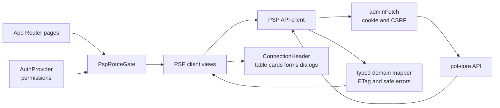
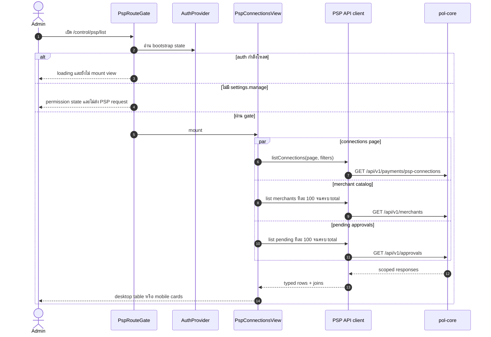
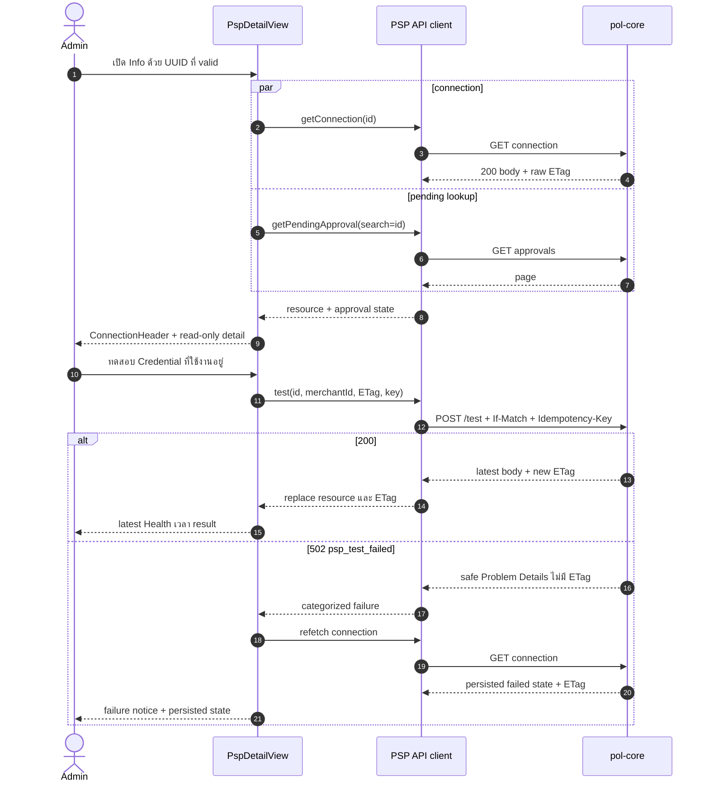
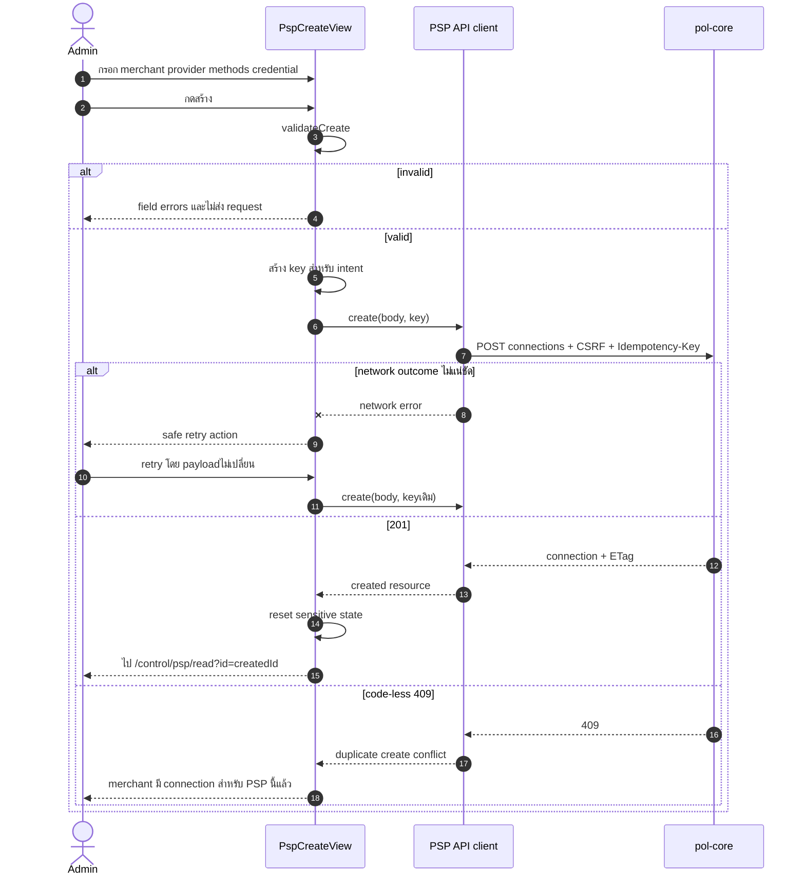
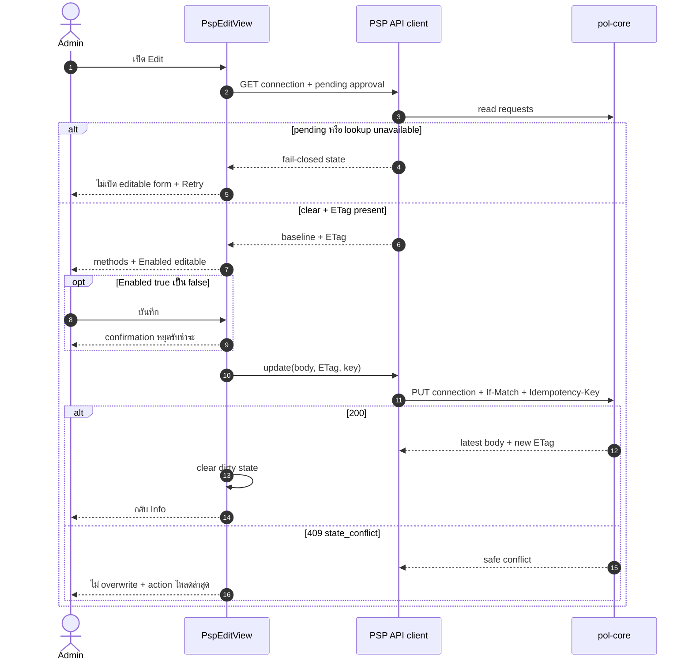
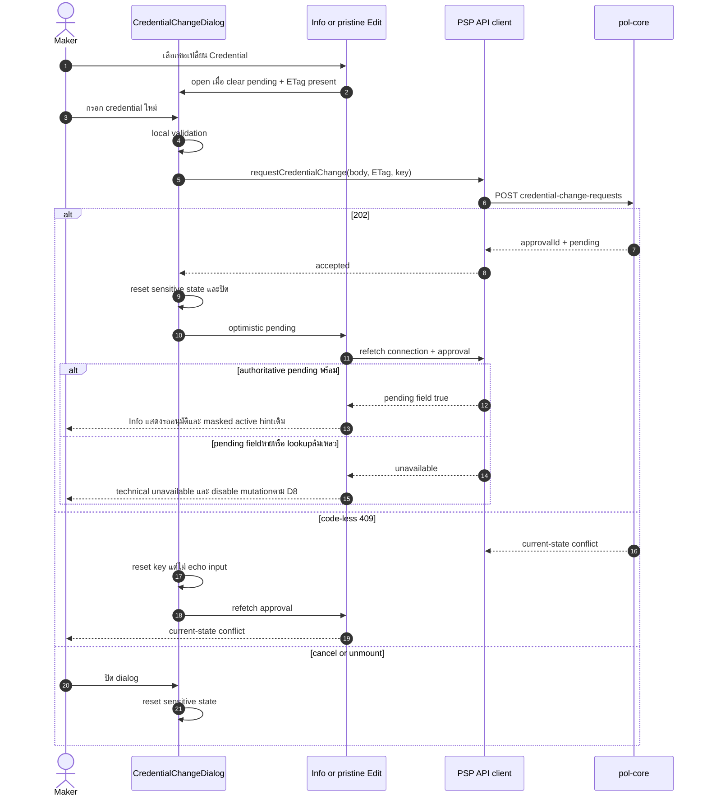

# Design: PSP Connections

> Status: approved 2026-08-19

อ้างอิง: `requirements.md` (REQ-1..14, approvedพร้อม D8 amendment 2026-08-19),
`.ai/shared/ARCHITECTURE.md`, `.ai/shared/CODING_STANDARDS.md`,
`.ai/shared/TESTING_PROTOCOL.md`, `.ai/shared/SECURITY_RULES.md` และ backend contract ใน `pol-core`.

Scopeที่อนุมัติรวม frontend integrationและ backend coordinationขั้นต่ำตาม D8: additive read-model fieldกับ
credential replay ordering fix. ไม่แตะ endpointใหม่, persistence schema, vault, approval engineหรือ PSP adapter.

## Architecture Overview

### หลักออกแบบ

- Backend เป็น source of truth ของ authorization, merchant scope, connection/ETag และ approval state; pending
  safetyต้องมาจาก connection fieldใน D8 ไม่ใช่ eventual approval projectionอย่างเดียว.
- Auth bootstrap gate ต้องผ่านก่อน mount view ที่ยิง PSP API. Client-side permission ใช้ซ่อน/disable UX เท่านั้น.
- Credential เป็น write-only: plaintext อยู่ใน component-local state, ไม่ผ่าน URL, storage, global store, cache หรือ log.
- Mutationบน existing connectionใช้ raw ETagล่าสุด; Createไม่มี ETag. ทุก mutationใช้ idempotency keyต่อ intent.
  ผลลัพธ์ไม่แน่ชัด reuse keyเดิมเมื่อ reconciliationอนุญาต; intentใหม่ใช้ keyใหม่.
- Pending approval เป็น fail-closed state: lookup ล้มเหลวไม่เท่ากับไม่มี pending.
- List ใช้ backend pagination. Merchant และ approval projection เป็นข้อมูล join ฝั่ง clientจาก endpoint จริง.
- ใช้ component/token/dependency เดิม. ลบ PSP mock path และ stat cards ที่สรุปจาก page เดียวผิดความหมาย.

### Layer และ data flow



Dependency direction: route -> feature component -> API/domain helper -> shared fetch/type. `src/lib/*` ห้าม import React.

### Route และ access gate

| Route | Server page | Client view | Permission ก่อน mount view |
|---|---|---|---|
| `/control/psp/list` | `src/app/control/psp/list/page.tsx` | `PspConnectionsView` | `settings.manage` |
| `/control/psp/create` | `src/app/control/psp/create/page.tsx` | `PspCreateView` | `settings.manage` + `merchant.manage` |
| `/control/psp/read?id={uuid}` | `src/app/control/psp/read/page.tsx` | `PspDetailView` | `settings.manage` |
| `/control/psp/edit?id={uuid}` | `src/app/control/psp/edit/page.tsx` | `PspEditView` | `settings.manage` + `merchant.manage` |

ทุก page แยก Server Component สำหรับ metadata/search params. `PspRouteGate` เป็น Client Component อ่าน
`useAuth()` แล้วทำตาม state ต่อไปนี้:

1. `loading` -> แสดง `aria-busy` loading panel; ยังไม่ mount view ลูก.
2. `anon` -> AuthGuardเข้า login flowเดิม; ยังไม่ mount shell/view.
3. `forbidden` -> แสดง/เปิด existing 403 state; ไม่ redirectกลับ login.
4. `error` -> แสดง bootstrap error + reload action; ไม่ตีความเป็น anonymous.
5. `authed` แต่ไม่มี permission ที่ routeต้องใช้ -> แสดง permission state; ยังไม่ mount viewลูก.
6. ผ่าน gate -> mount view; backendยังตรวจ permission/scopeทุก request.

Info/Edit ตรวจ `id` ด้วย pure UUID validator ก่อนสร้าง view. Missing/invalid ID render generic not-found ภายใน gate
และไม่ยิง PSP endpoint. UUID validถูก canonicalizeเป็น lowercaseก่อนใช้ใน API path, approval search,
exact `targetId` comparison และ navigation. `404` จาก backendใช้ข้อความเดียวกัน ไม่แยก nonexistentกับ out-of-scope.

Create/Edit viewเป็นเจ้าของ `EditPageHeader` เพื่อผูก dirty-state callbackกับปุ่มย้อนกลับ. เปลี่ยน headerเป็น
Client Componentและเพิ่ม optional `onBack`; callerเดิมที่ส่งเฉพาะ `backHref` ยัง render Linkและไม่เปลี่ยน behavior.

### Navigation permission

เพิ่ม `requiredPermission?: string` ใน `NavItem`, กำหนด PSP entry เป็น `settings.manage` ในทั้ง
`nav-config.ts` และ `minimals-nav-config.ts`. เพิ่ม pure recursive `filterNavGroups(groups, permissions)` ใน
`nav-config.ts` เพื่อ:

- ตัด item ที่ permission ไม่ครบและตัด parent/group ที่ว่าง.
- ใช้กับ sidebar, mobile drawer, horizontal nav และ `SearchDialog`.
- ระหว่าง auth loading ใช้ permission set ว่าง จึงไม่ flash PSP entry.

`MinimalsLayout` คำนวณ visible groups ครั้งเดียว แล้วส่งชุดเดียวให้ `SidebarNav` และ
`MinimalsHorizontalNav`. `SearchDialog` filter `navConfig` จาก permission ปัจจุบันก่อน flatten; ย้าย
`navItems` จาก module constant เข้า `useMemo`.

### Feature components และ ownership

| ไฟล์ | หน้าที่ |
|---|---|
| `src/components/control/psp/route-gate.tsx` | auth loading/direct-route permission gate |
| `src/components/control/psp/connection-header.tsx` | identity + Enabled/Health/Approval control strip ของ Create/Info/Edit |
| `src/components/control/psp/connections-view.tsx` | filter, backend page state, merchant/approval joins, loading/empty/error/retry |
| `src/components/control/psp/table-columns.tsx` | desktop columns; ไม่มี inline mutation/test/secret |
| `src/components/control/psp/connection-card.tsx` | mobile list card ต่ำกว่า 900 px |
| `src/components/control/psp/detail-view.tsx` | Info resource, ETag, pending state, Test/Edit/credential actions |
| `src/components/control/psp/create-view.tsx` | Create form และ navigation หลัง `201` |
| `src/components/control/psp/edit-view.tsx` | Edit form, disable confirmation, dirty guard, navigation หลัง `200` |
| `src/components/control/psp/credential-change-dialog.tsx` | write-only credential form; reset เมื่อ success/cancel/unmount |
| `src/components/control/psp/form-fields.tsx` | provider method controls และ credential fields ที่ Create/Edit/dialog ใช้ร่วมกัน |
| `src/components/control/psp/resource-hooks.ts` | `useMerchantCatalog` และ `useConnectionResource`; request abort/refetch state |
| `src/components/control/psp/confirm-dialog.tsx` | PSP-local confirmation สำหรับออกจาก dirty form และปิด connection |
| `src/lib/api/control/psp.ts` | endpoint ทั้งหมดของ feature, query serialization, ETag/problem parsing |
| `src/lib/control/psp.ts` | provider rules, validation, allowlist mapper, labels/tones, approval matching, intent transition |
| `src/types/control/psp-connection.ts` | wire/domain/form contracts |
| `../pol-core/src/Modules/Payments/Payments.Application/AdminControlPlane/AdminPaymentsControl.cs` | เพิ่ม `HasPendingCredentialChange` ใน `PspConnectionView` |
| `../pol-core/src/Persistence/Persistence.MerchantRuntime/Payments/AdminPaymentsControlStore.cs` | project synchronous pending fieldและ replay credential operationก่อน stale-version rejection |
| `../pol-core/tests/Hosts.Tests/AdminTask4ContractTests.cs` | read-model contract assertion |
| `../pol-core/tests/Hosts.Tests/AdminPspCredentialChangeTests.cs` | synchronous pending projectionและ committed-retry behavior |

`resource-hooks.ts` มีเฉพาะ logic ที่ใช้ซ้ำจริง: merchant catalog ใช้ 4 หน้า; connection+ETag ใช้ Info/Edit.
List approval pagination และ Info exact approval lookup มี shape ต่างกัน จึงอยู่เป็น API function ไม่สร้าง generic hook.

ไฟล์เดิมที่เลิกใช้:

- ลบ `src/lib/mock/control/psp-connections.ts` และลบ reference จาก `mock-contract.test.ts`.
- ลบ `src/components/control/psp/stat-cards.tsx`; backend ไม่มี aggregate health endpoint และ current-page
  summary ทำให้ผู้ใช้เข้าใจว่าเป็นทั้งระบบ.
- ลบ `maskSecret`; UI render เฉพาะ `maskedSecrets.secretKey` ที่ backend คืน.

### View composition และ visual direction

ภาพรวมเป็น payment operator control room: อ่าน machine state เร็ว, ไม่มี dashboard decoration.

`ConnectionHeader` เป็น signature component: vertical `StatusSpine` ฝั่งซ้าย, identity block กลาง, status cells
สามช่องขอบแยกฝั่งขวา. PSP และ Connection ID ใช้ data typography; merchant ใช้ body typography.
Enabled, Health, Approval มี icon + text + semantic color ทุกช่อง ไม่รวมเป็น badge เดียว.

บน Create, PSP/merchant เป็น placeholderจนผู้ใช้เลือกแล้วเปลี่ยนเป็น labelจริง; status previewคง backend default:
Enabled `เปิดใช้งาน`, Health `Unknown`, Approval `ไม่มีคำขอที่รออนุมัติ`.

| State | Label | Tone |
|---|---|---|
| Enabled `true` / `false` | `เปิดใช้งาน` / `ปิดใช้งาน` | success / muted |
| Health `unknown` / `healthy` / `failed` | `Unknown` / `Healthy` / `Failed` | muted / success / error |
| Approval clear / pending / unavailable | `ไม่มีคำขอที่รออนุมัติ` / `รออนุมัติ` / `ตรวจสถานะอนุมัติไม่ได้` | muted / warning / error |

ใช้ token เดิม (`primary`, `foreground`, `bg-card`, `grey-*`, `success`, `warning`, `error`) และ font เดิม:
Barlow สำหรับ heading, Public Sans/Noto Sans Thai สำหรับข้อความ, IBM Plex Mono ผ่าน `text-data` สำหรับ ID/เวลา.
ไม่เพิ่ม theme, gradient, animation ตกแต่ง หรือ stat-card row. Loading spinner/skeleton ใช้เฉพาะระหว่าง request.

Layout (superseded 2026-08-30 โดย `.claude/specs/psp-ui-parity/`: List ใช้ `DataTable` ทุก viewport, ไม่มี mobile cards/StatusSpine/ConnectionHeader; header/card/action pattern ตาม merchant user/role):

- 375 px: content/form/status cells เรียงหนึ่งคอลัมน์; primary action กว้างเต็ม; List ใช้ cards.
- 768 px: form ใช้ 1-2 คอลัมน์ตามพื้นที่; ไม่มี page-level horizontal overflow; List ยังใช้ cards.
- ตั้งแต่ breakpoint `mmd` 900 px: List ใช้ `DataTable`; `ConnectionHeader` วาง identity + 3 status cellsแนวนอน.
- 1440 px: desktop table แสดง Merchant, PSP, methods, Enabled, Health, last test, Approval และ `ดูข้อมูล`
  โดยไม่ต้อง expand row.

Info ใช้ content grid: overview/config/credential cards ฝั่งหลัก และ action panel ฝั่งรองบน desktop; mobile เรียง
action หลัง status header. Create/Edit ใช้ header + form card เดียว ไม่ทำ multi-step wizard เพราะ field น้อย.

Info credential card render `maskedSecrets.secretKey ?? "—"` เป็น textอย่างเดียวและไม่มี reveal. สำหรับ 2C2P
แสดงข้อความว่า provider merchant ID อ่านกลับไม่ได้. ไม่ render/infer environment, Omise `publicKey`,
`webhookSecret` หรือ raw JSON. Last test map `authenticated` -> `สำเร็จ`, `probe_failed` -> `ล้มเหลว`,
`null` -> `ยังไม่เคยทดสอบ`, ค่าอื่น -> `ไม่ทราบผล`; ไม่แสดง wire value.

List toolbarใช้ label `ค้นหา Connection ID` และ filter Merchant/PSP/Health. Empty stateแสดง
`เพิ่มการเชื่อมต่อ` เมื่อมี `merchant.manage`; ถ้า merchant catalogไม่พร้อม ปุ่มยังมองเห็นแต่ disabledพร้อมเหตุผล.
Rows/cardsมีเฉพาะ `ดูข้อมูล`; ไม่มี inline edit, test, secret หรือ destructive action.

### Page state และ joins

**Merchant catalog**

`useMerchantCatalog(enabled)` เรียก `GET /api/v1/merchants?page=N&limit=100` ต่อจนสะสมครบ `total`.
แต่ละรอบเริ่มใหม่ทั้งหมดและ replace map เมื่อครบ เพื่อไม่ผสม snapshot คนละเวลา.

- สำเร็จครบ: ใช้ `Map<merchantId, name>` เป็น label/filter/options.
- ไม่มี `merchant.view`: state `forbidden`; label fallback เป็น `merchantId`; Create/filter disabled พร้อมเหตุผล.
- หน้าถัดไปล้มเหลว: คง label ที่โหลดได้เฉพาะการอ่าน, state `partial`; Create/filter disabled และมี Retry.
- หน้าแรก/ทั้งหมดล้มเหลว: fallback ID; List/Info ยังอ่านได้.
- ถ้า page metadataไม่สอดคล้องหรือ itemsว่างก่อนครบ `total`, จัดเป็น incompleteเหมือน partial; ห้าม loopไม่สิ้นสุด.

**Approval projection**

- List: โหลด `action=psp.credential.change&status=pending&limit=100` ทุกหน้าจนครบ `total`, สร้าง
  `Set<targetId>` แล้ว join rows. Error เป็น `unavailable` ทุก row พร้อม Retry; ห้าม map เป็น clear.
- Info/Edit: ส่ง `search={connectionId}`, action/status เดิม แล้วรับ pending เฉพาะ item ที่
  `targetId === connectionId` แบบ exact.
- `202` บน Info ตั้ง optimistic pending ทันที แล้ว refetch connection + approval.
- `202` บน pristine Edit ไป Info ด้วย non-sensitive query marker `notice=credential-requested`; Info ใช้ marker
  เป็น optimistic pending และ `router.replace` ลบ markerเมื่อ approvals endpoint ยืนยัน pending. Marker ไม่มี
  credential/idempotency key และไม่ถูกใช้เป็น authorization state.
- Safety gateสุดท้ายใช้ approved `hasPendingCredentialChange` จาก connection snapshotร่วมกับ approval lookup:
  ค่า `true` หรือ approval exact match -> pending; ค่า `false` + lookupสำเร็จและไม่ match -> clear.
- Fieldหายหรือ lookupล้มเหลว -> unavailableและ fail closed. Positiveจาก sourceใด sourceหนึ่งชนะเป็น pending;
  ห้าม infer clearจาก approvalsว่าง
  เพียงอย่างเดียว เพราะ outbox projectionอาจยังไม่มาถึง.
- ระหว่าง rolloutที่ backendยังไม่คืน fieldนี้ Info/Edit renderได้ แต่ Edit/Test/credential action
  ต้อง disabled; optimistic markerช่วย current flowแต่ไม่ใช่ authorization/safety proofข้าม reload/tab/operator.
- All-page loopsทำ sequential requestsจำนวน `ceil(total / 100)` โดยไม่ตั้ง capที่ทำ false clear. ถ้า `total`
  เปลี่ยนระหว่าง loop, pageซ้ำ/ว่าง หรือ metadataไม่สอดคล้อง ให้ stateเป็น incomplete/unavailable. Userยอมรับ
  operational riskนี้สำหรับ MVP; เพิ่ม capได้เมื่อ amend requirementพร้อม budgetหรือมี backend bulk/exact-state contract.

**Request race**

ทุก GET effect ใช้ `AbortController` และ request generation guard. เมื่อ List search/filter/page เปลี่ยน:

1. reset visible rows เป็น loading ไม่แสดง page เก่าเป็นผลใหม่;
2. abort request ก่อนหน้า;
3. commit เฉพาะ generation ล่าสุด.

Search/filter reset backend page เป็น 1. Page control ของ `DataTable` ใช้ controlled zero-based `pageIndex`
แล้วแปลงเป็น backend one-based `page`.

### Form และ mutation state

ใช้ controlled React state; ไม่เพิ่ม form library.

- Create: merchant, provider, methods, `pspMerchantId`, `secretKey` อยู่ใน `PspCreateView`.
- Edit: baseline connection + methods + `isEnabled`; config/merchant/PSP read-only.
- Credential dialog: `pspMerchantId` และ `secretKey` อยู่ภายใน dialog componentเท่านั้น.
- เปลี่ยน providerใน Create reset methods และ credential fieldทั้งหมดก่อนเลือก defaults ใหม่; Omise มี `card`
  เท่านั้น, 2C2P ให้ผู้ใช้เลือก `card`, `promptpay`, `installment` อย่างน้อยหนึ่งค่า.
- Credential input ใช้ `type="password"`, `autocomplete="new-password"`, `spellCheck={false}` และไม่ block paste.

ขยาย `TextField` เฉพาะ props native ที่ขาด (`autoComplete`, `spellCheck`) และขยาย `SelectField` เฉพาะ
`disabled`, `required`, `error`, `helperText`, `aria-describedby`. ไม่สร้าง field system ใหม่.

Dirty guardตาม convention เดิมของ repo: ดัก page-owned back/cancel controls, เปิด confirm dialog และไม่เพิ่ม
`beforeunload`/global router blocker. เพิ่ม optional `onBack` ให้ `EditPageHeader`; เมื่อมี callback render button
แทน Link. Edit dirty เทียบ normalized methods + Enabled กับ baseline; Create dirtyเมื่อ fieldใดต่างจาก initial state.

Disable confirmation เปิดเฉพาะ transition `true -> false`; ข้อความระบุว่า connection จะหยุดรับชำระ.

Action gateใช้เงื่อนไขตรง ไม่สร้าง capability policyเพิ่ม:

| Action | เงื่อนไขเปิดใช้ |
|---|---|
| Create | `settings.manage` + `merchant.manage` + `merchant.view` + merchant catalogครบ |
| Edit | `settings.manage` + `merchant.manage` + ETag + authoritative pending fieldเป็น false + approval clear |
| Credential change | `settings.manage` + ETag + authoritative pending fieldเป็น false + approval clear + Info หรือ pristine Edit |
| Test | `settings.manage` + `capabilities.test === true` + ETag + authoritative pending fieldเป็น false + approval clear |

Capability keyหายมีผลเฉพาะ Test. Create/Edit/credentialไม่อ่าน capability key. Pendingหรือ approval unavailable
disable Edit/Test/credentialพร้อมเหตุผลและ Retryตาม state.

Permissionไม่ครบทำให้ actionถูกซ่อนตาม REQ-2; permissionครบแต่ resource/catalog/ETagยังไม่พร้อมทำให้ action
ยังมองเห็นแบบ disabledพร้อมเหตุผล. Backend `403` หลังผ่าน client gateยังแสดง permission errorและไม่ retryข้าม gate.

### ETag และ idempotency state machine

API clientอ่าน `response.headers.get("ETag")` แล้วเก็บ raw stringพร้อม resource. Mutationบน existing connection
ส่ง raw stringเดิมใน `If-Match`; Createไม่ส่ง headerนี้. ห้าม parse/rebuildจาก `version`. ETagเปลี่ยนเฉพาะจาก
successful response/refetch.

Idempotency key ใช้ `crypto.randomUUID()` และ component-local `useRef`; ไม่ persistent. Pure transition:

```text
idle + submit             -> key ใหม่, in-flight
uncertain/network/5xx     -> เก็บ key เดิม; retryหลัง operation-specific reconciliation
operation_in_progress     -> เก็บ keyเดิม, หยุดยิงซ้ำชั่วคราว
payload changed           -> ทิ้ง key; submitถัดไปเป็น intentใหม่
terminal response         -> ทิ้ง key
idempotency_key_reused    -> ทิ้ง keyและบังคับเริ่ม intentใหม่
resource/ETag changed     -> ปกติจบ intent; uncertain credentialเข้า quarantined/unknownตาม D8
```

Sensitive payloadไม่ถูก hash/เก็บเป็น fingerprint. Change handler ของ field reset key; retryหลัง outcomeไม่แน่ชัด
reuse keyได้ตราบ form/ETagไม่เปลี่ยนและ reconciliationอนุญาต. Quarantined credential keyไม่ถูกส่งอีกและ UIไม่
เปิด intentใหม่จน pending/unknown outcomeถูก resolve. Submitทุกชนิด disabledระหว่าง in-flight.

## Sequence Diagrams

### เปิด List ผ่าน permission gate



### เปิด Info และทดสอบ active credential



### Create และ idempotent retry



### Edit พร้อม stale-version protection



### Credential change และ maker-checker



## Data Models & Interfaces

### Domain contracts

```ts
export type PspProvider = "2c2p" | "omise";
export type PspMethod = "card" | "promptpay" | "installment";
export type PspHealth = "unknown" | "healthy" | "failed";

export type JsonObject = Record<string, unknown>;

export interface PspConfigView {
  accountId?: string;
  card?: boolean;
  installment?: boolean;
  enabledSources?: string[];
  returnUrls?: string[];
}

export interface PspConnection {
  pspConnectionId: string;
  merchantId: string;
  psp: PspProvider;
  enabledMethods: PspMethod[];
  config: JsonObject | null;
  maskedSecrets: Record<string, string>;
  isEnabled: boolean;
  health: PspHealth;
  lastTestedAt: string | null;
  lastTestResult: string | null;
  capabilities: Record<string, boolean>;
  /** Approved D8 contract; optionalเฉพาะ wire rolloutเพื่อ detect absenceและ fail closed. */
  hasPendingCredentialChange?: boolean;
  createdAt: string;
  version: number;
}

export interface PagedResult<T> {
  items: T[];
  page: number;
  limit: number;
  total: number;
}

export interface ConnectionResource {
  connection: PspConnection;
  etag: string | null;
}
```

Wire mapperเก็บ immutable raw `config` สำหรับ Edit round-tripเท่านั้น. Rendererเรียก `toPspConfigView(raw)`
ซึ่งอ่านเฉพาะ allowlisted fieldที่ชนิดถูกต้องและไม่คืน keyอื่น. ดังนั้น UIไม่ render unknown field แต่ Updateยังส่ง
snapshotเดิมกลับโดยไม่เปลี่ยน. `lastTestResult` คง `string | null` เพื่อรองรับ unknown wire valueด้วย label
`ไม่ทราบผล` แทนการ castแล้วรั่วค่า.

`hasPendingCredentialChange` เป็น required backend response contractตาม D8. Typeฝั่ง wireคง optionalเพื่อรองรับ
deployment orderและตรวจ missingแบบ fail closedเท่านั้น; UIเปิด mutationได้เฉพาะค่า `false` แบบ explicit.

### Mutation inputs

```ts
export interface CreatePspConnectionInput {
  merchantId: string;
  psp: PspProvider;
  enabledMethods: PspMethod[];
  config: null;
  secrets: { secretKey: string };
  pspMerchantId: string | null;
}

export interface UpdatePspConnectionInput {
  merchantId: string;
  enabledMethods: PspMethod[];
  config: JsonObject | null;
  isEnabled: boolean;
}

export interface CredentialChangeInput {
  merchantId: string;
  secrets: { secretKey: string };
  pspMerchantId: string | null;
}

export interface TestPspConnectionInput {
  merchantId: string;
}

export interface CredentialChangeAccepted {
  approvalId: string;
  candidateVersionId: string;
  status: string;
  replayed: boolean;
}
```

2C2P บังคับ `pspMerchantId` + `secrets.secretKey`; Omise ส่ง `pspMerchantId: null` และ
`secrets.secretKey`. Update typeไม่มี credential field จึงส่ง credentialผ่าน endpointนี้ไม่ได้ด้วย TypeScript.

### Joined read state

```ts
export type ApprovalState = "loading" | "clear" | "pending" | "unavailable";
export type MerchantCatalogStatus =
  | "loading"
  | "ready"
  | "partial"
  | "forbidden"
  | "error";

export interface MerchantOption {
  id: string;
  name: string;
  code: string;
}

export interface ApprovalListItem {
  approvalId: string;
  merchantId: string | null;
  action: string;
  targetId: string;
  status: string;
}
```

Merchant wire itemรับ fieldเพิ่มจาก backendได้ แต่ featureเก็บเฉพาะ `id`, `name`, `code`. Approval mapperเก็บ
เฉพาะ fieldที่ใช้ exact pending join. ไม่มี credentialใน joined state.

### Auth bootstrap

แก้ `AdminMe` ให้ตรง backend:

```ts
export interface AccessibleMerchants {
  isUnrestricted: boolean;
  merchants?: { id: string; code: string | null }[];
}

export interface AdminMe {
  adminId: string;
  email: string;
  tier: "Super" | "Scoped";
  accessibleMerchants: AccessibleMerchants;
  permissions: string[];
}
```

อัปเดต dev `MOCK_ME` ให้ใช้ `accessibleMerchants` และ permissionจริงที่จำเป็น. ไม่ derive permissionจาก tier.

แก้ bootstrap resultให้แยกสถานะ ไม่ให้ `AuthProvider.catch()` mapทุก errorเป็น `anon`:

```ts
export type AuthStatus =
  | "loading"
  | "authed"
  | "anon"
  | "forbidden"
  | "error";
```

`getMe` map `401 -> anon`, `403 -> forbidden`, `200 -> authed`; network/other status -> error. `AuthGuard`
redirect loginเฉพาะ anon, ใช้ existing 403 stateสำหรับ forbidden และแสดง reload actionสำหรับ error. ทั้งสาม
non-authed statesไม่ render protected children จึงไม่มี PSP/merchant/approval request.

### API surface

`src/lib/api/control/psp.ts` export function ต่อ operation ไม่สร้าง service class/interface:

```ts
listPspConnections(query, signal): Promise<PagedResult<PspConnection>>
getPspConnection(id, signal): Promise<ConnectionResource>
createPspConnection(input, idempotencyKey): Promise<ConnectionResource>
updatePspConnection(id, input, etag, idempotencyKey): Promise<ConnectionResource>
testPspConnection(id, input, etag, idempotencyKey): Promise<ConnectionResource>
requestCredentialChange(id, input, etag, idempotencyKey): Promise<CredentialChangeAccepted>
listMerchantPage(page, limit, signal): Promise<PagedResult<MerchantOption>>
listApprovalPage(query, signal): Promise<PagedResult<ApprovalListItem>>
```

ทุก path ใช้ `/api/v1/...` เพื่อเข้า Next rewriteเดิม. JSON mutationผ่าน `adminFetch`, set
`Content-Type: application/json`, session cookie, CSRF, raw ETagและ idempotency keyตาม operation.
Functionรับ ETag/keyจาก callerแล้ว set headerตรงๆ; GETไม่ส่ง mutation header.

API error parserอ่านเฉพาะ HTTP statusและ `extensions.code`/top-level `code` ที่เป็น string. ไม่ส่งต่อ
`detail`, request body หรือ response bodyดิบไป UI/log.

## Technology Decisions

### D1: Client view ใต้ Server route

App Router pageคงเป็น Server Componentสำหรับ metadata/UUID parsing; interactive viewเป็น Client Componentเพราะ
ต้องอ่าน auth context, form state, browser CSRF cookie และ refetch. Client boundaryหยุดที่ feature view ไม่เปลี่ยน
layoutหรือ shared pageทั้งหมดเป็น client.

### D2: API clientเดียวต่อ feature

ใช้ `src/lib/api/control/psp.ts` รวม connections, merchant catalog และ approval queryที่ featureต้อง join.
ไม่สร้าง repository class, query framework หรือ cache layer. `adminFetch` ครอบ cookie/CSRF/401 อยู่แล้ว.

### D3: Existing DataTable + responsive cards

Desktop reuse `DataTable` + `useDataTable` ด้วย `manualPagination: true`, controlled pagination และปิด sorting
เพราะ endpointไม่มี sort contract. Mobile render cardsจาก rowsชุดเดียวผ่าน CSS breakpoint; ไม่ใช้ JS viewport
listenerและไม่ duplicate fetching.

### D4: Local state ไม่มี state/form dependency

React `useState`, `useRef`, `useEffect`, `AbortController` และ `crypto.randomUUID()` ครบ use case.
ไม่เพิ่ม React Query, Zustand, form library, UUID package หรือ test dependency.

### D5: Existing Base UI primitives

Credential/confirm dialogใช้ `components/ui/dialog` ซึ่ง wrap `@base-ui/react`; ได้ initial focus, containment,
Escapeและ focus return. Methodใช้ `Checkbox`, Enabledใช้ `Switch`, merchant/providerใช้ `SelectField`, secretใช้
`TextField`. ไม่ reuse `OrgUnitConfirmDialog` ข้าม domain; PSP-local wrapperเล็กกว่าการ refactorหลาย module.

### D6: Config read-only

Createส่ง `config: null`. Edit render typed allowlist viewแต่ round-trip immutable raw objectเดิมโดยไม่เปิด editor.
ไม่เพิ่ม config formที่ runtimeยังไม่ใช้. Provider merchant IDไม่อยู่ใน responseจึงแสดงคำอธิบายแทนการ infer.
ถ้า legacy/future raw configมี unknown field, UIยังไม่ renderและไม่ทิ้ง fieldเงียบ; PUTอาจได้
`invalid_psp_config` จาก backendปัจจุบันและแสดง safe form error. การลบ unknown fieldเพื่อให้บันทึกผ่านจะขัด REQ-8.5.

### D7: Permission-aware navแบบ generic fieldเดียว

เพิ่ม optional `requiredPermission` ใน modelเดิมและ recursive filterหนึ่งตัว. ไม่สร้าง PSP-specific nav config,
permission registry หรือ policy engineฝั่ง client.

### D8: Contract และ requirement amendments — APPROVED 2026-08-19

Userอนุมัติ backend coordinationขั้นต่ำสองจุด, requirement applicability amendment และ operational risk
ของ sequential all-page scan:

| Gap | หลักฐาน backend | ผลต่อ REQ | มติที่อนุมัติ |
|---|---|---|---|
| Pending stateผ่าน outbox | `Connection` มี `PendingApprovalId` synchronous แต่ `PspConnectionView`ไม่ project fieldนี้ | Reload/tab/operatorใหม่อาจเห็น approvalsว่างระหว่าง lagแล้วเปิด Edit/Test/credential | เพิ่ม `HasPendingCredentialChange` ใน `PspConnectionView` จาก `PendingApprovalId is not null`; FE fail closedเมื่อ fieldหาย |
| Credential replayตรวจ versionก่อน operation record | `RequestCredentialChangeAsync` เรียก `EnsureVersion` ก่อน `FindOperationAsync` | `202` commitแต่ responseหายแล้ว retry key/ETagเดิมได้ `state_conflict` แทน replay | หลัง access/resource/intent validation ให้ lookup matching operation recordก่อน stale-version rejection |
| REQ-3.16ผูก Createกับ ETag/pending | Createยังไม่มี connection/ETag/pending target | Acceptanceตามตัวอักษรทำไม่ได้ แม้เพิ่ม pending field | REQ-3.16ให้ Createใช้ permissions/catalog; REQ-3.22ให้ Edit/credentialใช้ permission + ETag + pending |

Implementation scopeเพิ่มเฉพาะ additive boolean + ordering fixพร้อม contract tests. ไม่เพิ่ม endpoint,
persistence schemaหรือเปิดเผย approval ID/secret. ระหว่าง backend rollout:

- List/Info/Createอ่านและสร้างได้ตาม contractเดิม.
- Edit/Test/credential-changeต้อง fail closedเพราะไม่มี authoritative pending state.
- Credential unknown outcomeต้องแสดง `ตรวจผลลัพธ์ไม่ได้` และห้ามสร้าง keyใหม่/ส่งซ้ำอัตโนมัติ.

Operational riskอีกจุด: REQ-2.7/4.15 บังคับ all-page scanแต่ไม่กำหนด maximum total/request/latency budget.
Designจึงไม่มี capโดยตั้งใจเพื่อไม่สร้าง false clear; requestถูก abortได้และ inconsistency fail closed แต่ totalสูงมาก
ยังสร้าง requestจำนวนมาก. Userยอมรับ riskนี้สำหรับ MVP. ทางลด riskภายหลังต้องกำหนด budgetแล้ว amend REQ
ให้เกิน budgetเป็น partial/unavailable หรือเพิ่ม backend bulk/exact-state contract; frontendไม่ตั้ง thresholdเอง.

หลัง ordering fix, credential retryด้วย payload + ETag + keyเดิม replayผลเดิม. ก่อน fix, frontendใช้ขั้นตอนปลอดภัย:

1. network outcomeไม่แน่ชัด -> เก็บ key/inputsและ refetch connectionก่อน.
2. ETagเดิม + authoritative pending false -> retry key/ETagเดิมได้.
3. ETagเปลี่ยนหรือ pending true -> ห้าม retry; แสดง reconciled pendingหรือ unknown outcome.
4. ห้ามนำ keyเดิมจับคู่ ETagใหม่ เพราะ intent hashเปลี่ยนและ backendจะคืน `idempotency_key_reused`.

### Self-critique และความเสี่ยงที่แก้แล้ว

| ความเสี่ยง | การแก้ใน design |
|---|---|
| Unauthorized direct routeยิง requestก่อน authพร้อม | Gateไม่ mount viewลูกจน bootstrapและpermissionผ่าน |
| Approval false-negativeจาก pagination/error | โหลดทุก page; exact target match; errorเป็น unavailableและ fail closed |
| Approval projectionช้าหลัง `202` หรือข้าม client | D8 authoritative field contract; optimistic markerเป็น UXเสริมเท่านั้น |
| `202` และ `502` ไม่มี ETag | refetch Infoก่อนเปิด mutationถัดไป |
| Merchant pageกลางล้มเหลวทำ selectorไม่ครบ | partial state, ID fallback, disable Create/filter, retryทั้ง catalog |
| Searchเร็วทำ responseเก่าทับใหม่ | AbortController + generation guard + clear rowsตอน loading |
| Client maskทำ plaintextเข้าถึง DOM | ลบ `maskSecret`; render backend hintเท่านั้น |
| Mutation retryไม่แน่ชัด | key state machine + D8 operation-specific reconciliation; ไม่สร้าง keyใหม่อัตโนมัติ |
| `capabilities` keyที่ไม่เกี่ยวข้องหายแล้วปิด actionอื่น | อ่านเฉพาะ `capabilities.test` สำหรับ Test; Edit/Create/credentialไม่พึ่ง capability |
| Generic shared refactorขยาย scope | เพิ่มเฉพาะ optional native propsให้ field/header; PSP helperคง local |
| Dirty guard coverage | ดัก page-owned back/cancelตาม conventionเดิม; browser/sidebar exitอยู่นอก boundaryที่ REQ-1.11อ้าง |
| Summary healthจาก pageเดียวทำให้เข้าใจผิด | ลบ stat cards; แสดงสถานะต่อ connectionเท่านั้น |

Fresh-context `spec-architect` critiqueถูกเรียกเพราะ validation/idempotencyเป็น pure security logic. Disposition:

| Finding | ผล |
|---|---|
| C1 approval projection safety | RESOLVED; approved synchronous field + fail-closed rollout |
| C2 credential idempotent replay | RESOLVED; approved replay ordering + safe reconciliationระหว่าง rollout |
| C3 UUID canonicalization | APPLIED; lowercase canonical ID + uppercase test |
| C4 config preservation | APPLIED; raw immutable round-tripแยกจาก allowlisted view |
| C5 auth bootstrap failure | APPLIED; five-state auth model |
| C6 unsaved guard exit vectors | REBUTTEDตาม explicit repo convention; boundaryบันทึกและทดสอบ page controls |
| C7 testsไม่ใช่ integration | APPLIED; relative-URL adapter -> real loopback HTTP + deterministic browser server |
| C8 all-page operational ceiling | ACCEPTED for MVP; ไม่มี capจน ownerกำหนด budget/amend REQ |
| C9 missing JSON Content-Type | APPLIED; headerและ assertionบังคับทุก JSON mutation |
| R1 REQ-3.16ผูก Createกับ ETag/pending | APPLIED; requirementsแยก Createใน 3.16 และ Edit/credentialใน 3.22 |

## Error Handling Strategy

UIใช้ operation-aware safe message. ไม่ render Problem Details `detail`, wire valueไม่รู้จัก, identifierภายใน หรือ
sensitive input.

| Status/code | UI behavior | Retry/idempotency |
|---|---|---|
| `400 validation_failed` / `invalid_psp_config` | map field/formตาม operation; fallbackข้อความตรวจข้อมูล | terminal; แก้ inputแล้ว keyใหม่ |
| `400` ไม่มี/ไม่รู้จัก code | safe generic form error | terminal; submitใหม่เป็น intentใหม่ |
| `401` | ปล่อย `adminFetch` เข้า session-expired flowเดิม | ไม่ยิงซ้ำใน view |
| `403` | permission stateที่เห็นชัด; ไม่ bypass UI gate | terminal |
| `404` | generic not-found ไม่บอก scope | terminal |
| `409 state_conflict` | ห้าม overwrite; actionโหลด resource+ETagล่าสุด | Edit/Testจบ intent; credential uncertainใช้ D8 reconciliationและห้ามจับ keyเดิมกับ ETagใหม่ |
| `409 idempotency_key_reused` | หยุด retryด้วย keyนั้น; แจ้งเริ่ม intentใหม่ | clear key |
| `409 operation_in_progress` | แจ้ง requestเดิมกำลังทำงาน; disable immediate repeat | retain keyสำหรับ status/retryภายหลัง |
| Create code-less `409` | แจ้ง merchantมี PSP connectionนี้แล้ว | terminal |
| Credential code-less `409` | reset sensitive stateเมื่อปิด, refetch approval, แสดง current-state conflict | terminal |
| Test `502 psp_test_failed` | แจ้ง active credential testล้มเหลว; refetch persisted state+ETag | keyจบหลัง refetch |
| Network/unknown `5xx` | safe generic error; Retryเฉพาะ operationที่ idempotentด้วย key | retain keyถ้า outcomeไม่แน่ชัด |
| Missing ETag | แสดง technical unavailable + reload action; disable mutation | ไม่สร้าง ETagเอง |
| Missing authoritative pending field | แสดง technical unavailable; disable Edit/Test/credential | fail closedระหว่าง D8 rollout |
| Approval unavailable | labelเฉพาะ + Retry; disable Edit/Test/credential | fail closed |
| Merchant catalog partial/unavailable | fallback ID; disable Create/filter + Retry | List/Infoยังอ่านได้ |

Validationก่อน request:

- Merchant/providerต้องเลือกครบ; methodsอย่างน้อยหนึ่งและอยู่ใน provider allowlist.
- 2C2P: `pspMerchantId.trim()` และ `secretKey` ต้องไม่ว่าง.
- Omise: `secretKey` ต้องไม่ว่าง; account fieldไม่ renderและ payloadเป็น `null`.
- Editไม่อนุญาต unsupported method; configไม่ editable; Update bodyใช้ immutable raw snapshotเดิมเท่านั้น.
- Errorบอกชื่อ field/ข้อกำหนด ไม่ includeค่าที่กรอก.

Accessibility state:

- loading containerใช้ `aria-busy="true"` และ status text.
- form errorผูก `aria-invalid` + `aria-describedby`; form summaryใช้ `role="alert"` เมื่อจำเป็น.
- request success/error noticeใช้ `aria-live="polite"`; blocking errorใช้ `role="alert"`.
- disabled actionมีข้อความเหตุผลที่อยู่ใน DOM; ไม่พึ่ง tooltipอย่างเดียว.
- dialogปิดไม่ได้ระหว่าง submit; cancelหลัง requestจบ reset sensitive state.

## Testing Strategy

ไม่เพิ่ม `jsdom`, Testing Library หรือ Playwright. ใช้ Vitest node tests, loopback HTTP integration และ
deterministic browser contract serverตาม protocolเดิม.

### Unit tests

ปรับ `src/lib/control/psp.test.ts` ให้ครอบ:

- provider labels, supported method allowlist และ provider-switch reset.
- Create/Edit/credential validation รวม methodsว่างและ credentialบังคับ.
- Enabled/Health/Approval/last-test labelsและ tones รวม unknown fallback.
- config allowlist view mapper: รับ fieldถูกชนิด, ไม่ render keyอื่น และ raw snapshotยัง round-tripเท่าเดิม.
- exact pending approval match; clear/pending/unavailable แยกกัน.
- safe Problem Details mappingทุก known codeและ unknown fallback.
- UUID validator + canonical lowercase; uppercase routeต้อง match lowercase approval target.
- idempotency transition: new, uncertain reuse, payload/resource change, terminal, key-reused.
- ยืนยันไม่มี client plaintext masking helper.

เพิ่ม/ปรับ nav pure testให้ยืนยัน `requiredPermission` filterตัด PSP entryและตัด parent/groupว่างโดยไม่แก้ input.

### API integration tests

เพิ่ม `src/lib/api/control/psp.integration.test.ts`. Suiteเปิด `node:http` serverบน random loopback portแล้วให้
test-only `globalThis.fetch` adapterแปลง string pathด้วย `new URL(path, loopbackOrigin)` แล้ว delegateไป
captured native `fetch`. Shim `document.cookie`/`window.location` เพิ่มเฉพาะ bindingที่ `adminFetch`ต้องใช้.
Adapterไม่ fabricate response; requestวิ่งผ่าน real loopback HTTP จึงตรวจ HTTP boundaryได้โดยไม่เพิ่ม dependency.

Fixture matrixมี `200/201/202`, `400`, `401`, `403`, `404`, known/code-less `409`, `502`, missing ETag,
delayed approval projection และ D8 pending-field present/absent. ตรวจ:

- List path/query serialize `page`, `limit`, `search`, `merchantId`, `psp`, `health`; omitค่าว่าง.
- Merchant/approval pagination pathและ `limit=100`.
- Infoรับ raw quoted ETagโดยไม่แปลง.
- Create bodyมี `config:null`, `secrets.secretKey`, top-level `pspMerchantId`; header JSON + CSRF + Idempotency-Key.
- Update bodyไม่มี `secrets`/`pspMerchantId`, configเท่ากับ raw snapshot; header JSON + If-Match raw + key + CSRF.
- Test bodyมีเฉพาะ `merchantId`; header JSONครบ; `200`เก็บ ETag.
- Credential bodyวาง secretใต้ `secrets`เท่านั้น; header JSONครบ; `202` parse accepted responseแต่ไม่สร้าง ETag.
- status categorization `401`, `403`, `404`, `409` ทุก known/code-less context และ `502`.
- Error parserไม่ expose `detail` และไม่ log request body.

อัปเดต `auth.test.ts`/auth fixtureให้ตรวจ `permissions` และ `accessibleMerchants` contract.
เพิ่ม auth cases `401 -> anon`, `403 -> forbidden`, network/`5xx -> error`; เฉพาะ anon redirect login.
ลบ PSP mock assertionsจาก `mock-contract.test.ts`; security assertionย้ายไป API body testsซึ่งตรวจ pathจริง.

### Backend contract และ behavior tests

ปรับ `../pol-core/tests/Hosts.Tests/AdminTask4ContractTests.cs` และเพิ่ม
`../pol-core/tests/Hosts.Tests/AdminPspCredentialChangeTests.cs` ให้ตรวจ:

- `PspConnectionView` มี `HasPendingCredentialChange` และ List/Info serializeเป็น camelCase.
- projectionคืน `false` เมื่อ `PendingApprovalId` เป็น `null` และ `true` เมื่อมี pending approval.
- credential requestที่ commitแล้วแต่ responseสูญหาย replay `202` เดิมเมื่อ actor, merchant, payload,
  expected version และ `Idempotency-Key` ตรงกัน แม้ resource versionเปลี่ยนจาก commitนั้น.
- access/resource/intent validationยังเกิดก่อน replay; keyเดิมกับ payloadต่างกันยังคืน `idempotency_key_reused`.

### Browser verification

เพิ่ม `scripts/psp-contract-server.mjs` ด้วย Node stdlibสำหรับ browser verificationเท่านั้น. Serverคืน auth bootstrap,
CSRF cookie, PSP/merchant/approval fixturesและ mutation outcomesแบบ deterministic; production bundleไม่ importไฟล์นี้.
รัน contract serverใน terminal A:

```bash
PSP_CONTRACT_SCENARIO=happy node scripts/psp-contract-server.mjs
```

รัน SPAใน terminal B:

```bash
ADMIN_API_ORIGIN=http://127.0.0.1:5100 npm run dev
```

เปลี่ยน scenarioเป็น `forbidden`, `catalog-partial`, `approval-lag`, `missing-etag`, `conflict`, `test-failed`
เพื่อครอบ failure matrix. ใช้ backendจริงเพิ่มเมื่อ local session/credentialพร้อมและรายงาน live coverageแยกจาก
deterministic evidence. Production codeไม่มี mock fallback. ตรวจ List, Info, Create, Edit, credential dialog:

- permission gate: loading/no `settings.manage` ไม่ส่ง PSP request; manage/view combinationsซ่อนหรือ disableถูกต้อง.
- loading, empty, API error, retry, not-found, merchant partial, approval unavailable, missing ETag, pending.
- search/filter reset page; backend pagination; mobile card/desktop tableมีข้อมูลและ actionครบ.
- Create provider switch, local validation, duplicate `409`, in-flight guard, success navigation.
- Edit dirty guard, disable confirmation, stale conflict, success navigation, Updateไม่มี credential.
- credential cancel/success/unmountล้าง inputs; `202` pendingทันที; Edit dirty disable action.
- D8: pending field absentต้อง fail closed; approval lagข้าม reloadไม่เปิด mutation; uncertain credentialไม่ auto-retry.
- Test capability false/missing, success `200`, failure `502` + refetch.
- keyboard order, visible focus, dialog focus trap/return, screen-reader labels/live states.
- viewport 375, 768, 1440 px: ไม่มี page-level overflowและ primary actionไม่ถูกบัง.
- consoleไม่มี error/hydration error.
- DevToolsตรวจ URL, `localStorage`, `sessionStorage`, application logไม่มี `secretKey`/`pspMerchantId`.

### Gate

หลัง implementรัน:

```bash
npm run typecheck
npm run lint
npm test
npm run build
npm exec vitest -- run src/lib/api/control/psp.integration.test.ts
dotnet test ../pol-core/tests/Hosts.Tests/Hosts.Tests.csproj
```

ทุกคำสั่งต้อง exit 0, ไม่มี `.only`/`.skip`, coverageไม่ลด และบันทึก browser evidenceสาม viewportใน handoff.

## Requirement Traceability

| Requirements | Design element / verification |
|---|---|
| REQ-1.1-1.5 | Route table + Server page/Client viewแยกสี่หน้า |
| REQ-1.6-1.10 | List/Create/Info/Edit navigationใน viewและ sequence diagrams |
| REQ-1.11 | page-owned dirty guard + PSP confirm dialog + optional header callback |
| REQ-1.12 | permission-aware `nav-config` และ `minimals-nav-config`, sidebar/horizontal/search |
| REQ-1.13 | UUID validator/canonicalizerก่อน mount resource view + generic not-found |
| REQ-2.1-2.6 | `AdminMe.permissions`, `PspRouteGate`, action gates, backend source of truth |
| REQ-2.7-2.13 | paged merchant catalog, ID fallback, partial/forbidden state, disable + Retry |
| REQ-2.14-2.16 | auth loading/direct route gateไม่ mount API view; Create/Editใช้ manage gate |
| REQ-3.1-3.4 | provider/method types + rules; `capabilities.test`ใช้กับ Testเท่านั้น |
| REQ-3.5-3.10 | status model/header/list cells; provider labels; backend masked hintเท่านั้น |
| REQ-3.11-3.16 | typed config allowlist, no environment/public/webhook fields และ Create permission/catalog gate |
| REQ-3.17-3.22 | last-test mapping, approval unavailable state และ Edit/credential authoritative gates |
| REQ-4.1-4.3 | list API/query + manual backend pagination |
| REQ-4.4-4.7 | desktop columns/mobile cards + merchant/approval joins + separate status cells |
| REQ-4.8-4.14 | request generation guard, loading/empty/error/retry, reset page, no inline action, exact label |
| REQ-4.15-4.16 | approval all-page loop + unavailable Retry/fail-closed |
| REQ-5.1-5.4 | reusable `ConnectionHeader` + Create selected identity/placeholders |
| REQ-5.5-5.8 | text/icon/status cells, row equivalence, Create default preview |
| REQ-6.1-6.7 | connection resource+ETag, Info fields/config, backend masked hint, 2C2P note |
| REQ-6.8-6.10 | canonical exact lookup + D8 authoritative pending gate + active-hint/action lock |
| REQ-6.11-6.15 | Info loading/not-found/error, missing ETag, approval unavailable Retry |
| REQ-7.1-7.6 | Create fields/provider-switch reset/method validation |
| REQ-7.7-7.10 | typed Create body, `config:null`, secret nesting, top-level provider merchant ID |
| REQ-7.11-7.15 | idempotency state, `201` reset/navigation, safe validation/code-less `409`, in-flight guard |
| REQ-8.1-8.7 | Edit latest resource+ETag, immutable fields/config, no credential input/body |
| REQ-8.8-8.14 | typed Update body/headers, disable confirm, success/stale flow, D8 pending gate |
| REQ-9.1-9.8 | dialog from Info/pristine Edit, provider fields, no prefill, exact endpoint/body/headers |
| REQ-9.9-9.13 | reset/close, optimistic pending, active hint unchanged, Info refetch/navigation, cancel reset |
| REQ-9.14-9.18 | in-flight/D8 pending/code-less `409`/unknown error/dirty Edit guards |
| REQ-10.1-10.7 | exact label, test capability gate, typed endpoint/body/headers/in-flight state |
| REQ-10.8-10.12 | `200` resource+ETag replacement, `502` refetch/safe notice, D8 pending lock |
| REQ-11.1-11.6 | `adminFetch`, raw ETag และ idempotency transition/reconciliation |
| REQ-11.7-11.14 | status/code error matrix + safe retry policy |
| REQ-11.15-11.17 | local validationและ safe known/unknown `400` mapping |
| REQ-11.18-11.19 | synchronous pending projection + credential replay-before-version behavior tests |
| REQ-12.1-12.8 | local credential state, reset lifecycle, no URL/storage/store/cache/telemetry/log |
| REQ-12.9-12.16 | no reveal/client mask, backend hint, password attrs/paste, safe error, payload placement |
| REQ-13.1-13.6 | semantic controls, described errors, Base UI focus, visible focus, icon+text status |
| REQ-13.7-13.10 | 375/768/1440 layout + CSS table/card breakpoint |
| REQ-13.11 | accessible loading/empty/error/disabled/in-flight states |
| REQ-14.1-14.2 | pure unit suite + loopback HTTP API integration suite |
| REQ-14.3-14.6 | browser matrix + status coverage + credential request-shape assertions |
| REQ-14.7-14.11 | CI/browser gate, viewports, console/storage/URL/log inspection |
| REQ-14.12-14.14 | delete mock path; real API only; no DOM/browser dependencyเพิ่ม; backend D8 tests |
