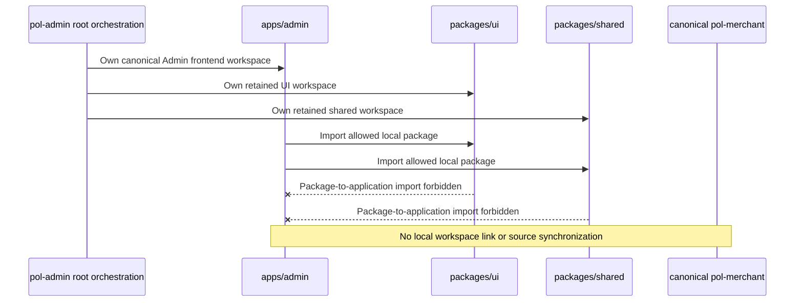
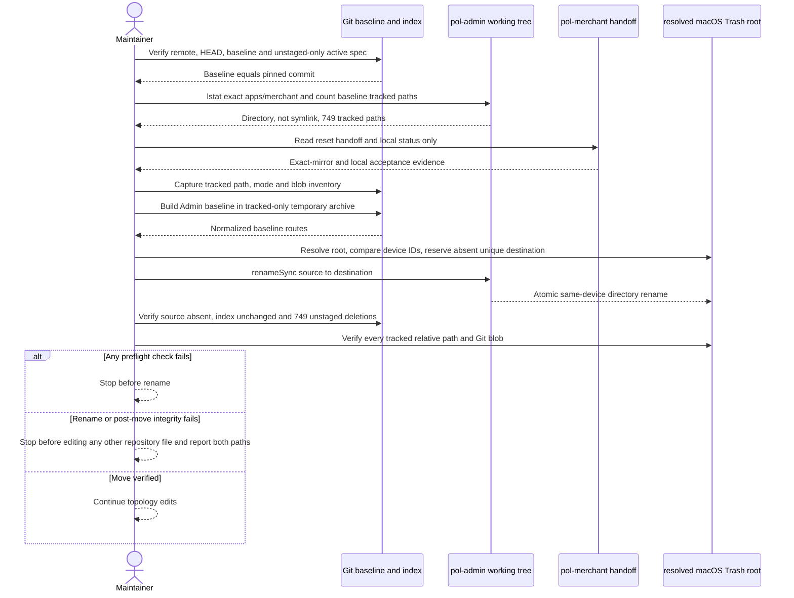
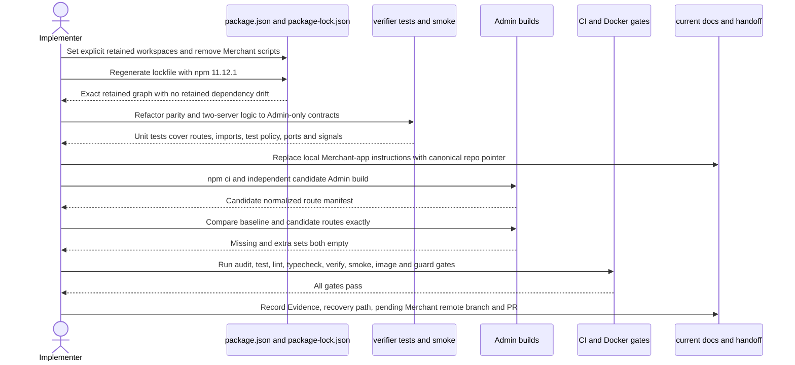
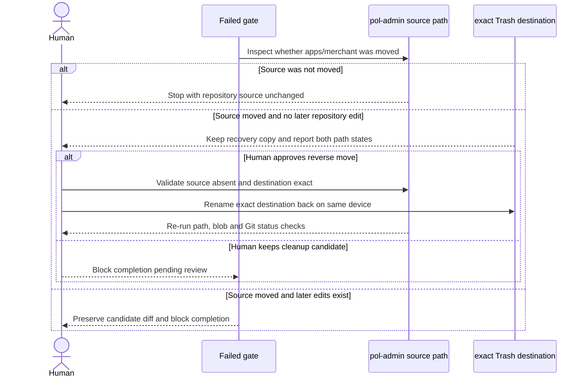

# Design: Remove Merchant Workspace

> Status: approved 2026-08-17
> Mode: requirements-first
> Baseline: `79644df1bfa4b9ad9149fdeecedc63cbafda76d6`

## Architecture Overview

งานนี้เปลี่ยน repository topology จากสอง application workspace เป็น Admin application เดียว โดยย้าย
`apps/merchant` ทั้ง directory ไป macOS Trash แบบกู้คืนได้ แล้วตัด active integration ที่อ้าง workspace
นั้นออก ไม่เปลี่ยน product behavior, domain model หรือ source ใต้ retained trees

### Root cause และผลที่ออกแบบต้องแก้

หลักฐานใน baseline ชี้ว่า duplicate Merchant ไม่ได้แยกขาดจาก root orchestration:

| หลักฐาน baseline | ผลกระทบถ้าลบ directory อย่างเดียว | การแก้ระดับ design |
|---|---|---|
| `package.json` ใช้ `apps/*`, มี `dev/build/start/test:merchant` | npm ยังพยายาม discover workspace ที่หาย; command ค้างเสีย | ใช้ explicit retained workspaces และลบ Merchant scripts |
| `package-lock.json` มี `apps/merchant` และ `node_modules/@pol/merchant` | `npm ci` เห็น manifest/lock ไม่ตรงกัน | regenerate ด้วย npm `11.12.1` และตรวจ retained dependency drift |
| CI build ทั้ง Admin และ Merchant | CI fail ที่ path ถูกลบ | build, verify และ smoke เฉพาะ Admin |
| verifier อ่าน manifest สอง app และบังคับ route parity | verifier fail แม้ Admin ถูกต้อง | เปลี่ยนเป็น Admin route contract + retained boundary checks |
| smoke เปิด port `3001` และ `3002` | probe/start Merchant fail; cleanup อาจแตะ process ที่ไม่เกี่ยว | manage เฉพาะ Admin child และ port `3001` |
| `Dockerfile` copy Merchant manifest ใน deps stage | Docker build fail ก่อน Admin build | copy เฉพาะ retained manifests |
| current docs สอนรัน Merchant จาก repo นี้ | ownership กลับมาซ้ำได้ | ชี้ Merchant frontend ไป canonical `pol-merchant` |

`apps/admin` ยังมี `/merchant/*`, Merchant-management components, APIs, mocks และ types โดยเจตนา
เพราะเป็น Admin domain capability ไม่ใช่ Merchant frontend application. การค้นคำว่า `merchant` แล้วลบ
ทั้งหมดจึงผิด boundary; design ใช้ path/import/script patterns ที่เจาะจงเท่านั้น

### Target topology



Root `workspaces` มีค่าแน่นอนตามลำดับนี้:

```json
[
  "apps/admin",
  "packages/ui",
  "packages/shared"
]
```

ไม่มี workspace wildcard, `@pol/merchant`, application-to-application link หรือ sync mechanism ใหม่

### Change boundaries

| Boundary | เปลี่ยน | คงเดิม |
|---|---|---|
| Filesystem | ย้าย `apps/merchant` ไป unique path ใต้ `/Users/king_developer/.Trash` | Git history และ Trash recovery copy |
| Workspace graph | root manifest และ lockfile | dependency versions/sources/integrity ของ retained graph |
| Commands | ลบ Merchant scripts | default/Admin scripts, retained test/lint/typecheck delegation |
| Verification | Admin route contract, forbidden removed-workspace imports | import parser, package-to-app guard, test-policy scan, process cleanup helper |
| Automation | CI/Docker ใช้ Admin-only graph | Node/npm pins, guard, secret, trace, non-root runtime, port `3001` |
| Documentation | current operational docs ระบุ canonical ownership | historical specs/retros และ Admin Merchant-management guidance |
| Product code | ไม่มี | `apps/admin/**`, `packages/ui/**`, `packages/shared/**` byte-for-byte |
| External systems | ไม่มี | sibling repo, backend, database, deployments, production traffic |

### Components

1. **Ephemeral removal procedure**
   ใช้ Git, Node.js standard library และ same-device `rename(2)` ผ่าน `fs.renameSync`; ไม่เพิ่ม cleanup
   utility ถาวร. Procedure ทำ preflight, เลือก destination ที่ยังไม่มี, rename ครั้งเดียว, ตรวจ Git blobs
   ที่ Trash และหยุดก่อน mutation อื่นเมื่อผิดพลาด
2. **Root topology**
   `package.json` ระบุสาม retained workspaces; `package-lock.json` regenerate ด้วย npm ที่ pin ไว้
3. **Workspace verifier**
   `scripts/verify-workspaces.mjs` อ่าน Admin route manifest, root manifest/lockfile และ retained source
   เท่านั้น. `scripts/lib/workspace-verification.mjs` คง generic parsers/guards แต่ลบ parity API ที่หมดผู้ใช้
4. **Production smoke**
   `scripts/smoke-workspace-routes.mjs` จัดการ Admin process เดียว. `scripts/verify-smoke-signals.mjs`
   ตรวจ signal exit และ port `3001` เท่านั้น. `workspace-process.mjs` reuse โดยไม่แก้ behavior
5. **CI และ image**
   `.github/workflows/ci.yml` รัน full gates บน retained graph. `Dockerfile` ตัด Merchant manifest copy;
   build/runner stages อื่นคง Admin standalone contract
6. **Current ownership docs**
   ปรับ `README.md`, `docs/dev-setup.md`, `.ai/shared/PROJECT_CONTEXT.md`,
   `.ai/shared/ARCHITECTURE.md` และ `.ai/shared/stack/nextjs.md`; historical records ไม่แตะ
7. **Acceptance evidence**
   task Evidence และ final handoff เก็บ baseline, Trash destination, exact commands/results,
   preservation checks, sibling evidence state และ deviations; ไม่มี commit/stage/push/PR

### Mutation allowlist

Implementation แก้ได้เฉพาะ:

- `apps/merchant/**` โดย atomic move ไป Trash
- `package.json`, `package-lock.json`, `Dockerfile`
- `.github/workflows/ci.yml`
- `scripts/verify-workspaces.mjs`
- `scripts/lib/workspace-verification.mjs`
- `scripts/lib/workspace-verification.test.mjs`
- `scripts/smoke-workspace-routes.mjs`
- `scripts/verify-smoke-signals.mjs`
- current docs ห้ารายการใน Components
- active spec `.claude/specs/remove-merchant-workspace/**`

Path อื่นเปลี่ยนถือเป็น scope violation และบล็อก acceptance

## Sequence Diagrams

### Safe preflight และ recoverable move



Directory rename ครอบ ignored `.next`, `node_modules`, `tsconfig.tsbuildinfo` และ artifact อื่นโดยไม่
อ่าน content. Blob verification อ่านเฉพาะ 749 baseline tracked paths. Destination ใช้ชื่อ unique ที่ไม่มี
อยู่ก่อน; ห้าม overwrite และห้าม fallback เป็น copy/delete

### Topology reconciliation และ acceptance



### Failure and recovery decision



Recovery ไม่ auto-run. Reverse move ต้องผ่าน explicit human review เพราะ source path อาจถูกสร้างใหม่หลัง
failure. Git restore กู้ได้เฉพาะ tracked files; Trash destination เป็น recovery source สำหรับ ignored artifacts

## Data Models & Interfaces

งานไม่มี production data model หรือ API schema ใหม่. Interfaces ต่อไปนี้เป็น verification contracts;
ใช้ object ชั่วคราวใน command output/Evidence ไม่สร้าง abstraction หรือ dependency ใหม่

### Removal evidence contract

```ts
interface RemovalEvidence {
  repositoryRemote: "https://github.com/metrodiesign/pol-admin.git";
  baselineCommit: "79644df1bfa4b9ad9149fdeecedc63cbafda76d6";
  sourcePath: "/Users/king_developer/Desktop/Project/pol-admin/apps/merchant";
  trashDestination: string;
  sourceDevice: number;
  trashDevice: number;
  trackedFileCount: 749;
  verifiedBlobCount: 749;
  ignoredContentRead: false;
  indexChanged: false;
}
```

`trashDestination` ต้อง resolve อยู่ใต้ `/Users/king_developer/.Trash`, ไม่มีอยู่ก่อน rename และไม่ใช่
symlink. Evidence เก็บ path จริง ไม่ใช้ glob หรือ unresolved environment variable

### Workspace topology contract

```ts
interface WorkspaceTopology {
  workspaces: ["apps/admin", "packages/ui", "packages/shared"];
  localPackages: ["@pol/admin", "@pol/ui", "@pol/shared"];
}

function assertWorkspaceTopology(
  rootManifest: unknown,
  lockfile: unknown,
): void;
```

`assertWorkspaceTopology` ตรวจ exact workspace arrays, local lock entries และ absence ของ
`apps/merchant`, `node_modules/@pol/merchant`, `@pol/merchant`. Logic อยู่ใน
`workspace-verification.mjs` เพื่อให้ root verifier และ unit test ใช้จุดเดียว

### Admin route contract

```ts
const REQUIRED_ADMIN_ROUTES = [
  "/",
  "/admin/user/list",
  "/checkout/[sessionId]",
  "/dashboard",
  "/minimals/subpaths/[...segments]",
] as const;

function assertRequiredAdminRoutes(adminRoutes: readonly string[]): void;
```

Function fail พร้อม missing route แต่ละรายการ และ fail เมื่อพบ `/register`.
`compareRouteParity`/`assertRouteParity` ถูกลบเพราะไม่มี second application; test parity เดิมถูกแทนด้วย
Admin-only route tests. `normalizePageRoutes` และ `readPageRoutes` คงไว้

### Dependency-boundary contract

| Source owner | Allowed | Rejected |
|---|---|---|
| `apps/admin` | external deps, `@pol/ui`, `@pol/shared`, local Admin imports | `@pol/merchant`, subpaths, relative/absolute target ใต้ removed `apps/merchant` |
| `packages/ui`, `packages/shared` | package-local, package-to-package ตาม baseline, external deps | `@pol/admin`, Admin source path, `@pol/merchant`, removed Merchant source path |

`findBoundaryViolations` รับ roots `{ admin, packages, removedMerchant }`. `removedMerchant` เป็น logical
absolute path สำหรับ resolution เท่านั้น ไม่ต้องมี directory จริง. Scanner อ่าน code จาก Admin และ retained
packages; ไม่อ่าน Trash หรือ sibling repo

### Lockfile delta contract

Migration acceptance สร้าง baseline/candidate JSON snapshots แล้วคืน:

```ts
interface LockfileDelta {
  removedTopologyKeys: string[];
  removedUnreachableKeys: string[];
  changedRetainedKeys: Array<{
    key: string;
    field: "version" | "resolved" | "integrity";
    before: string | undefined;
    after: string | undefined;
  }>;
}
```

ผ่านเมื่อ `changedRetainedKeys` ว่าง และ removed keys เป็น Merchant topology หรือพิสูจน์ว่า unreachable
จากสาม retained workspaces. เป็น one-time acceptance command; ไม่เพิ่ม permanent migration framework

### Route preservation contract

Baseline และ candidate ใช้ `normalizePageRoutes` เดียวกัน แล้วคำนวณ:

```ts
interface RouteDelta {
  missing: string[];
  extra: string[];
}
```

ผ่านเมื่อทั้งสอง array ว่าง. รายงานแยกชุดเสมอเพื่อไม่ซ่อน route loss ด้วย route addition

### Sibling evidence contract

อ่านอย่างเดียวจาก
`/Users/king_developer/Desktop/Project/pol-merchant/.claude/specs/merchant-workspace-reset/handoff.md`:

- source commit ต้องเท่ากับ pinned baseline
- handoff ต้องบันทึก exact mirror และ local acceptance ผ่าน
- local sibling working tree/branch ถูกบันทึกเป็น context แต่ไม่แก้
- remote feature branch และ PR ที่ยังไม่มีถูกบันทึกเป็น pending risk ไม่ block cleanup ตาม approved analysis

## Technology Decisions

### TD-1: Same-device rename ไป Trash

ใช้ `lstat`, `stat`, `realpath` และ `renameSync` จาก Node.js standard libraryใน process เดียว. Same-device
preflight ทำให้ `renameSync` เป็น atomic filesystem rename และ error แทน copy/delete fallback. วิธีนี้เก็บ
ignored artifacts ครบและกู้คืนได้ โดยไม่ต้องอ่าน content หรือใช้ `rm -rf`

### TD-2: ไม่มี permanent migration tool

Cleanup เกิดครั้งเดียว. ใช้ existing Git/npm/Node capabilities และเก็บ exact output ใน Evidence. ไม่เพิ่ม
class, package, sync job หรือ generic repository-cleanup framework

### TD-3: Explicit npm workspaces และ native lock regeneration

ใช้ npm `11.12.1` ซึ่งเป็น generator version ปัจจุบัน. แก้ root manifest ก่อน แล้วรัน
`npm install --package-lock-only --ignore-scripts`; หลัง delta acceptance รัน `npm ci` จาก lockfileใหม่.
ไม่ hand-edit dependency nodes และไม่เพิ่ม/update package

### TD-4: Keep guards, delete parity

Route parity มีความหมายเฉพาะตอน source duplicate อยู่สอง app จึงลบ. Generic normalization, required Admin
routes, dependency boundaries, test-policy scan, port ownership และ managed-process cleanup ยังป้องกัน
regression จริง จึงคงและปรับ input ให้น้อยที่สุด

### TD-5: Preserve source by path invariant

ห้ามแก้ `apps/admin`, `packages/ui`, `packages/shared`. Git blob/path comparison เป็น primary proof;
Admin baseline/candidate route equality, build, smoke และ container เป็น behavioral proof เพิ่มเติม

### TD-6: Tracked-only baseline build

สร้าง temporary directory ด้วย `mktemp`, extract `git archive` จาก pinned commit และ build Admin ที่นั่น.
Baseline ไม่อ่าน candidate source. Candidate buildทำใน working treeหลัง topology change. ทั้งคู่ใช้ runtime
เดียวกันใน local comparison; CI/Docker ยืนยัน Node `22.19.0` และ npm `11.12.1`. Temporary path ถูก validate
ก่อน cleanup และไม่อยู่ใน repository

### TD-7: Documentation scan แบบ semantic boundary

Operational stale scan หา `@pol/merchant`, `apps/merchant`, removed Merchant scripts, local Merchant port
`3002`, Merchant env/setup/deploy guidance เฉพาะ root manifests/config, CI, Docker, scripts, current docs และ
canonical shared guidance. Scan ไม่ใช้คำว่า `merchant` เปล่า ๆ เพราะจะลบ Admin domain capabilityผิด.
`.claude/specs/**` และ retrospectives ถูก exclude เป็น historical record

### TD-8: No sibling or external mutation

`pol-merchant` เป็น evidence sourceแบบ read-only. ไม่มี clone/copy/sync ใน phase นี้ เพราะ copy เสร็จใน
approved prior workแล้ว. ไม่มี backend, database, deployment หรือ production command

## Error Handling Strategy

| Failure | Required response | Forbidden response |
|---|---|---|
| Remote/HEAD/path/type/count/dirty-state mismatch | stop ก่อน rename; แสดง expected/actual และ exact path | เดา path, ปรับ count, ลบต่อ |
| Trash root resolve ไม่ได้, destination ชน, device ต่าง | stop; สร้าง unique candidate ใหม่ได้เฉพาะกรณีชื่อชน | overwrite, cross-device copy/delete |
| `renameSync` error | stopก่อนแก้ repo fileอื่น; รายงาน source/destination existence และ error | retry ด้วย stronger deletion/copy primitive |
| Post-move source/Git/blob verification fail | stopก่อน mutationอื่น; เก็บ Trash copy; รอ human recovery decision | auto rollback หรือ stage deletions |
| Sibling handoff/source SHA ไม่ตรง | stopก่อน move; รายงาน field ที่ไม่ตรง | แก้ sibling หรือ infer ว่า mirrorสำเร็จ |
| Merchant remote branch/PR ยัง pending แต่ local handoffผ่าน | บันทึก risk ใน Evidence/handoff | แก้ sibling, push หรือสร้าง PR |
| Lockfile retained field drift | failพร้อม package key/field/before/after | ยอมรับ npm churn แบบกว้าง |
| Manifest missing/invalid หรือ required Admin routeหาย | failพร้อม manifest path หรือ route | fallback เป็น source-directory scan |
| Port `3001` ถูกใช้ก่อน smoke | failโดยไม่ signal process owner | kill owner, เปลี่ยน port |
| Managed Admin child cleanup fail | failพร้อม PID/phase/output; ไม่แตะ processอื่น | kill by port หรือ broad process pattern |
| Any acceptance gate fail | block completion; เก็บ failed command/output ใน Evidence | mark task done, commit, push หรือ PR |
| Scope pathเปลี่ยน | blockพร้อม changed path | รวม unrelated changeใน cleanup |

## Testing Strategy

### 1. Preflight และ removal integrity

- ตรวจ `origin`, repo root, HEAD SHA, exact source path, `lstat`, symlink status, device IDs
- `git ls-tree -r` baseline ต้องได้ 749 tracked entries; เก็บ path/mode/blob inventory
- `git status --porcelain=v1 --untracked-files=all` ยอมเฉพาะ active spec ก่อน move
- build tracked-only baseline ก่อน rename เพื่อ fail early
- หลัง rename ตรวจ source absent, destinationใต้ resolved Trash root, index diff ว่าง และ working-tree deletion
  exact 749 paths
- hashทุก tracked fileที่ destinationเทียบ baseline blob; ไม่ traverse/read ignored-file content

### 2. Unit tests สำหรับ verifier

ปรับ `scripts/lib/workspace-verification.test.mjs` ให้ครอบ:

- valid/invalid Admin manifest normalization
- required Admin routesครบ, routeหาย และ forbidden `/register`
- exact retained workspace topology และ Merchant lock entriesถูก reject
- import parserทั้ง static, side-effect, dynamic, `require`
- Admin/package importไป `@pol/merchant` และ relative/absolute removed pathถูก reject
- package-to-Admin importยังถูก reject
- focused/skipped test detectionยังทำงาน
- occupied portไม่ถูกปิด
- existing managed-process graceful/forced cleanup และ signal exit testsยังผ่าน

ลบ parity fixtures/tests; ไม่สร้าง compatibility shim สำหรับ API ที่ไม่มี callerแล้ว

### 3. Lockfile acceptance

- regenerateด้วย npm `11.12.1`
- assert exact local workspace namesสาม package
- assert Merchant topology absent
- compareทุก retained key field `version`, `resolved`, `integrity` กับ baseline
- removed dependency nodeต้องอยู่ใต้ Merchant topologyหรือ unreachableจาก retained graph
- `npm ci` จาก candidate lockfileต้องผ่าน

### 4. Admin preservation

- compare Git path/mode/blobจาก pinned baselineสำหรับ `apps/admin`, `packages/ui`, `packages/shared`
- build baselineจาก tracked-only Git archiveและ candidateแยกกัน
- normalize `.next/server/app-paths-manifest.json` ทั้งคู่ด้วย helperเดิม
- compare exact equality; failureแสดง `missing` และ `extra` แยกกัน
- ยืนยัน standalone entry `apps/admin/server.js` ใน image/runtime pathตาม Docker contract

UI screenshot/viewport regressionไม่เพิ่ม เพราะ tracked UI sourceต้อง byte-identicalและงานไม่มี UI change;
build, route manifest, smoke และ containerครอบผลกระทบ runtimeที่เกี่ยวข้อง

### 5. Runtime, CI และ container

รันตามลำดับ:

```text
npm ci
npm audit --omit=dev --audit-level=high
npm test
npm run lint
npm run typecheck
npm run build:admin
npm run verify:workspaces
node scripts/verify-smoke-signals.mjs
npm run smoke:routes
```

CI ต้องมี Node `22.19.0`, npm `11.12.1`, timeout signal smoke 1 นาที, route smoke 2 นาที และไม่มี
Merchant build. Docker acceptance:

- build `Dockerfile` จาก Admin-only lock graph
- inspect/run exact local test image
- verify runtime user UID `1001`, exposed/listening port `3001`, root probe statusต่ำกว่า `500`
- verify Admin `/`, `/admin/user/list`, `/register` ตาม smoke contract
- stop/removeเฉพาะ test containerที่สร้างและบันทึก image/container identifiers
- ไม่สร้าง Merchant image/service

### 6. Enforcement, docs และ scope gates

- รันทุก `.claude/hooks/tests/*.test.sh`
- รัน `.ai/bin/check-secrets.sh --all`
- รัน focused/skip scanผ่าน verifier
- รัน `scripts/spec-trace.sh remove-merchant-workspace` หลัง tasksมี coverageครบ
- stale operational scanตาม TD-7; historical specs/retrospectives excluded
- inspect docs diffเพื่อคง Admin Merchant-management/producer-domain guidance
- inspect `git diff --name-status` เทียบ mutation allowlist
- ยืนยัน `git diff --cached` ว่าง, ไม่มี commit/push/PR

### 7. Evidence และ handoff

แต่ละ taskเก็บ command, exit code และ observed resultจริง. Final handoffต้องมี:

- pinned baselineและ exact Trash recovery destination
- 749 source deletionsและ 749 verified Trash blobs
- files changedและ explicit preserved trees
- sibling handoff path/source SHA/local acceptance พร้อม remote branch/PR pending
- lockfile delta summary, normalized route counts/delta, full gate results
- constraints/deviationsและ recovery instruction

## Requirement Traceability

| Requirement | Design coverage | Verification |
|---|---|---|
| REQ-1.1, REQ-1.2, REQ-1.3, REQ-1.4, REQ-1.5, REQ-1.6, REQ-1.7, REQ-1.8, REQ-1.9, REQ-1.10, REQ-1.11, REQ-1.12, REQ-1.13, REQ-1.14, REQ-1.15, REQ-1.16, REQ-1.17, REQ-1.18 | Ephemeral removal procedure, Safe preflight sequence, Removal evidence, TD-1 | Preflight/removal integrity, Git/blob/index checks, handoff recovery record |
| REQ-2.1, REQ-2.2, REQ-2.3, REQ-2.4, REQ-2.5, REQ-2.6, REQ-2.7, REQ-2.8, REQ-2.9, REQ-2.10, REQ-2.11, REQ-2.12, REQ-2.13, REQ-2.14, REQ-2.15 | Target topology, Workspace topology contract, Lockfile delta contract, TD-3 | Topology unit tests, lock delta acceptance, `npm ci` |
| REQ-3.1, REQ-3.2, REQ-3.3, REQ-3.4, REQ-3.5, REQ-3.6, REQ-3.7, REQ-3.8, REQ-3.9, REQ-3.10, REQ-3.11, REQ-3.12, REQ-3.13, REQ-3.14 | Root topology, Components, Production smoke | Root manifest assertions, retained command gates, port `3001` smoke/no `3002` scan |
| REQ-4.1, REQ-4.2, REQ-4.3, REQ-4.4, REQ-4.5, REQ-4.6, REQ-4.7, REQ-4.8, REQ-4.9, REQ-4.10, REQ-4.11, REQ-4.12, REQ-4.13, REQ-4.14, REQ-4.15, REQ-4.16, REQ-4.17, REQ-4.18 | Admin route contract, Dependency-boundary contract, TD-4, Error strategy | Verifier unit tests, signal test, Admin-only production smoke |
| REQ-5.1, REQ-5.2, REQ-5.3, REQ-5.4, REQ-5.5, REQ-5.6, REQ-5.7, REQ-5.8, REQ-5.9, REQ-5.10, REQ-5.11, REQ-5.12, REQ-5.13, REQ-5.14, REQ-5.15, REQ-5.16, REQ-5.17, REQ-5.18 | CI and image component, TD-3, TD-4 | CI command set, Docker build/runtime/user/port/health checks |
| REQ-6.1, REQ-6.2, REQ-6.3, REQ-6.4, REQ-6.5, REQ-6.6, REQ-6.7, REQ-6.8, REQ-6.9, REQ-6.10, REQ-6.11, REQ-6.12, REQ-6.13, REQ-6.14, REQ-6.15, REQ-6.16, REQ-6.17, REQ-6.18, REQ-6.19, REQ-6.20 | Current ownership docs, Sibling evidence contract, TD-7, TD-8 | Scoped stale scan, docs diff review, read-only sibling evidence and pending-risk handoff |
| REQ-7.1, REQ-7.2, REQ-7.3, REQ-7.4, REQ-7.5, REQ-7.6, REQ-7.7, REQ-7.8, REQ-7.9, REQ-7.10, REQ-7.11, REQ-7.12, REQ-7.13, REQ-7.14, REQ-7.15, REQ-7.16, REQ-7.17 | Change boundaries, TD-5, TD-6, Route preservation contract | Git blob equality, independent builds, normalized route equality, scope gate |
| REQ-8.1, REQ-8.2, REQ-8.3, REQ-8.4, REQ-8.5, REQ-8.6, REQ-8.7, REQ-8.8, REQ-8.9, REQ-8.10, REQ-8.11, REQ-8.12, REQ-8.13, REQ-8.14, REQ-8.15, REQ-8.16, REQ-8.17 | Acceptance sequence, Error strategy, Testing strategy, Evidence and handoff | Full local/CI/container/enforcement gates; any failure blocks completion |

## Design Review Notes

- ไม่มี CORE domain logic; spec-architect subagent gateไม่จำเป็นตาม `spec-design` workflow
- Designเลือก deletion-over-addition: ลบ parity/two-app branchesและไม่สร้าง migration frameworkหรือ sync
- จุดเสี่ยงสูงสุดคือ recoverability, retained-source integrity และ lockfile drift; ทุกจุดมี independent proof
- Remote Merchant branch/PR ยัง pending เป็น explicit handoff risk ไม่ถูกตีความว่า local mirrorหาย
- Phase นี้สร้างเฉพาะ `design.md`; ยังไม่ย้าย directoryหรือแก้ implementation
