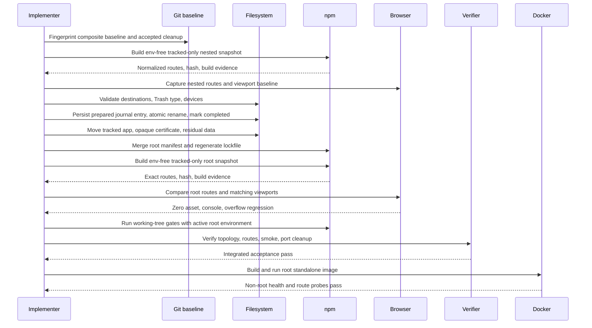
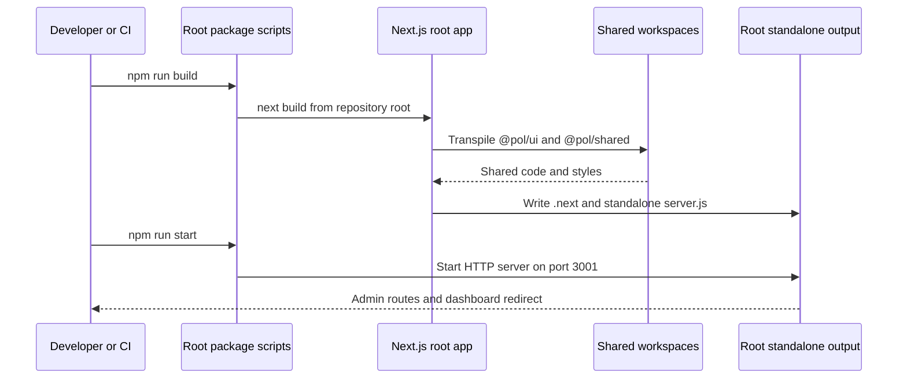

# Design: Restore Root App Layout

> Status: approved 2026-08-17, amended 2026-08-17

ย้าย POL Admin Next.js application จาก nested workspace กลับเป็น root application ตาม layout
ก่อน commit `a239c56` โดยคง shared packages, product behavior, routes และ runtime contracts ปัจจุบัน.

## Architecture Overview

### Context and Boundary

Git history ยืนยันว่า commit `a239c56` ย้าย root `src`, `public` และ Next.js config เข้า
`apps/admin` เพื่อรองรับสอง applications. หลัง spec `remove-merchant-workspace` ตัด Merchant app แล้ว
outer Admin workspace ไม่เพิ่ม isolation value แต่ทำให้ทุก command, path และ deployment ซับซ้อนเกินจำเป็น.

Design นี้ย้อนเฉพาะ repository boundary:

- Root package `pol-admin` กลับเป็น Next.js application โดยตรง.
- `packages/ui` และ `packages/shared` ยังเป็น npm workspaces.
- Internal Admin domain namespaces และ App Router URLs ไม่เปลี่ยน.
- Merchant-management domain ภายใน Admin และ canonical `pol-merchant` ownership ไม่เปลี่ยน.
- งานนี้ต่อจาก accepted working tree ของ spec `remove-merchant-workspace`; ไม่มี stage, commit, push หรือ PR.

Migration baseline เป็น composite state: commit
`79644df1bfa4b9ad9149fdeecedc63cbafda76d6` รวม accepted candidate ที่บันทึกใน
`.claude/specs/remove-merchant-workspace/handoff.md`. Preflight fingerprint ครอบ prior-cleanup-owned
tracked changes กับ untracked previous spec แต่ตัด active spec `restore-root-app-layout` ซึ่งต้องเปลี่ยนระหว่างงานนี้.

### Target Layout

```text
pol-admin/
  .env.example
  components.json
  next.config.ts
  postcss.config.mjs
  public/
  src/
    app/
      admin/
      merchant/
      control/
      ...
    components/
    hooks/
    lib/
    types/
  tsconfig.json
  vitest.config.ts
  package.json
  package-lock.json
  packages/
    ui/
    shared/
  scripts/
  Dockerfile
```

Target ไม่มี `apps/admin`, package `@pol/admin` หรือ `apps/` directory. ชื่อ `admin` ใต้ `src`
ยังอยู่เพราะเป็น route/domain concern ไม่ใช่ repository workspace boundary.

### Components and Responsibilities

| Component | Target location | Responsibility |
|---|---|---|
| Root Next.js app | `src`, `public`, root config | Admin routes, UI, auth, API adapters, mocks และ assets |
| Root package | `package.json` | Application dependencies, direct commands และ workspace ownership |
| Shared UI | `packages/ui` | Presentation exports ผ่าน `@pol/ui/*` |
| Shared logic | `packages/shared` | Pure types, validation และ utilities ผ่าน `@pol/shared/*` |
| Repository verifier | `scripts/lib/workspace-verification.mjs` | Root topology, routes, boundaries และ test policy |
| Runtime smoke | `scripts/smoke-workspace-routes.mjs` | Start root production app, probe port 3001 และ cleanup managed process |
| CI | `.github/workflows/ci.yml` | Install, audit, lint, typecheck, test, root build, verify และ smoke |
| Container | `Dockerfile` | Build root standalone output และ run non-root Admin server |
| Current docs | README, dev setup, shared guidance | Root layout, root commands และ canonical ownership |

### Migration Mapping

| Current | Target | Transformation |
|---|---|---|
| `apps/admin/src` | `src` | Move 660 tracked files; เปลี่ยนเฉพาะ Tailwind shared-source path |
| `apps/admin/public` | `public` | Move 81 tracked assets byte-for-byte |
| `apps/admin/.env.example` | `.env.example` | Move tracked template byte-for-byte |
| `apps/admin/components.json` | `components.json` | Move byte-for-byte; aliases ยังชี้ `@/*` |
| `apps/admin/postcss.config.mjs` | `postcss.config.mjs` | Move byte-for-byte |
| `apps/admin/vitest.config.ts` | `vitest.config.ts` | Move byte-for-byte; root-relative alias ยังถูกต้อง |
| `apps/admin/tsconfig.json` | `tsconfig.json` | เปลี่ยน base path และจำกัด include ไว้ที่ root app |
| `apps/admin/next.config.ts` | `next.config.ts` | ลบ nested-workspace tracing override; คง runtime config อื่น |
| `apps/admin/package.json` | root `package.json` | Merge dependencies/scripts แล้วลบ nested manifest |
| nested package-lock entries | root package-lock entry | Regenerate ด้วย npm 11.12.1 ตาม exact three-record delta |
| `apps/admin/certificates` | `certificates` | Opaque same-device move; ห้ามอ่าน private-key content |
| residual ignored Admin files | unique Recoverable Trash path | Move `.next`, `node_modules`, generated types/cache แบบกู้คืนได้ |

Tracked Admin inventory ปัจจุบันมี 748 paths. `src` และ `public` ไม่มี working-tree drift จาก
composite migration baseline ก่อนเริ่ม design นี้. Git status, diff hash, tracked blob hashes และ
untracked previous-spec content hashes เป็น preservation fingerprint; active spec ไม่อยู่ใน fingerprint.

Source preservation allowlist:

| Target | Allowed content change |
|---|---|
| `src/app/globals.css` | เปลี่ยน `@source` relative path หนึ่งรายการ |
| Remaining 659 tracked `src` files | none; Git blobs ต้องตรง source |
| 81 tracked `public` files | none; Git blobs ต้องตรง source |
| `.env.example`, `components.json`, `postcss.config.mjs`, `vitest.config.ts` | none; Git blobs ต้องตรง source |
| `next.config.ts`, `tsconfig.json` | เฉพาะ path-dependent changes ที่ระบุใน design |

### Dependency Direction

```text
Root Admin app
  -> @pol/ui
  -> @pol/shared

@pol/ui
  -> external presentation dependencies

@pol/shared
  -> pure local logic only
```

Packages ห้าม import root `src`, old `@pol/admin`, old `apps/admin`, Merchant workspace หรือ
Merchant package. Root app import retained package public exports ได้ตามเดิม.

## Sequence Diagrams

### Repository Migration and Acceptance



### Root Build and Runtime Flow



## Data Models & Interfaces

### Root Package Contract

| Field | Target contract |
|---|---|
| `name` | `pol-admin` |
| `private` | `true` |
| `workspaces` | exact `packages/ui`, `packages/shared` |
| `dependencies` | existing Admin runtime dependencies plus retained local packages |
| `devDependencies` | existing root toolchain dependencies |
| `engines` | preserve Node constraint |
| `packageManager` | `npm@11.12.1` |

No dependency เพิ่ม, remove หรือ version bump นอกจากลบ obsolete package identity `@pol/admin`.
Runtime dependencies จาก nested manifest ย้ายเข้า root manifest ด้วยค่าเดิม.

Lockfile comparison ยอมรับ exact delta นี้เท่านั้น:

| `packages` record | Approved change |
|---|---|
| `packages[""]` | Update dependency/workspace metadata required by merged root app |
| `packages["apps/admin"]` | Remove record |
| `packages["node_modules/@pol/admin"]` | Remove record |
| Every other retained record | Deep-equal baseline at every key |

### Root Script Contract

| Script | Target behavior |
|---|---|
| `dev` | Direct `next dev` HTTPS port 3001 |
| `dev:clean` | Recursively remove only root `.next`, root `tsconfig.tsbuildinfo`, then run `dev` |
| `build` | Direct `next build` |
| `start` | Direct `next start` HTTP port 3001 |
| `test` | Verifier unit tests, root Vitest และ `packages/shared` tests |
| `lint` | Root app/config lint และ retained workspace lint |
| `typecheck` | Root app TypeScript และ retained workspace typecheck |
| `verify:workspaces` | Root topology, route, dependency และ test-policy verification |
| `smoke:routes` | Root production route smoke |

Scripts `dev:admin`, `build:admin`, `start:admin` และ `test:admin` ถูกลบโดยเจตนา. Command removal
เป็น accepted breaking developer-tooling change; ไม่มี compatibility alias ค้างไว้.
`packages/ui` ไม่มี `test` script จึงอยู่ใน lint/typecheck gates เท่านั้น. Root test ใช้ native
workspace behavior กับ `--if-present`; ไม่สร้าง test script หรือ compatibility shim เพิ่ม.

### TypeScript and Test Boundaries

Root `tsconfig.json` extends `./tsconfig.base.json`. Include scope ต้องจำกัดที่ root application และ
generated Next types เพื่อไม่ typecheck package sources ซ้ำด้วย app compiler options:

```text
next-env.d.ts
src/**/*.ts
src/**/*.tsx
src/**/*.mts
.next/types/**/*.ts
.next/dev/types/**/*.ts
next.config.ts
vitest.config.ts
```

Packages คง typecheck ผ่าน workspace scripts ของตัวเอง. Root `vitest.config.ts` ใช้ alias
`@ -> ./src`, environment `node` และ include `src/**/*.test.ts` ตามเดิม.

### Move Journal Contract

Journal อยู่ที่ `.claude/specs/restore-root-app-layout/migration-journal.json`. แต่ละ entry มี
sequence, source, destination, device, inventory reference และ state. Implementer persist entry ด้วย
state `prepared` ก่อน rename; rename สำเร็จแล้วเปลี่ยนเป็น `completed` ก่อนเริ่ม entry ถัดไป. Rollback
reverse เฉพาะ completed entries ตามลำดับย้อนกลับ. Journal อยู่ใต้ active spec จึงไม่เข้า composite fingerprint.

### Next.js and Styling Contract

| Concern | Target |
|---|---|
| App root | Repository root |
| Source alias | `@/* -> ./src/*` |
| Standalone output | `.next/standalone/server.js` |
| Shared transpilation | `@pol/ui`, `@pol/shared` |
| Output tracing root | Next.js default root; ลบ nested `../..` override |
| Tailwind shared source | root-relative `../../packages/ui/src` จาก `src/app/globals.css` |
| Rewrites | Exact conditional map ด้านล่าง |
| Public assets | root `public` |

| `ADMIN_API_ORIGIN` state | Source | Destination |
|---|---|---|
| Non-empty | `/admin/:path*` | `${ADMIN_API_ORIGIN}/api/v1/admins/:path*` |
| Non-empty | `/producer/:path*` | `${ADMIN_API_ORIGIN}/api/v1/merchants/:path*` |
| Non-empty | `/api/:path*` | `${ADMIN_API_ORIGIN}/api/:path*` |
| Absent or empty | no rule | no destination |

### Verification Roots

```ts
type VerificationRoots = {
  appSource: "<repo>/src";
  packages: "<repo>/packages";
  removedAdminWorkspace: "<repo>/apps/admin";
  removedMerchantWorkspace: "<repo>/apps/merchant";
  routeManifest: "<repo>/.next/server/app-paths-manifest.json";
};
```

Topology guard ยอมรับ local workspace links เฉพาะ `@pol/ui` และ `@pol/shared`. Guard ปฏิเสธ
`@pol/admin`, `apps/admin`, `@pol/merchant` และ `apps/merchant` ใน active topology/imports.
Operational text scan ครอบ exact set ต่อไปนี้:

- Root manifests: `package.json`, `package-lock.json`.
- Root config: `.dockerignore`, `.gitignore`, `.env.example`, `components.json`, `eslint.config.mjs`,
  `next.config.ts`, `opencode.json`, `postcss.config.mjs`, `tsconfig.base.json`, `tsconfig.json`, `vitest.config.ts`.
- Root guidance/runtime: `AGENTS.md`, `CLAUDE.md`, `claude-code-spec-driven-workflow.md`, `README*`, `Dockerfile`.
- Operational trees: `.github/**`, `scripts/**`, `docs/**`, `.ai/shared/**`.

Import/topology scan ครอบ `src/**`, `packages/**`. Exclude เฉพาะ `.claude/specs/**`,
`retrospectives/**`. Forbidden strings อยู่ได้เฉพาะ verified fixture/assertion content ใน
`scripts/lib/workspace-verification.test.mjs`; ห้าม blanket-ignore arbitrary file content.

### Runtime and Container Contract

| Contract | Value |
|---|---|
| Development | HTTPS port 3001 |
| Local production | HTTP port 3001 |
| Root redirect | 307 หรือ 308 ไป `/dashboard` |
| Required route | `/admin/user/list` ไม่เป็น 404 |
| Forbidden route | `/register` เป็น 404 |
| Container user | `nextjs`, UID 1001 |
| Container command | `node server.js` |
| Healthcheck | Root status ต่ำกว่า 500 |
| TLS production | Reverse proxy responsibility |

Docker deps stage copy root manifests และ package manifests ก่อน `npm ci`. Builder run `npm run build`.
Runner copy root `public`, `.next/standalone` และ `.next/static` ด้วย ownership `nextjs`.

### Local Environment Contract

Root `.env.local` มีอยู่แล้วใน working tree และถูก ignore. Design กำหนดดังนี้:

- Migration tooling ห้ามอ่าน, log, copy หรือ overwrite content.
- คงไฟล์ไว้ตำแหน่งเดิม; หลัง migration Next.js จะอ่านไฟล์นี้เป็น active local environment.
- Baseline/candidate parity สร้างจาก tracked-only snapshots ที่ตัด `.env.local` ทุกไฟล์.
- Working-tree build/smoke ให้ Next.js ใช้ root `.env.local` ตามปกติ; evidence บอกได้เฉพาะ activation กับ path.
- Docker context ยัง exclude `.env` และ `.env.*` ทุกระดับ.
- หาก `apps/admin/.env.local` ปรากฏก่อน implementation ให้หยุดเพราะเกิดสอง sources ที่ reconcile ไม่ได้โดยไม่อ่าน secret.

## Technology Decisions

### Root Application with Package Workspaces

เลือก root Next.js app ร่วมกับสอง npm package workspaces. npm รองรับ root package เป็น application
พร้อม child workspaces อยู่แล้ว จึงไม่ต้องสร้าง application workspace หนึ่งตัวเพื่อครอบ app เดียว.

### Reverse the Proven Split Boundary

ใช้ mapping ย้อนจาก commit `a239c56` แทนออกแบบ folder scheme ใหม่. วิธีนี้รักษา internal aliases,
domain ownership และ App Router URL tree โดยเปลี่ยนเฉพาะ outer repository paths.

### Native Moves and npm Lock Regeneration

ใช้ Git/native filesystem moves สำหรับ tracked paths และ npm 11.12.1 regenerate lockfile. ไม่เพิ่ม
migration dependency, custom copier หรือ permanent source-sync mechanism. ทุก source-to-destination
mapping เขียนลง journal ก่อน individual same-device rename. npm `ci` เปลี่ยน generated root
`node_modules` ได้ตาม native behavior; ข้อห้าม destructive migration ไม่ครอบ package-manager internals.

### Default Next.js Output Tracing

ลบ `outputFileTracingRoot` override เพราะ app root และ repository root เป็น directory เดียวกัน.
Default tracing จึงครอบ `packages/ui` และ `packages/shared`; `transpilePackages` ยังคง explicit.

### Preserve Domain Namespaces

คง `src/app/admin`, `src/components/admin`, `src/lib/api/admin`, `src/lib/mock/admin` และ
`src/types/admin`. ชื่อเหล่านี้แยก Admin user/role/API domain จาก Merchant-management domain;
ไม่ใช่ artifact ของ outer workspace split.

### No Compatibility Aliases

ลบ Admin-specific root script aliases และ package `@pol/admin`. การคง alias จะทำให้ docs/tooling
ยังสื่อว่ามี application workspace แยก ซึ่งขัดเป้าหมาย architecture.

## Error Handling Strategy

| Error case | Detection | Required response |
|---|---|---|
| Prior cleanup ไม่อยู่ accepted state | Verify exact previous handoff plus composite fingerprint | Stop ก่อนย้ายไฟล์ |
| Admin tracked tree มี drift | Compare `apps/admin/src` และ `public` กับ composite baseline | Stop พร้อม changed paths |
| Root rename destination ชน | Enumerate rename destinations plus activation/cache paths; allow only opaque `.env.local` plus governed caches | Stop; ห้าม overwrite |
| Root `.env.local` มีอยู่ | Check existence/type เท่านั้น | Keep opaque, report activation, never read |
| App-local `.env.local` ปรากฏ | Check existence/type เท่านั้น | Stop; ขอ human reconciliation |
| Root certificate destination ชน | Check both directory paths | Stop; ห้าม merge private-key directories |
| Trash root invalid | Require `/Users/king_developer/.Trash` real non-link directory plus matching device | Stop ก่อน recovery move |
| Root stale `.next` หรือ tsbuild cache | Validate exact paths, type, device | Journal แล้ว move ไป unique Trash location ก่อน build |
| Tracked move ไม่ครบ | Compare mapping inventory และ Git blobs | Stop ก่อน manifest/lock edits ต่อ |
| Residual `apps/admin` มี tracked file | Git inventory after moves | Stop; ห้ามย้าย residual ไป Trash |
| Residual ignored data | Validate path, type, same-device destination | Journal แล้ว atomic rename ทั้ง residual directory ไป Trash |
| Individual rename ล้ม | Detect failed rename before next mapping | Stop; reverse completed new-spec moves from journal |
| `apps` มี entry หลังย้าย Admin residual | Enumerate exact direct children | Stop หากไม่ว่าง; ใช้ `rmdir` เฉพาะ empty directory |
| npm lock retained record drift | Deep-compare every record outside exact three-record delta | Fail พร้อม record path และ changed key |
| Old app workspace ยัง resolve | Topology guard และ `npm query .workspace` | Fail install acceptance |
| Root route manifest หาย/invalid | Verifier reads exact root manifest | Fail พร้อม manifest path |
| Normalized route drift | Exact set comparison | Fail พร้อม missing และ extra routes |
| Port 3001 ถูกครอง | Existing port preflight | Fail โดยไม่หยุด existing owner |
| Smoke cleanup ไม่คืน port | Managed-process cleanup verification | Fail พร้อม PID/phase/output |
| Container ไม่เป็น non-root/healthy | Runtime inspect และ HTTP probes | Block completion |
| Active stale path reference | Exact operational/import scopes plus narrow fixture exception | Fail พร้อม file และ line |
| Rollback fingerprint mismatch | Recompute composite preservation fingerprint | Stop; report changed component |

Rollback ก่อน commit reverse เฉพาะ completed new-spec moves จาก journal แล้วต้องคืน composite baseline
fingerprint เดิม. Migration tooling ห้าม `rm -rf`, `git reset --hard` หรือ destination overwrite ต่อ
migration/recovery paths. Native `npm ci` และ exact generated-cache cleanup ไม่ใช่ migration deletion.

## Testing Strategy

Requirements derive จาก design นี้แล้ว. Tests map ไป observable behaviors และ stable REQ IDs ดังนี้:

| Design behavior | Verification | REQ coverage |
|---|---|---|
| Pre-migration behavior baseline | Build tracked-only env-free nested snapshot; normalize routes; capture browser baseline | REQ-2, REQ-8, REQ-9 |
| Tracked path preservation | Compare source/public Git blobs ตาม migration mapping และ allowlist | REQ-2, REQ-8 |
| Root topology | Assert exact workspaces, absent app link และ exact local package links | REQ-1, REQ-3, REQ-5 |
| Dependency stability | Allow exact three-record lockfile delta; deep-equal every retained record | REQ-3 |
| Root commands | Static contract plus real execution; UI test omitted because script absent | REQ-3 |
| Import boundaries | Unit fixtures สำหรับ root app, packages และ removed app paths | REQ-3, REQ-5 |
| Test policy | Verifier rejects committed `.only` และ `.skip` | REQ-5 |
| Route preservation | Hash UTF-8 `JSON.stringify(normalizePageRoutes(manifest))`; compare exact set | REQ-2, REQ-5, REQ-9 |
| Root build | Fresh `npm run build` succeeds and writes root `.next` | REQ-3, REQ-4, REQ-9 |
| Production runtime | Working-tree active-env signal verification plus route smoke on port 3001 | REQ-4, REQ-5, REQ-9 |
| Styling/assets | Same browser/routes at widths 375/768/1440; candidate adds zero asset, console or overflow regression | REQ-2, REQ-4, REQ-9 |
| Docker | Build image, inspect user/UID/command, wait healthy และ probe 307/200/404 | REQ-6, REQ-9 |
| Security floor | Production audit, full-tree secret scan และ guard regression suites | REQ-4, REQ-6, REQ-9 |
| Documentation | Exact operational/import scan applies exclusions and one fixture exception | REQ-5, REQ-7, REQ-9 |
| Spec integrity | All-spec trace passes; historical specs/retrospectives unchanged | REQ-7, REQ-9 |
| Git workflow | Composite fingerprint preserved; index empty; HEAD unchanged; no external Git action | REQ-8, REQ-9 |

Integrated acceptance ใช้ Node 22.19.0 และ npm 11.12.1:

```text
npm ci
npm audit --omit=dev --audit-level=high
npm test
npm run lint
npm run typecheck
npm run build
npm run verify:workspaces
node scripts/verify-smoke-signals.mjs
npm run smoke:routes
```

Baseline/candidate parity ใช้ tracked-only snapshots ที่ตัด `.env.local` และ browser/tool ชุดเดียวกัน.
Route comparison ต้องได้ 112 routes, missing 0, extra 0 และ SHA-256 ของ UTF-8 bytes จาก
`JSON.stringify(normalizePageRoutes(manifest))` เท่ากับ
`6011454515d15a40e39e171ef87e748f92a63a0f0a995ff43c3c16455d387216`. Working-tree build/smoke
ยังใช้ active root `.env.local`; evidence ระบุได้เฉพาะ activation กับ path.

## Requirement Traceability

| Design element | Requirement coverage |
|---|---|
| Architecture Overview > Context and Boundary, Target Layout, Components and Responsibilities | REQ-1, REQ-7 |
| Architecture Overview > Migration Mapping and source preservation allowlist | REQ-2, REQ-8 |
| Architecture Overview > Dependency Direction | REQ-3, REQ-5 |
| Sequence Diagrams > Repository Migration and Acceptance | REQ-2, REQ-8, REQ-9 |
| Sequence Diagrams > Root Build and Runtime Flow | REQ-3, REQ-5, REQ-6 |
| Data Models & Interfaces > Root Package Contract, Root Script Contract | REQ-3 |
| Data Models & Interfaces > TypeScript and Test Boundaries | REQ-3, REQ-5 |
| Data Models & Interfaces > Move Journal Contract | REQ-8 |
| Data Models & Interfaces > Next.js and Styling Contract | REQ-2, REQ-4 |
| Data Models & Interfaces > Verification Roots | REQ-5 |
| Data Models & Interfaces > Runtime and Container Contract | REQ-5, REQ-6 |
| Data Models & Interfaces > Local Environment Contract | REQ-4, REQ-8 |
| Technology Decisions | REQ-1, REQ-2, REQ-3, REQ-4, REQ-7 |
| Error Handling Strategy | REQ-1, REQ-2, REQ-3, REQ-4, REQ-5, REQ-8, REQ-9 |
| Testing Strategy | REQ-2, REQ-3, REQ-4, REQ-5, REQ-6, REQ-7, REQ-8, REQ-9 |
| Non-Functional Considerations > Correctness, Compatibility | REQ-2, REQ-3, REQ-5, REQ-6 |
| Non-Functional Considerations > Security, Build and Cache Behavior | REQ-4, REQ-6, REQ-8, REQ-9 |
| Non-Functional Considerations > Recoverability | REQ-8 |
| Non-Functional Considerations > Maintainability, Scope Exclusions | REQ-1, REQ-7 |
| Non-Functional Considerations > Accessibility and Visual Stability | REQ-2, REQ-9 |

## Non-Functional Considerations

### Correctness

Repository relocation ต้องไม่เปลี่ยน rendered behavior, API schemas, auth/session flow, navigation,
route URLs หรือ Merchant-management capability. Only path-dependent config อยู่ใน change allowlist.

### Security

Environment files และ certificate content เป็น opaque ต่อ migration tooling. Next.js runtime ใช้ root
`.env.local` ตาม platform contract โดย evidence ห้ามเผย content. Container คง non-root user,
production audit และ full-tree secret scan เป็น blocking gates.

### Recoverability

Generated root caches และ residual nested workspace ย้ายไป unique Trash paths แทน permanent deletion.
ทุก rename มี prewritten journal entry. Failure reverse completed new-spec moves; rollback ต้องคืน composite fingerprint.

### Maintainability

Root layout ลด delegation scripts, package identity และ nested path assumptions. Internal domain folders
ยังคง hierarchy เดิมเพื่อไม่ปน Admin user/role กับ Merchant-management concern.

### Build and Cache Behavior

Docker คง manifest-first layer caching และ pinned toolchain. Root `.next` ต้องสร้างจาก clean candidate;
`dev:clean` ลบได้เฉพาะ generated root cache targets. npm `ci` จัดการ root `node_modules` ตาม native behavior.

### Compatibility

Runtime port, routes, conditional rewrite map และ Docker health contract คงเดิม. Empty
`ADMIN_API_ORIGIN` ให้ empty rewrite set. Developer commands suffix `:admin` กับ package identity
`@pol/admin` ถูกลบโดยอนุมัติแล้ว; current docs และ CI ต้องเปลี่ยนพร้อมกัน.

### Accessibility and Visual Stability

ไม่มี intentional UI change. Browser acceptance ใช้ env-free baseline/candidate, browser/tool/routes/viewports
ชุดเดียวกัน แล้วบังคับ zero additional missing assets, error-level console messages หรือ horizontal overflow.

### Scope Exclusions

- ไม่เปลี่ยน backend, database, API contract หรือ external deployment.
- ไม่แก้ sibling `pol-merchant`.
- ไม่ flatten internal Admin domain directories หรือเปลี่ยน `/admin/*` URLs.
- ไม่เพิ่ม dependency หรือ source synchronization.
- ไม่ rewrite historical specs หรือ retrospectives.
