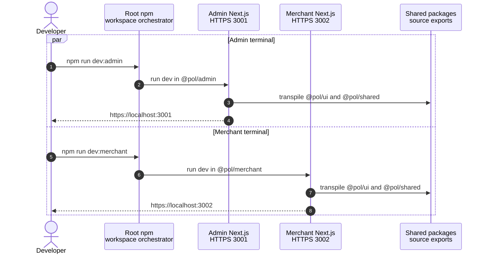
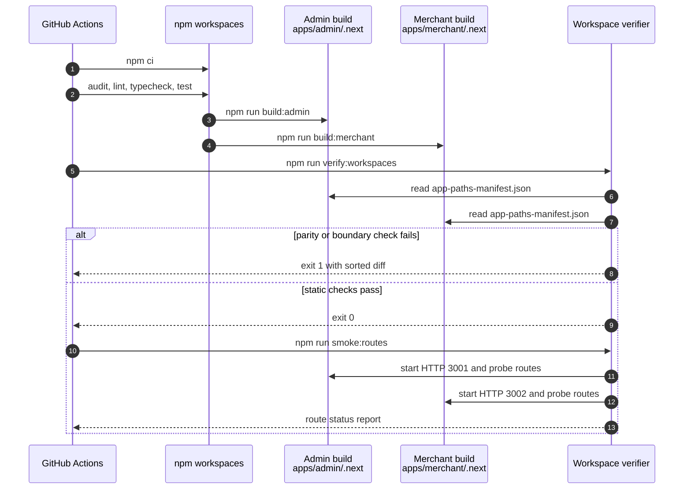

# Design: Split Admin and Merchant Apps

> Status: approved 2026-08-17

## Architecture Overview

แปลง single Next.js app เป็น npm-workspaces monorepo โดยให้แต่ละ app เป็น module เจ้าของ route,
auth, API adapters, navigation และ build output ของตัวเอง ส่วน packages เปิด interface เฉพาะ code
ที่ทั้งสอง app ใช้จริง. Merchant เริ่มจาก clone ของ Admin และมี `/register` เพิ่มหนึ่ง route.

### Target Structure

```text
apps/
  admin/
    package.json
    next.config.ts
    tsconfig.json
    vitest.config.ts
    postcss.config.mjs
    components.json
    .env.example
    public/
    src/
  merchant/
    package.json
    next.config.ts
    tsconfig.json
    vitest.config.ts
    postcss.config.mjs
    components.json
    .env.example
    public/
    src/
packages/
  shared/
    package.json
    tsconfig.json
    vitest.config.ts
    src/
  ui/
    package.json
    tsconfig.json
    src/
scripts/
  lib/workspace-verification.mjs
  lib/workspace-verification.test.mjs
  verify-workspaces.mjs
  smoke-workspace-routes.mjs
package.json
package-lock.json
tsconfig.base.json
eslint.config.mjs
Dockerfile
```

### Module Responsibilities

| Module | Interface | Implementation ownership | Dependencies |
|---|---|---|---|
| Root orchestrator | Root npm scripts | Workspace selection, aggregate gates | npm workspaces |
| `@pol/admin` | Admin routes และ commands | Admin source, auth, navigation, assets, config | `@pol/ui`, `@pol/shared` |
| `@pol/merchant` | Merchant routes และ commands | Admin clone, Merchant `/register`, assets, config | `@pol/ui`, `@pol/shared` |
| `@pol/ui` | Three explicit subpath exports | Shared presentational code และ internal `cn()` | React/Next peers, existing style deps |
| `@pol/shared` | Merchant user types และ validation exports | Pure TypeScript พร้อม validation tests | ไม่มี runtime dependency |
| Workspace verifier | `verify:workspaces`, `smoke:routes` | Route normalization, import scan, process smoke | Node.js standard library |

Dependency direction:

```text
@pol/admin ─────┬──> @pol/ui
                └──> @pol/shared

@pol/merchant ──┬──> @pol/ui
                └──> @pol/shared

@pol/ui ────────────> external peer/runtime dependencies
@pol/shared ────────> no runtime dependency
```

ไม่มี app-to-app import. ไม่มี shared route, auth, API หรือ navigation module. การ duplicate
app-local implementation เป็น deliberate choice เพื่อให้ Merchant pruning ภายหลังเป็นการลบไฟล์ตรง ๆ.

### Source Migration

1. ย้าย tracked `src/` และ `public/` เดิมเข้า Admin เพื่อรักษา Git history.
2. Clone Admin source และ assets เข้า Merchant ก่อนตัด `/register` ออกจาก Admin.
3. คงทุก common page implementation ในทั้งสอง apps รวม global error และ not-found handling.
4. เปลี่ยน Merchant registration request เป็น `POST /producer/users/register`.
5. Extract เฉพาะ shared interfaces ที่ระบุด้านล่าง แล้วแก้ imports ของทั้งสอง apps ไป package subpaths.
6. ไม่แก้ domain behavior, Admin auth contract, navigation items หรือ page presentation ระหว่าง migration.

### Auth and Navigation Clone

| Concern | Admin | Merchant |
|---|---|---|
| Protected layout | Local copy ของ `AuthProvider` และ `AuthGuard` | Local copy เดียวกับ Admin |
| Identity interface | `AdminMe` ผ่าน `getMe` | `AdminMe` ผ่าน `getMe` |
| Admin operations | Existing Admin API adapters | Cloned Admin API adapters |
| Navigation | Existing Admin navigation | Cloned Admin navigation |
| Registration | ไม่มี route | Public `/register` และ Merchant registration adapter |

Merchant ไม่มี auth provider, dashboard หรือ navigation แบบเฉพาะ audience ในรอบนี้. Admin OAuth callback
ยังใช้ backend Admin SPA origin 3001 แม้เริ่ม flow จาก Merchant port 3002; runtime acceptance จึงตรวจ
route availability บน Merchant แต่ไม่เปลี่ยนหรือรับรอง Admin OAuth roundtrip ให้กลับ port 3002.

## Sequence Diagrams

### Development Startup

สอง terminal เรียก root command interface; npm เปลี่ยน working directory ไป app workspace ให้ Next
โหลด app-local environment และเขียน `.next` คนละตำแหน่ง.



### CI Build and Route Verification

CI สร้างสอง build ก่อนใช้ verifier เดียวเทียบ manifests และยิง runtime smoke ผ่าน production servers.



## Data Models & Interfaces

Feature นี้ไม่เปลี่ยน business entity schema. Interface ใหม่มีเฉพาะ package exports, command surface,
route-set contract และ environment contract.

### Package Interfaces

| Import path | Exported interface | Source baseline |
|---|---|---|
| `@pol/shared/merchant-user` | Merchant user types และ labels | `src/types/merchant/user.ts` |
| `@pol/shared/merchant-user-validation` | Validation functions และ error types | `src/lib/merchant/user/validation.ts` |
| `@pol/ui/avatar-upload` | `AvatarUpload` | `src/components/shared/avatar-upload.tsx` |
| `@pol/ui/fieldset` | Fieldset presentation exports | `src/components/shared/fieldset.tsx` |
| `@pol/ui/logo` | `Logo` | `src/components/layout/logo.tsx` |

`@pol/ui` เก็บ `cn()` เป็น internal implementation ไม่ export. App-local `src/lib/utils.ts` ยังอยู่เพราะ
มี amount/date formatters ซึ่งไม่ใช่ UI package interface. Package source ใช้ relative imports ภายใน package.

Package manifests ใช้ version `0.1.0`. Apps อ้าง internal packages ด้วย exact version `0.1.0`; npm
workspace linking จัด symlink จาก root install. `@pol/ui` ประกาศ `next`, `react` และ `lucide-react`
เป็น peer dependencies พร้อม `clsx` และ `tailwind-merge` เป็น runtime dependencies เดิม.

### Root Command Interface

| Root command | Delegation | Result |
|---|---|---|
| `npm run dev` | `@pol/admin` dev | Admin HTTPS 3001 |
| `npm run dev:admin` | `@pol/admin` dev | Admin HTTPS 3001 |
| `npm run dev:merchant` | `@pol/merchant` dev | Merchant HTTPS 3002 |
| `npm run dev:clean` | `@pol/admin` targeted clean + dev | ล้างเฉพาะ Admin cache |
| `npm run build` | `@pol/admin` build | Admin production build |
| `npm run build:admin` | `@pol/admin` build | `apps/admin/.next` |
| `npm run build:merchant` | `@pol/merchant` build | `apps/merchant/.next` |
| `npm run start` | `@pol/admin` start | Admin HTTP 3001 |
| `npm run start:admin` | `@pol/admin` start | Admin HTTP 3001 |
| `npm run start:merchant` | `@pol/merchant` start | Merchant HTTP 3002 |
| `npm run test` | all workspace tests + verifier unit tests | Aggregate test gate |
| `npm run test:admin` | `@pol/admin` tests | Admin source copy |
| `npm run test:merchant` | `@pol/merchant` tests | Merchant source copy |
| `npm run lint` | all four workspaces | Aggregate ESLint gate |
| `npm run typecheck` | all four workspaces | Aggregate TypeScript gate |
| `npm run verify:workspaces` | static verifier | Manifests, imports, skipped tests |
| `npm run smoke:routes` | runtime verifier | Production HTTP route checks |

`dev:clean` ใช้ targeted Node.js filesystem call ภายใน Admin workspace; ไม่ใช้ broad root deletion.
ไม่มี `dev:all` เพราะสอง terminal ตรงกว่าและไม่ต้องเพิ่ม process-runner dependency.

### Route-Set Contract

ให้ `A` เป็น normalized Admin page-route set และ `M` เป็น normalized Merchant page-route set:

```text
M = A ∪ { "/register" }
A ∩ { "/register" } = ∅
```

Normalization interface รับ JSON object จาก `.next/server/app-paths-manifest.json` แล้วทำตามลำดับ:

1. เลือก key ที่ลงท้าย `/page` เท่านั้น.
2. Map `/page` เป็น `/`; key อื่นตัด suffix `/page`.
3. ตัด normalized route ที่ขึ้นต้น `/_`.
4. คง `[sessionId]` และ `[...segments]` ตาม manifest.
5. Sort ก่อนแสดงผล เพื่อให้ CI diff deterministic.

Verifier fail เมื่อ manifest หาย, JSON ไม่ถูกต้อง, route set ไม่ตรงสมการ หรือ required smoke route หาย.

### Rewrite and Environment Contract

| Browser path | Development destination เมื่อมี `ADMIN_API_ORIGIN` |
|---|---|
| `/admin/:path*` | `/api/v1/admins/:path*` บน configured origin |
| `/producer/:path*` | `/api/v1/merchants/:path*` บน configured origin |
| `/api/:path*` | `/api/:path*` บน configured origin |

แต่ละ app โหลด `.env.local` จาก workspace ของตัวเองตาม Next.js project directory. App templates
มีค่า non-secret เดิมและ comment ที่ระบุ port ของ app. Root `.env.local` ไม่ถูกอ่าน ย้าย หรือคัดลอก
อัตโนมัติ; developer คัดค่าที่ต้องใช้ด้วยมือ.

## Technology Decisions

### Workspace and Package Execution

- ใช้ npm 11.12.1 workspaces และ root lockfile เดียว; ไม่เพิ่ม Nx, Turborepo หรือ concurrently.
- Root manifest กำหนด `workspaces`, `engines.node >=20.9.0` และ `packageManager=npm@11.12.1`.
- Root scripts ใช้ `--workspace` สำหรับ app เดียว และ `--workspaces --if-present` สำหรับ aggregate gates.
- เหตุผล: npm รองรับ local linking, workspace-scoped scripts และ ignore missing scripts โดยตรง.
- Reference: [npm Workspaces](https://docs.npmjs.com/cli/v11/using-npm/workspaces/).

### Dependency Placement and Security Upgrade

- Apps รับ runtime dependencies เดิมครบ เพราะ route implementation ถูก clone ทั้งชุด.
- Root ถือ shared dev tooling; `shadcn@4.8.0` ย้ายจาก production ไป dev dependency.
- Pin `next@16.3.1` และ `sharp@0.35.3`; dependency อื่นคง version range เดิม.
- สร้าง lockfile ใหม่ด้วย npm 11.12.1 แล้วพิสูจน์ด้วย clean `npm ci`.
- ห้ามใช้ `npm audit fix --force`; ถ้า production audit ยังแดง ให้หยุดและรายงาน chain จริง.

### Next.js App Configuration

- แต่ละ app มี `next.config.ts` ของตัวเองและ duplicate rewrites/images config โดยเจตนา.
- ตั้ง `output: "standalone"` และ `outputFileTracingRoot` ไป repository root.
- ตั้ง `transpilePackages` เป็น `@pol/ui` และ `@pol/shared` เพื่อ consume TypeScript source exports.
- ใช้ app-local `.next` ตาม default; ไม่ตั้ง shared `distDir`.
- Reference: [Next.js transpilePackages](https://nextjs.org/docs/app/api-reference/config/next-config-js/transpilePackages) และ [standalone output tracing](https://nextjs.org/docs/app/api-reference/config/next-config-js/output).

### TypeScript, ESLint, Vitest and Tailwind

- Root `tsconfig.base.json` เก็บ compiler defaults; app configs เพิ่ม local alias `@/*` ไป `./src/*`.
- Packages มี tsconfig ของตัวเอง; `@pol/shared` เปิด DOM lib เพราะ public form types ใช้ `File`.
- Root ESLint config scan `apps/**` และ `packages/**`; workspace scripts เรียก config เดียว.
- App Vitest configs ใช้ local `@` alias; shared package มี config/test ของ validation เอง.
- App global CSS คง design tokens คนละ copy และเพิ่ม `@source` ไป `packages/ui/src` เพื่อ generate utility classes จาก shared UI.
- Reference: [Tailwind source detection](https://tailwindcss.com/docs/detecting-classes-in-source-files).

### Local HTTPS and Production HTTP

- App dev scripts ใช้ Next native `--experimental-https` กับ ports 3001/3002.
- App start scripts ใช้ `next start` ผ่าน HTTP; TLS production เป็นหน้าที่ reverse proxy.
- Generated certificate อยู่ใต้ app-local `certificates/` และถูก ignore ด้วย pattern เดิม.
- Reference: [Next.js CLI HTTPS options](https://nextjs.org/docs/pages/api-reference/cli/next).

### Docker Standalone Layout

- Deps stage copy root lockfile และ package manifests ของทั้งสี่ workspaces ก่อน `npm ci`.
- Builder รัน `npm run build:admin` เท่านั้น.
- Runner copy standalone root แล้ววาง Admin `public` และ static chunks ใต้ `apps/admin`.
- Runtime command เป็น `node apps/admin/server.js`; `PORT=3001`, `HOSTNAME=0.0.0.0`.
- Container expose และ health-check HTTP port 3001. ไม่มี Merchant image หรือ deploy config.

### Documentation and Migration Safety

- ย้าย root `.env.example` content ไป app-local templates; root `.env.local` คงอยู่และไม่ถูกแตะ.
- อัปเดต README, dev setup, project context, architecture และ Next.js stack profile ให้ตรง monorepo.
- รักษา user changes เรื่อง Admin port 3001, HTTPS, certificate ignore และ production HTTP.
- ไม่แตะ user-owned `.ai/shared/TASK_PROTOCOL.md`.
- ไม่ commit, push หรือเปิด PR.

### Rejected Alternatives

| ทางเลือก | เหตุผลไม่ใช้ |
|---|---|
| Shared route/auth package | ทำ Merchant pruning ยากและขัด app ownership |
| Re-export code จากอีก app | สร้าง app-to-app coupling และทำ standalone tracing เปราะ |
| Custom process orchestrator | สอง terminal พอและไม่ต้องเพิ่ม dependency |
| Auto-copy root `.env.local` | เสี่ยงคัดลอก secret และทำ ownership ไม่ชัด |
| Shared `.next` หรือ custom `distDir` | เพิ่ม collision risk โดยไม่มีประโยชน์ |
| Audit allowlist สำหรับ baseline | ซ่อน known high vulnerabilities แทนการแก้ direct dependencies |

## Error Handling Strategy

| Failure | Detection | Response |
|---|---|---|
| Lockfile ไม่ตรง manifests | `npm ci` exit non-zero | หยุด; regenerate lock ด้วย npm 11.12.1 |
| Production audit ยังมี high | npm audit exit non-zero | หยุด; รายงาน dependency chain ห้าม force-fix |
| App port ถูกใช้อยู่ | Next process exit non-zero | ส่ง error เดิม; docs ระบุวิธีตรวจ process |
| HTTPS certificate สร้างไม่ได้ | Next dev exit non-zero | ส่ง error เดิม; ไม่ fallback เป็น HTTP เงียบ ๆ |
| `ADMIN_API_ORIGIN` ไม่มี | Next config condition | คืน rewrites ว่างตาม behavior เดิม |
| Shared package compile ไม่ผ่าน | app build หรือ package typecheck | หยุด workspace gate ที่พบ error |
| Build manifest หายหรือ JSON เสีย | static verifier | Exit 1 พร้อม absolute manifest path |
| Route parity ไม่ตรง | set comparison | Exit 1 พร้อม sorted missing/extra routes |
| Cross-app import พบ | import-boundary scan | Exit 1 พร้อม source file และ import specifier |
| `.only` หรือ `.skip` พบ | committed-test scan | Exit 1 พร้อม test file และบรรทัด |
| Production server start timeout | smoke verifier timeout | Terminate child processes แล้ว exit 1 |
| Smoke status ผิด | HTTP probe | Terminate child processes แล้วรายงาน expected/actual |
| Docker standalone path ผิด | Docker build/start smoke | Fail image gate; ไม่ fallback ไป full node_modules image |

Smoke verifier ลงทะเบียน cleanup handler สำหรับ success, failure และ process signal. Child processes
ถูก terminate เฉพาะ PID ที่ verifier สร้าง; ไม่ค้นหรือ kill process อื่นตาม port.

## Testing Strategy

### Automated Gates

| Gate | Command | Observable result | Requirements |
|---|---|---|---|
| Clean install | `npm ci` | Four workspaces linked, lockfile accepted | REQ-1, REQ-7 |
| Production audit | `npm audit --omit=dev --audit-level=high` | Exit 0 | REQ-1, REQ-9.8 |
| Lint | `npm run lint` | All four workspaces pass | REQ-2.3, REQ-9.3 |
| Typecheck | `npm run typecheck` | All four workspaces pass | REQ-2.14, REQ-9.4 |
| Unit tests | `npm test` | Both app copies, shared validation และ verifier logic pass | REQ-2.7, REQ-4.14, REQ-9.5 |
| Admin build | `npm run build:admin` | `apps/admin/.next` และ standalone output exist | REQ-3, REQ-5, REQ-9.6 |
| Merchant build | `npm run build:merchant` | `apps/merchant/.next` และ standalone output exist | REQ-3, REQ-5, REQ-9.7 |
| Static workspace checks | `npm run verify:workspaces` | Route equation, import seams และ test policy pass | REQ-3, REQ-6, REQ-9.9-9.15 |
| Runtime routes | `npm run smoke:routes` | Required HTTP statuses และ redirects pass | REQ-2, REQ-3, REQ-9.11-9.13 |
| Admin image | `docker build -t pol-admin:local .` | Image builds Admin standalone server | REQ-8 |

Verifier unit testsใช้ Node.js built-in `node:test` ครอบ root mapping, suffix stripping, internal-route
exclusion, dynamic notation, allowed `/register` delta และ rejected cross-app imports. Existing Vitest
tests ถูก clone ไปทั้ง apps ยกเว้น merchant-user validation test ซึ่งย้ายไป `@pol/shared` และรันครั้งเดียว.

### Runtime Acceptance

| App | Request | Expected |
|---|---|---|
| Admin | `GET /` | Redirect location `/dashboard` |
| Merchant | `GET /` | Redirect location `/dashboard` |
| Merchant | `GET /admin/user/list` | Status ไม่ใช่ 404 |
| Admin | `GET /register` | Status 404 |
| Merchant | `GET /register` | Status ไม่ใช่ 404 |

Dev HTTPS verification รันสอง commands คนละ terminal แล้วใช้ `curl -k` ตรวจ ports 3001/3002.
Production route smoke ใช้ HTTP และ built-in fetch; ไม่ต้อง trust local certificate ใน CI.

### CI Layout

คง existing `verify` job สำหรับ guard tests, secret scan และ spec-trace. เพิ่ม application job ด้วย
Node.js 22.19.0 และ npm 11.12.1 ตามลำดับ: install, production audit, lint, typecheck, unit tests,
Admin build, Merchant build, static checks และ runtime smoke. Job ใดแดง block merge ตามกฎเดิม.

## Requirement Traceability

| Design element | Requirements satisfied |
|---|---|
| Workspace manifests, package placement, lockfile และ security upgrades | REQ-1 (all criteria) |
| Root command interface และ app runtime ports | REQ-2 (all criteria) |
| Source clone, route equation, manifest normalization และ runtime probes | REQ-3 (all criteria) |
| App-local Admin auth/API/navigation clone และ registration endpoint | REQ-4 (all criteria) |
| App source/assets/config/output isolation และ standalone tracing | REQ-5 (all criteria) |
| Package interfaces, dependency direction และ import verifier | REQ-6 (all criteria) |
| App-local environment templates, HTTPS certificates และ secret handling | REQ-7 (all criteria) |
| Admin-only Docker standalone image และ health check | REQ-8 (all criteria) |
| CI gates, route smoke, audit, docs และ test policy | REQ-9 (all criteria) |
