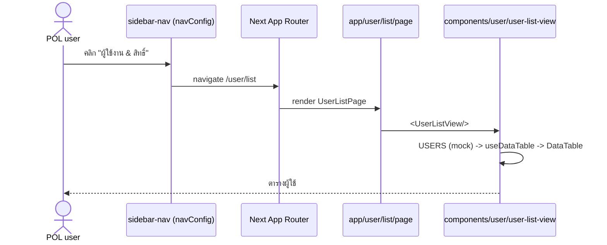
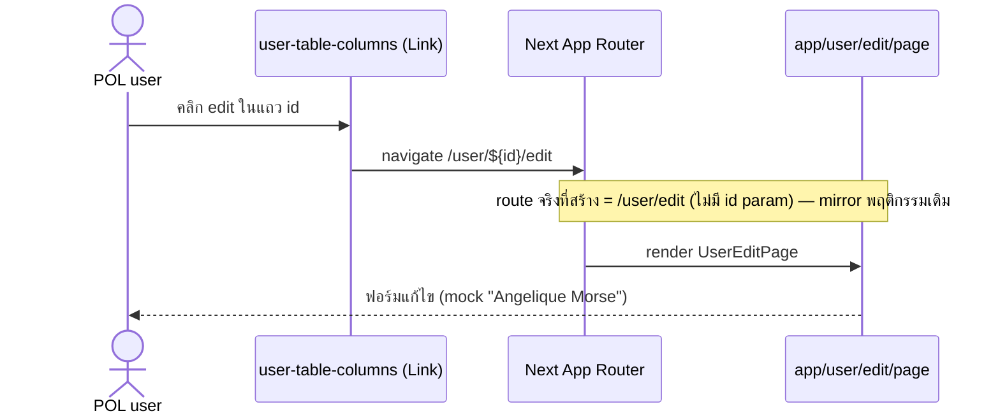

# Design: User Management Module (isolated /user)

> Status: approved 2026-06-17, amended 2026-06-17

## Architecture Overview

โมดูลใหม่เป็น **vertical copy** ของ `dashboard/user` (เฉพาะ list/new/edit) ไปยัง
namespace แยกขาด ไม่มี logic ใหม่ ไม่มี backend — เป็นการ duplicate presentation
layer แล้ว rewrite ค่าที่ผูกเส้นทาง.

สองชั้นที่สร้างใหม่ + หนึ่งจุดที่แก้:

1. Route layer — `src/app/user/` (App Router pages/layouts)
   - `layout.tsx` — group shell: wrap `MinimalsLayout` (sidebar/topbar). REQUIRED:
     ของเดิม list/new/edit ไม่มี shell ของตัวเอง แต่ inherit จาก parent
     `app/minimals/layout.tsx`; โมดูลใหม่ไม่มี parent นั้น ต้องมี shell ของกลุ่มเอง
     ไม่งั้น render นอก shell (ไม่มี sidebar). [amended 2026-06-17 — พบตอน browser verify]
   - `list/page.tsx`
   - `new/layout.tsx`, `new/page.tsx`
   - `edit/layout.tsx`, `edit/page.tsx`
   - responsibilities: ประกอบ PageHeader/breadcrumb + เรียก view component; client
     state (`useState` ใน new/edit) คงเดิม

2. Component layer — `src/components/user/` (6 view components, copy)
   - `user-list-view.tsx`, `user-list-tabs.tsx`, `user-list-toolbar.tsx`,
     `user-table-columns.tsx`, `user-edit-form-card.tsx`,
     `user-edit-profile-card.tsx`
   - cross-import ภายในกลุ่มเป็น **relative** (`./user-list-tabs`) -> copy ยกชุด
     แล้วใช้ได้ทันที ไม่ต้อง rewrite
   - dependency อื่นทั้งหมดเป็น shared (`@/components/{form,ui,table,shared}`,
     `@/lib/*`, `@/types/user`, `@/hooks/*`) -> ใช้ร่วมของเดิม (REQ-2.5)

3. Nav layer — แทรก NavGroup `UserManagement` (ไม่แตะกลุ่มอื่น) ใน:
   - `src/components/layout/minimals-nav-config.ts` — **live config ที่ sidebar
     render จริง** (`MinimalsLayout` ส่ง `minimalsNavConfig` ให้ `SidebarNav`).
     แทรกหลัง `Main` ก่อน `Overview`. [amended 2026-06-17 — design เดิมระบุ
     `nav-config.ts` ผิด; sidebar override default prop ด้วย `minimalsNavConfig`]
   - `src/components/layout/nav-config.ts` — default config, feed breadcrumb
     (`lib/breadcrumbs.ts`) + search-dialog; คงไว้ให้สอดคล้อง (แทรกหลัง `Main`)

ขอบเขตการแก้ค่าใน "ไฟล์ที่ copy มา" แคบมาก:
- pages: rewrite `/minimals/user*` -> `/user*`, rewrite breadcrumb root, แก้
  import view จาก `@/components/dashboard/user/*` -> `@/components/user/*`, ปรับ
  metadata title เป็นรูปแบบ POL
- components: แก้จุดเดียว — `user-table-columns.tsx` ลิงก์ edit
  (`/minimals/user/${u.id}/edit` -> `/user/${u.id}/edit`); อีก 5 ไฟล์ copy verbatim

## Sequence Diagrams

### นำทางผ่านเมนูใหม่ -> list



### list -> edit ผ่านปุ่มในแถว



## Data Models & Interfaces

ไม่มี data model ใหม่. ใช้ contract เดิมทั้งหมด:
- `@/types/user` -> `User`, `UserStatus`
- `@/lib/mock/users` -> `USERS`, `USER_ROLES`
- `NavGroup` / `NavItem` (`src/components/layout/nav-config.ts`)

NavGroup ใหม่ที่แทรก (หลัง `Main`, ก่อน `Demo`):

```ts
{
  subheader: "UserManagement",
  items: [
    {
      title: "ผู้ใช้งาน & สิทธิ์",
      path: "/user/list",
      icon: "user",
      deepMatch: true, // active ทุก sub-path ภายใต้ /user (REQ-4.6)
    },
  ],
},
```

> `deepMatch: true` ใช้ field ที่มีอยู่แล้วใน `NavItem` (nav-config.ts:11) เพื่อให้
> active state ครอบคลุม `/user/edit`, `/user/new` ด้วย ไม่ใช่แค่ exact `/user/list`.

ตาราง path mapping (old -> new):

| ตำแหน่ง (ไฟล์ที่ copy) | old | new |
|---|---|---|
| list breadcrumb root | `Dashboard` -> `/minimals` | `ผู้ใช้งาน & สิทธิ์` -> `/user/list` |
| list breadcrumb User | `User` -> `/minimals/user` | (ตัดออก / รวมเป็น root) |
| list action Add user | `/minimals/user/new` | `/user/new` |
| new breadcrumb User | `/minimals/user/list` | `/user/list` |
| edit backHref + breadcrumb | `/minimals/user/list` | `/user/list` |
| table-columns edit Link | `/minimals/user/${u.id}/edit` | `/user/${u.id}/edit` |
| page imports | `@/components/dashboard/user/*` | `@/components/user/*` |

Breadcrumb ใหม่ (REQ-3.4) — list page เป็นตัวอย่าง:

```ts
breadcrumbs={[
  { label: "ผู้ใช้งาน & สิทธิ์", href: "/user/list" },
  { label: "List" },
]}
```

new/edit: prepend root เดียวกัน + ตามด้วย label หน้านั้น (`Create` / ชื่อ user).

## Technology Decisions

- **Copy-not-share**: ตามคำสั่ง "ห้ามใช้ร่วมกับของเดิม" + decision /spec-new
  (แยกเต็ม). ยอม duplication เพื่อให้ POL แก้โมดูลนี้ได้อิสระ 100% โดยไม่ regress
  หน้า Demo. แลกกับ DRY — ยอมรับเพราะ Demo คือ scaffolding ชั่วคราวที่จะถูกถอด.
- **Shared primitives ใช้ร่วม** (form/ui/table/shared/lib/types/hooks): ไม่ copy
  เพราะไม่ใช่ "ของเดิมของ user module" แต่เป็น cross-app primitive (ARCHITECTURE.md
  จัด `shared/`, `ui/`, `form/` เป็น cross-app). copy จะทำซ้ำ design token / util
  — ผิด anti-pattern "ห้าม duplicate".
- **relative cross-import คงไว้**: `user-list-view` อ้าง `./user-list-tabs` ฯลฯ —
  copy ยกโฟลเดอร์แล้ว resolve ภายใน namespace ใหม่เอง ไม่ต้องแตะ.
- **icon `user`**: key เดิมที่ map `/assets/icons/navbar/ic-user.svg` (มีอยู่แล้ว —
  Demo>User ใช้). ไม่เพิ่ม asset ใหม่.
- **`deepMatch` แทน logic active ใหม่**: ใช้ field ที่ nav รองรับอยู่แล้ว.

## Error Handling Strategy

โมดูล frontend/mock — error path น้อย:
- IF หลัง copy ยังเหลือ `/minimals/user` หรือ import `@/components/dashboard/user`
  ในไฟล์ใต้ `src/app/user` หรือ `src/components/user` (REQ-3.5) THEN ถือว่าไม่ผ่าน —
  ตรวจด้วย `grep -rn "dashboard/user" src/app/user src/components/user` ต้องได้ 0
  บรรทัด (เป็น acceptance check ใน tasks).
- IF type-check / build ล้ม (REQ-5.5) THEN แก้ก่อน mark task เขียว (gate-task.sh).
- ลิงก์ `/user/${id}/edit` ชี้ route ที่ไม่มี id param — mirror ของเดิม, ไม่ใช่ error
  ใหม่ที่ scope นี้สร้าง (เปิดประเด็นไว้ใน requirements). ไม่ทำ 404 handler เพิ่ม.

## Testing Strategy

ไม่มี pure logic ใหม่ -> ไม่มี unit test ใหม่. ยืนยันด้วย structural + build checks:

| Check | วิธี | REQ |
|---|---|---|
| 3 routes ใต้ /user สร้างครบ | ไฟล์ list/new/edit page มีอยู่ | REQ-1.1–1.3 |
| ไม่มี profile/cards/account | ls src/app/user ไม่มี 3 โฟลเดอร์นั้น | REQ-1.4 |
| 6 components copy ครบ | ls src/components/user | REQ-2.2 |
| ไม่มี coupling ของเดิม | `grep -rn "dashboard/user" src/app/user src/components/user` = 0 | REQ-2.4, REQ-3.5 |
| path rewrite ครบ | grep `/user/` ปรากฏใน breadcrumb/action/Link | REQ-3.1–3.4 |
| nav group ใหม่ | navConfig[1].subheader === "UserManagement", item เดียว path /user/list | REQ-4.1–4.4 |
| ของเดิมไม่แตะ | `git diff --name-only` ไม่มีไฟล์ใต้ dashboard/user | REQ-5.1–5.3 |
| coexist + build | route ทั้งคู่เข้าได้ + `npm run build`/type-check ผ่าน | REQ-5.4, REQ-5.5 |

> โปรเจกต์เป็น frontend mock ไม่มี test runner ผูกกับ component พวกนี้; gate-task.sh
> จะรัน type-check (auto-detect script) เป็น code-green หลัก. ที่เหลือเป็น manual/grep
> evidence ตาม Definition of Done.

## Requirement Traceability

| Design element | satisfies |
|---|---|
| Route layer `src/app/user/{list,new,edit}` | REQ-1.1, 1.2, 1.3, 1.5 |
| ไม่สร้าง profile/cards/account | REQ-1.4 |
| Component layer `src/components/user/*` (6 ไฟล์) | REQ-2.1, 2.2, 2.3 |
| pages import `@/components/user/*` เท่านั้น | REQ-2.3, 2.4 |
| shared primitives ใช้ร่วม (ไม่ copy) | REQ-2.5 |
| path mapping table (rewrite `/minimals/user`->`/user`) | REQ-3.1, 3.2, 3.3 |
| breadcrumb root `ผู้ใช้งาน & สิทธิ์` | REQ-3.4 |
| grep coupling = 0 check | REQ-3.5 |
| NavGroup `UserManagement` แทรกหลัง Main | REQ-4.1, 4.2 |
| item เดียว title/path/icon, ไม่มี children | REQ-4.3, 4.4, 4.5 |
| `deepMatch: true` | REQ-4.6 |
| ไม่แก้ minimals/user, components/dashboard/user, Demo>User | REQ-5.1, 5.2, 5.3 |
| route ทั้งคู่ coexist | REQ-5.4 |
| type-check/build ผ่าน (gate-task.sh) | REQ-5.5 |
